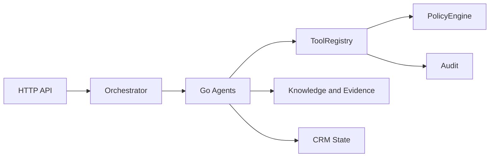
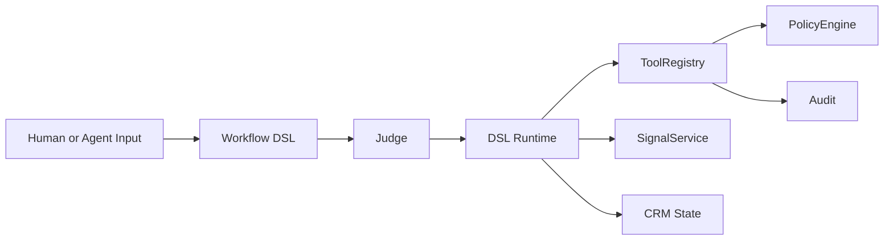
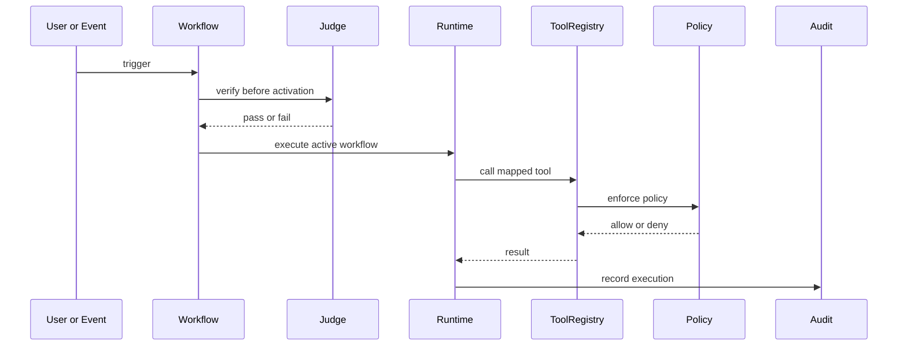
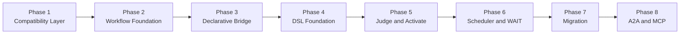

# FenixCRM

> Operational CRM with agents, evidence, governance, and an evolving declarative workflow layer.

---

## What It Is

FenixCRM combines two things:

- a traditional operational CRM: accounts, contacts, leads, deals, cases, activities
- an agentic layer: tools, policy, audit, evidence packs, and agents acting on the CRM

The current direction of the project is to evolve from hardcoded Go agents toward verified,
executable declarative workflows.

The core idea is simple:

- today: Go agents execute business logic
- transition: the orchestrator becomes pluggable
- future: DSL workflows + Judge + Runtime drive execution

---

## Core Idea

The system is moving from:

- "Go code defines the workflow"

to:

- "the declarative workflow defines execution"

This does not require a rewrite. The strategy is to extend the current infrastructure:

- `ToolRegistry`
- `PolicyEngine`
- `ApprovalService`
- `AuditTrail`
- `EventBus`
- `agent_run`

For documentation purposes, the new workflow-platform capabilities use the existing repository
use case convention and are reserved as `UC-A2` to `UC-A9`.

---

## Basic Concepts

### 1. Tools, not direct mutations

Agents should not mutate CRM data directly. Relevant actions must go through registered,
auditable tools.

### 2. Policy and approvals

Before executing a sensitive action, the system evaluates permissions and may require human approval.

### 3. Audit

Every important execution should leave a trace. This includes decisions, tool calls, approvals,
and outcomes.

### 4. Workflow

A workflow is the declarative unit that describes what should happen when an event or condition occurs.

### 5. Judge

The Judge verifies that a workflow is consistent before it can be activated.

### 6. Signal

A signal is an operational conclusion backed by evidence, for example high intent or risk.

---

## Architectural State

Today, the system mainly works like this:



The target direction is this:



High-level interaction:



**Simple example**

A new support case is created. That event triggers the workflow `resolve_support_case`.

The workflow was already verified by the Judge before activation, so the Runtime can execute it safely.

During execution, the Runtime maps a step such as `SET case.status = "resolved"` to a registered tool like `update_case`.
Before that tool runs, the Policy layer checks whether the action is allowed. If it is allowed, the tool executes and returns the result.
Finally, the Runtime records the full execution in the audit trail.

In short:

- event: `case.created`
- workflow: `resolve_support_case`
- tool call: `update_case`
- policy decision: allow or deny
- outcome: CRM updated and execution audited

---

## Transition Strategy

The transition is phased.



Quick summary:

- `Phase 1`: common execution contract for agents
- `Phase 2`: workflows and signals as first-class entities
- `Phase 3`: bridge declarative format before the final DSL
- `Phase 4`: parser, runtime, and DSL runner
- `Phase 5`: verify and activate with Judge
- `Phase 6`: `WAIT` and resume
- `Phase 7`: gradual agent migration
- `Phase 8`: standards-based interoperability

---

## Interoperability

The current direction is:

- **A2A-first** for agent-to-agent delegation
- **MCP-first** for tools, resources, and context

That means:

- external `DISPATCH` should align with A2A
- tools and context should be exposed or consumed through MCP-compatible boundaries
- the project should not introduce a new proprietary external protocol

---

## Project Structure

```text
fenix/
|-- cmd/                # entrypoints
|-- internal/
|   |-- api/            # HTTP handlers and middleware
|   |-- domain/         # crm, agent, tool, policy, audit, knowledge
|   |-- infra/          # sqlite, eventbus, llm, config
|-- docs/               # architecture, plans, and task docs
|-- tests/              # contract and integration tests
|-- mobile/             # mobile app
|-- bff/                # backend for frontend
```

---

## Useful Commands

```bash
make test
make build
make run
make lint
make complexity
make trace-check
```

Important note:

- `make ci` is currently designed for a POSIX/Linux environment
- the documented local reference is remote CI or a compatible environment

See: [docs/ci.md](/c:/Users/octoedro/Desktop/fenixCRM/fenix/docs/ci.md)

---

## Recommended Documentation

To understand the current system:

- [docs/architecture.md](/c:/Users/octoedro/Desktop/fenixCRM/fenix/docs/architecture.md)
- [docs/implementation-plan.md](/c:/Users/octoedro/Desktop/fenixCRM/fenix/docs/implementation-plan.md)

To understand the AGENT_SPEC transition:

- [docs/agent-spec-overview.md](/c:/Users/octoedro/Desktop/fenixCRM/fenix/docs/agent-spec-overview.md)
- [docs/agent-spec-traceability.md](/c:/Users/octoedro/Desktop/fenixCRM/fenix/docs/agent-spec-traceability.md)
- [docs/agent-spec-use-cases.md](/c:/Users/octoedro/Desktop/fenixCRM/fenix/docs/agent-spec-use-cases.md)
- [docs/agent-spec-design.md](/c:/Users/octoedro/Desktop/fenixCRM/fenix/docs/agent-spec-design.md)
- [docs/agent-spec-integration-analysis.md](/c:/Users/octoedro/Desktop/fenixCRM/fenix/docs/agent-spec-integration-analysis.md)
- [docs/agent-spec-development-plan.md](/c:/Users/octoedro/Desktop/fenixCRM/fenix/docs/agent-spec-development-plan.md)

Reference-only AGENT_SPEC documents:

- [docs/agent-spec-transition-plan.md](/c:/Users/octoedro/Desktop/fenixCRM/fenix/docs/agent-spec-transition-plan.md)
- [docs/AGENT_SPEC.md](/c:/Users/octoedro/Desktop/fenixCRM/fenix/docs/AGENT_SPEC.md)

To understand the transition baselines:

- [docs/agent-spec-regression-baseline.md](/c:/Users/octoedro/Desktop/fenixCRM/fenix/docs/agent-spec-regression-baseline.md)
- [docs/agent-spec-go-agents-baseline.md](/c:/Users/octoedro/Desktop/fenixCRM/fenix/docs/agent-spec-go-agents-baseline.md)
- [docs/agent-spec-core-contracts-baseline.md](/c:/Users/octoedro/Desktop/fenixCRM/fenix/docs/agent-spec-core-contracts-baseline.md)
- [docs/agent-spec-phase1-quality-gates.md](/c:/Users/octoedro/Desktop/fenixCRM/fenix/docs/agent-spec-phase1-quality-gates.md)

---

## Status

- the CRM base and agentic layer already exist
- the declarative workflow transition is documented
- implementation work is isolated in the `agent-spec-transition` branch
