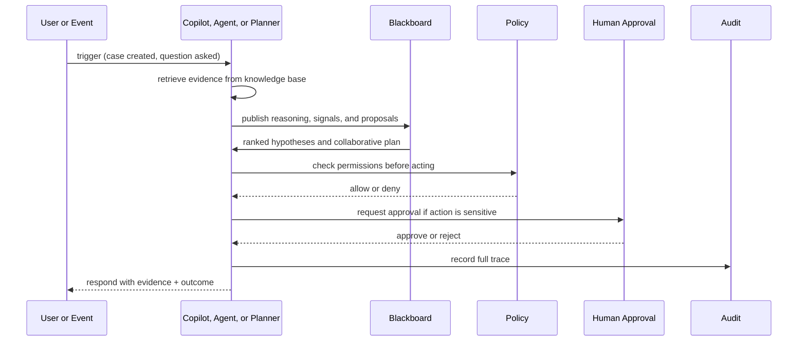
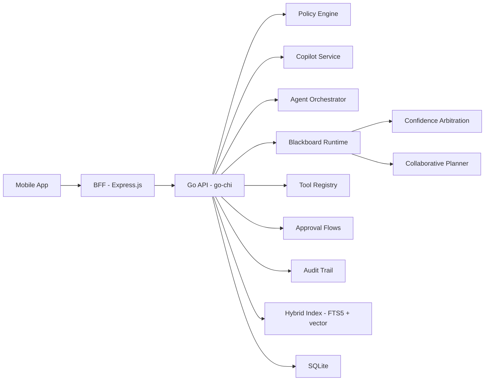
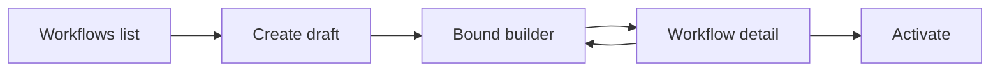

# FenixCRM

<p align="center">
  
</p>

> A governed AI operations layer for customer-facing workflows where retrieval is grounded, execution is policy-controlled, and human approval stays in the loop.

---

## What It Is

FenixCRM is not positioned as a broad CRM replacement. It is a governed AI layer for customer operations that sits on top of CRM workflows, enterprise context, and execution controls.

The core promise is simple:

- answers should be grounded in evidence
- actions should go through policy
- risky steps should require human approval
- every run should be traceable after the fact

That makes FenixCRM a workflow intelligence and governed execution platform for support and sales operations, not a passive system of record.

## Product Wedge

The commercial and product wedge is intentionally narrow:

- **Support Copilot and Support Agent**: grounded case resolution, safe tool execution, approvals, and handoff
- **Sales Copilot**: account and deal context, risks, next actions, and evidence-backed briefs

CRM entities still matter, but mainly as a **system of context** that feeds governed AI behavior.

---

## Why It Exists

Most AI features inside business systems fail for predictable reasons:

- they answer without showing grounding
- they execute without clear policy boundaries
- they hide approval logic outside the working surface
- they leave operators with weak auditability when something goes wrong

FenixCRM is built to solve that operational trust gap.

## What Makes It Different

### Evidence before confidence

FenixCRM is designed so copilots and agents do not just answer. They retrieve context, assemble evidence, expose confidence, and abstain or defer when evidence is weak.

### Policy before execution

Actions do not run directly from model output. They are routed through registered tools, checked by policy, and blocked or escalated when execution is unsafe.

### Approval when needed

Sensitive operations can stop in a pending-approval state instead of pretending to be fully autonomous. Human review is part of the operating model, not an afterthought.

### Traceability by default

Runs, evidence, policy outcomes, approvals, and execution traces remain inspectable so operators can understand what happened and why.

---

## What Is Built Today

The repository already includes the core platform pieces for governed AI operations:

| Area | What exists |
|---|---|
| Customer operations context | Accounts, Contacts, Leads, Deals, Cases, Activities, Notes |
| Knowledge and retrieval | Ingestion, chunking, hybrid search, evidence packs |
| Governed AI runtime | Copilot responses, support and sales agents, tool routing |
| Governance layer | RBAC, policy checks, approval flows, audit trail |
| Agentic blackboard | Cognitive workspace, reasoning timeline, specialized agents, arbitration, collaborative planning |
| Workflow control | Declarative workflow engine with visual authoring and graph viewer |
| Observability | Usage tracking, cost per run, quotas, agent run traces |
| Surfaces | React Native mobile app and admin/BFF surfaces |

---

## Operating Model

At a high level, FenixCRM turns customer-operation events into governed AI actions:



The blackboard layer lets multiple specialized agents contribute reasoning before execution:

- `SignalAgent` derives hypotheses
- `EvidenceAgent` captures supporting findings
- `PolicyAgent` contributes policy constraints
- arbitration ranks candidate hypotheses
- collaborative planning converts ranked reasoning into a deterministic proposal

---

## Example Flow

A support case arrives. The system retrieves relevant records and knowledge, assembles evidence, publishes reasoning to the blackboard, ranks competing hypotheses, builds a collaborative plan, and only then attempts governed execution. If the action is sensitive, it stops for approval. If the evidence is weak, it defers instead of guessing.

The result is not just an answer. It is an inspectable operational run.

---

## Product Surfaces

Every screen below is generated from the live mobile app using the Maestro screenshot suite.

---

### Entry — identity before automation


Every action starts with a user and a workspace. Accountability starts at the door.

---

### Inbox — the main work queue


The inbox centers operational triage: approvals, handoffs, signals, and policy rejections in one place.

---

### Signal — the system proposes, humans decide


Signals make machine judgment reviewable. The detail screen shows confidence, related context, and supporting evidence.

---

### Support case — a working surface


The case view combines context, evidence, actions, and governance state in the same operational surface.

---

### Sales brief — context before action


The brief gives reps grounded account context, active risks, and suggested next actions before outreach or meetings.

---

### Denied trace — stopped work is still visible


A blocked action is still first-class product data. Users can inspect the reason, the policy, and when the decision happened.

---

### Governance — control inside the product


Governance is built into the operating surface. Usage, quotas, actor, tool, model, latency, and cost are visible together.

---

### Audit trail — readable where work happens


Audit remains available where work happens so operators can inspect requests, decisions, and execution outcomes in context.

---

### Workflow graph — logic made visible


Workflows are visible, not hidden. The graph shows how governed logic is structured and whether it stays inside the supported tooling contract.

---

### CRM hub — unified entity navigation


The CRM hub provides the system-of-context entities that copilots and agents reason over.

---


> Full article: [When CRM Begins to Operate, Not Just Record](https://medium.com/@iotforce/when-crm-begins-to-operate-not-just-record-84248b080ee7)

---

## Architecture

**Stack**: Go 1.22+ · SQLite (WAL + FTS5 + vector) · Express.js BFF · React Native + Expo

```
Mobile app  →  BFF (Express.js)  →  Go backend (go-chi)  →  SQLite
```

The BFF is intentionally thin. Retrieval, governance, agent orchestration, blackboard reasoning, approvals, and execution logic live in the Go backend.



---

## Project Structure

```text
fenixcrm/
├── cmd/            entrypoints (server, LSP, trace tool)
├── internal/
│   ├── api/        HTTP handlers and middleware
│   ├── domain/     crm, agent, blackboard, tool, policy, audit, knowledge, workflow, signal
│   └── infra/      sqlite, llm, supporting runtime
├── docs/           architecture, ADRs, plans, and task records
├── reqs/           UC / FR / TST requirement traceability
├── tests/          contract and integration tests
├── mobile/         mobile app and screenshot artifacts
├── bff/            backend for frontend (Express.js)
└── pkg/            shared Go utilities
```

---

## Local Setup

```bash
# run the backend
make run

# run tests
make test

# build
make build

# lint and complexity check
make lint
make complexity

# generate mobile screenshots
cd mobile && npm run screenshots
```

Install the pre-push quality gates on first setup:

```bash
make install-hooks
```

That activates the local QA hooks used by the repo for Go and mobile changes.

**Note**: `make ci` is designed for a POSIX/Linux environment. See [`docs/ci.md`](docs/ci.md) for details.

Troubleshooting mobile screenshots:
- [English runbook](docs/maestro-debug-apk-runbook-en.md)
- [Spanish runbook](docs/maestro-debug-apk-runbook-es.md)

---

## Positioning Summary

FenixCRM should be read as a governed AI operations platform for support and sales workflows:

- not a generic CRM replacement
- not blind workflow automation
- not autonomous execution without evidence or policy

It is a practical operating layer for teams that want AI assistance in customer operations without giving up grounding, approvals, and traceability.

---

## Admin Surface

The BFF exposes an operator admin shell at `/bff/admin` with session-backed authentication.

- Login with email and password — no bearer token exposed in the browser
- HTTP-only session cookie — no `localStorage` token storage
- All admin routes protected by a session guard
- Explicit logout via `POST /bff/admin/logout`

| Login | Dashboard | Workflows |
|-------|-----------|-----------|
|  |  |  |

| Agent Runs | Approvals | Audit |
|------------|-----------|-------|
|  |  |  |

### Workflow authoring

The admin surface includes a full workflow authoring loop. Operators can create, edit, validate, and activate workflows without leaving the browser.



| Create draft | Visual builder | Review and activate |
|---|---|---|
|  |  |  |

- **Create** — start a draft from the workflows list with a minimal scaffold
- **Edit** — write workflow logic in the text editor or connect nodes on the visual canvas; both stay bound to the same workflow ID
- **Validate** — every save runs through the full lexer → parser → judge → conformance gate before persisting
- **Activate** — promote the workflow from draft to active from the detail screen; the conformance badge (`safe` / `extended`) tells the operator whether the workflow is within the stable tooling contract

Run `cd bff && npm run admin-screenshots` to regenerate.

---

## Documentation

To understand the current system:

- [`docs/architecture.md`](docs/architecture.md) — full architecture, ERD, diagrams, and API
- [`docs/plans/fenixcrm_strategic_repositioning_spec.md`](docs/plans/fenixcrm_strategic_repositioning_spec.md) — product direction
- [`docs/plans/fenixcrm_strategic_repositioning_implementation_plan.md`](docs/plans/fenixcrm_strategic_repositioning_implementation_plan.md) — canonical implementation plan
- [`docs/implementation-plan.md`](docs/implementation-plan.md) — historical reference

To understand the workflow and agent transition:

- [`docs/agent-spec-overview.md`](docs/agent-spec-overview.md)
- [`docs/agent-spec-design.md`](docs/agent-spec-design.md)
- [`docs/plans/carta-language-server-flow.md`](docs/plans/carta-language-server-flow.md) — Carta DSL, Judge, Runtime, and visual authoring

---

## Status

- The governed runtime, retrieval layer, approvals, and audit foundations are complete
- The current focus is support workflows first, sales copilot second
- The declarative workflow engine (Carta DSL + Judge + Runtime) is built and shipping incrementally
- Mobile app and admin surface are verified end-to-end with screenshot suites
