# FenixCRM

> A governed AI layer for customer operations where evidence grounds answers, policy constrains actions, and humans stay in control where it matters.

---

## What It Is

Most CRMs are passive databases. Teams update them after the fact, work happens elsewhere,
and the system lags behind reality.

FenixCRM starts from a different assumption: **the key unit is the governed workflow over trusted context.**

That means FenixCRM is not trying to win as a broad CRM replacement. It is a governed AI execution layer
for customer operations, sitting between human teams, business events, external systems, and shared context.

Concretely, it combines:

- a context layer: native CRM records plus external context and provenance
- a governed AI layer: retrieval, evidence packs, policy, approvals, audit, and safe tools
- an execution layer: copilots, agents, handoff, and declarative workflow evolution

The current wedge is:

- Support Copilot and Support Agent for case handling
- Sales Copilot for account and deal context
- Evidence-grounded execution with approval and auditability

The commercial packaging aligned to that wedge is:

- `Support Copilot`: grounded support assistance with evidence visibility and governed actions
- `Support Agent`: governed case execution with approvals, handoff, audit, and usage traces
- `Sales Copilot`: grounded account and deal briefs with risks, next steps, and abstention on weak evidence

The current direction of the project is to evolve from hardcoded Go agents toward verified,
executable declarative workflows without losing the governed runtime already built.

The core idea is simple:

- today: Go agents execute business logic
- transition: the orchestrator becomes pluggable
- future: DSL workflows + Judge + Runtime drive execution

---

## Core Idea

Business logic should not live forever as hidden code and tribal knowledge.
It should be something the system can explain and the team can evolve.

That is why the system is moving from:

- "Go code defines the workflow"

to:

- "the declarative workflow defines execution"

A workflow should be understandable, verifiable, and executable.
A judge verifies it before activation. A runtime executes it. Tools perform the concrete operations.
Policy, approvals, audit, and cost controls keep the whole thing under control.

This does not require a rewrite. The strategy is to extend the current infrastructure:

- `ToolRegistry`
- `PolicyEngine`
- `ApprovalService`
- `AuditTrail`
- `Usage Ledger`
- `EventBus`
- `agent_run`

For documentation purposes, the new workflow-platform capabilities use the existing repository
use case convention and are reserved as `UC-A2` to `UC-A9`.

---

## Basic Concepts

### 1. Tools, not direct mutations

Agents should not mutate CRM data directly. Relevant actions must go through registered,
auditable tools.

### 2. Policy and approvals

Before executing a sensitive action, the system evaluates permissions and may require human approval.

### 3. Audit

Every important execution should leave a trace. This includes decisions, tool calls, approvals,
and outcomes.

### 4. Workflow

A workflow is the declarative unit that describes what should happen when an event or condition occurs.

### 5. Judge

The Judge verifies that a workflow is consistent before it can be activated.

### 6. Signal

A signal is an operational conclusion backed by evidence, for example high intent or risk.

---

## Architectural State

Today, the system mainly works like this:

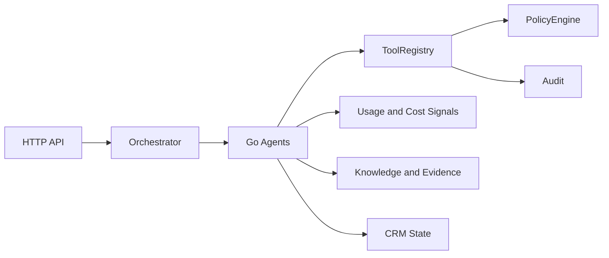
```mermaid
flowchart LR
    API[HTTP API] --> ORC[Orchestrator]
    ORC --> GO[Go Agents]
    GO --> TOOLS[ToolRegistry]
    TOOLS --> POLICY[PolicyEngine]
    TOOLS --> AUDIT[Audit]
    GO --> USAGE[Usage and Cost Signals]
    GO --> EVIDENCE[Knowledge and Evidence]
    GO --> CRM[CRM State]
```

The target direction is this:

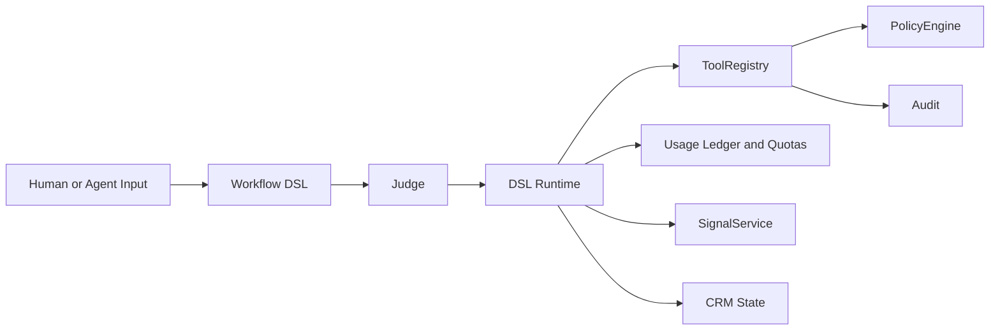
```mermaid
flowchart LR
    INPUT[Human or Agent Input] --> DSL[Workflow DSL]
    DSL --> JUDGE[Judge]
    JUDGE --> RUNTIME[DSL Runtime]
    RUNTIME --> TOOLS[ToolRegistry]
    TOOLS --> POLICY[PolicyEngine]
    TOOLS --> AUDIT[Audit]
    RUNTIME --> USAGE[Usage Ledger and Quotas]
    RUNTIME --> SIGNALS[SignalService]
    RUNTIME --> CRM[CRM State]
```

High-level interaction:

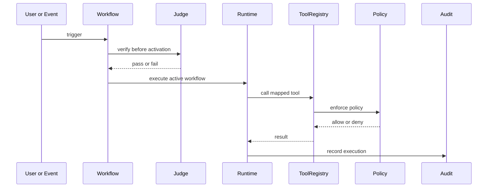
```mermaid
sequenceDiagram
    participant U as User or Event
    participant W as Workflow
    participant J as Judge
    participant R as Runtime
    participant T as ToolRegistry
    participant P as Policy
    participant A as Audit

    U->>W: trigger
    W->>J: verify before activation
    J-->>W: pass or fail
    W->>R: execute active workflow
    R->>T: call mapped tool
    T->>P: enforce policy
    P-->>T: allow or deny
    T-->>R: result
    R->>A: record execution
```

**Simple example**

A new support case is created. That event triggers the workflow `resolve_support_case`.

The workflow was already verified by the Judge before activation, so the Runtime can execute it safely.

During execution, the Runtime maps a step such as `SET case.status = "resolved"` to a registered tool like `update_case`.
Before that tool runs, the Policy layer checks whether the action is allowed. If it is allowed, the tool executes and returns the result.
Finally, the Runtime records the full execution in the audit trail.

In short:

- event: `case.created`
- workflow: `resolve_support_case`
- tool call: `update_case`
- policy decision: allow or deny
- outcome: CRM updated, usage attributed, and execution audited

---

## Transition Strategy

The transition is phased, but the commercial priority is narrower than the full platform surface.

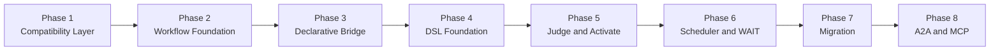
```mermaid
flowchart LR
    F1[Phase 1\nCompatibility Layer]
    F2[Phase 2\nWorkflow Foundation]
    F3[Phase 3\nDeclarative Bridge]
    F4[Phase 4\nDSL Foundation]
    F5[Phase 5\nJudge and Activate]
    F6[Phase 6\nScheduler and WAIT]
    F7[Phase 7\nMigration]
    F8[Phase 8\nA2A and MCP]

    F1 --> F2 --> F3 --> F4 --> F5 --> F6 --> F7 --> F8
```

Quick summary:

- `Phase 1`: common execution contract for agents
- `Phase 2`: workflows and signals as first-class entities
- `Phase 3`: bridge declarative format before the final DSL
- `Phase 4`: parser, runtime, and DSL runner
- `Phase 5`: verify and activate with Judge
- `Phase 6`: `WAIT` and resume
- `Phase 7`: gradual agent migration
- `Phase 8`: standards-based interoperability

The current product priority order is:

- first: support workflows, approvals, audit, evidence quality, and usage attribution
- next: sales copilot, connector coverage, eval depth, and quotas
- later: mobile breadth, broad studio surfaces, and marketplace-style extensibility

---

## Interoperability

A serious system cannot be closed.

The current direction is:

- **A2A-first** — the emerging standard for agent-to-agent delegation across systems
- **MCP-first** — Model Context Protocol, for sharing tools, resources, and context across system boundaries

Once you assume A2A and MCP are part of the core, the CRM stops looking like a closed workspace
and starts looking more like an operational node in a broader ecosystem.

That means:

- external `DISPATCH` should align with A2A
- tools and context should be exposed or consumed through MCP-compatible boundaries
- the project should not introduce a new proprietary external protocol

---

## Project Structure

```text
fenixcrm/
|-- cmd/                # entrypoints
|-- internal/
|   |-- api/            # HTTP handlers and middleware
|   |-- domain/         # crm, agent, tool, policy, audit, knowledge, workflow, signal
|   |-- infra/          # sqlite, llm, supporting runtime infra
|-- docs/               # architecture, plans, and task docs
|-- reqs/               # UC / FR / TST requirement traceability
|-- tests/              # contract and integration tests
|-- mobile/             # mobile app, visual system, and screenshot artifacts
|-- bff/                # optional backend for frontend
|-- pkg/                # shared Go utilities
|-- scripts/            # QA and automation
```

---

## Useful Commands

```bash
make test
make build
make run
make lint
make complexity
make trace-check
cd mobile && npm run screenshots
```

Important note:

- `make ci` is currently designed for a POSIX/Linux environment
- the documented local reference is remote CI or a compatible environment

See: `docs/ci.md`

---

## How It Works In Practice

FenixCRM is not a classic system of record — it is an operational layer where context, decisions, execution, and governance are visible as a continuous loop.

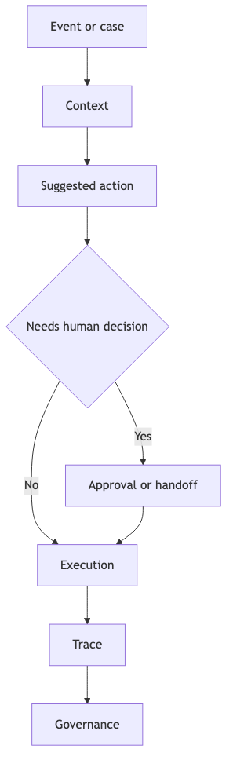

Every event or case surfaces context. The system suggests an action. A human decides whether to approve or hand it off. Execution happens. Everything is traced. The screens below show that loop in practice.

---

### 1. Entry - identity before automation

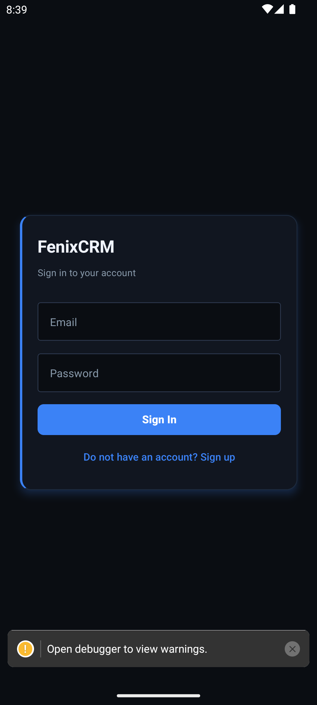

Every action starts with a user and a workspace. Accountability starts at the door.

---

### 2. Inbox - the main work queue

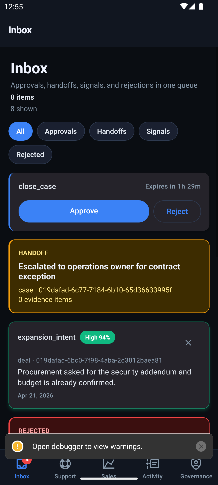

The inbox is the main work queue. It answers a simple question: "what needs attention now?" Approvals, handoffs, signals, and policy rejections are shown together.

---

### 3. Signal - the system proposes, humans decide

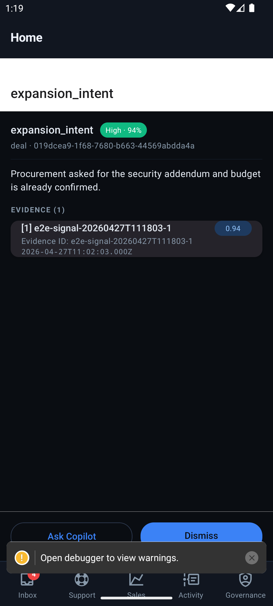

Signals make AI judgment reviewable. The detail screen shows confidence, related CRM context, and the evidence behind the signal.

---

### 4. Support case - a working surface

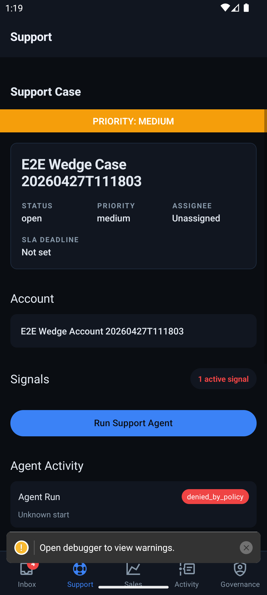

The case view shows history, current state, what the AI found, what actions are available, and what the case needs next.

---

### 5. Sales brief - context before action

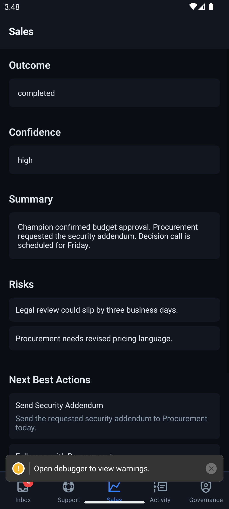

The brief shows account context, recent signals, and a suggested next action grounded in evidence. Sales users start from context, not from raw data.

---

### 6. Denied trace - stopped work is still visible

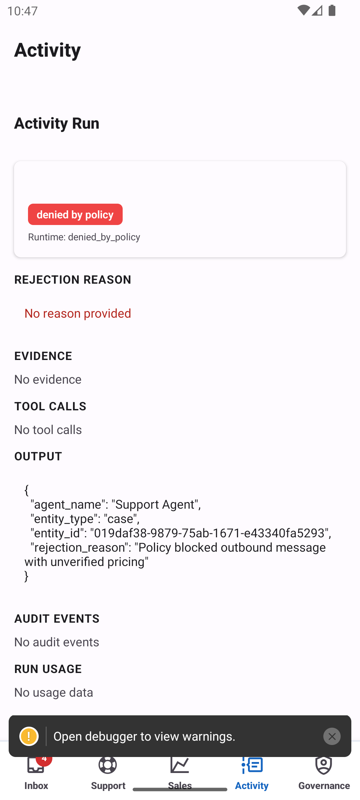

A stopped run is not hidden. The user can inspect the reason, the policy that applied, and when the decision happened.

---

### 7. Governance - control inside the product

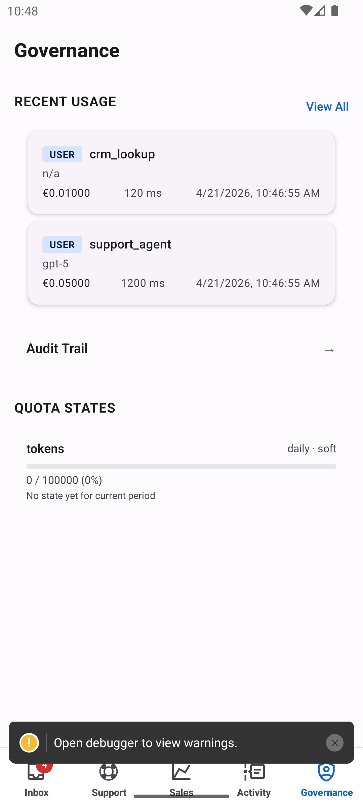

Governance is part of the product, not a separate backend view. Usage, quota state, actor, tool, model, latency, time, and cost can be read together.

---

### 8. Audit trail - readable where work happens

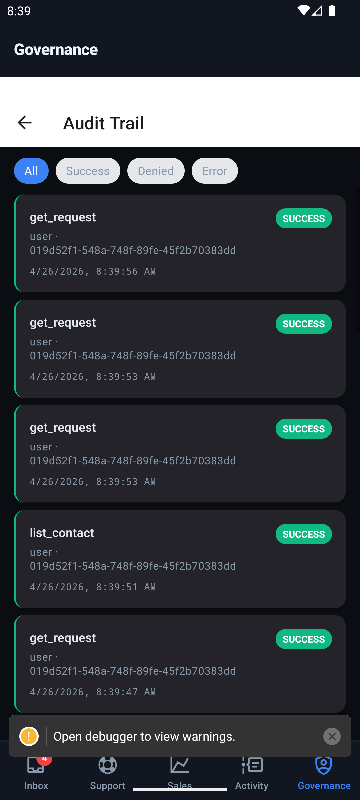

Audit is available where work happens. Mobile users can inspect requests and decisions, filter outcomes, and understand how the system behaved.

---

### 9. Usage drilldown - AI cost in product terms

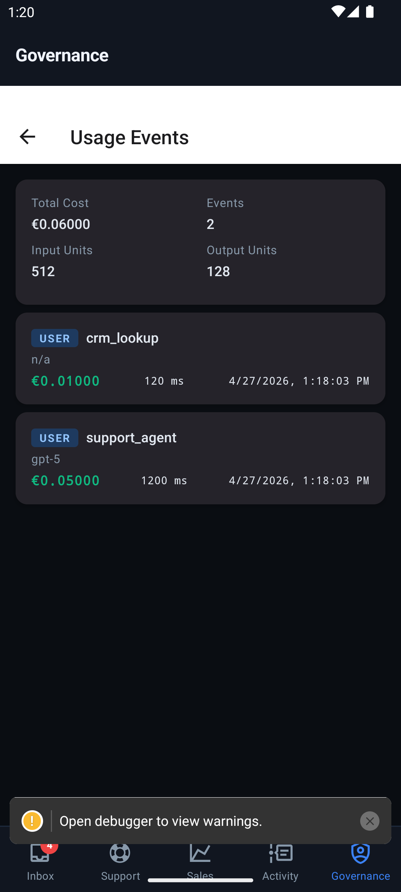

Usage and cost are visible from the same governance area. Event count, input units, output units, and individual tool/model calls stay visible inside the product.

---

### 10. KB trigger - resolved work can become knowledge

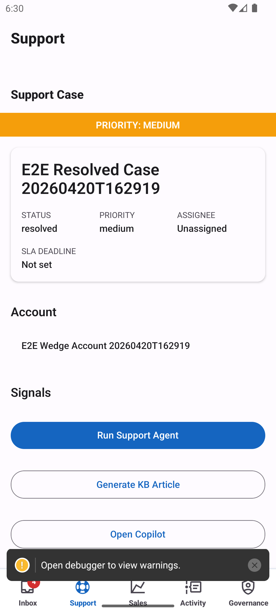

Once a case is resolved, the operator can trigger knowledge generation from the same support screen. The result can become reusable documentation.

---

### 11. Prospecting trigger - leads can start AI work

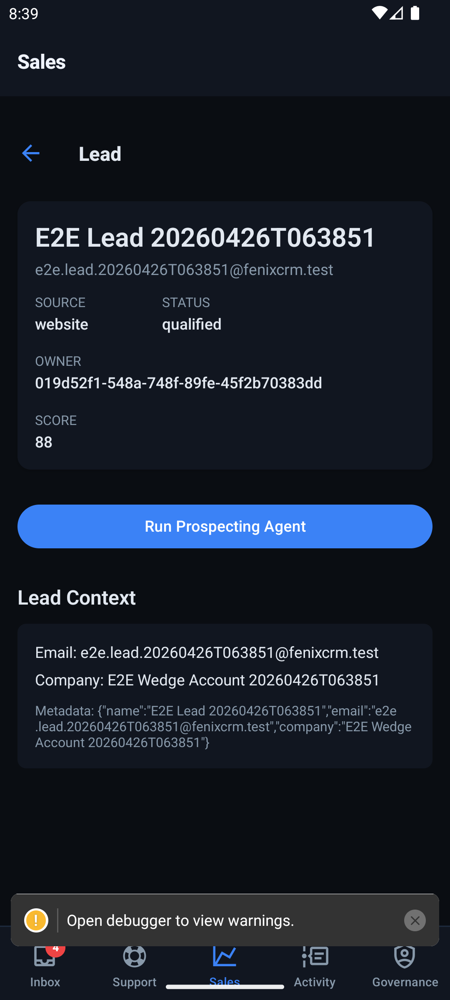

Leads are part of the Sales operating surface. From lead detail, the team can launch the Prospecting Agent and inspect the resulting run.

---

### 12. Deal Risk - risk review in the deal flow

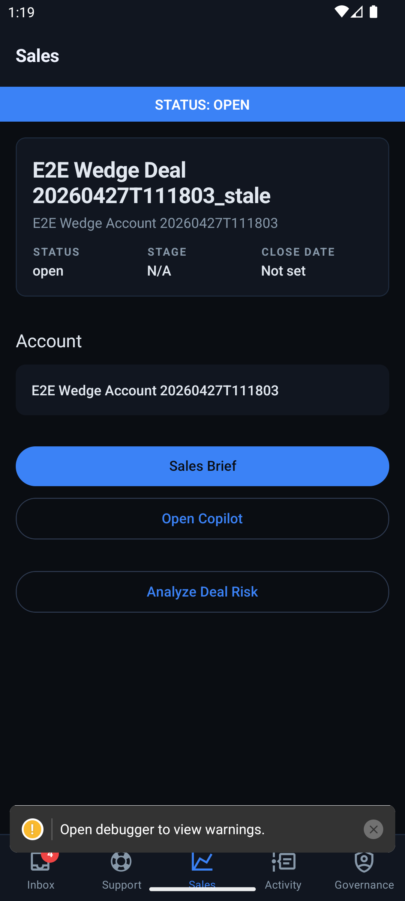

Deal risk is part of the deal flow. The user can review risk signals without leaving the sales context.

---

### 13. Insights entry - questions can start from mobile

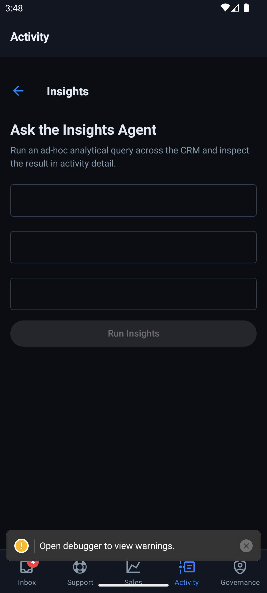

Analytical questions do not need to start from a dashboard. The Insights screen gives mobile users a direct entry point for grounded ad hoc queries.

---

### 14. Workflows list - declarative logic as a first-class entity

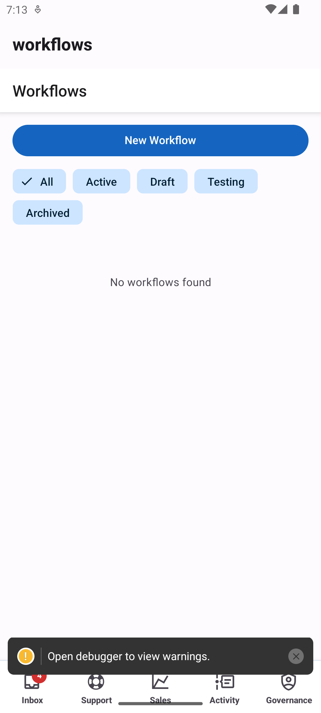

Workflows are not hidden code. They are named, versioned, and inspectable from the mobile app. The list shows status badges (active, draft, testing, archived) and lets operators review what automation is running.

---

### 15. Workflow graph - execution logic made visible

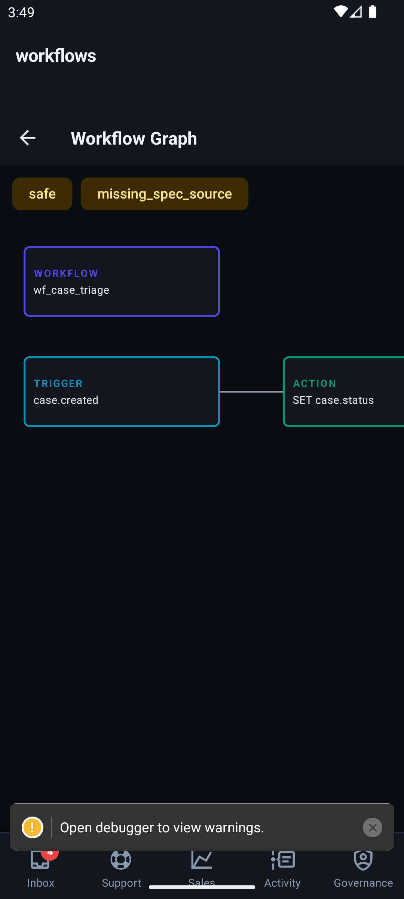

The graph screen renders the semantic projection of a workflow's DSL and Carta source as a read-only canvas. Nodes show kind labels (WORKFLOW, TRIGGER, ACTION) and are connected by directed edges. The conformance badge (`safe`, `extended`) tells the operator whether the workflow is within the stable tooling contract. This is the mobile surface for Wave 8 of the Carta Language Server and Visual Flow plan (CLSF-84).

---

### 16. CRM hub - unified entity navigation

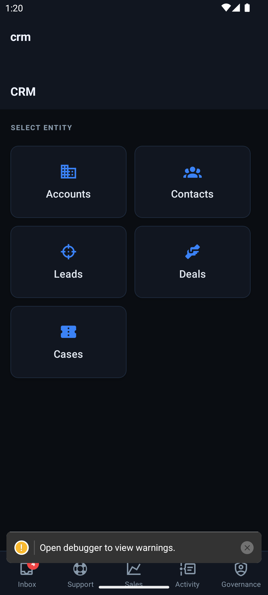

The CRM hub gives operators a single navigation point for all entity types: Accounts, Contacts, Leads, Deals, and Cases. This surface complements the operational inbox without replacing it — the hub is for inspection and maintenance, the inbox is for governed work.

---

### 17. Account detail - full context in one place

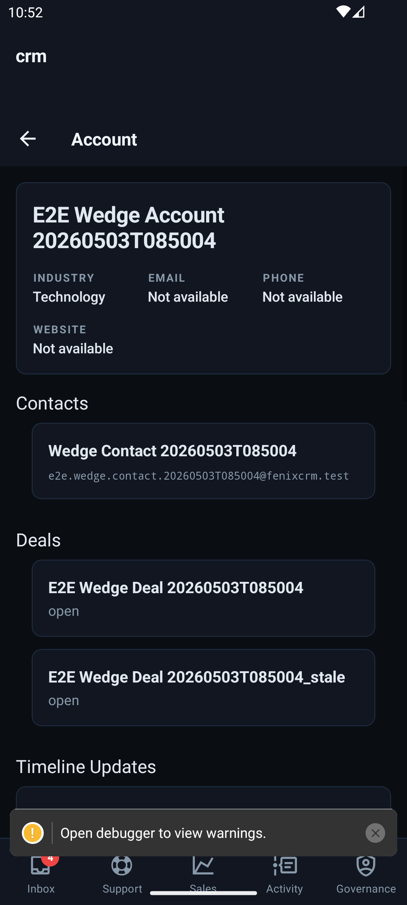

The account detail screen surfaces related contacts, deals, and a timeline of activity. Operators can review full context without switching between isolated lists.

---

### 18. CRM mutation - create and verify in one flow

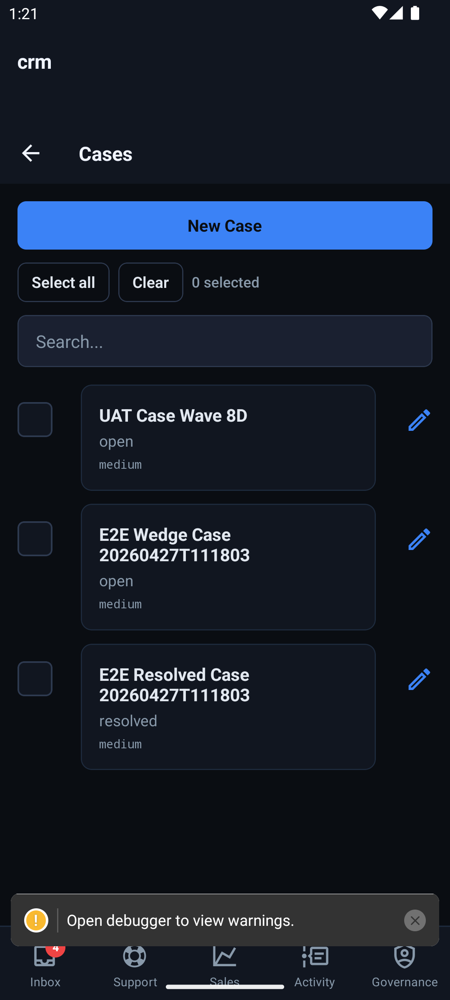

CRM writes go through the same governed path as AI-triggered actions. The case creation flow — form → submit → list — is verified end-to-end in the Maestro screenshot suite, confirming that the mutation persisted correctly and is immediately visible in the list.

---

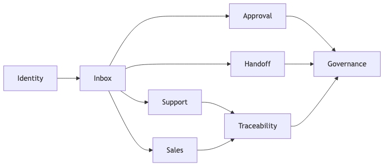

Each surface above is reachable from the inbox or from the CRM hub. The inbox is the operational center for governed work. The CRM hub is the place to inspect and maintain customer records. Screenshots are generated from the mobile app with Maestro and stored in `mobile/artifacts/screenshots/`.

> Full article: [When CRM Begins to Operate, Not Just Record](https://medium.com/@iotforce/when-crm-begins-to-operate-not-just-record-84248b080ee7)

---

## Carta Language Server and Visual Flow (CLSF)

Eight waves covering the full authoring and tooling layer for Carta-backed workflows.

**Waves 0–1** audited and locked the Carta parser, judge, runtime preflight order (Delegate → Grounds → DSL), and activation bridges (`BUDGET`, `INVARIANT`) with deterministic tests.

**Wave 2** added a `WorkflowSemanticGraph` projection with stable node IDs, semantic diff, and a conformance evaluator that classifies every workflow as `safe`, `extended`, or `invalid`.

**Wave 3** exposed three tooling endpoints: `GET /workflows/{id}/graph`, `POST /workflows/{id}/validate`, and `POST /workflows/diff`.

**Wave 4** added `cmd/fenixlsp`, a stdio LSP shell with diagnostics, completion, and hover backed by the parser, judge, and conformance validator.

**Wave 5** introduced `CALL` and `APPROVE` tokens, AST nodes, and parser rules. Both are classified `extended` until a runtime contract exists.

**Wave 6** shipped a web builder at `/bff/builder` with a text editor and a live graph refresh loop through `POST /bff/builder/preview`.

**Wave 7** added full visual authoring: users create and connect nodes on a canvas, the graph converts to canonical DSL/Carta source, and every save passes through the full lexer → parser → judge → conformance gate before persisting.

**Wave 8** added a mobile read-only graph viewer that renders the backend visual projection as a `FlowCanvas` with conformance badge. Verified in the Maestro screenshot suite as `18b_workflow_graph` (CLSF-84).

The authoring surface is no longer just a standalone builder. The BFF admin now
exposes a real operator loop for workflow authoring: create a draft from the
admin workflows list, land in a builder already bound to a real `workflowId`,
save text or graph changes against that workflow, return to workflow detail, and
activate from the existing admin surface.

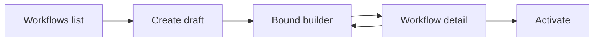
```mermaid
flowchart LR
    L[Workflows list] --> C[Create draft]
    C --> B[Bound builder]
    B --> D[Workflow detail]
    D --> A[Activate]
    D --> B
```

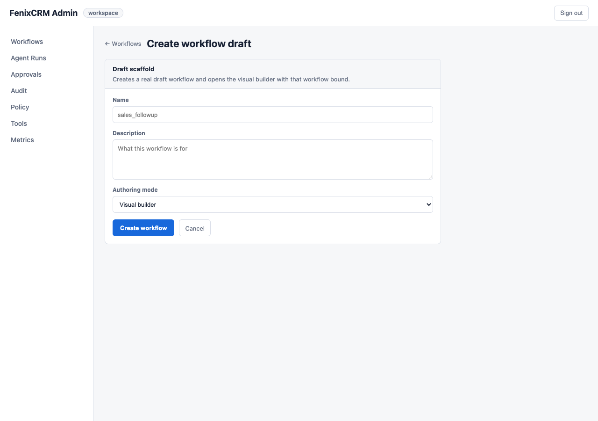

The flow starts from a real admin entry point. Operators create a draft with a
minimal scaffold and immediately move into an editable workflow context instead
of starting from a detached builder shell.

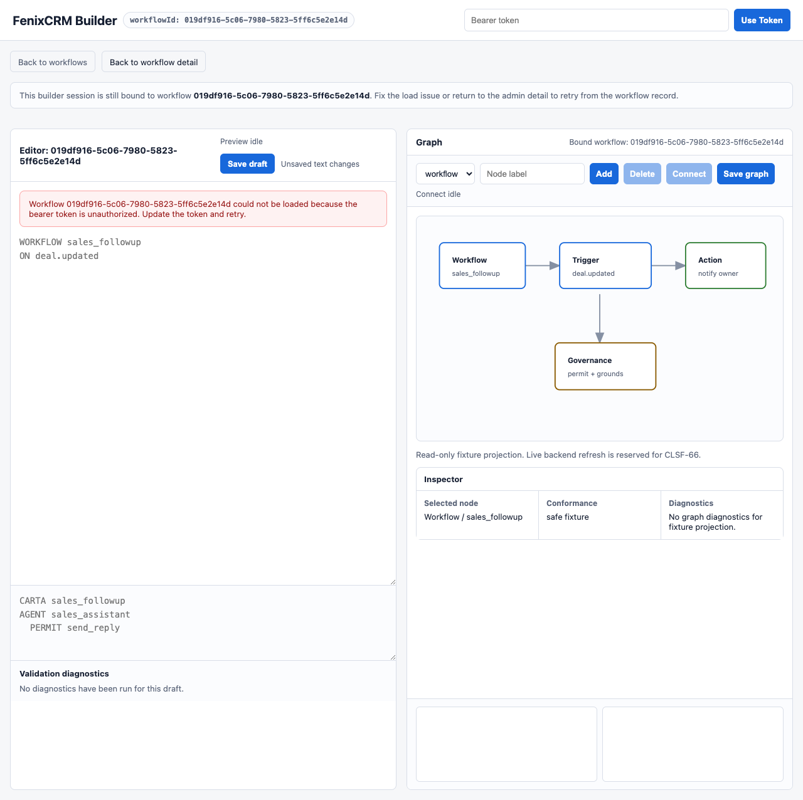

Inside the builder, both text and graph changes are bound to the real
`workflowId`. The editor, projection, save actions, and navigation all stay in
that workflow context.

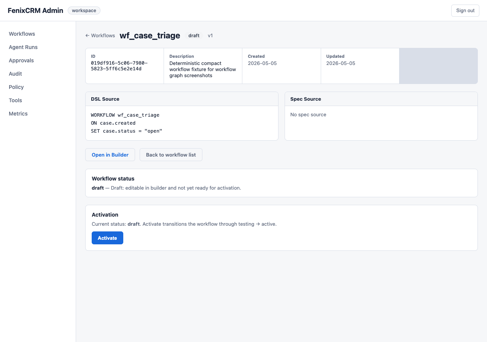

The operator loop closes on workflow detail, which remains the review surface
for status, source inspection, builder re-entry, and activation.

The admin screenshot suite captures this loop through
`03_workflow_create_draft`, `04_workflow_builder_bound`, and
`05_workflow_detail`. The full report is generated in
`bff/artifacts/admin-screenshots/report.html`.

| Layer | Files |
|---|---|
| Semantic graph | `internal/domain/agent/semantic_*.go`, `conformance.go` |
| Visual authoring | `internal/domain/agent/visual_projection.go`, `visual_authoring.go`, `visual_source_generator.go` |
| Tooling API | `internal/api/handlers/workflow.go` |
| Language server | `internal/lsp/`, `cmd/fenixlsp/` |
| BFF builder | `bff/src/routes/builder*.ts` |
| Mobile graph | `mobile/app/(tabs)/workflows/graph.tsx`, `mobile/src/lib/flowLayout.ts` |
| Plan | `docs/plans/carta-language-server-flow.md` |

---

## Recommended Documentation

To understand the current system:

- `docs/architecture.md`
- `docs/plans/fenixcrm_strategic_repositioning_spec.md`
- `docs/plans/fenixcrm_strategic_repositioning_implementation_plan.md`
- `docs/implementation-plan.md` (historical reference)

To understand the AGENT_SPEC transition:

- `docs/agent-spec-overview.md`
- `docs/agent-spec-traceability.md`
- `docs/agent-spec-use-cases.md`
- `docs/agent-spec-design.md`
- `docs/agent-spec-integration-analysis.md`
- `docs/agent-spec-development-plan.md`

Reference-only AGENT_SPEC documents:

- `docs/agent-spec-transition-plan.md`
- `docs/AGENT_SPEC.md`

To understand the transition baselines:

- `docs/agent-spec-regression-baseline.md`
- `docs/agent-spec-go-agents-baseline.md`
- `docs/agent-spec-core-contracts-baseline.md`
- `docs/agent-spec-phase1-quality-gates.md`

---

## Status

- the governed runtime, retrieval layer, approvals, and audit foundations already exist
- the current wedge is support workflows first, sales copilot second
- the declarative workflow transition is documented but does not define the market-facing wedge by itself
