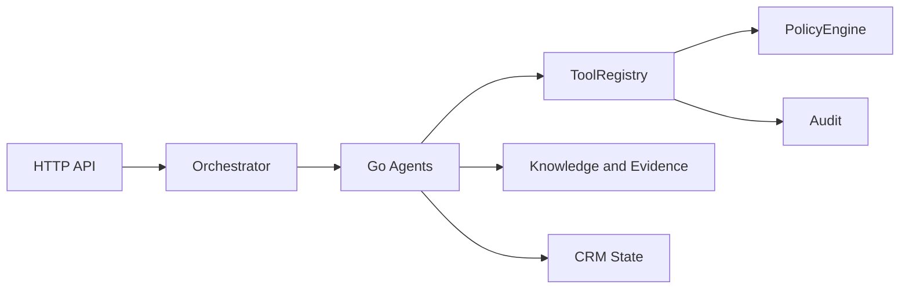
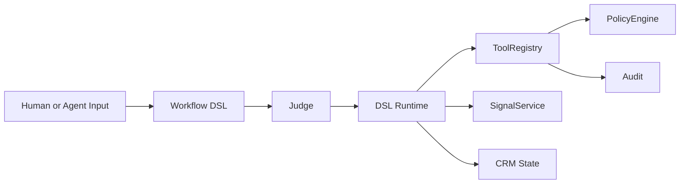
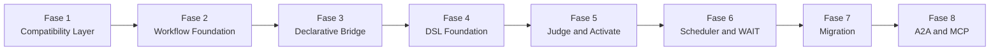

# FenixCRM

> CRM operativo con agentes, evidencia, governance y una capa declarativa en evolucion.

---

## Que es

FenixCRM combina dos cosas:

- un CRM operativo tradicional: cuentas, contactos, leads, deals, casos, actividades
- una capa agentic: tools, policy, audit, evidence packs y agentes que actuan sobre el CRM

La direccion actual del proyecto es evolucionar desde agentes Go hardcodeados hacia
workflows declarativos verificados y ejecutables.

La idea base es simple:

- hoy: agentes Go ejecutan logica de negocio
- transicion: el orquestador se vuelve pluggable
- futuro: workflows DSL + Judge + Runtime gobiernan la ejecucion

---

## Idea central

El sistema quiere pasar de:

- "el codigo Go define el workflow"

a:

- "el workflow declarativo define la ejecucion"

Eso no implica reescribir todo. La estrategia es extender la infraestructura actual:

- `ToolRegistry`
- `PolicyEngine`
- `ApprovalService`
- `AuditTrail`
- `EventBus`
- `agent_run`

---

## Conceptos basicos

### 1. Tools, no mutaciones directas

Los agentes no deberian mutar datos del CRM directamente. Toda accion relevante debe pasar
por herramientas registradas y auditables.

### 2. Policy y approvals

Antes de ejecutar una accion sensible, el sistema evalua permisos y puede requerir aprobacion
humana.

### 3. Audit

Toda ejecucion importante debe dejar traza. Esto incluye decisiones, tool calls, approvals y
resultados.

### 4. Workflow

Un workflow es la unidad declarativa que describe que debe pasar ante un evento o una condicion.

### 5. Judge

El Judge verifica que un workflow sea consistente antes de activarse.

### 6. Signal

Un signal representa una conclusion operativa con evidencia, por ejemplo una intencion alta o
un riesgo.

---

## Estado arquitectonico

Hoy el sistema funciona principalmente asi:



La direccion objetivo es esta:



---

## Estrategia de transicion

La transicion se hace por fases.



Resumen rapido:

- `Fase 1`: contrato comun de ejecucion para agentes
- `Fase 2`: workflows y signals como entidades first-class
- `Fase 3`: formato declarativo puente antes del DSL final
- `Fase 4`: parser, runtime y runner DSL
- `Fase 5`: verify y activate con Judge
- `Fase 6`: `WAIT` y resume
- `Fase 7`: migracion progresiva de agentes
- `Fase 8`: interoperabilidad estandar

---

## Interoperabilidad

La direccion actual del proyecto es:

- **A2A-first** para delegacion entre agentes
- **MCP-first** para tools, resources y contexto

Esto significa:

- `DISPATCH` externo debe alinearse con A2A
- tools y contexto deben exponerse o consumirse alineados con MCP
- no se busca inventar un protocolo propietario nuevo como contrato externo

---

## Estructura del proyecto

```text
fenix/
|-- cmd/                # entrypoints
|-- internal/
|   |-- api/            # handlers y middleware HTTP
|   |-- domain/         # crm, agent, tool, policy, audit, knowledge
|   |-- infra/          # sqlite, eventbus, llm, config
|-- docs/               # arquitectura, planes y tareas
|-- tests/              # contract y otros tests de integracion
|-- mobile/             # app mobile
|-- bff/                # backend for frontend
```

---

## Comandos utiles

```bash
make test
make build
make run
make lint
make complexity
make trace-check
```

Nota importante:

- `make ci` esta pensado para entorno POSIX/Linux
- la referencia local documentada hoy es CI remota o entorno compatible

Ver: [docs/ci.md](/c:/Users/octoedro/Desktop/fenixCRM/fenix/docs/ci.md)

---

## Documentacion recomendada

Si quieres entender el sistema por capas:

- [docs/architecture.md](/c:/Users/octoedro/Desktop/fenixCRM/fenix/docs/architecture.md)
- [docs/implementation-plan.md](/c:/Users/octoedro/Desktop/fenixCRM/fenix/docs/implementation-plan.md)

Si quieres entender la transicion AGENT_SPEC:

- [docs/agent-spec-development-plan.md](/c:/Users/octoedro/Desktop/fenixCRM/fenix/docs/agent-spec-development-plan.md)
- [docs/agent-spec-transition-plan.md](/c:/Users/octoedro/Desktop/fenixCRM/fenix/docs/agent-spec-transition-plan.md)
- [docs/agent-spec-design.md](/c:/Users/octoedro/Desktop/fenixCRM/fenix/docs/agent-spec-design.md)
- [docs/agent-spec-integration-analysis.md](/c:/Users/octoedro/Desktop/fenixCRM/fenix/docs/agent-spec-integration-analysis.md)

Si quieres entender los baselines de la transicion:

- [docs/agent-spec-regression-baseline.md](/c:/Users/octoedro/Desktop/fenixCRM/fenix/docs/agent-spec-regression-baseline.md)
- [docs/agent-spec-go-agents-baseline.md](/c:/Users/octoedro/Desktop/fenixCRM/fenix/docs/agent-spec-go-agents-baseline.md)
- [docs/agent-spec-core-contracts-baseline.md](/c:/Users/octoedro/Desktop/fenixCRM/fenix/docs/agent-spec-core-contracts-baseline.md)
- [docs/agent-spec-phase1-quality-gates.md](/c:/Users/octoedro/Desktop/fenixCRM/fenix/docs/agent-spec-phase1-quality-gates.md)

---

## Estado

- base CRM y capa agentic ya existen
- la transicion a workflows declarativos esta documentada
- la implementacion esta aislada en el branch `agent-spec-transition`
