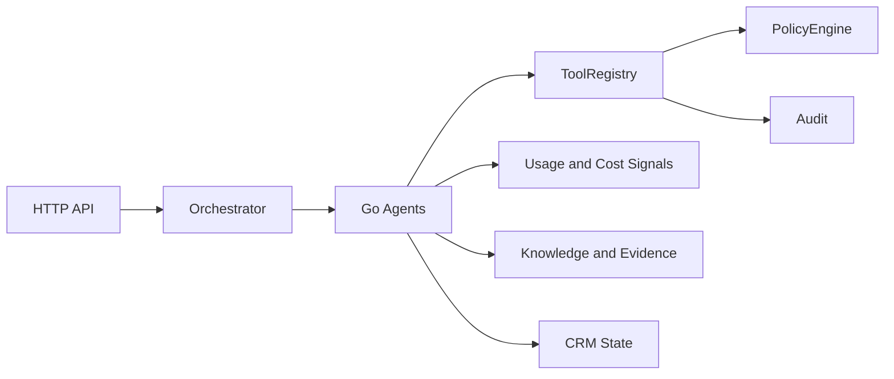
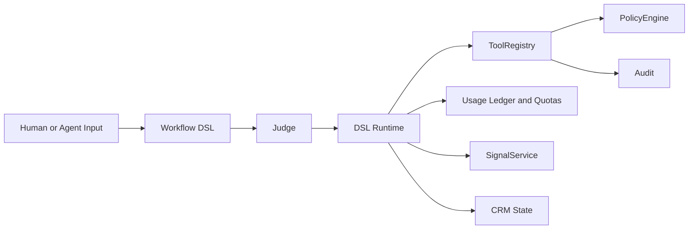
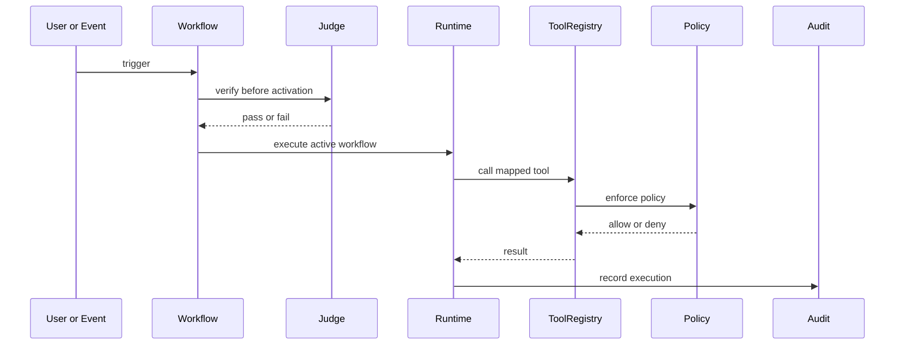
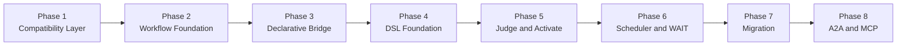

# FenixCRM

> A governed AI layer for customer operations where evidence grounds answers, policy constrains actions, and humans stay in control where it matters.

---

## What It Is

Most CRMs are passive databases. Teams update them after the fact, work happens elsewhere,
and the system lags behind reality.

FenixCRM starts from a different assumption: **the key unit is the governed workflow over trusted context.**

That means FenixCRM is not trying to win as a broad CRM replacement. It is a governed AI execution layer
for customer operations, sitting between human teams, business events, external systems, and shared context.

Concretely, it combines:

- a context layer: native CRM records plus external context and provenance
- a governed AI layer: retrieval, evidence packs, policy, approvals, audit, and safe tools
- an execution layer: copilots, agents, handoff, and declarative workflow evolution

The current wedge is:

- Support Copilot and Support Agent for case handling
- Sales Copilot for account and deal context
- Evidence-grounded execution with approval and auditability

The commercial packaging aligned to that wedge is:

- `Support Copilot`: grounded support assistance with evidence visibility and governed actions
- `Support Agent`: governed case execution with approvals, handoff, audit, and usage traces
- `Sales Copilot`: grounded account and deal briefs with risks, next steps, and abstention on weak evidence

The current direction of the project is to evolve from hardcoded Go agents toward verified,
executable declarative workflows without losing the governed runtime already built.

The core idea is simple:

- today: Go agents execute business logic
- transition: the orchestrator becomes pluggable
- future: DSL workflows + Judge + Runtime drive execution

---

## Core Idea

Business logic should not live forever as hidden code and tribal knowledge.
It should be something the system can explain and the team can evolve.

That is why the system is moving from:

- "Go code defines the workflow"

to:

- "the declarative workflow defines execution"

A workflow should be understandable, verifiable, and executable.
A judge verifies it before activation. A runtime executes it. Tools perform the concrete operations.
Policy, approvals, audit, and cost controls keep the whole thing under control.

This does not require a rewrite. The strategy is to extend the current infrastructure:

- `ToolRegistry`
- `PolicyEngine`
- `ApprovalService`
- `AuditTrail`
- `Usage Ledger`
- `EventBus`
- `agent_run`

For documentation purposes, the new workflow-platform capabilities use the existing repository
use case convention and are reserved as `UC-A2` to `UC-A9`.

---

## Basic Concepts

### 1. Tools, not direct mutations

Agents should not mutate CRM data directly. Relevant actions must go through registered,
auditable tools.

### 2. Policy and approvals

Before executing a sensitive action, the system evaluates permissions and may require human approval.

### 3. Audit

Every important execution should leave a trace. This includes decisions, tool calls, approvals,
and outcomes.

### 4. Workflow

A workflow is the declarative unit that describes what should happen when an event or condition occurs.

### 5. Judge

The Judge verifies that a workflow is consistent before it can be activated.

### 6. Signal

A signal is an operational conclusion backed by evidence, for example high intent or risk.

---

## Architectural State

Today, the system mainly works like this:



The target direction is this:



High-level interaction:



**Simple example**

A new support case is created. That event triggers the workflow `resolve_support_case`.

The workflow was already verified by the Judge before activation, so the Runtime can execute it safely.

During execution, the Runtime maps a step such as `SET case.status = "resolved"` to a registered tool like `update_case`.
Before that tool runs, the Policy layer checks whether the action is allowed. If it is allowed, the tool executes and returns the result.
Finally, the Runtime records the full execution in the audit trail.

In short:

- event: `case.created`
- workflow: `resolve_support_case`
- tool call: `update_case`
- policy decision: allow or deny
- outcome: CRM updated, usage attributed, and execution audited

---

## Transition Strategy

The transition is phased, but the commercial priority is narrower than the full platform surface.



Quick summary:

- `Phase 1`: common execution contract for agents
- `Phase 2`: workflows and signals as first-class entities
- `Phase 3`: bridge declarative format before the final DSL
- `Phase 4`: parser, runtime, and DSL runner
- `Phase 5`: verify and activate with Judge
- `Phase 6`: `WAIT` and resume
- `Phase 7`: gradual agent migration
- `Phase 8`: standards-based interoperability

The current product priority order is:

- first: support workflows, approvals, audit, evidence quality, and usage attribution
- next: sales copilot, connector coverage, eval depth, and quotas
- later: mobile breadth, broad studio surfaces, and marketplace-style extensibility

---

## Interoperability

A serious system cannot be closed.

The current direction is:

- **A2A-first** — the emerging standard for agent-to-agent delegation across systems
- **MCP-first** — Model Context Protocol, for sharing tools, resources, and context across system boundaries

Once you assume A2A and MCP are part of the core, the CRM stops looking like a closed workspace
and starts looking more like an operational node in a broader ecosystem.

That means:

- external `DISPATCH` should align with A2A
- tools and context should be exposed or consumed through MCP-compatible boundaries
- the project should not introduce a new proprietary external protocol

---

## Project Structure

```text
fenixcrm/
|-- cmd/                # entrypoints
|-- internal/
|   |-- api/            # HTTP handlers and middleware
|   |-- domain/         # crm, agent, tool, policy, audit, knowledge, workflow, signal
|   |-- infra/          # sqlite, llm, supporting runtime infra
|-- docs/               # architecture, plans, and task docs
|-- reqs/               # UC / FR / TST requirement traceability
|-- tests/              # contract and integration tests
|-- mobile/             # optional mobile app surface
|-- bff/                # optional backend for frontend
|-- pkg/                # shared Go utilities
|-- scripts/            # QA and automation
```

---

## Useful Commands

```bash
make test
make build
make run
make lint
make complexity
make trace-check
```

Important note:

- `make ci` is currently designed for a POSIX/Linux environment
- the documented local reference is remote CI or a compatible environment

See: `docs/ci.md`

---

## Recommended Documentation

To understand the current system:

- `docs/architecture.md`
- `docs/plans/fenixcrm_strategic_repositioning_spec.md`
- `docs/plans/fenixcrm_strategic_repositioning_implementation_plan.md`
- `docs/implementation-plan.md` (historical reference)

To understand the AGENT_SPEC transition:

- `docs/agent-spec-overview.md`
- `docs/agent-spec-traceability.md`
- `docs/agent-spec-use-cases.md`
- `docs/agent-spec-design.md`
- `docs/agent-spec-integration-analysis.md`
- `docs/agent-spec-development-plan.md`

Reference-only AGENT_SPEC documents:

- `docs/agent-spec-transition-plan.md`
- `docs/AGENT_SPEC.md`

To understand the transition baselines:

- `docs/agent-spec-regression-baseline.md`
- `docs/agent-spec-go-agents-baseline.md`
- `docs/agent-spec-core-contracts-baseline.md`
- `docs/agent-spec-phase1-quality-gates.md`

---

## Status

- the governed runtime, retrieval layer, approvals, and audit foundations already exist
- the current wedge is support workflows first, sales copilot second
- the declarative workflow transition is documented but does not define the market-facing wedge by itself
