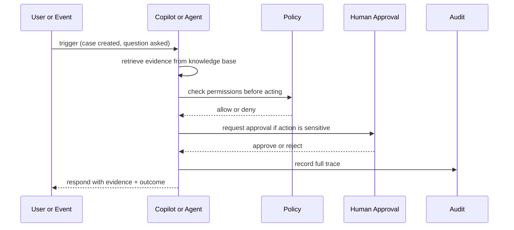
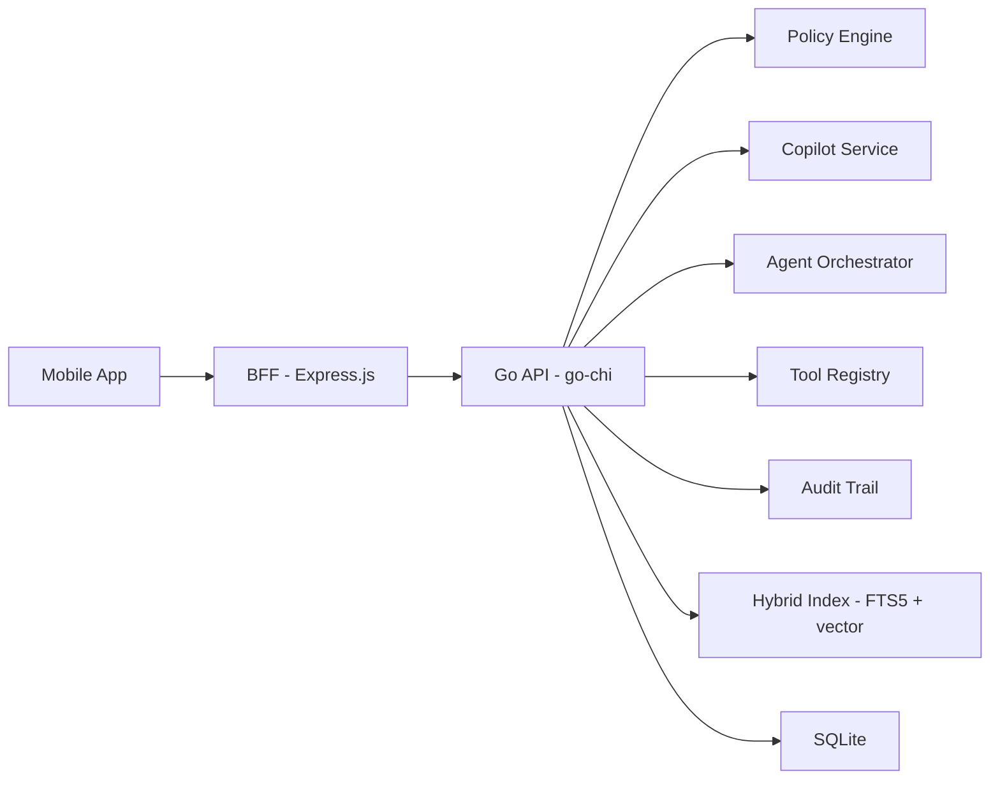
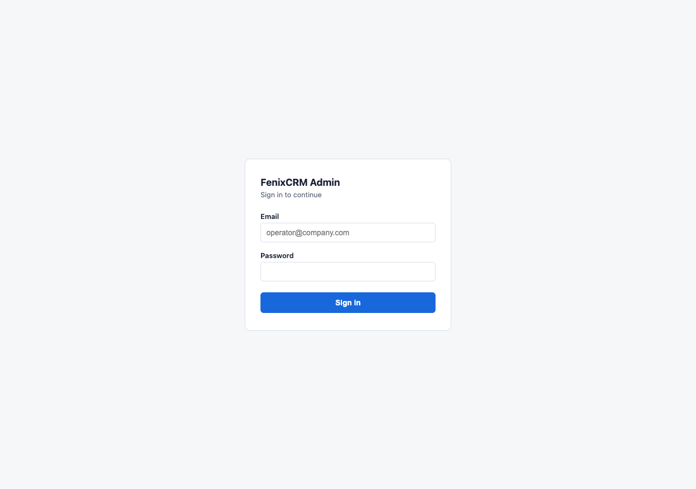
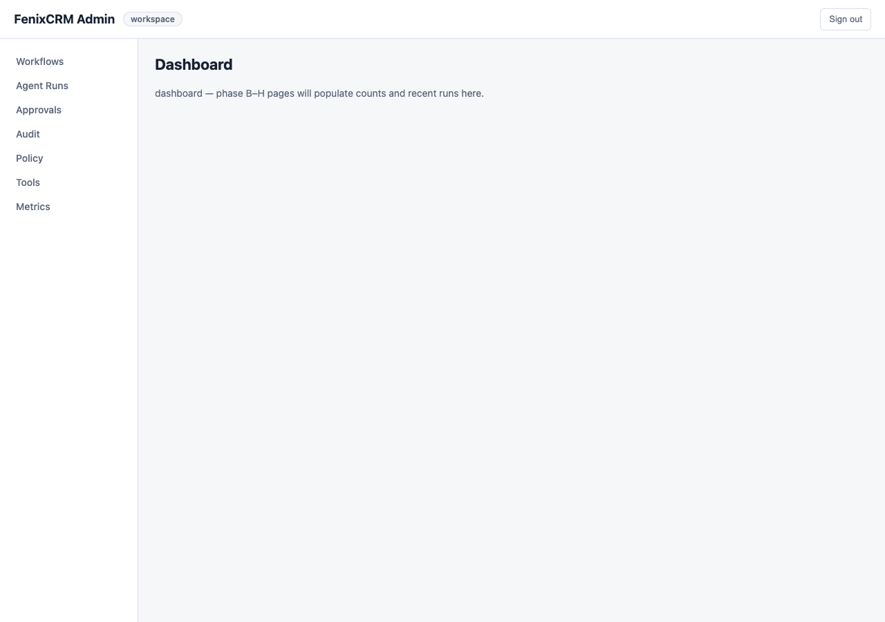
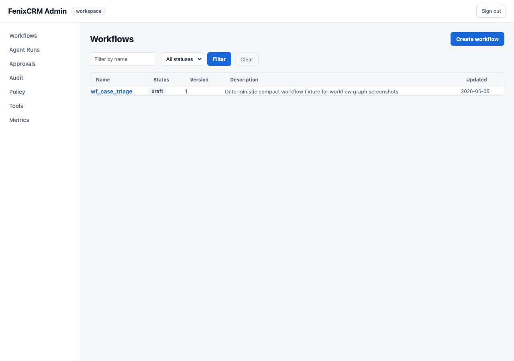
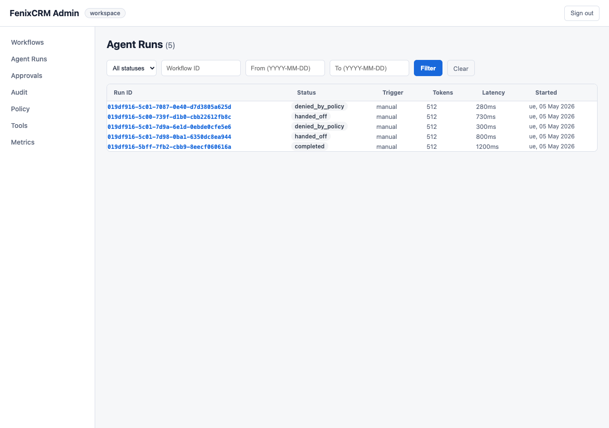
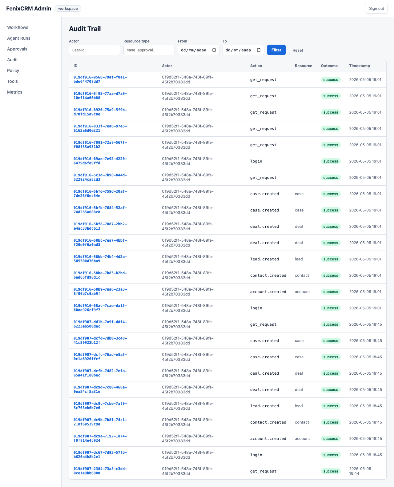

# FenixCRM

<p align="center">
  
</p>

> An AI layer for customer operations where every answer is backed by evidence, every action goes through policy, and humans stay in control where it matters.

---

## What It Is

Most CRMs are passive databases. Teams enter data after the fact, decisions happen in emails and chats, and the system just stores the result.

FenixCRM works differently. Instead of being a place to record what happened, it is an active layer that helps teams act on what is happening — with AI assistance that is grounded, auditable, and controlled.

Concretely, it combines three things:

- **Context** — CRM records, emails, documents, and call notes in one searchable place
- **Governed AI** — answers backed by evidence, actions blocked by policy, approvals for sensitive steps
- **Execution** — copilots and agents that do real work, with a full trace of every decision

The focus today is on two workflows:

- **Support** — help agents resolve cases faster with grounded suggestions and safe actions
- **Sales** — give reps account context and deal briefs before every call or meeting

---

## What Makes It Different

### Answers come with evidence

The AI does not just answer. It shows which documents, emails, or records it used and how confident it is. If there is not enough evidence, it says so instead of guessing.

### Actions go through policy

Agents cannot change data directly. Every action goes through a registered tool. The policy layer checks permissions before anything runs. Sensitive actions — like sending an email to an external contact — require human approval.

### Everything leaves a trace

Every AI response, tool call, approval decision, and policy check is recorded. Operators can inspect what happened, who approved it, and what it cost — from the same app where the work happens.

---

## What Is Built Today

The core system is complete and working:

| Area | What exists |
|---|---|
| CRM records | Accounts, Contacts, Leads, Deals, Cases, Activities, Notes |
| Knowledge layer | Ingestion, chunking, hybrid search (keyword + semantic) |
| AI layer | Copilot responses with evidence packs, support and sales agents |
| Governance | RBAC permissions, policy engine, approval flows, audit trail |
| Workflows | Declarative workflow engine with visual authoring and a mobile graph viewer |
| Observability | Usage tracking, cost per run, quota controls, agent run traces |
| Mobile app | React Native app with inbox, CRM hub, copilot, governance screens |
| Admin surface | BFF admin shell with session auth, workflow builder, approval review |

---

## How It Works

When something happens — a new case, a meeting request, a signal from a lead — the system surfaces relevant context, suggests an action, and asks for approval if needed. The result is traced and stored.



**Example — support case**

A new case arrives. The copilot searches the knowledge base and finds three relevant past cases and a product doc. It surfaces them with confidence scores. The agent suggests closing the case with a specific resolution. Before that action runs, the policy layer checks the agent's permissions. The result is written, and the full run — retrieval queries, evidence used, tool calls, cost — is stored in the audit trail.

---

## The App in Practice

Every screen below is generated from the live mobile app using the Maestro screenshot suite.

---

### Entry — identity before automation


Every action starts with a user and a workspace. Accountability starts at the door.

---

### Inbox — the main work queue


The inbox answers one question: what needs attention right now? Approvals, handoffs, signals, and policy rejections appear together in one place.

---

### Signal — the system proposes, humans decide


Signals make AI judgment reviewable. The detail screen shows confidence, related CRM context, and the evidence behind the signal.

---

### Support case — a working surface


The case view shows history, current state, what the AI found, what actions are available, and what the case needs next.

---

### Sales brief — context before action


The brief shows account context, recent signals, and a suggested next action grounded in evidence. Sales reps start from context, not from raw data.

---

### Denied trace — stopped work is still visible


A stopped run is not hidden. The user can inspect the reason, the policy that applied, and when the decision happened.

---

### Governance — control inside the product


Governance is part of the product, not a separate backend view. Usage, quota state, actor, tool, model, latency, and cost are visible together.

---

### Audit trail — readable where work happens


Audit is available where work happens. Mobile users can inspect requests and decisions, filter outcomes, and understand how the system behaved.

---

### Workflow graph — logic made visible


Workflows are not hidden code. The graph screen renders the workflow as a visual canvas. Nodes show what each step does and how they connect. The conformance badge shows whether the workflow is within the stable tooling contract.

---

### CRM hub — unified entity navigation


The CRM hub gives operators a single entry point for all entity types: Accounts, Contacts, Leads, Deals, and Cases.

---


> Full article: [When CRM Begins to Operate, Not Just Record](https://medium.com/@iotforce/when-crm-begins-to-operate-not-just-record-84248b080ee7)

---

## Architecture

**Stack**: Go 1.22+ · SQLite (WAL + FTS5 + vector) · Express.js BFF · React Native + Expo

```
Mobile app  →  BFF (Express.js)  →  Go backend (go-chi)  →  SQLite
```

The BFF is a thin proxy. All business logic, retrieval, policy, and execution live in the Go backend. The mobile app talks only to the BFF.



---

## Project Structure

```text
fenixcrm/
├── cmd/            entrypoints (server, LSP, trace tool)
├── internal/
│   ├── api/        HTTP handlers and middleware
│   ├── domain/     crm, agent, tool, policy, audit, knowledge, workflow, signal
│   └── infra/      sqlite, llm, supporting runtime
├── docs/           architecture, plans, and task docs
├── reqs/           UC / FR / TST requirement traceability
├── tests/          contract and integration tests
├── mobile/         mobile app and screenshot artifacts
├── bff/            backend for frontend (Express.js)
└── pkg/            shared Go utilities
```

---

## Getting Started

```bash
# run the backend
make run

# run tests
make test

# build
make build

# lint and complexity check
make lint
make complexity

# generate mobile screenshots
cd mobile && npm run screenshots
```

**First time setup** — install the pre-push quality gates:

```bash
make install-hooks
```

This ensures Go and mobile QA runs locally before any push reaches CI.

**Note**: `make ci` is designed for a POSIX/Linux environment. See [`docs/ci.md`](docs/ci.md) for details.

Troubleshooting mobile screenshots:
- [English runbook](docs/maestro-debug-apk-runbook-en.md)
- [Spanish runbook](docs/maestro-debug-apk-runbook-es.md)

---

## Admin Surface

The BFF exposes an operator admin shell at `/bff/admin` with session-backed authentication.

- Login with email and password — no bearer token exposed in the browser
- HTTP-only session cookie — no `localStorage` token storage
- All admin routes protected by a session guard
- Explicit logout via `POST /bff/admin/logout`

| Login | Dashboard | Workflows |
|-------|-----------|-----------|
|  |  |  |

| Agent Runs | Approvals | Audit |
|------------|-----------|-------|
|  |  |  |

Run `cd bff && npm run admin-screenshots` to regenerate.

---

## Documentation

To understand the current system:

- [`docs/architecture.md`](docs/architecture.md) — full architecture, ERD, diagrams, and API
- [`docs/plans/fenixcrm_strategic_repositioning_spec.md`](docs/plans/fenixcrm_strategic_repositioning_spec.md) — product direction
- [`docs/plans/fenixcrm_strategic_repositioning_implementation_plan.md`](docs/plans/fenixcrm_strategic_repositioning_implementation_plan.md) — canonical implementation plan
- [`docs/implementation-plan.md`](docs/implementation-plan.md) — historical reference

To understand the workflow and agent transition:

- [`docs/agent-spec-overview.md`](docs/agent-spec-overview.md)
- [`docs/agent-spec-design.md`](docs/agent-spec-design.md)
- [`docs/plans/carta-language-server-flow.md`](docs/plans/carta-language-server-flow.md) — Carta DSL, Judge, Runtime, and visual authoring

---

## Status

- The governed runtime, retrieval layer, approvals, and audit foundations are complete
- The current focus is support workflows first, sales copilot second
- The declarative workflow engine (Carta DSL + Judge + Runtime) is built and shipping incrementally
- Mobile app and admin surface are verified end-to-end with screenshot suites
