# FenixCRM

<p align="center">
  
</p>

> A governed AI operations layer for customer-facing workflows: grounded context, controlled execution, human approval when needed, and traceability after the fact.

## Contents

- [From CRM records to governed action](#from-crm-records-to-governed-action)
- [Inside the agent loop](#inside-the-agent-loop)
- [From copilot to controlled execution](#from-copilot-to-controlled-execution)
- [See it in action](#see-it-in-action)
- [Built as a toolchain, not a monolith](#built-as-a-toolchain-not-a-monolith)
- [Architecture at a glance](#architecture-at-a-glance)
- [Explore the code](#explore-the-code)
- [Run it](#run-it)
- [Project status](#project-status)
- [Go deeper](#go-deeper)

---

## From CRM records to governed action

A traditional CRM is good at storing customer state: cases, accounts, contacts, opportunities and activity history.

Fenix does **not** replace that system of record. It adds an execution layer above it so agents can use that context, collaborate on a plan, pass through policy and approvals, and then perform a controlled action.

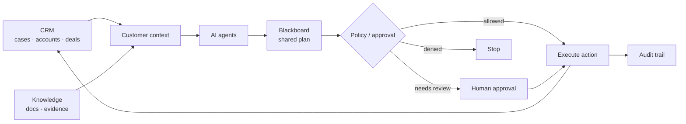
```mermaid
flowchart LR
    CRM[CRM<br/>cases · accounts · deals] --> CTX[Customer context]
    KB[Knowledge<br/>docs · evidence] --> CTX

    CTX --> AG[AI agents]
    AG --> BB[Blackboard<br/>shared plan]
    BB --> GOV{Policy / approval}

    GOV -->|allowed| ACT[Execute action]
    GOV -->|needs review| HUMAN[Human approval]
    HUMAN --> ACT
    GOV -->|denied| STOP[Stop]

    ACT --> CRM
    ACT --> AUDIT[Audit trail]
```

The distinction is practical:

| CRM responsibility | What Fenix adds |
|---|---|
| Store customer and business records | Turn those records into grounded agent context |
| Expose workflows and APIs | Decide which actions agents are allowed to invoke |
| Keep current business state | Coordinate several agents before one action is selected |
| Record the final state | Keep the plan, approval and execution trace inspectable |
| Run predefined automation | Allow AI-assisted execution without bypassing policy |

### Example: a support case

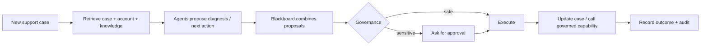
```mermaid
flowchart LR
    C[New support case] --> R[Retrieve case + account + knowledge]
    R --> S[Agents propose diagnosis / next action]
    S --> B[Blackboard combines proposals]
    B --> G{Governance}
    G -->|safe| X[Execute]
    G -->|sensitive| H[Ask for approval]
    H --> X
    X --> U[Update case / call governed capability]
    U --> A[Record outcome + audit]
```

So the product is not "AI inside a CRM" in the abstract. The concrete loop is:

```text
business context
      ↓
agent collaboration
      ↓
deterministic proposal
      ↓
policy / approval
      ↓
controlled execution
      ↓
traceable outcome
```

The initial use cases are intentionally narrow:

- **Support Copilot / Support Agent** — understand a case, gather evidence, propose an action and execute only when allowed.
- **Sales Copilot** — assemble account/deal context, surface risks and prepare governed next actions.

[Read the product overview →](docs/product-overview.md)

---

## Inside the agent loop

Fenix does not ask one model to make the whole decision. Specialized agents contribute different
pieces of the problem into a shared Blackboard.

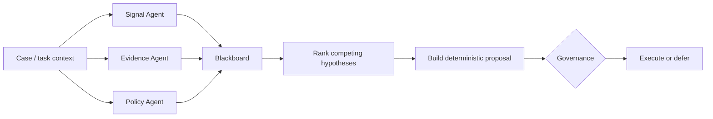
```mermaid
flowchart LR
    CASE[Case / task context] --> S[Signal Agent]
    CASE --> E[Evidence Agent]
    CASE --> P[Policy Agent]

    S --> B[Blackboard]
    E --> B
    P --> B

    B --> R[Rank competing hypotheses]
    R --> PLAN[Build deterministic proposal]
    PLAN --> G{Governance}
    G --> X[Execute or defer]
```

In practice:

- the **Signal Agent** identifies likely issues or opportunities;
- the **Evidence Agent** adds supporting facts;
- the **Policy Agent** contributes constraints;
- the **Blackboard** keeps those contributions in one shared state;
- arbitration ranks the alternatives;
- the planner converts the selected alternative into an executable proposal.

That separation matters because the model that suggests an action is not automatically the component
that gets to execute it.


---

## From copilot to controlled execution

The point where Fenix stops behaving like a copilot and starts behaving like an operating layer is **execution**. Once agents can act, collaboration, policy, retries and evidence become part of the product—not plumbing hidden behind the model.

| Problem | Fenix approach |
|---|---|
| Several agents need to contribute before an action | **Blackboard → ranked proposal → deterministic plan** |
| Model reasoning must not directly cause side effects | **Agent → governance → ToolRegistry → action** |
| Salesforce Flow must be editable in a human-readable form | **Salesforce XML ⇄ FlowIR ⇄ Mermaid** |
| Evidence infrastructure may fail after an action succeeds | **Recover evidence separately; never replay the business action** |

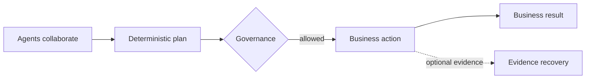
```mermaid
flowchart LR
    A[Agents collaborate] --> B[Deterministic plan]
    B --> G{Governance}
    G -->|allowed| X[Business action]
    X --> R[Business result]
    X -. optional evidence .-> E[Evidence recovery]
```

These are implemented boundaries, not just design goals. The functional proof exercises retries,
multi-agent execution, provider failures and restart-safe evidence recovery.

---

## See it in action

This is what the operating model looks like in the product. The screenshots come from the live screenshot suites.

| Inbox | Support case |
|---|---|
| 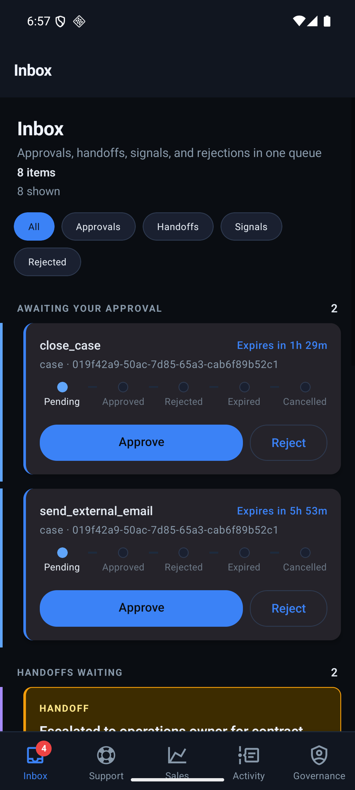 | 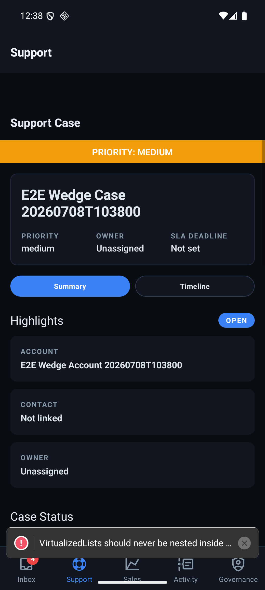 |
| Operational triage, approvals, handoffs and signals | Context, evidence, actions and governance in one surface |

| Governance | Workflow graph |
|---|---|
| 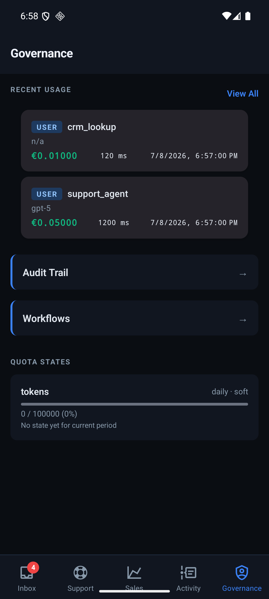 | 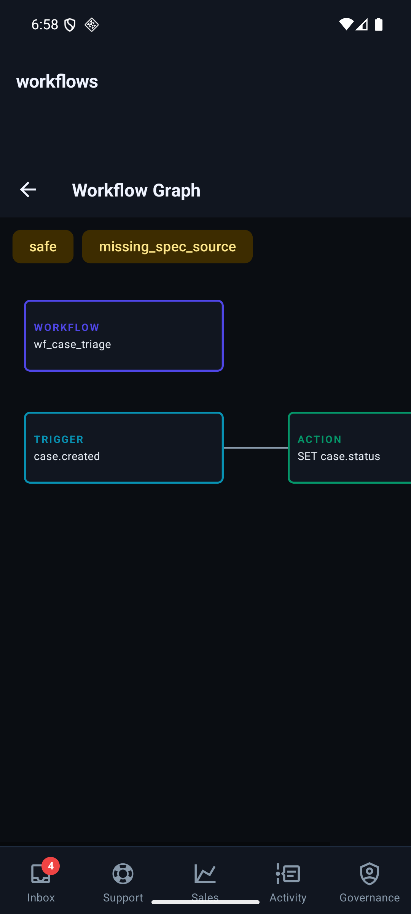 |
| Usage, policy, actor, tool, latency and cost | Governed workflow logic made visible |

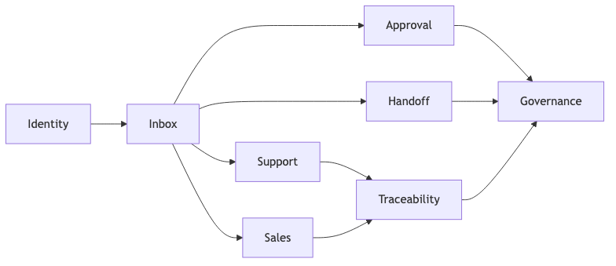

[See the complete mobile and admin surface tour →](docs/product-surfaces.md)

---

## Built as a toolchain, not a monolith

Fenix, Mermaid2SF and VEL are separate repositories in the same internally developed stack. The split
is an architecture choice, not a third-party dependency: each project owns one problem well and keeps
that complexity out of the others.

### Mermaid2SF — move between Salesforce and a human-readable model

**[Mermaid2SF](https://github.com/krukmat/Mermaid2SF)** is the Flow-focused part of that toolchain.
It starts from a simple question:

> Can a Salesforce Flow move into a readable diagram, be inspected or changed, and come back without
> losing its meaning?

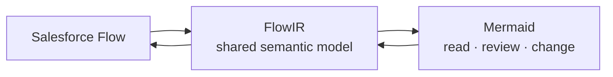
```mermaid
flowchart LR
    SF[Salesforce Flow] --> IR[FlowIR<br/>shared semantic model]
    IR --> MM[Mermaid<br/>read · review · change]
    MM --> IR
    IR --> SF
```

For Fenix, that creates a useful bridge between agent work and a real Salesforce artifact:

```text
understand the Flow
      ↓
reason about it
      ↓
propose a change
      ↓
validate the result
      ↓
return to Salesforce form
```

The important part is the round trip: Mermaid is not just a picture generated from Salesforce. It can
participate in a path back to Salesforce Flow.

### VEL — keep proof separate from the action itself

**[Verifiable Event Ledger (VEL)](https://github.com/krukmat/verifiable-event-ledger)** is the
evidence-focused part of the same toolchain, built around a different question:

> After Fenix performs an action, can the evidence of that execution be independently checked later
> instead of being trusted only because it sits in an application database?

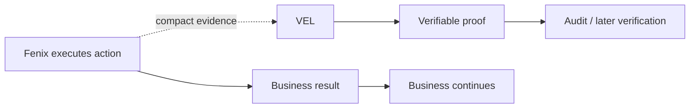
```mermaid
flowchart LR
    F[Fenix executes action] --> R[Business result]
    F -. compact evidence .-> V[VEL]
    V --> P[Verifiable proof]

    R --> C[Business continues]
    P --> A[Audit / later verification]
```

That separation is deliberate:

```text
business action succeeds
        │
        ├──→ result continues through Fenix
        │
        └──→ evidence is recorded separately
                    ↓
              verify later
```

If the evidence path is temporarily unavailable, Fenix keeps the completed business result and
recovers the evidence later. It does **not** replay the business action just to create proof.

### How they fit together

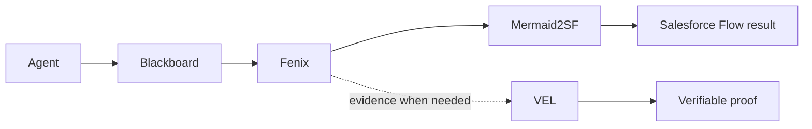
```mermaid
flowchart LR
    A[Agent] --> B[Blackboard]
    B --> F[Fenix]

    F --> M[Mermaid2SF]
    M --> R[Salesforce Flow result]

    F -. evidence when needed .-> V[VEL]
    V --> P[Verifiable proof]
```

Together they form a small internal toolchain:

- **Fenix** owns orchestration, governance and execution.
- **Mermaid2SF** owns Salesforce Flow understanding and transformation.
- **VEL** owns verifiable execution evidence.

The projects are separate by design so each concern can evolve independently, but they are part of
the same internal stack rather than external dependencies.

### Works with external systems too

The internal projects are only part of the picture. Fenix is also designed to work with external
APIs, services and platforms that it does not control.

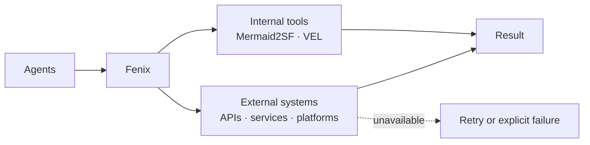
```mermaid
flowchart LR
    A[Agents] --> F[Fenix]
    F --> I[Internal tools<br/>Mermaid2SF · VEL]
    F --> X[External systems<br/>APIs · services · platforms]

    I --> R[Result]
    X --> R

    X -. unavailable .-> E[Retry or explicit failure]
```

The rule is the same in both cases:

- Fenix decides what may run.
- External calls keep the same execution identity and retry rules.
- If an external system is unavailable, Fenix reports the failure instead of inventing a result.
- A failure in an external system should not silently repeat an already completed business action.

The goal is not to avoid external systems. It is to use them without losing control of the workflow.

[Read the integration guide, failure model and proof index →](docs/integration-overview.md)

---

## Architecture at a glance

**Stack:** Go · SQLite · Express.js BFF · React Native / Expo

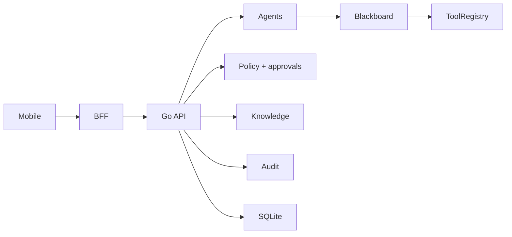
```mermaid
flowchart LR
    MOB[Mobile] --> BFF[BFF]
    BFF --> API[Go API]
    API --> AG[Agents]
    AG --> BB[Blackboard]
    BB --> TR[ToolRegistry]
    API --> POL[Policy + approvals]
    API --> KB[Knowledge]
    API --> AUD[Audit]
    API --> DB[SQLite]
```

For the full system model, ERD and API view, see [Architecture](docs/architecture.md).

---

## Explore the code

If the architecture caught your attention, these are the shortest paths into the implementation:

| Question | Start here |
|---|---|
| How do agents share work and produce a plan? | [`internal/domain/blackboard/`](internal/domain/blackboard/) |
| How are actions governed and executed? | [`internal/domain/tool/`](internal/domain/tool/) |
| Where are Mermaid2SF and VEL wired into Fenix? | [`internal/api/integration_runtime.go`](internal/api/integration_runtime.go) |
| Where is the complete functional integration exercised? | [`internal/api/integration_runtime_w6_test.go`](internal/api/integration_runtime_w6_test.go) |

The W6 integration test is the fastest single-file tour of the current design: Blackboard planning,
governed capability execution, Mermaid2SF, evidence optionality, retry identity, failure handling and
restart reconciliation all meet there.

---

## Run it

The shortest path from README to a running backend:

```bash
make run
make test
```

Full setup, repository structure, quality hooks and screenshot commands are in the
[development guide](docs/development-guide.md).

---

## Project status

The core product already includes governed agents, grounded retrieval, policy and approvals,
multi-agent Blackboard coordination, declarative workflows, mobile/admin surfaces and audit.

The cross-platform integration program through **W6 is closed** at architecture, runtime and
functional-proof level.

Production-style acceptance remains a separate step. The exact QA caveats and the optional live
Fenix + Mermaid2SF + VEL smoke are documented in the
[integration guide](docs/integration-overview.md#validation-boundary).

---

## Go deeper

Start here:

| Topic | Page |
|---|---|
| Documentation index | [docs/README.md](docs/README.md) |
| Product concept and positioning | [docs/product-overview.md](docs/product-overview.md) |
| Mobile + admin screens | [docs/product-surfaces.md](docs/product-surfaces.md) |
| Fenix + Mermaid2SF + VEL | [docs/integration-overview.md](docs/integration-overview.md) |
| Full architecture | [docs/architecture.md](docs/architecture.md) |
| Local setup and repository structure | [docs/development-guide.md](docs/development-guide.md) |
| Agent / Blackboard design | [docs/agent-spec-overview.md](docs/agent-spec-overview.md) |
| W6 functional integration handoff | [docs/plans/fenix-integration-w6-functional-execution.md](docs/plans/fenix-integration-w6-functional-execution.md) |

> Longer-form context: [When CRM Begins to Operate, Not Just Record](https://medium.com/@iotforce/when-crm-begins-to-operate-not-just-record-84248b080ee7)
