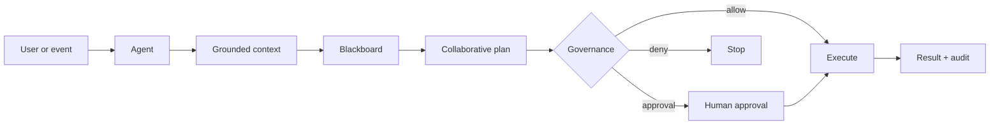
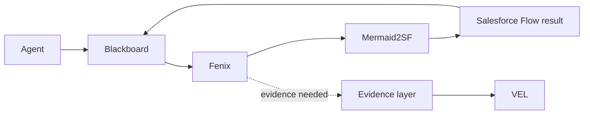
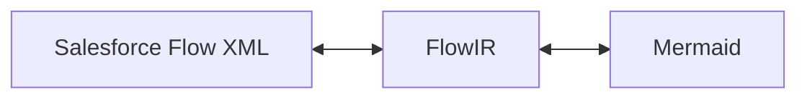
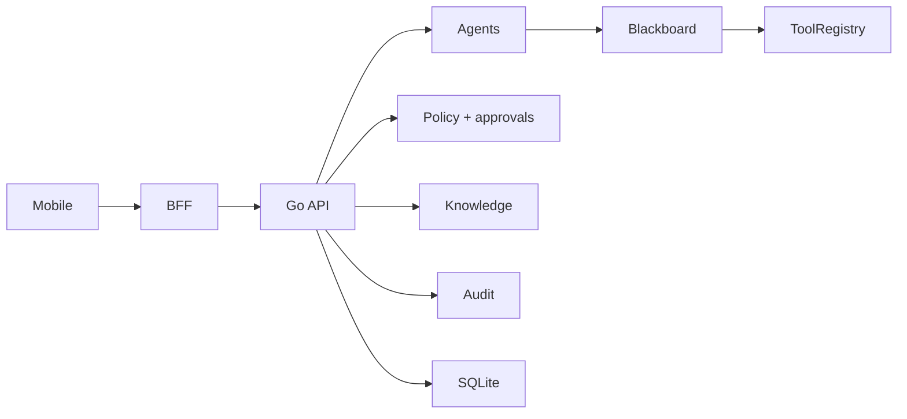

# FenixCRM

<p align="center">
  
</p>

> A governed AI operations layer for customer-facing workflows: grounded context, controlled execution, human approval when needed, and traceability after the fact.

## Contents

- [What Fenix is](#what-fenix-is)
- [How it works](#how-it-works)
- [Product surfaces](#product-surfaces)
- [The interesting part: governed external capabilities](#the-interesting-part-governed-external-capabilities)
- [Architecture at a glance](#architecture-at-a-glance)
- [Current status](#current-status)
- [Documentation](#documentation)

---

## What Fenix is

FenixCRM is not intended to replace a CRM. It sits above customer-operation workflows and gives AI agents a controlled way to **reason, collaborate and act**.

The operating idea is simple:

1. **Ground before answering** — use customer and knowledge context.
2. **Plan before acting** — agents collaborate through a shared Blackboard.
3. **Govern before executing** — permissions, policy and approvals decide what may run.
4. **Record what happened** — execution remains inspectable afterwards.

The initial product focus is deliberately narrow:

- **Support Copilot / Support Agent** — case resolution, safe actions, approvals and handoff.
- **Sales Copilot** — account context, risks, next actions and evidence-backed briefs.

[Read the product overview →](docs/product-overview.md)

---

## How it works


```mermaid
flowchart LR
    U[User or event] --> A[Agent]
    A --> K[Grounded context]
    K --> B[Blackboard]
    B --> P[Collaborative plan]
    P --> G{Governance}
    G -->|allow| T[Execute]
    G -->|approval| H[Human approval]
    H --> T
    G -->|deny| X[Stop]
    T --> O[Result + audit]
```

The Blackboard is the shared work area for specialized agents. It collects signals, evidence and constraints, then turns them into a deterministic proposal before execution.

The result is not just an AI answer: it is an **inspectable operational run**.

---

## Product surfaces

These screens are generated from the live product using the screenshot suites.

| Inbox | Support case |
|---|---|
|  |  |
| Operational triage, approvals, handoffs and signals | Context, evidence, actions and governance in one surface |

| Governance | Workflow graph |
|---|---|
|  |  |
| Usage, policy, actor, tool, latency and cost | Governed workflow logic made visible |


[See the complete mobile and admin surface tour →](docs/product-surfaces.md)

---

## The interesting part: governed external capabilities

Fenix can use external specialists without giving up control.

For Salesforce Flow work it can call **Mermaid2SF**. When an execution needs tamper-evident evidence, Fenix can separately use **VEL**.


```mermaid
flowchart LR
    A[Agent] --> B[Blackboard]
    B --> F[Fenix]
    F --> M[Mermaid2SF]
    M --> R[Salesforce Flow result]
    R --> B

    F -. evidence needed .-> E[Evidence layer]
    E --> V[VEL]
```

Mermaid2SF owns the Flow translation:


```mermaid
flowchart LR
    SF[Salesforce Flow XML] <--> IR[FlowIR]
    IR <--> MM[Mermaid]
```

Two boundaries matter:

- **Agents do not call Mermaid2SF or VEL directly.** Fenix remains the control point.
- **VEL is not a tool.** It is on the evidence path, separate from business execution.

That separation also protects retries: if evidence cannot be recorded, Fenix does **not** repeat an already completed business action.

[Read the integration guide, failure model and proof index →](docs/integration-overview.md)

---

## Architecture at a glance

**Stack:** Go · SQLite · Express.js BFF · React Native / Expo

```text
Mobile
  ↓
BFF
  ↓
Go backend
  ├─ agents + Blackboard
  ├─ knowledge / retrieval
  ├─ policy + approvals
  ├─ ToolRegistry
  ├─ audit / observability
  └─ SQLite
```


```mermaid
flowchart LR
    MOB[Mobile] --> BFF[BFF]
    BFF --> API[Go API]
    API --> AG[Agents]
    AG --> BB[Blackboard]
    BB --> TR[ToolRegistry]
    API --> POL[Policy + approvals]
    API --> KB[Knowledge]
    API --> AUD[Audit]
    API --> DB[SQLite]
```

For the full system model, ERD and API view, see [Architecture](docs/architecture.md).

---

## Current status

The core platform is implemented:

- governed agent execution;
- retrieval and evidence-backed context;
- policy and human approval;
- multi-agent Blackboard coordination;
- declarative workflow engine;
- mobile and admin surfaces;
- Mermaid2SF integration;
- optional VEL evidence lifecycle;
- restart-safe evidence reconciliation.

The integration program through **W6 is closed** at architecture/runtime/proof level.

Two validation caveats remain explicit:

- the last full W5 validation reached **82.9%** coverage against an **83.0%** gate; the 0.1-point gap was accepted without lowering the threshold;
- W6 functional proof changes were committed without another full QA run.

A live three-process smoke using real Fenix + Mermaid2SF + VEL processes remains an optional acceptance step before production-style use.

---

## Documentation

Start here:

| Topic | Page |
|---|---|
| Documentation index | [docs/README.md](docs/README.md) |
| Product concept and positioning | [docs/product-overview.md](docs/product-overview.md) |
| Mobile + admin screens | [docs/product-surfaces.md](docs/product-surfaces.md) |
| Fenix + Mermaid2SF + VEL | [docs/integration-overview.md](docs/integration-overview.md) |
| Full architecture | [docs/architecture.md](docs/architecture.md) |
| Local setup and repository structure | [docs/development-guide.md](docs/development-guide.md) |
| Agent / Blackboard design | [docs/agent-spec-overview.md](docs/agent-spec-overview.md) |
| W6 functional integration handoff | [docs/plans/fenix-integration-w6-functional-execution.md](docs/plans/fenix-integration-w6-functional-execution.md) |

> Longer-form context: [When CRM Begins to Operate, Not Just Record](https://medium.com/@iotforce/when-crm-begins-to-operate-not-just-record-84248b080ee7)
