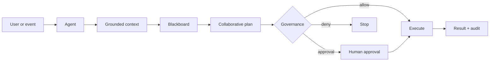
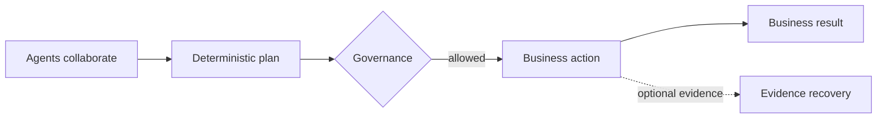
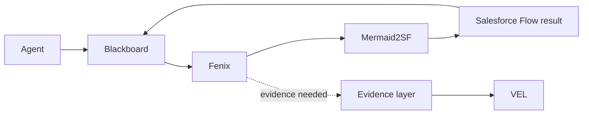
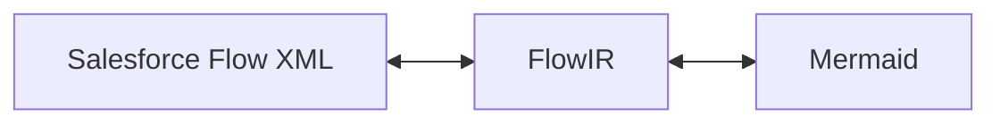
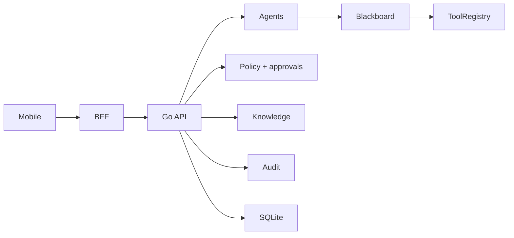

# FenixCRM

<p align="center">
  
</p>

> A governed AI operations layer for customer-facing workflows: grounded context, controlled execution, human approval when needed, and traceability after the fact.

## Contents

- [AI operations, not another CRM](#ai-operations-not-another-crm)
- [From context to action](#from-context-to-action)
- [From copilot to controlled execution](#from-copilot-to-controlled-execution)
- [See it in action](#see-it-in-action)
- [Specialized capabilities, one control plane](#specialized-capabilities-one-control-plane)
- [Architecture at a glance](#architecture-at-a-glance)
- [Explore the code](#explore-the-code)
- [Run it](#run-it)
- [Project status](#project-status)
- [Go deeper](#go-deeper)

---

## AI operations, not another CRM

FenixCRM is not intended to replace a CRM. It sits above customer-operation workflows and gives AI agents a controlled way to **reason, collaborate and act**.

The operating idea is simple:

1. **Ground before answering** — use customer and knowledge context.
2. **Plan before acting** — agents collaborate through a shared Blackboard.
3. **Govern before executing** — permissions, policy and approvals decide what may run.
4. **Record what happened** — execution remains inspectable afterwards.

The initial product focus is deliberately narrow:

- **Support Copilot / Support Agent** — case resolution, safe actions, approvals and handoff.
- **Sales Copilot** — account context, risks, next actions and evidence-backed briefs.

[Read the product overview →](docs/product-overview.md)

---

## From context to action


```mermaid
flowchart LR
    U[User or event] --> A[Agent]
    A --> K[Grounded context]
    K --> B[Blackboard]
    B --> P[Collaborative plan]
    P --> G{Governance}
    G -->|allow| T[Execute]
    G -->|approval| H[Human approval]
    H --> T
    G -->|deny| X[Stop]
    T --> O[Result + audit]
```

The Blackboard is the shared work area for specialized agents. It collects signals, evidence and constraints, then turns them into a deterministic proposal before execution.

The result is not just an AI answer: it is an **inspectable operational run**.

---

## From copilot to controlled execution

The point where Fenix stops behaving like a copilot and starts behaving like an operating layer is **execution**. Once agents can act, collaboration, policy, retries and evidence become part of the product—not plumbing hidden behind the model.

| Problem | Fenix approach |
|---|---|
| Several agents need to contribute before an action | **Blackboard → ranked proposal → deterministic plan** |
| Model reasoning must not directly cause side effects | **Agent → governance → ToolRegistry → action** |
| Salesforce Flow must be editable in a human-readable form | **Salesforce XML ⇄ FlowIR ⇄ Mermaid** |
| Evidence infrastructure may fail after an action succeeds | **Recover evidence separately; never replay the business action** |


```mermaid
flowchart LR
    A[Agents collaborate] --> B[Deterministic plan]
    B --> G{Governance}
    G -->|allowed| X[Business action]
    X --> R[Business result]
    X -. optional evidence .-> E[Evidence recovery]
```

These are implemented boundaries, not just design goals. The functional proof exercises retries,
multi-agent execution, provider failures and restart-safe evidence recovery.

---

## See it in action

This is what the operating model looks like in the product. The screenshots come from the live screenshot suites.

| Inbox | Support case |
|---|---|
|  |  |
| Operational triage, approvals, handoffs and signals | Context, evidence, actions and governance in one surface |

| Governance | Workflow graph |
|---|---|
|  |  |
| Usage, policy, actor, tool, latency and cost | Governed workflow logic made visible |


[See the complete mobile and admin surface tour →](docs/product-surfaces.md)

---

## Specialized capabilities, one control plane

Fenix can delegate specialized work without delegating control.

For Salesforce Flow work it can call **Mermaid2SF**. When an execution needs tamper-evident evidence, Fenix can separately use **VEL**.


```mermaid
flowchart LR
    A[Agent] --> B[Blackboard]
    B --> F[Fenix]
    F --> M[Mermaid2SF]
    M --> R[Salesforce Flow result]
    R --> B

    F -. evidence needed .-> E[Evidence layer]
    E --> V[VEL]
```

Mermaid2SF owns the Flow translation:


```mermaid
flowchart LR
    SF[Salesforce Flow XML] <--> IR[FlowIR]
    IR <--> MM[Mermaid]
```

Two boundaries matter:

- **Agents do not call Mermaid2SF or VEL directly.** Fenix remains the control point.
- **VEL is not a tool.** It is on the evidence path, separate from business execution.

That separation also protects retries: if evidence cannot be recorded, Fenix does **not** repeat an already completed business action.

[Read the integration guide, failure model and proof index →](docs/integration-overview.md)

---

## Architecture at a glance

**Stack:** Go · SQLite · Express.js BFF · React Native / Expo


```mermaid
flowchart LR
    MOB[Mobile] --> BFF[BFF]
    BFF --> API[Go API]
    API --> AG[Agents]
    AG --> BB[Blackboard]
    BB --> TR[ToolRegistry]
    API --> POL[Policy + approvals]
    API --> KB[Knowledge]
    API --> AUD[Audit]
    API --> DB[SQLite]
```

For the full system model, ERD and API view, see [Architecture](docs/architecture.md).

---

## Explore the code

If the architecture caught your attention, these are the shortest paths into the implementation:

| Question | Start here |
|---|---|
| How do agents share work and produce a plan? | [`internal/domain/blackboard/`](internal/domain/blackboard/) |
| How are actions governed and executed? | [`internal/domain/tool/`](internal/domain/tool/) |
| Where are Mermaid2SF and VEL wired into Fenix? | [`internal/api/integration_runtime.go`](internal/api/integration_runtime.go) |
| Where is the complete functional integration exercised? | [`internal/api/integration_runtime_w6_test.go`](internal/api/integration_runtime_w6_test.go) |

The W6 integration test is the fastest single-file tour of the current design: Blackboard planning,
governed capability execution, Mermaid2SF, evidence optionality, retry identity, failure handling and
restart reconciliation all meet there.

---

## Run it

The shortest path from README to a running backend:

```bash
make run
make test
```

Full setup, repository structure, quality hooks and screenshot commands are in the
[development guide](docs/development-guide.md).

---

## Project status

The core product already includes governed agents, grounded retrieval, policy and approvals,
multi-agent Blackboard coordination, declarative workflows, mobile/admin surfaces and audit.

The cross-platform integration program through **W6 is closed** at architecture, runtime and
functional-proof level.

Production-style acceptance remains a separate step. The exact QA caveats and the optional live
Fenix + Mermaid2SF + VEL smoke are documented in the
[integration guide](docs/integration-overview.md#validation-boundary).

---

## Go deeper

Start here:

| Topic | Page |
|---|---|
| Documentation index | [docs/README.md](docs/README.md) |
| Product concept and positioning | [docs/product-overview.md](docs/product-overview.md) |
| Mobile + admin screens | [docs/product-surfaces.md](docs/product-surfaces.md) |
| Fenix + Mermaid2SF + VEL | [docs/integration-overview.md](docs/integration-overview.md) |
| Full architecture | [docs/architecture.md](docs/architecture.md) |
| Local setup and repository structure | [docs/development-guide.md](docs/development-guide.md) |
| Agent / Blackboard design | [docs/agent-spec-overview.md](docs/agent-spec-overview.md) |
| W6 functional integration handoff | [docs/plans/fenix-integration-w6-functional-execution.md](docs/plans/fenix-integration-w6-functional-execution.md) |

> Longer-form context: [When CRM Begins to Operate, Not Just Record](https://medium.com/@iotforce/when-crm-begins-to-operate-not-just-record-84248b080ee7)
