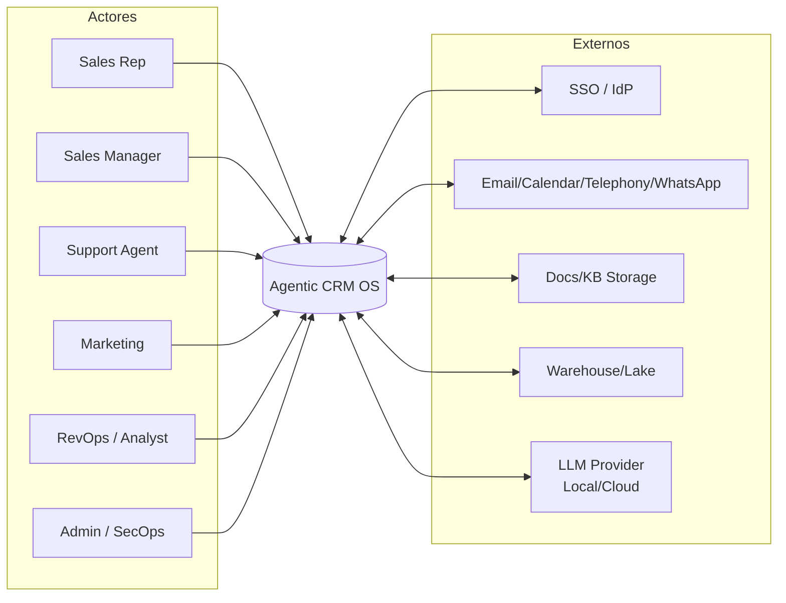
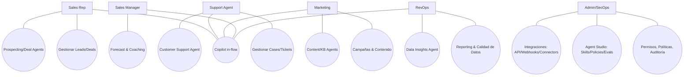
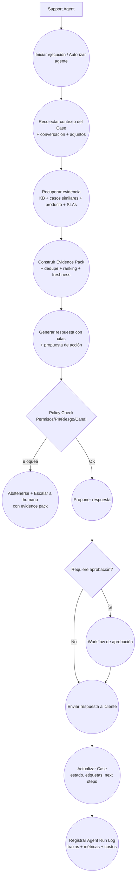

# Agentic CRM OS — Análisis y requerimientos (Agent-Ready)

> **Propósito**: Este documento consolida el análisis de mercado (CRM + IA/LLM + Agents) y deriva un set completo de requerimientos **funcionales (FR)** y **no funcionales (NFR)** para un producto que cubra el hueco: **CRM AI-native, evidence-first, action-capable, gobernado por políticas y con trazabilidad end-to-end**, con opción **self-hosted** y/o **BYO-model**.

---

## Índice
1. [Resumen ejecutivo](#resumen-ejecutivo)
2. [Hallazgos del mercado y patrones](#hallazgos-del-mercado-y-patrones)
3. [Definición del producto y alcance](#definición-del-producto-y-alcance)
4. [Actores y JTBD](#actores-y-jtbd)
5. [Mapa de capacidades](#mapa-de-capacidades)
6. [Casos de uso y diagramas](#casos-de-uso-y-diagramas)
7. [Requerimientos funcionales (FR)](#requerimientos-funcionales-fr)
8. [Requerimientos no funcionales (NFR)](#requerimientos-no-funcionales-nfr)
9. [Arquitectura conceptual](#arquitectura-conceptual)
10. [Modelo de datos conceptual](#modelo-de-datos-conceptual)
11. [Gobernanza de IA](#gobernanza-de-ia)
12. [Calidad y evaluación (Evals)](#calidad-y-evaluación-evals)
13. [Roadmap por fases](#roadmap-por-fases)
14. [Riesgos y mitigaciones](#riesgos-y-mitigaciones)
15. [Apéndices](#apéndices)

---

## Resumen ejecutivo

### Problema
Los CRMs se están “IA-izando” de dos maneras:
- **Copilots** embebidos en la UI que redactan/resumen y, en algunos casos, ejecutan acciones.
- **Agentes** especializados (support, prospecting, content, insights) con algún grado de orquestación, “studio”, y control.

Sin embargo, el mercado queda fragmentado entre:
- suites enterprise con fuerte “agent layer” pero **vendor lock-in**,
- CRMs OSS/modernos con buena base operativa pero **sin runtime agentic consistente**,
- add-ons de IA puntuales que no resuelven **gobernanza ni trazabilidad**.

### Oportunidad
Un **CRM AI-native** que combine:
1) CRM core extensible  
2) Capa de conocimiento (RAG) **con evidencia y citación obligatoria**  
3) Runtime agentic (acciones, tools, triggers) con **políticas**  
4) “Agent Studio” (skills/tools/policies/evals/versioning/rollback)  
5) Auditoría y observabilidad end-to-end  
6) Data sovereignty (self-host/BYO-model, “no-cloud” por policy)  
7) Control de costos (presupuestos/quotas por rol/agente/tenant)

### Principios de diseño (no negociables)
- **Evidence-first**: si no hay evidencia suficiente → **abstención** o **handoff humano**.
- **Actions via tools**: la IA no “escribe directo”; ejecuta **herramientas registradas**.
- **Policy-governed**: RBAC/ABAC + PII/no-cloud + approvals.
- **Operabilidad real**: logs, métricas, tracing, replay/dry-run, gating por evals.
- **Model-agnostic**: local o cloud sin reescribir el producto.

---

## Hallazgos del mercado y patrones

> Nota: Se listan patrones por su relevancia, no como dependencias de vendors.

### Patrón A — Copilot “in-flow” + acciones ejecutables
**Síntesis**: el asistente vive dentro del record/pipeline, con acciones “one-click” y chaining.  
**Implicación**: requiere **tool registry** + **audit log** + **idempotencia**.

### Patrón B — Agentes + Studio + guardrails + analítica
**Síntesis**: agentes por dominio y un “studio” para adaptar habilidades/políticas y medir rendimiento.  
**Implicación**: sin **Agent Studio** no hay plataforma; hay features sueltas.

### Patrón C — Customer support agentic: handoff humano + reglas
**Síntesis**: escalado configurable, control por canal, transferencia de contexto.  
**Implicación**: “human-in-the-loop” es un módulo core, no accesorio.

### Patrón D — Grounding/Trust: respuestas con evidencia
**Síntesis**: tendencia a exigir fuentes/citas, especialmente en enterprise.  
**Implicación**: imponer **evidence pack** como contrato de salida.

### Patrón E — IA como add-on puntual en CRMs tradicionales/OSS
**Síntesis**: features aisladas (dashlets, generadores) sin coherencia agentic.  
**Implicación**: el hueco está en la **capa agentic y de gobernanza**.

---

## Definición del producto y alcance

### Nombre de trabajo
**Agentic CRM OS (self-hosted + AI-native)**

### Propuesta de valor
1) **Copilot contextual** dentro del CRM, con acciones operativas.  
2) **RAG** sobre datos estructurados y no estructurados, con **citas obligatorias**.  
3) **Agentes especializados** con triggers, límites, y handoff humano.  
4) **Agent Studio** para construir skills/tools/policies y evaluar.  
5) **Governance**: RBAC/ABAC, PII/no-cloud, approvals, auditoría.  
6) **Model-agnostic**: LLM local y/o cloud con budgets explícitos.

### Fuera de alcance (por defecto)
- ERP completo
- Marketing automation tipo “suite” (solo features mínimas integrables)
- Contact center/CTI completo (solo conectores e integración)

---

## Actores y JTBD

### Actores
- **Sales Rep**
- **Sales Manager**
- **Support Agent**
- **Marketing Manager**
- **RevOps / Data Analyst**
- **Admin / SecOps**
- **Automation/AI Builder** (rol mixto, típicamente Admin/RevOps)

### JTBD (jobs-to-be-done)
- “Quiero saber **qué hacer ahora** y **por qué** (evidencia).”
- “Quiero que el sistema ejecute tareas repetitivas **con límites y aprobación**.”
- “Quiero confianza operacional: **abstención** si no hay evidencia.”
- “Quiero trazabilidad: quién hizo qué, cuándo, con qué datos, y cómo revertirlo.”

---

## Mapa de capacidades

1) **CRM Core & Extensibility**  
2) **Knowledge & Retrieval Layer (RAG)**  
3) **Copilot UI (in-flow)**  
4) **Agent Runtime (triggers + orchestration + tools)**  
5) **Agent Studio (builder + policy + eval + deploy)**  
6) **Governance & Security (RBAC/ABAC + audit + approvals)**  
7) **Integrations (connectors + API/webhooks)**  
8) **Observability & Analytics (usage, quality, cost, outcomes)**

---

## Casos de uso y diagramas

### Catálogo de casos de uso (alto nivel)
- **UC-S1**: Sales Copilot — resumen de account/deal + próximos pasos con evidencia.
- **UC-S2**: Prospecting Agent — investigar + redactar outreach + crear tasks.
- **UC-S3**: Deal Risk Agent — detectar riesgo + sugerir mitigación.
- **UC-C1**: Support Agent — responder case + actualizar case + handoff humano.
- **UC-K1**: KB Agent — convertir soluciones en artículos + revisión.
- **UC-D1**: Data Insights Agent — responder preguntas analíticas con evidencia.
- **UC-G1**: Governance — auditar Agent Runs + replay + rollback.
- **UC-A1**: Agent Studio — crear skill + policy + eval + promover.

### Diagrama — Nivel 0 (Contexto)


### Diagrama — Nivel 1 (Casos de uso principales)


### Diagrama — Nivel 2 (Detalle: UC-C1 “Customer Agent resuelve un Case”)


---

## Requerimientos funcionales (FR)

> **Formato**: FR-XXX — *Título* (Prioridad)  
> **Descripción**, **AC (Acceptance Criteria)**, **Dependencias**.  
> **Prioridad**: P0 (MVP), P1 (v1), P2 (v2)

### CRM Core & Extensibilidad

**FR-001 — Entidades core CRM (P0)**  
**Descripción:** CRUD + relaciones para Account/Company, Contact, Lead, Opportunity/Deal, Case/Ticket, Activity (Task/Event), Note, Attachment.  
**AC:**  
- CRUD con búsqueda, filtros, paginación.  
- Timeline por entidad (actividades + cambios).  
- Auditoría de cambios (quién/cuándo/qué).  
**Dep:** FR-060, FR-070.

**FR-002 — Pipelines y etapas (P0)**  
**Descripción:** pipeline configurable, reglas de etapa (required fields, probabilidad, SLA interno).  
**AC:**  
- Configurar pipeline por equipo/unidad.  
- Evento al cambiar etapa (trigger).  
**Dep:** FR-120.

**FR-003 — Reporting base (P0/P1)**  
**Descripción:** dashboards y KPIs: embudo, SLA, backlog, aging.  
**AC:**  
- Dashboards mínimos por dominio (Sales/Support).  
- Export/CSV.  
**Dep:** FR-070.

**FR-004 — Extensión del modelo (custom objects/fields) (P1)**  
**Descripción:** crear objetos/campos, layouts y validaciones; reflejo en APIs y retrieval.  
**AC:**  
- Creación sin downtime.  
- Indexación y reporting para campos extensibles.  
**Dep:** FR-090, FR-061.

**FR-005 — Workflows no-IA (P1)**  
**Descripción:** motor de reglas para notificaciones/asignación/SLAs sin usar LLM.  
**AC:**  
- Triggers + acciones estándar (create task, assign owner, webhook).  
**Dep:** FR-051, FR-120.

---

### Knowledge & Retrieval Layer (RAG)

**FR-090 — Indexación híbrida (P0)**  
**Descripción:** keyword (BM25) + vector (embeddings) + filtros por permisos; indexación incremental.  
**AC:**  
- Query con filtros por entidad/tenant/owner.  
- Ranking híbrido configurable.  
- Incremental reindex por cambios.  
**Dep:** FR-060, FR-100, FR-121.

**FR-091 — Ingesta multifuente (P0/P1)**  
**Descripción:** ingesta de emails, calendar, llamadas/transcripciones, docs/KB, chat → normalización a KnowledgeItem.  
**AC:**  
- P0: emails + docs.  
- Metadata mínima: fuente, timestamps, owner, sensibilidad, TTL.  
**Dep:** FR-050, FR-061.

**FR-092 — Evidence Pack obligatorio (P0)**  
**Descripción:** toda salida de IA (respuesta/recomendación/acción) adjunta evidencias: IDs + snippets + score + timestamp.  
**AC:**  
- UI muestra “fuentes” por defecto.  
- Si evidencia insuficiente → FR-210 (abstención).  
**Dep:** FR-200, FR-230.

**FR-093 — Freshness/TTL por tipo (P1)**  
**Descripción:** políticas de frescura para datos volátiles (stage/status).  
**AC:**  
- TTL por tipo de KnowledgeItem.  
- Advertencias cuando evidencia es antigua.  
**Dep:** FR-091.

**FR-094 — Dedupe y consolidación (P1)**  
**Descripción:** deduplicar chunks/evidencia; consolidar respuestas repetidas.  
**AC:**  
- Reducir duplicación en evidence packs.  
- Métrica de “duplication rate” disponible.  
**Dep:** FR-310.

---

### Copilot (in-flow)

**FR-200 — Copilot embebido (P0)**  
**Descripción:** UI contextual dentro del CRM (record pages/pipeline) + chat/command palette.  
**AC:**  
- En account/deal/case: “Resumen”, “Siguiente acción”, “Draft email”, “Actualizar campo”.  
- “Explain why” muestra evidencias.  
**Dep:** FR-092, FR-060.

**FR-201 — Resúmenes operativos (P0)**  
**Descripción:** resúmenes de account/deal/case/meeting prep con riesgos y next steps.  
**AC:**  
- Resumen incluye evidencias citadas.  
- Debe indicar “unknown” si faltan datos.  
**Dep:** FR-092.

**FR-202 — Copilot Actions (tools) (P0)**  
**Descripción:** biblioteca de acciones ejecutables y chaining (crear task, actualizar etapa, crear case, enviar email).  
**AC:**  
- Tool registry con schemas.  
- La IA no muta datos sin invocar tool.  
- Log de tool call (params/result).  
**Dep:** FR-230, FR-070.

**FR-203 — Plantillas y voz de marca (P1)**  
**Descripción:** drafting con plantillas por segmento y estilo/tono administrable.  
**AC:**  
- Configurable por unidad/tenant.  
- Versionado de plantillas.  
**Dep:** FR-240.

---

### Agent Runtime (agentes y orquestación)

**FR-230 — Runtime de agentes (P0/P1)**  
**Descripción:** ejecutar agentes por evento/schedule/manual; soportar herramientas; mantener estado.  
**AC:**  
- Dry-run disponible.  
- Reintentos con backoff; DLQ.  
- Idempotencia para writes.  
**Dep:** FR-121, FR-070, FR-060.

**FR-231 — Catálogo mínimo de agentes (P0)**  
**Descripción:** incluir agentes: Prospecting, Support, KB, Insights.  
**AC:**  
- Cada agente tiene: objetivo, tools permitidas, límites, KPIs.  
**Dep:** FR-240, FR-092.

**FR-232 — Handoff humano + reglas de escalado (P0)**  
**Descripción:** escalado configurable por canal/audiencia/estado; transferencia de contexto.  
**AC:**  
- Se preserva conversación + evidence pack.  
- Se registra motivo de escalado.  
**Dep:** FR-070, FR-060.

**FR-233 — Límites operativos (quotas) (P1)**  
**Descripción:** límites por agente/rol/tenant (tokens, costo, ejecuciones/día).  
**AC:**  
- Circuit breaker ante errores repetidos.  
- Notificaciones por umbral.  
**Dep:** FR-310.

**FR-234 — Scheduling y triggers (P1)**  
**Descripción:** triggers por evento (record created/updated), schedule, y manual.  
**AC:**  
- UI para configurar triggers.  
- Auditoría de configuración.  
**Dep:** FR-120, FR-070.

---

### Agent Studio (builder + policy + eval + deploy)

**FR-240 — Prompt/Policy versioning (P0)**  
**Descripción:** repositorio versionado de prompts/policies por agente/rol/tenant; rollback y entornos dev/test/prod.  
**AC:**  
- Diff + auditoría de cambios.  
- Rollback en un click (con log).  
**Dep:** FR-070.

**FR-241 — Skills/Tools Builder (P1)**  
**Descripción:** crear tools y skills (workflows multi-step) low-code; librería reutilizable.  
**AC:**  
- Tool schema + auth + rate limit + retries.  
- Skills componen tools con pasos.  
**Dep:** FR-051, FR-230.

**FR-242 — Evals y gating de releases (P0/P1)**  
**Descripción:** datasets por dominio y scoring (groundedness, exactitud, abstención, policy).  
**AC:**  
- Run eval antes de promover a prod.  
- Umbrales configurables.  
**Dep:** FR-092, FR-310.

**FR-243 — Simulación / replay (P1)**  
**Descripción:** simular ejecuciones con snapshots; replay de agent runs.  
**AC:**  
- Reproducibilidad bajo modo determinista configurable.  
**Dep:** FR-070, FR-090.

---

### Integraciones y APIs

**FR-050 — Framework de conectores (P0/P1)**  
**Descripción:** conectores (email, calendar, docs, telephony, WhatsApp) con scopes y auditoría.  
**AC:**  
- Gestión de tokens/secretos.  
- Logs por conector.  
**Dep:** FR-320.

**FR-051 — API pública + webhooks (P0)**  
**Descripción:** API (REST/GraphQL) + webhooks de eventos.  
**AC:**  
- OAuth/SSO + rate limits.  
- Documentación (OpenAPI).  
**Dep:** FR-060.

**FR-052 — Plugins/Marketplace (P2)**  
**Descripción:** empaquetar skills/agentes/widgets como plugins instalables.  
**AC:**  
- SDK con contracts estables.  
**Dep:** FR-241, FR-240.

---

### Seguridad, compliance y auditoría

**FR-060 — RBAC/ABAC (P0)**  
**Descripción:** permisos por rol + atributos (equipo/territorio), por objeto/campo/registro; enforcement en UI/API/retrieval/tools.  
**AC:**  
- Ningún usuario/agente recupera evidencia de records sin permiso.  
- Ningún tool call se ejecuta sin permiso.  
**Dep:** FR-070.

**FR-061 — Clasificación de datos y PII/no-cloud (P0)**  
**Descripción:** tags de sensibilidad (PII/PHI/secret), políticas de retención/anonimización/no-cloud.  
**AC:**  
- Enmascaramiento antes del prompt.  
- Reglas por tenant/unidad.  
**Dep:** FR-320.

**FR-070 — Audit trail + Agent Run Log (P0)**  
**Descripción:** log auditable de: queries, evidencias, tool calls, outputs, costos, decisiones.  
**AC:**  
- Consultable con filtros + exportable.  
- Modo append-only opcional.  
**Dep:** FR-310.

**FR-071 — Approvals workflow (P0/P1)**  
**Descripción:** aprobación para acciones sensibles (envío externo, cambios masivos, transferencias de ownership).  
**AC:**  
- Definir política por acción/rol.  
- Auditoría de decisiones (approve/deny).  
**Dep:** FR-060, FR-070.

---

### Contratos de comportamiento IA (enforcement)

**FR-210 — Abstención obligatoria (P0)**  
**Descripción:** el sistema debe abstenerse si evidencia insuficiente/contradictoria o viola policy.  
**AC:**  
- Output incluye razón de abstención y próximos pasos sugeridos.  
- Opción de “escalar a humano” con evidence pack.  
**Dep:** FR-092, FR-232.

**FR-211 — Safe tool routing (P0)**  
**Descripción:** el modelo solo puede ejecutar acciones via tools allowlisted; tool schemas validados.  
**AC:**  
- Validación de parámetros y scopes antes de ejecutar.  
- Denegar si parámetros peligrosos/no permitidos.  
**Dep:** FR-202, FR-060, FR-071.

---

## Requerimientos no funcionales (NFR)

### Performance & Latency
- **NFR-001 (P0)** Copilot Q&A p95 ≤ **2.5s** (respuestas cortas).
- **NFR-002 (P0)** Resúmenes p95 ≤ **5s** (account/deal/case) con evidencia.
- **NFR-003 (P1)** Indexación incremental: cambios visibles ≤ **60s** (objetivo).

### Reliability & Correctness
- **NFR-010 (P0)** Idempotencia para escrituras via idempotency keys.
- **NFR-011 (P0)** Reintentos con backoff + DLQ.
- **NFR-012 (P1)** Consistencia eventual documentada por tipo.

### Security & Privacy
- **NFR-020 (P0)** Cifrado en tránsito y reposo.
- **NFR-021 (P0)** Secrets en vault + rotación.
- **NFR-022 (P0)** Enforcement permisos en retrieval y tools.
- **NFR-023 (P0/P1)** “No-cloud” por policy para datos sensibles.

### Observability & Governance
- **NFR-030 (P0)** Métricas por agente: éxito, abstención, escalado, latencia, costo.
- **NFR-031 (P0)** Tracing por request: retrieval → ranking → prompt → tools → output.
- **NFR-032 (P1)** Alertas por regresión de calidad/costos.

### Cost Control
- **NFR-040 (P0/P1)** Presupuestos por tenant/agente/rol (tokens/€).
- **NFR-041 (P1)** Degradación controlada (modelo más barato, menor contexto, abstención).

### Portabilidad & Deployment
- **NFR-050 (P0)** Self-host (Docker/K8s) + opción SaaS; BYO-LLM.
- **NFR-051 (P1)** Multi-tenant con aislamiento (keys por tenant, namespaces).

### UX & Operabilidad
- **NFR-060 (P0)** IA “in-flow” (record pages) y acciones contextuales.
- **NFR-061 (P0)** “Explain why” siempre disponible con evidencia.
- **NFR-062 (P0)** Handoff y reversión/undo para acciones críticas.

---

## Arquitectura conceptual

### Componentes
- **CRM Store (OLTP)**
- **Event Bus / CDC**
- **Connectors & Ingestion Workers**
- **Hybrid Index (BM25 + Vector)**
- **Policy Engine (RBAC/ABAC, PII/no-cloud, approvals)**
- **Copilot Service (evidence builder)**
- **Agent Orchestrator (planner + state machine + queues)**
- **Tool Registry (schemas, auth, rate limits)**
- **Audit/Telemetry**
- **Eval Service (datasets + gating)**

### Diagrama
```mermaid
flowchart LR
  UI[CRM UI\n(in-flow Copilot)] --> API[CRM API Gateway]
  API --> OLTP[(CRM Store)]
  OLTP --> BUS[(Event Bus)]
  API --> POL[Policy Engine\nRBAC/ABAC + PII + Approvals]

  subgraph Knowledge
    CONN[Connectors\nEmail/Docs/Calls] --> ING[Ingestion/Normalize]
    ING --> IDX[Hybrid Index\nBM25 + Vector]
  end

  API --> COP[Copilot Service\nEvidence Builder]
  COP --> IDX
  COP --> LLM[LLM Adapter\nLocal/Cloud]
  COP --> POL

  API --> ORCH[Agent Orchestrator]
  ORCH --> TOOL[Tool Registry\nActions/Skills]
  ORCH --> POL
  ORCH --> IDX
  ORCH --> LLM

  COP --> AUD[Audit & Telemetry]
  ORCH --> AUD
  POL --> AUD
```

---

## Modelo de datos conceptual

### Objetos core
- Workspace/Tenant
- User
- Role / PolicySet
- Account/Company
- Contact
- Lead
- Opportunity/Deal
- Case/Ticket
- Activity (Task/Event)
- Note / Attachment

### Objetos AI-native
- KnowledgeItem (normalizado: email/doc/call/chat)
- EmbeddingDocument (chunk + vector + metadata)
- Evidence (ref record + snippet + score + timestamp + permissions snapshot)
- AgentDefinition (objetivo + tools + límites + policies)
- SkillDefinition (workflows multi-step)
- ToolDefinition (schema + auth + rate limits)
- AgentRun (inputs/outputs/tools/costos/estado)
- ApprovalRequest (acción propuesta, aprobadores, decisión)
- AuditEvent (actor, recurso, cambio)
- EvalSuite / EvalRun (datasets, scores, gating)

---

## Gobernanza de IA

### Políticas esenciales
- **Abstención** si evidencia insuficiente/contradictoria o viola policy.
- **Handoff humano** por sensibilidad, riesgo, loop, baja confianza.
- **Allowlist de tools** + validación de schemas.
- **Approvals** para acciones sensibles.
- **No-cloud** para datos marcados (PII/secret).

### Puntos de enforcement
1) Antes de retrieval (filtro por permisos)
2) Antes de prompt (redacción/enmascaramiento de PII)
3) Antes de tool call (permisos + approvals)
4) Después de ejecución (auditoría + métricas)

---

## Calidad y evaluación (Evals)

### Métricas offline
- Groundedness (% outputs con evidencia suficiente)
- Exactitud vs CRM truth (comparación con campos)
- Abstención correcta
- Policy adherence (0 violaciones)
- Tool success rate + rollback correctness

### Métricas online
- Resolution/deflection (support)
- Time-to-update (sales)
- Adoption (WAU/MAU de copilot + actions)
- Cost per outcome (€/ticket resuelto, €/deal movido)
- Escalation rate + reasons

---

## Roadmap por fases

### P0 (MVP)
- FR-001/002/090/092/200/202/060/070/071
- Un agente end-to-end (UC-C1) con handoff (FR-232)
- Telemetría mínima (NFR-030/031)

### P1 (v1)
- FR-091/093/241/242/243/233/234
- Catálogo completo de agentes (FR-231)
- Cost control completo (NFR-040/041)
- Simulación/replay (FR-243)

### P2 (v2)
- Plugins/Marketplace (FR-052)
- Multi-tenant fuerte (NFR-051)
- Packs verticales (skills/templates por industria)

---

## Riesgos y mitigaciones

1) **Hallucinations (sin evidencia)**  
   - Mitigación: FR-092 + FR-210 + eval gating (FR-242).

2) **Data leakage (PII/no-cloud)**  
   - Mitigación: FR-061 + enforcement + LLM adapter policy aware.

3) **Acciones peligrosas**  
   - Mitigación: FR-071 approvals + FR-211 allowlist tools + idempotencia (NFR-010).

4) **Cost blow-up**  
   - Mitigación: quotas/presupuestos (FR-233, NFR-040) + degradación controlada (NFR-041).

5) **Baja adopción**  
   - Mitigación: in-flow UI (NFR-060) + acciones de 1-click + “why” visible (NFR-061).

---

## Apéndices

### A) Glosario
- **RAG**: Retrieval-Augmented Generation (generación asistida por recuperación).
- **Evidence pack**: paquete de evidencias (IDs + snippets + scores + timestamps).
- **Tool/Action**: operación ejecutable (CRUD, enviar email, webhook, etc.) accesible al agente.
- **Dry-run**: ejecución simulada sin escribir/mutar datos.
- **RBAC/ABAC**: control de acceso por roles / por atributos.
- **No-cloud policy**: regla de no enviar datos sensibles a proveedores cloud.
- **Evals**: pruebas sistemáticas de calidad y compliance (offline).

### B) Checklist “Agent-ready” (para ingestion por agentes)
- [x] IDs estables (FR-xxx, NFR-xxx, UC-xx)  
- [x] Prioridades (P0/P1/P2)  
- [x] AC claros por requerimiento  
- [x] Dependencias explícitas  
- [x] Diagramas Mermaid L0/L1/L2  
- [x] Roadmap y riesgos  

