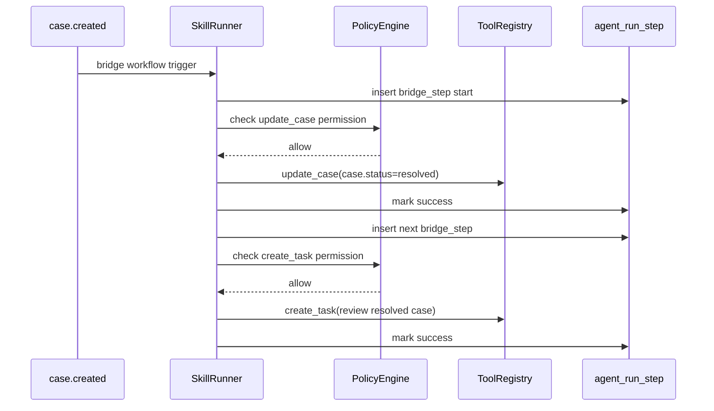

# Bridge E2E Workflow Pilot

This document captures the minimal bridge workflow used to validate `F3.8`.

## Workflow

```json
{
  "name": "resolve_support_case_bridge",
  "trigger": { "event": "case.created" },
  "steps": [
    {
      "id": "step_set_status",
      "condition": {
        "left": "case.priority",
        "operator": "IN",
        "right": ["high", "urgent"]
      },
      "action": {
        "verb": "SET",
        "target": "case.status",
        "args": { "value": "resolved" }
      }
    },
    {
      "id": "step_notify_owner",
      "action": {
        "verb": "NOTIFY",
        "target": "salesperson",
        "args": { "message": "review resolved case" }
      }
    }
  ]
}
```

## Expected Runtime Path



## Observable Outcome

- `agent_run.status = success`
- `tool_calls` include `update_case` and `create_task`
- `agent_run_step` includes one `bridge_step` row per workflow step
- both bridge steps finish in `success`
