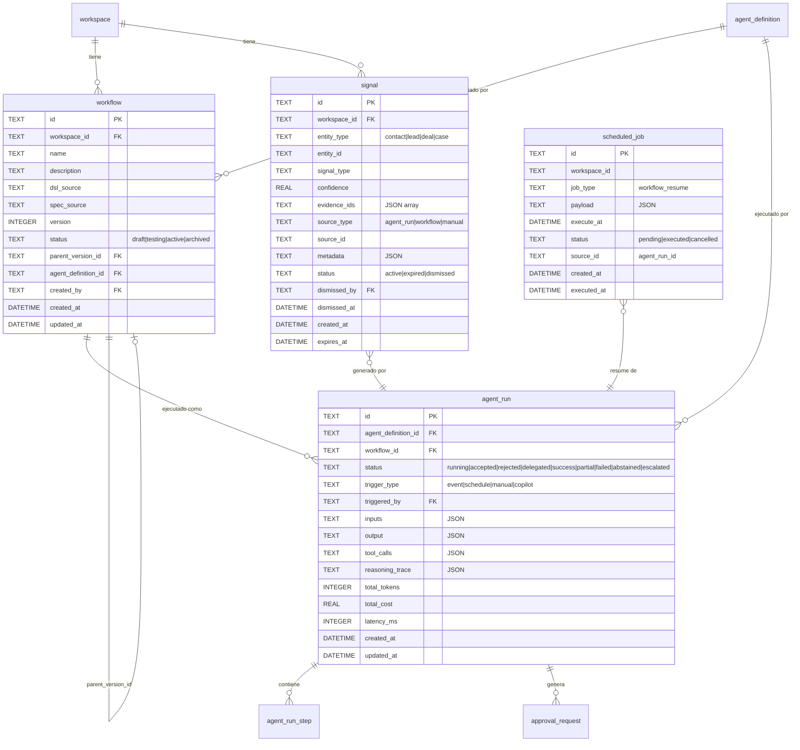
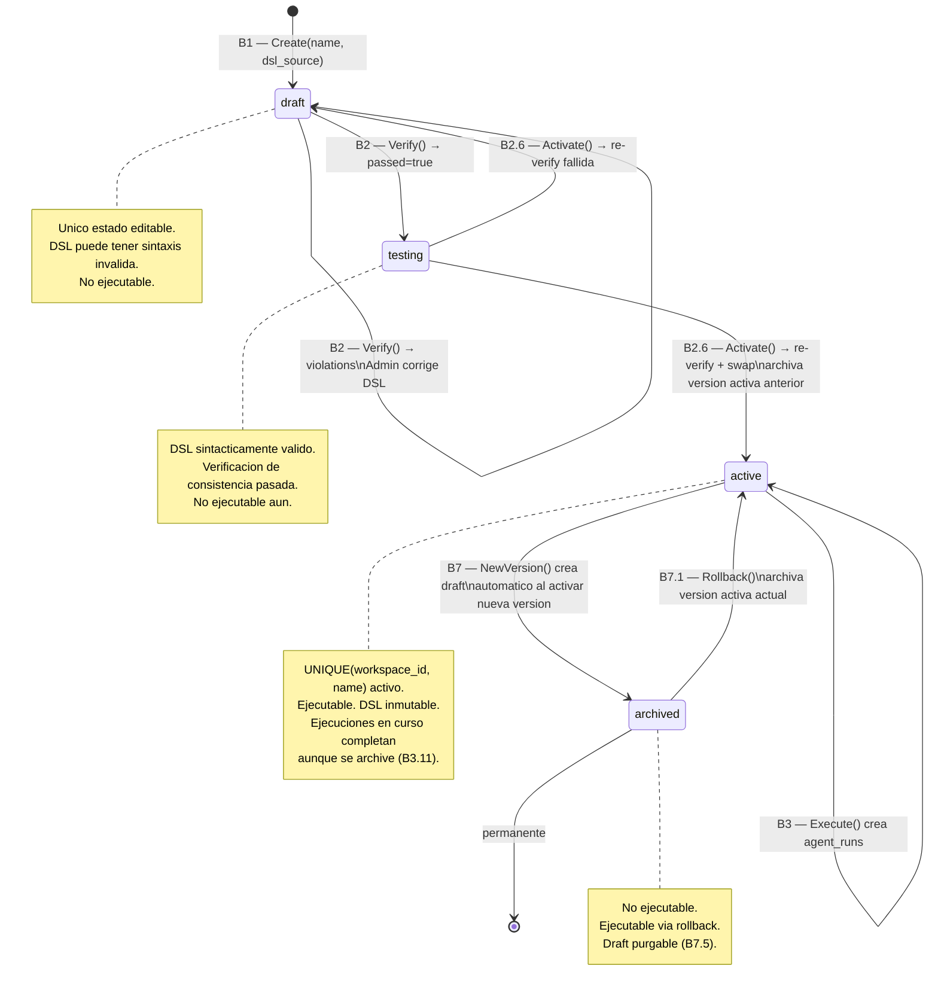
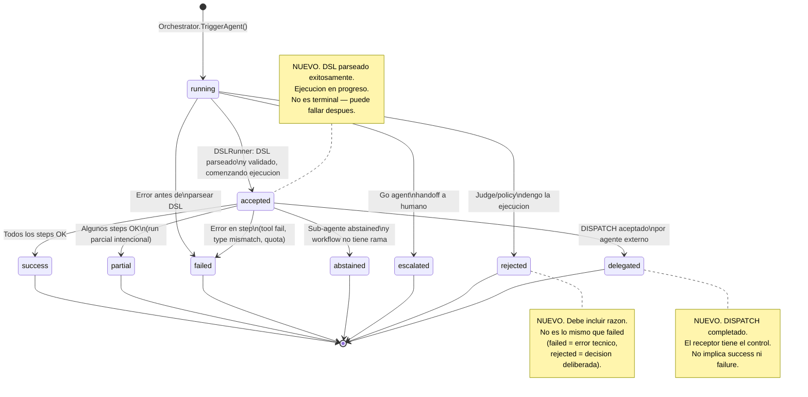
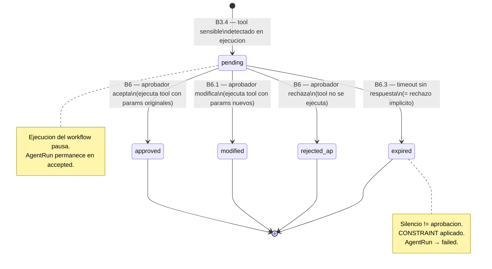
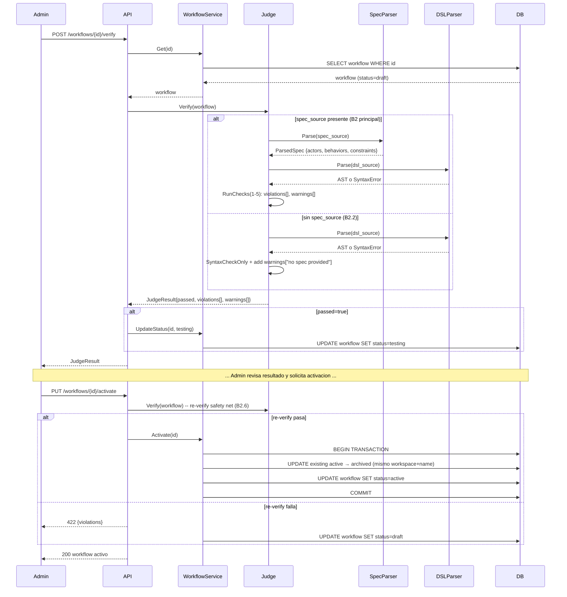
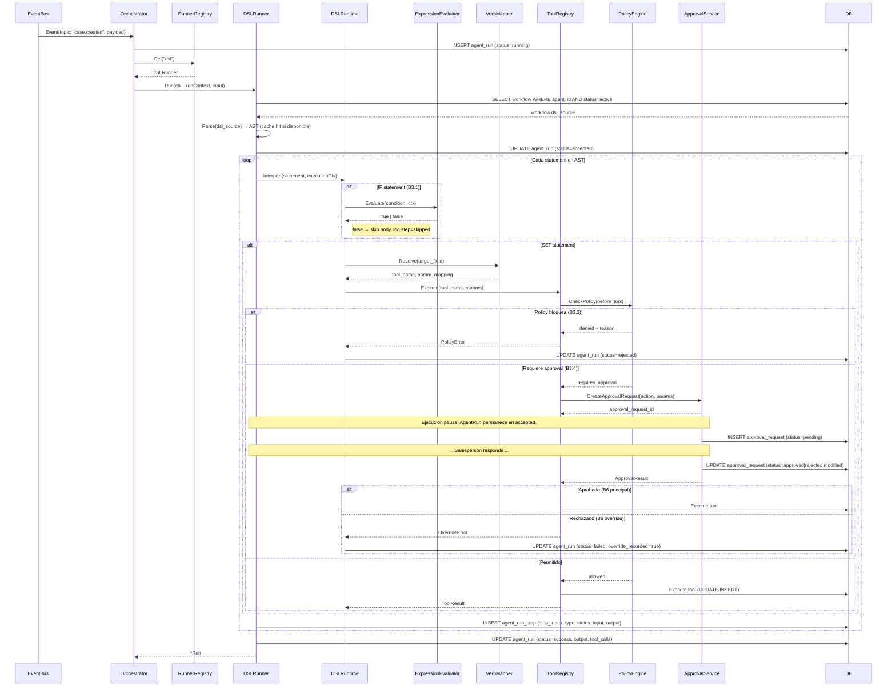
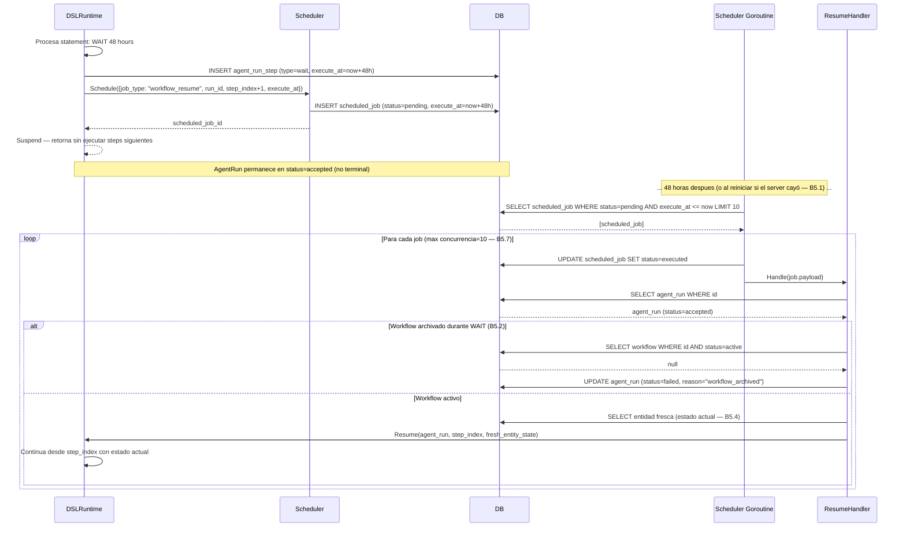
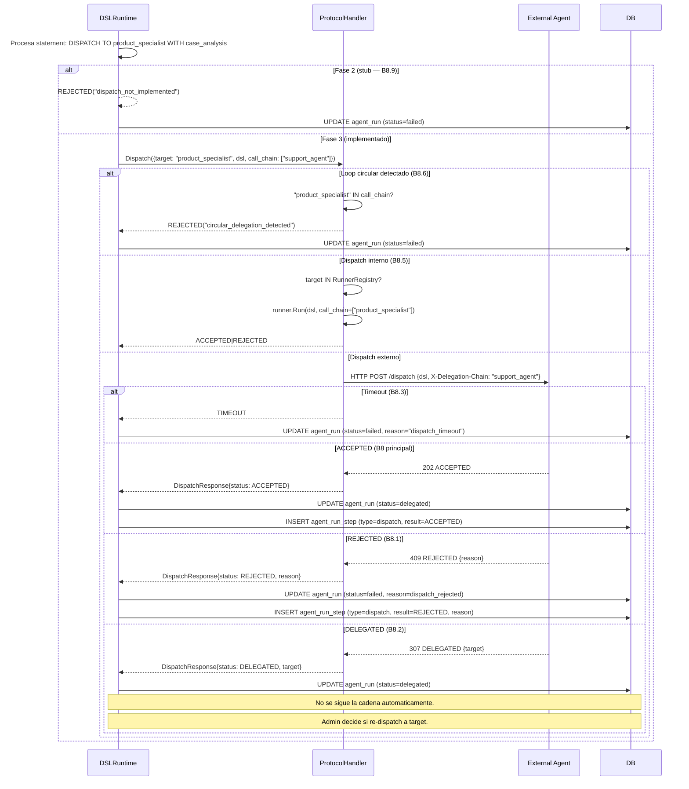

# AGENT_SPEC — Documento de Diseño

> **Fecha**: 2026-03-09
> **Derivado de**: `docs/agent-spec-use-cases.md` (behaviors B1-B8 con 3 niveles de detalle)
> **Informa a**: `docs/agent-spec-transition-plan.md` (Parte 3: Implementacion)
> **Principio**: Cada decision de diseño esta justificada por al menos un caso de uso.

---

## 1. Mapa: Casos de Uso → Componentes

La siguiente tabla muestra que componente satisface cada behavior (y sus sub-casos).

| Behavior | Componente principal | Componentes de soporte |
|---|---|---|
| B1: Definicion de Workflow | `WorkflowService` | `WorkflowRepository`, validador de campos |
| B2: Verificacion | `Judge` | `DSLParser`, `SpecParser`, `JudgeChecks` |
| B3: Ejecucion | `DSLRunner` + `DSLRuntime` | `AgentRunner`, `RunnerRegistry`, `RunContext`, `ExpressionEvaluator`, `VerbMapper` |
| B4: Deteccion de Signals | `SignalService` | `SignalRepository`, `EventBus` |
| B5: Accion Diferida | `Scheduler` | `ScheduledJobRepository`, `WorkflowResumeHandler` |
| B6: Override Humano | `ApprovalService` | `OverrideRecord` en `AgentRun` |
| B7: Versionado y Rollback | `WorkflowVersionService` | `WorkflowRepository` (parent_version_id) |
| B8: Delegacion | `ProtocolHandler` | `DispatchClient`, `DelegationRecord` en `AgentRun` |

---

## 2. Catalogo de Componentes

### 2.1 WorkflowService

**Satisface**: B1 (todos los sub-casos), B7.

**Responsabilidades**:
- Crear workflow como draft (v1) con validacion de campos obligatorios → B1.3
- Validar DSL source no vacio → B1.5
- Validar limite de tamano (64KB) → B1.7
- Rechazar creacion con nombre duplicado → B1.2
- Permitir edicion libre del DSL en draft → B1 principal
- Rechazar edicion de workflow no-draft → B1.4
- Last-write-wins en ediciones concurrentes → B1.8

**Interfaz**:

```go
type WorkflowService interface {
    Create(ctx context.Context, input CreateWorkflowInput) (*Workflow, error)
    Update(ctx context.Context, workspaceID, id string, input UpdateWorkflowInput) (*Workflow, error)
    Get(ctx context.Context, workspaceID, id string) (*Workflow, error)
    List(ctx context.Context, workspaceID string, filters WorkflowFilters) ([]*Workflow, error)
    GetActiveByAgent(ctx context.Context, workspaceID, agentDefinitionID string) (*Workflow, error)
    Activate(ctx context.Context, workspaceID, id string) (*Workflow, error)   // B2.6, B7
    Archive(ctx context.Context, workspaceID, id string) (*Workflow, error)    // B7
    NewVersion(ctx context.Context, workspaceID, id string) (*Workflow, error) // B7
    Rollback(ctx context.Context, workspaceID, id string) (*Workflow, error)   // B7.1
    DeleteDraft(ctx context.Context, workspaceID, id string) error              // B7.5
}
```

**Decision de diseño** — DSL no se valida en save, solo en verify (B2):
> B1.6 establece que el draft permite DSL con errores de sintaxis. La validacion ocurre en B2 (Judge). Separar save de validate permite edicion incremental sin friction.

---

### 2.2 Judge

**Satisface**: B2 (todos los sub-casos).

**Responsabilidades**:
- Ejecutar solo validacion sintactica cuando no hay spec_source → B2.2
- Reportar TODAS las violaciones en un solo pass (no fail-fast) → B2.1
- Distinguir violaciones (bloqueantes) de warnings (no bloqueantes) → B2.4
- Cada verificacion es independiente, sin cache → B2.5
- Re-verificar en activacion como safety net → B2.6
- Rechazar verificacion de workflow no-draft → B2.7
- Parsear spec con bloques faltantes sin abortar → B2.8

**Interfaz**:

```go
type Judge interface {
    Verify(ctx context.Context, workflow *Workflow) (*JudgeResult, error)
}

type JudgeResult struct {
    Passed     bool
    Violations []Violation
    Warnings   []Warning
}

type Violation struct {
    CheckID     int    // 1-8 segun AGENT_SPEC judge checks
    Type        string // behavior_no_coverage, constraint_contradiction, actor_undefined, given_unreachable, dsl_mismatch
    Description string
    Location    string // "DSL linea 12" o "BEHAVIOR detect_intent"
}

type Warning struct {
    CheckID     int
    Description string
}
```

**Checks implementados por fase**:

| Check | Descripcion | Fase |
|---|---|---|
| 1 | THEN clause observable sin conocer implementacion | 2 |
| 2 | BEHAVIOR no contradice CONSTRAINT | 2 |
| 3 | ACTORS en BEHAVIOR estan definidos en ACTORS | 2 |
| 4 | GIVEN states son producidos por otro BEHAVIOR o son eventos externos | 2 |
| 5 | DSL BLOCK implementa todos los BEHAVIOR | 2 |
| 6 | DSL usa solo conceptos BPMN-grounded | 3 |
| 7 | Protocol responses (ACCEPTED/REJECTED/DELEGATED) estan cubiertos | 3 |
| 8 | Terminos que pueden interpretarse de mas de una forma | 3 |

**Decision de diseño** — Judge re-verifica en activacion (B2.6):
> El gap entre verify y activate puede incluir ediciones del DSL. Re-verificar en activate garantiza que lo que se activa es lo que se verifico. Costo: latencia extra en activate. Beneficio: garantia de consistencia.

---

### 2.3 AgentRunner + RunnerRegistry + RunContext

**Satisface**: B3 (contrato de ejecucion para todos los runners), B8 (sub-agente interno).

**Responsabilidades**:
- Contrato unico para Go agents, SkillRunner y DSLRunner → B3 principal
- RunContext pasado por metodo (no constructor) para soportar runners creados dinamicamente → B3.11
- RunnerRegistry hace lookup por agent_type → B3 principal

**Interfaces**:

```go
// RunContext lleva todas las dependencias que cualquier runner necesita.
// Forward-compatible: el DSL Runtime usa el mismo contexto.
type RunContext struct {
    Orchestrator  *Orchestrator
    ToolRegistry  *tool.ToolRegistry
    PolicyEngine  *policy.Evaluator
    EventBus      eventbus.EventBus
    AuditLogger   audit.Service
    SignalService signal.Service    // para SURFACE verb → B4
    Scheduler     scheduler.Service // para WAIT verb → B5
    RunnerRegistry *RunnerRegistry  // para AGENT verb → B3.5
    DB            *sql.DB
    // Contexto de ejecucion para detectar loops
    CallDepth     int               // limite: 5 → B3.12
    CallChain     []string          // agentes en la cadena → B8.6
}

// AgentRunner es el contrato de ejecucion para cualquier tipo de agente.
type AgentRunner interface {
    Run(ctx context.Context, rc *RunContext, input TriggerAgentInput) (*Run, error)
}

type RunnerRegistry struct {
    runners map[string]AgentRunner
}

func (r *RunnerRegistry) Register(agentType string, runner AgentRunner)
func (r *RunnerRegistry) Get(agentType string) (AgentRunner, bool)
```

**Decision de diseño** — RunContext por metodo, no por constructor:
> Los DSLRunners se crean dinamicamente (uno por workflow, bajo demanda). Si el contexto se inyectara en el constructor del runner, cada workflow necesitaria una instancia diferente pre-configurada al startup. Pasarlo por metodo permite crear runners dinamicamente y compartir la misma instancia para multiples ejecuciones.

---

### 2.4 DSLParser

**Satisface**: B2 (genera AST para verificacion), B3 (genera AST para ejecucion).

**Responsabilidades**:
- Tokenizar DSL con soporte de indentacion significativa (INDENT/DEDENT) → B2.3
- Producir AST completo si no hay errores de sintaxis
- Reportar errores con linea y columna → B2.3
- Rechazar verbos no permitidos → B2.9
- Validar duraciones negativas en WAIT → B5.3
- Ser puro: sin side effects, sin imports de domain packages

**Tokens**:

```
WORKFLOW  ON      IF      SET     AGENT
NOTIFY    SURFACE WAIT    DISPATCH
IDENT     STRING  NUMBER  NEWLINE INDENT  DEDENT  EOF
EQ(==)  NEQ(!=)  GT(>)   LT(<)   GTE(>=) LTE(<=) IN  AND  OR  ASSIGN(=)
```

**Nodos AST**:

```go
type WorkflowNode struct {
    Name       string
    Statements []Statement
}

type Statement interface{ statementNode() }

type OnNode       struct{ Event DottedIdent }
type IfNode       struct{ Condition Expression; Body []Statement }
type SetNode      struct{ Target DottedIdent; Value Expression }
type AgentNode    struct{ FuncName string; Args []Expression }
type NotifyNode   struct{ Actor string; Data Expression }
type SurfaceNode  struct{ Entity string; View DottedIdent; Reason string }
type WaitNode     struct{ Duration int; Unit string } // unit: hours|minutes|days|seconds
type DispatchNode struct{ AgentName string; WorkflowName string }

type Expression interface{ expressionNode() }
type BinaryExpr  struct{ Left Expression; Op string; Right Expression }
type DottedIdent struct{ Parts []string } // e.g. contact.intent_signal
type StringLit   struct{ Value string }
type NumberLit   struct{ Value float64 }
type ArrayLit    struct{ Elements []Expression }
```

---

### 2.5 DSLRuntime + ExpressionEvaluator + VerbMapper

**Satisface**: B3 (todos los sub-casos de ejecucion).

**Responsabilidades**:

**DSLRuntime**:
- Interpretar AST statement por statement → B3 principal
- Omitir body de IF cuando condicion es false → B3.1
- Fallar en tool error (no retry automatico) → B3.2
- Propagar fallo de sub-agente → B3.5
- Ejecutar ejecuciones de workflows multiples independientemente → B3.6
- Tratar abstained del sub-agente como informacion, no error → B3.8
- Detectar y abortar loops circulares de AGENT calls → B3.12
- Tratar campo inexistente como null (no abortar) → B3.14

**ExpressionEvaluator** — operadores soportados (sin coercion de tipos):
- Comparacion: `==`, `!=`, `>`, `<`, `>=`, `<=` → B3 principal
- Logicos: `AND`, `OR`
- Membership: `IN`
- Campo inexistente → null → B3.14
- Tipos incompatibles → error → B3.13

**VerbMapper** — tabla estatica DSL verb → tool:

```
SET case.status     → update_case(status)
SET case.priority   → update_case(priority)
SET lead.status     → update_lead(status)
SET deal.stage      → update_deal(stage)
NOTIFY contact      → send_reply(contact_id, content)
NOTIFY salesperson  → create_task(owner_id, title)
SURFACE entity      → signal.Service.Create(...)       → B4
WAIT duration       → scheduler.Service.Schedule(...)  → B5
DISPATCH            → protocol_handler.Dispatch(...)   → B8.9 (stub en Fase 2)
```

**Decision de diseño** — campo inexistente = null (B3.14):
> En un sistema con entidades dinamicas, las condiciones pueden referenciar campos que aun no existen en una instancia concreta. Abortar seria demasiado estricto. Tratar ausencia como null permite workflows mas robustos (e.g., `IF deal.close_date IS NULL`).

**Decision de diseño** — abstained no es error fatal (B3.8):
> Un sub-agente que abstiene esta comunicando informacion valida ("no encontre evidencia suficiente"). El workflow padre puede tener ramas para ese caso (`IF evidence.top_score < 0.55`). Propagarlo como error destruiria esa logica.

---

### 2.6 DSLRunner

**Satisface**: B3 (runner para agent_type="dsl"), B7 (usa version activa del workflow).

**Responsabilidades**:
- Cargar workflow activo por agent_definition_id → B7 principal
- Parsear DSL → AST (con cache en memoria, invalidado en Activate()) → B3.11
- Ejecutar via DSLRuntime con RunContext
- Registrar cada statement ejecutado como agent_run_step
- Permitir que ejecuciones en curso completen aunque el workflow se archive → B3.11

**Interfaz**: Implementa `AgentRunner`.

```go
type DSLRunner struct {
    workflowService workflow.Service
    astCache        map[string]*dsl.WorkflowNode // key: workflow.id
    cacheMu         sync.RWMutex
}

func (r *DSLRunner) Run(ctx context.Context, rc *RunContext, input TriggerAgentInput) (*Run, error)
func (r *DSLRunner) InvalidateCache(workflowID string) // llamado en Workflow.Activate()
```

---

### 2.7 SignalService

**Satisface**: B4 (todos los sub-casos).

**Responsabilidades**:
- Crear signal con evidencia → B4 principal
- Rechazar signal sin evidence → B4.1 (constraint)
- Permitir multiples signals del mismo tipo/entidad → B4.2
- Publicar evento `signal.created` en EventBus → B4 principal
- Registrar quien y cuando descarto un signal → B4.4
- Publicar evento `signal.dismissed` → B4.4
- Rechazar signal con entidad inexistente → B4.5
- Validar confianza en [0.0, 1.0] → B4.6
- No validar existencia de cada evidence_id en creacion → B4.7

**Interfaz**:

```go
type SignalService interface {
    Create(ctx context.Context, input CreateSignalInput) (*Signal, error)
    List(ctx context.Context, workspaceID string, filters SignalFilters) ([]*Signal, error)
    GetByEntity(ctx context.Context, workspaceID, entityType, entityID string) ([]*Signal, error)
    Dismiss(ctx context.Context, workspaceID, signalID, actorID string) error
}

type CreateSignalInput struct {
    WorkspaceID string
    EntityType  string   // contact, lead, deal, case
    EntityID    string
    SignalType  string   // intent_high, churn_risk, upsell_opportunity, ...
    Confidence  float64  // [0.0, 1.0]
    EvidenceIDs []string // al menos 1 requerido
    SourceType  string   // agent_run, workflow, manual
    SourceID    string
    Metadata    map[string]any
    ExpiresAt   *time.Time
}
```

**Decision de diseño** — no deduplicar signals (B4.2):
> Multiples evaluaciones del mismo tipo/entidad con diferente confianza o evidencia son informacion valiosa. La deduplicacion perderia el rastro de como evoluciona la confianza en el tiempo. La UI puede mostrar el mas reciente destacado.

---

### 2.8 Scheduler

**Satisface**: B5 (todos los sub-casos).

**Responsabilidades**:
- Persistir jobs en DB (recovery ante restart) → B5.1
- Procesar jobs pendientes en ciclos de polling (cada 10s) → B5 principal
- Cancelar jobs cuando el workflow se archiva → B5.2
- WAIT 0 = yield (resume en el proximo ciclo) → B5.3
- Limite de concurrencia: 10 resumes por ciclo → B5.7
- Marcar job como executed aunque el resume falle (no reintentar) → B5.8

**Interfaz**:

```go
type Scheduler interface {
    Schedule(ctx context.Context, job ScheduleJobInput) (*ScheduledJob, error)
    Cancel(ctx context.Context, workspaceID, jobID string) error
    CancelBySource(ctx context.Context, workspaceID, sourceID string) error // B5.2: cancela todos los jobs del workflow
}

type ScheduleJobInput struct {
    WorkspaceID string
    JobType     string    // workflow_resume
    Payload     any       // {workflow_id, run_id, resume_step_index}
    ExecuteAt   time.Time
}

// Callback registrado en startup para manejar cada tipo de job
type JobHandler func(ctx context.Context, job *ScheduledJob) error
```

**Decision de diseño** — no reintentar resume fallido (B5.8):
> El resume puede haber ejecutado steps parcialmente. Reintentar puede duplicar side effects (e.g., enviar el mismo email dos veces). Mejor loguear y dejar al Admin re-trigger manualmente con control total.

---

### 2.9 ApprovalService (extendido para B6)

**Satisface**: B6 (todos los sub-casos).

**Responsabilidades** (extension del servicio existente):
- Crear approval_request antes de tool call sensible → B3.4, B6
- Manejar aprobacion, rechazo y modificacion → B6 principal, B6.1
- Timeout = rechazo implicito (no aprobacion silenciosa) → B6.3
- Primer respondente es definitivo → B6.5
- Registrar override como feedback → B6.2
- Aceptar override sin razon (razon opcional) → B6.7

**Tipos de override**:

```go
const (
    OverrideTypeRejected           = "rejected"             // B6 principal
    OverrideTypeModified           = "modified"             // B6.1
    OverrideTypePostExecution      = "post_execution_feedback" // B6.2
    OverrideTypeDelegationOverride = "delegation_override"  // B6.4
)
```

**Decision de diseño** — no compensacion automatica post-ejecucion (B6.2):
> Revertir automaticamente (e.g., "desenviar un email") es imposible en muchos casos. Para los casos donde si es posible (e.g., cambiar un campo), el riesgo de compensar incorrectamente supera el beneficio. El override post-ejecucion se registra como feedback para mejorar el agente, no como rollback.

---

### 2.10 ProtocolHandler (Fase 3)

**Satisface**: B8 (todos los sub-casos).

**Responsabilidades**:
- Serializar DSL + headers de protocolo → B8 principal
- Enviar via HTTP (adaptable a MCP/A2A) → B8 principal
- Timeout configurable → B8.3
- Incluir cadena de delegacion en headers para deteccion de loops → B8.6
- Stub en Fase 2: retorna REJECTED("not_implemented") → B8.9
- Dispatch interno: invoca RunnerRegistry directamente sin HTTP → B8.5

**Interfaz**:

```go
type ProtocolHandler interface {
    Dispatch(ctx context.Context, input DispatchInput) (*DispatchResponse, error)
}

type DispatchInput struct {
    TargetAgent   string
    WorkflowName  string
    DSLSource     string
    CallChain     []string // para deteccion de loops circulares → B8.6
    TimeoutSec    int
}

type DispatchResponse struct {
    Status  string // ACCEPTED, REJECTED, DELEGATED
    Reason  string // requerido si REJECTED → B8.1
    Target  string // requerido si DELEGATED → B8.2
}
```

**Decision de diseño** — no seguir cadena DELEGATED automaticamente (B8.2):
> Seguir automaticamente puede crear loops o ejecutar en agentes no autorizados. El control humano sobre la cadena de delegacion es explicito: el Admin decide si re-dispatch al agente sugerido.

---

### 2.10.1 Direccion de Interoperabilidad

- `DISPATCH` externo debe ser A2A-first.
- HTTP queda como transporte del estandar, no como contrato propietario.
- La frontera externa para tools, resources y contexto debe ser MCP-first.
- `ProtocolHandler` se mantiene como puerto interno, pero sus adapters externos deben alinearse con A2A y MCP.

## 3. Modelo de Datos

### Diagrama ERD



### Entidad Workflow — Campos y Reglas

| Campo | Tipo | Regla | Caso de uso |
|---|---|---|---|
| `id` | TEXT UUID | PK inmutable | — |
| `name` | TEXT | NOT NULL | B1.3 |
| `dsl_source` | TEXT | NOT NULL, max 64KB | B1.3, B1.5, B1.7 |
| `spec_source` | TEXT | NULL permitido | B1.1 |
| `version` | INTEGER | DEFAULT 1, NOT NULL | B7 |
| `status` | TEXT | draft\|testing\|active\|archived | B1, B2, B7 |
| `parent_version_id` | TEXT | NULL para v1, FK a self para v2+ | B7 |
| `agent_definition_id` | TEXT | NULL permitido (workflow standalone) | B3 |
| `updated_at` | DATETIME | Updated en cada UPDATE | B1.8 |
| UNIQUE | (workspace_id, name, version) | Enforcement en DB | B1.2 |

### Entidad AgentRun — Estados extendidos

Nuevos estados para AGENT_SPEC (adicionales a los existentes):

| Estado | Descripcion | Terminal | Caso de uso |
|---|---|---|---|
| `running` | En ejecucion | No | B3 |
| `accepted` | DSL validado, ejecutando | No | B3 (nuevo) |
| `rejected` | Judge/policy denego la ejecucion | Si | B2.1, B8.1 (nuevo) |
| `delegated` | DISPATCH a agente externo | Si | B8 (nuevo) |
| `success` | Completado exitosamente | Si | B3 |
| `partial` | Algunos pasos completados | Si | B3 |
| `failed` | Error en ejecucion | Si | B3 |
| `abstained` | Evidencia insuficiente | Si | B3 |
| `escalated` | Handoff a humano (Go agents) | Si | B6 |

---

## 4. Maquinas de Estado

### 4.1 Workflow Lifecycle



### 4.2 AgentRun States



### 4.3 ApprovalRequest States (B6)



---

## 5. Diagramas de Secuencia

### 5.1 Verificacion y Activacion (B2)



### 5.2 Ejecucion con Tool Call y Approval (B3 + B6)



### 5.3 Accion Diferida: WAIT y Resume (B5)



### 5.4 Delegacion entre Agentes (B8)



---

## 6. API Design

Los endpoints derivan directamente de los behaviors y sus pre-condiciones.

### Workflow API

| Endpoint | Metodo | Behavior | Pre-condicion |
|---|---|---|---|
| `/api/v1/workflows` | POST | B1 | Admin autenticado |
| `/api/v1/workflows` | GET | B1 | — |
| `/api/v1/workflows/{id}` | GET | B1 | — |
| `/api/v1/workflows/{id}` | PUT | B1 | status=draft |
| `/api/v1/workflows/{id}` | DELETE | B7.5 | status=draft, nunca activado |
| `/api/v1/workflows/{id}/verify` | POST | B2 | status=draft |
| `/api/v1/workflows/{id}/activate` | PUT | B2.6 | status=testing |
| `/api/v1/workflows/{id}/new-version` | POST | B7 | status=active |
| `/api/v1/workflows/{id}/rollback` | PUT | B7.1 | tiene parent_version_id archived |
| `/api/v1/workflows/{id}/execute` | POST | B3.9 | status=active |

### Signal API

| Endpoint | Metodo | Behavior | Pre-condicion |
|---|---|---|---|
| `/api/v1/signals` | GET | B4 | — |
| `/api/v1/signals/{id}/dismiss` | PUT | B4.4 | status=active |
| `/api/v1/signals?entity_type=X&entity_id=Y` | GET | B4 | — |

### Codigos de Respuesta

| Situacion | HTTP Code | Behavior de origen |
|---|---|---|
| Creado exitosamente | 201 | B1 principal |
| Verificacion OK | 200 + JudgeResult | B2 principal |
| Verificacion con violations | 200 + violations (no es 422) | B2.1 — el cliente decide como mostrar |
| Verificacion de workflow no-draft | 409 Conflict | B2.7 |
| Nombre duplicado | 409 Conflict | B1.2 |
| Campos faltantes | 422 Unprocessable | B1.3 |
| DSL vacio | 422 Unprocessable | B1.5 |
| Tamano excedido | 413 Payload Too Large | B1.7 |
| Edicion de no-draft | 409 Conflict | B1.4 |
| Dispatch aceptado | 202 Accepted | B8 principal |
| Dispatch rechazado | 409 Conflict + reason | B8.1 |
| Dispatch delegado | 307 Temporary Redirect + target | B8.2 |

**Decision de diseño** — verificacion devuelve 200 con violations (no 422):
> La verificacion con violations no es un error del cliente — el cliente envio una request valida. El Judge hizo su trabajo y retorno un resultado. Usar 422 confundiria la respuesta tecnica con el resultado de negocio. El cuerpo del 200 contiene `passed: false` + `violations[]`.

---

## 7. Decisiones de Diseño (Resumen)

| Decision | Alternativa considerada | Razon de eleccion | Caso de uso |
|---|---|---|---|
| RunContext por metodo, no constructor | Inyeccion en constructor | DSLRunners creados dinamicamente; constructor requeriria pre-instanciar uno por workflow | B3 (DSLRunner dinamico) |
| DSL no se valida en save, solo en verify | Validar sintaxis en cada save | Draft es espacio de trabajo; forzar sintaxis frustra edicion incremental | B1.6 |
| No reintentar dispatch fallido | Retry con backoff | Side effects en agentes externos no son idempotentes; control humano explicitamente | B8.3, B8.8 |
| No seguir cadena DELEGATED automaticamente | Seguir automaticamente | Riesgo de loops y ejecuciones no autorizadas en agentes intermedios | B8.2, B8.6 |
| Abstained del sub-agente no es error fatal | Propagar como error | Abstained es informacion valida que el workflow padre puede manejar con IF | B3.8 |
| Last-write-wins en ediciones concurrentes | Optimistic locking con etag | Complejidad no justificada para MVP; drafts raramente editados concurrentemente | B1.8 |
| No compensacion automatica post-override | Compensacion automatica | Imposible en muchos casos (emails); riesgosa en los casos posibles | B6.2 |
| Signal sin deduplicacion | Upsert de signal existente | Multiples evaluaciones son trazabilidad valiosa; UI puede filtrar por timestamp | B4.2 |
| Scheduler no reintenta resume fallido | Retry con backoff | Resume puede tener side effects parciales; duplicacion es peor que fallo | B5.8 |
| Re-verificacion en Activate() | Solo verificar en Verify() | Gap entre verify y activate puede incluir ediciones del DSL | B2.6 |
| Verificacion devuelve 200 con violations | 422 cuando hay violations | Verificacion es un resultado de negocio, no un error HTTP del cliente | B2.1 |
| Campo inexistente en expression = null | Abortar con error | Entidades dinamicas; workflows mas robustos ante campos opcionales | B3.14 |
| Limite de concurrencia en Scheduler (10) | Sin limite | Previene saturacion del sistema en picos de scheduled_jobs | B5.7 |

---

## 8. Restricciones del Diseño (derivadas de Constraints del spec)

Cada constraint del documento de casos de uso tiene un componente de diseño responsable de hacerlo cumplir.

| Constraint | Componente responsable | Punto de enforcement |
|---|---|---|
| Workflow no ejecuta sin verificacion del Judge | `WorkflowService.Activate()` | Activa solo si Judge pasa |
| Mutacion solo via herramientas registradas | `DSLRuntime` + `VerbMapper` | SET → VerbMapper → ToolRegistry.Execute() |
| Agente sin permisos no ejecuta herramienta | `PolicyEngine` | Enforcement en ToolRegistry pipeline |
| Accion sensible requiere aprobacion | `PolicyEngine` + `ApprovalService` | Detectado en enforcement point before_tool |
| Signal requiere evidencia | `SignalService.Create()` | Validacion en service layer antes de INSERT |
| Override no se descarta silenciosamente | `ApprovalService` + `AgentRun` | Registro de override como evento en agent_run |
| Workflow archivado no recibe ejecuciones | `Orchestrator.TriggerAgent()` | Valida status=active antes de crear agent_run |
| REJECTED incluye razon | `ProtocolHandler` + `Judge` | Enforced en DispatchResponse y JudgeResult structs |
| Agentes Go siguen funcionando | `RunnerRegistry` | Go agents registrados como runners validos permanentemente |
