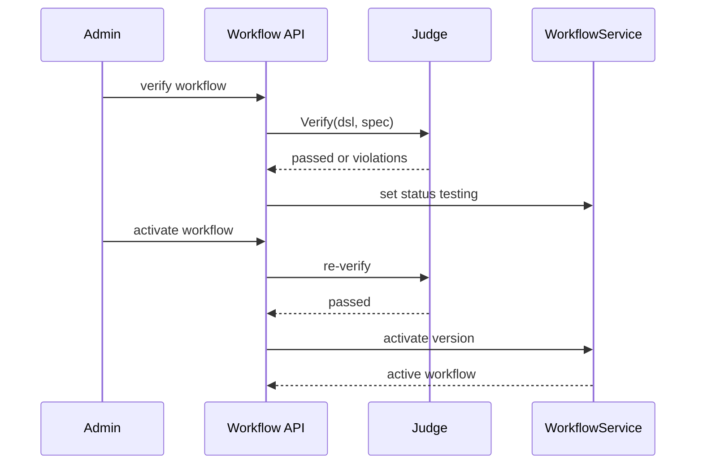
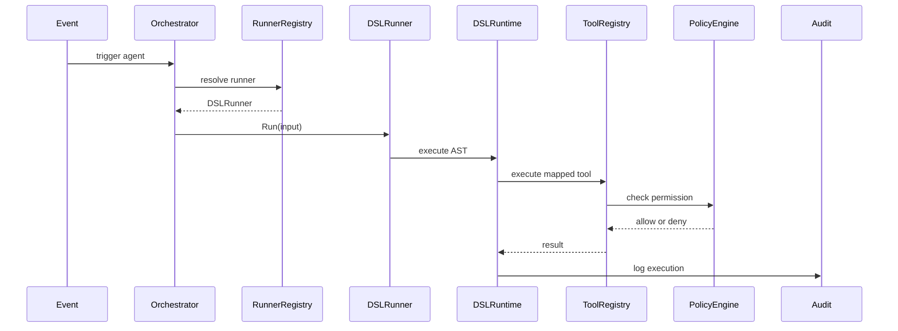
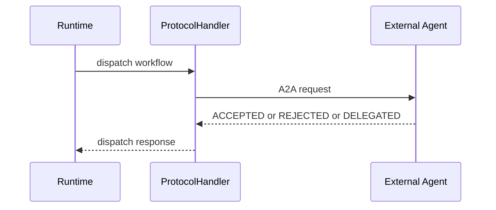

# Plan de Desarrollo AGENT_SPEC

> Fecha: 2026-03-09
> Estado: Propuesto
> Formato: fases, tareas y analisis de dependencias
> Naming source of truth: `docs/agent-spec-overview.md`

## Mapa de casos de uso

El plan implementa estas capacidades top-level:

- `UC-A2` Workflow Authoring
- `UC-A3` Workflow Verification and Activation
- `UC-A4` Workflow Execution
- `UC-A5` Signal Detection and Lifecycle
- `UC-A6` Deferred Actions
- `UC-A7` Human Override and Approval
- `UC-A8` Workflow Versioning and Rollback
- `UC-A9` Agent Delegation

Regla:
- `UC-*` identifica la capacidad estable
- `BEHAVIOR` identifica escenarios detallados dentro de cada capacidad

Set canonico relacionado:
- `docs/agent-spec-overview.md`
- `docs/agent-spec-use-cases.md`
- `docs/agent-spec-design.md`
- `docs/agent-spec-integration-analysis.md`
- `docs/agent-spec-development-plan.md`
- `docs/agent-spec-traceability.md`

---

## Fase 0. Baseline y preparacion

### Tareas

- F0.1 Cerrar o congelar el alcance pendiente de P0.
- F0.2 Asegurar `make test` verde y CI estable.
- F0.3 Identificar pruebas de no regresion para orquestacion, tools, policy y audit.
- F0.4 Documentar el comportamiento actual de los agentes Go como baseline de referencia.
- F0.5 Definir feature flags: `workflows_enabled`, `signals_enabled`, `dsl_runner_enabled`, `scheduler_enabled`, `dispatch_enabled`.
- F0.6 Confirmar contratos actuales de `agent_run`, `approval_request`, `ToolRegistry`, `PolicyEngine` y `EventBus`.

---

## Fase 1. Compatibility Layer

### Tareas

- F1.1 Crear `AgentRunner` como contrato comun de ejecucion.
- F1.2 Crear `RunContext` con dependencias compartidas.
- F1.3 Crear `RunnerRegistry` para resolver `agent_type -> runner`.
- F1.4 Adaptar `orchestrator.go` para delegar ejecucion via `RunnerRegistry`.
- F1.5 Adaptar agentes Go existentes para implementar `AgentRunner`.
- F1.6 Registrar todos los agentes Go actuales en `RunnerRegistry`.
- F1.7 Extender estados de `agent_run` con `accepted`, `rejected`, `delegated`.
- F1.8 Cubrir con tests de regresion el nuevo camino de ejecucion sin cambiar comportamiento funcional.

---

## Fase 2. Workflow Foundation

### Tareas

- F2.1 Crear migracion de tabla `workflow`.
- F2.2 Implementar modelo y repositorio de `workflow`.
- F2.3 Implementar `WorkflowService.Create`, `Get`, `List`, `Update`.
- F2.4 Implementar lifecycle `draft -> testing -> active -> archived`.
- F2.5 Implementar `NewVersion`, `Rollback`, `DeleteDraft`.
- F2.6 Garantizar unicidad de workflow activo por `workspace + name`.
- F2.7 Crear API base para CRUD de workflows.
- F2.8 Crear migracion de tabla `signal`.
- F2.9 Implementar modelo y repositorio de `signal`.
- F2.10 Implementar `SignalService.Create`, `List`, `GetByEntity`, `Dismiss`.
- F2.11 Publicar eventos `signal.created` y `signal.dismissed` en `EventBus`.
- F2.12 Crear API base para consulta y dismiss de signals.

---

## Fase 3. Declarative Bridge

### Tareas

- F3.1 Definir formato declarativo puente para ejecucion no DSL final.
- F3.2 Implementar `SkillRunner` o runner equivalente para el formato puente.
- F3.3 Soportar pasos secuenciales simples.
- F3.4 Soportar condiciones basicas en el formato puente.
- F3.5 Mapear acciones del formato puente a `ToolRegistry`.
- F3.6 Integrar `PolicyEngine` y approvals en el flujo declarativo.
- F3.7 Registrar `agent_run_step` por paso ejecutado.
- F3.8 Crear workflow declarativo minimo end-to-end sobre el formato puente.
- F3.9 Comparar comportamiento del flujo declarativo contra un flujo Go equivalente.

---

## Fase 4. DSL Foundation

### Tareas

- F4.1 Definir gramatica inicial del DSL.
- F4.2 Implementar `token.go`.
- F4.3 Implementar `lexer.go`.
- F4.4 Implementar `ast.go`.
- F4.5 Implementar `parser.go`.
- F4.6 Reportar errores de sintaxis con linea y columna.
- F4.7 Validar verbos permitidos y restricciones sintacticas.
- F4.8 Implementar `ExpressionEvaluator`.
- F4.9 Implementar `VerbMapper`.
- F4.10 Implementar `DSLRuntime`.
- F4.11 Implementar `DSLRunner` para `agent_type="dsl"`.
- F4.12 Integrar `DSLRunner` con `RunnerRegistry`.
- F4.13 Ejecutar `SET`, `AGENT`, `NOTIFY` e `IF` sobre `ToolRegistry` y `PolicyEngine`.
- F4.14 Registrar `agent_run_step` por statement DSL.
- F4.15 Crear endpoint manual `POST /workflows/{id}/execute`.

---

## Fase 5. Judge y activacion

### Tareas

- F5.1 Implementar validacion sintactica de workflows DSL.
- F5.2 Implementar estructura de `JudgeResult`, `Violation` y `Warning`.
- F5.3 Implementar `Judge.Verify`.
- F5.4 Implementar verificacion sin `spec_source` con warnings.
- F5.5 Implementar parser parcial de `spec_source`.
- F5.6 Implementar checks iniciales de consistencia spec -> DSL.
- F5.7 Implementar endpoint `POST /workflows/{id}/verify`.
- F5.8 Implementar transicion `draft -> testing` cuando `verify` pasa.
- F5.9 Implementar endpoint `PUT /workflows/{id}/activate`.
- F5.10 Re-verificar en `activate` antes de promover una version.
- F5.11 Archivar la version activa anterior al activar una nueva.
- F5.12 Invalidar cache de AST al activar una version.

---

## Fase 6. Scheduler y WAIT

### Tareas

- F6.1 Crear migracion de tabla `scheduled_job`.
- F6.2 Implementar repositorio de jobs programados.
- F6.3 Implementar `Scheduler.Schedule`.
- F6.4 Implementar `Scheduler.Cancel` y `CancelBySource`.
- F6.5 Crear goroutine de polling para jobs pendientes.
- F6.6 Implementar handler de resume de workflows.
- F6.7 Persistir estado minimo de resume: `run_id`, `workflow_id`, `step_index`.
- F6.8 Implementar `WAIT` en parser y runtime.
- F6.9 Cancelar jobs al archivar workflows.
- F6.10 Marcar jobs como ejecutados sin retry automatico ante fallo de resume.
- F6.11 Probar recovery tras reinicio.
- F6.12 Probar concurrencia limitada de resumes.

---

## Fase 7. Migracion progresiva

### Tareas

- F7.1 Seleccionar un agente piloto de bajo riesgo.
- F7.2 Modelar su comportamiento actual como workflow declarativo.
- F7.3 Ejecutar shadow mode: agente Go y workflow declarativo en paralelo.
- F7.4 Comparar resultados funcionales, side effects, costos y trazas.
- F7.5 Corregir diferencias hasta alcanzar paridad aceptable.
- F7.6 Activar el workflow declarativo para un segmento controlado.
- F7.7 Mantener rollback inmediato al agente Go.
- F7.8 Repetir el patron para el siguiente agente o subflujo.

---

## Fase 8. Dispatch y capacidades avanzadas

### Tareas

- F8.1 Implementar `DISPATCH` interno usando `RunnerRegistry`.
- F8.2 Registrar resultados `ACCEPTED`, `REJECTED`, `DELEGATED`.
- F8.3 Implementar deteccion de loops de delegacion interna.
- F8.4 Implementar `ProtocolHandler` como contrato interno alineado con A2A.
- F8.5 Implementar `DISPATCH` externo A2A-first sobre HTTP(S) + JSON-RPC.
- F8.6 Definir timeouts, autenticacion, discovery y trazabilidad del dispatch externo.
- F8.7 Implementar respuesta obligatoria con razon para `REJECTED`.
- F8.8 Integrar MCP para exposicion y consumo de tools/contexto donde aplique.
- F8.9 Integrar `SURFACE` con `SignalService` y capa de UI si aplica.
- F8.10 Extender Judge con checks avanzados de protocolo y ambiguedad.
- F8.11 Evaluar incorporacion futura de BPMN o NL -> DSL como capa de entrada.

### Regla de interoperabilidad

- A2A es el objetivo para delegacion entre agentes.
- MCP es el objetivo para tools, resources y contexto.
- No se debe introducir un protocolo propietario nuevo como contrato externo.

---

## Diagramas de interaccion

### 1. Activacion de workflow

### 2. Ejecucion declarativa

### 3. Delegacion externa

---

## Analisis de dependencias

### 1. Dependencias entre fases

| Fase | Depende de | Motivo |
|---|---|---|
| Fase 0 | - | Punto de partida |
| Fase 1 | Fase 0 | No se debe abstraer ejecucion sobre una base inestable |
| Fase 2 | Fase 1 | `workflow` y `signal` deben vivir sobre el modelo runtime unificado |
| Fase 3 | Fase 1, Fase 2 | El runner declarativo necesita contrato runtime y entidades base |
| Fase 4 | Fase 1, Fase 2, Fase 3 | El DSL real se apoya en la validacion previa del runtime declarativo |
| Fase 5 | Fase 2, Fase 4 | El Judge necesita workflows persistidos y parser DSL operativo |
| Fase 6 | Fase 2, Fase 4, Fase 5 | `WAIT` necesita lifecycle de workflow, parser/runtime y activacion real |
| Fase 7 | Fase 1, Fase 2, Fase 4, Fase 5 | La migracion requiere motor DSL funcional y gobernado |
| Fase 8 | Fase 4, Fase 5, Fase 7 | Dispatch y capacidades avanzadas deben entrar sobre una base DSL estable |

### 2. Dependencias criticas por tarea

| Tarea | Depende de | Bloquea |
|---|---|---|
| F1.1 | F0.2, F0.6 | F1.2, F1.3, F1.5 |
| F1.3 | F1.1 | F1.4, F1.6, F4.12, F8.1 |
| F1.4 | F1.2, F1.3 | F1.8, F3.2, F4.11 |
| F2.1 | F0.6 | F2.2, F2.3, F2.4 |
| F2.4 | F2.2, F2.3 | F5.8, F5.9, F6.9, F7.6 |
| F2.8 | F0.6 | F2.9, F2.10 |
| F3.2 | F1.4, F2.3 | F3.3, F3.4, F3.8 |
| F3.5 | F3.2 | F3.6, F3.8, F4.13 |
| F4.5 | F4.1, F4.2, F4.3, F4.4 | F4.6, F4.7, F4.10, F5.1 |
| F4.8 | F4.4, F4.5 | F4.10, F4.13 |
| F4.9 | F3.5 | F4.10, F4.13 |
| F4.10 | F4.5, F4.8, F4.9 | F4.11, F4.13, F6.8 |
| F4.11 | F1.3, F4.10 | F4.12, F5.12, F7.3 |
| F5.3 | F4.5, F5.2 | F5.7, F5.10 |
| F5.5 | F2.3 | F5.6 |
| F5.6 | F5.3, F5.5 | F5.7, F5.9 |
| F5.9 | F2.4, F5.3 | F5.10, F5.11, F7.6 |
| F6.3 | F6.1, F6.2 | F6.6, F6.8 |
| F6.6 | F4.11, F6.3 | F6.10, F6.11 |
| F6.8 | F4.10, F6.3 | F6.11, F7.2 |
| F7.3 | F4.11, F5.9 | F7.4, F7.6 |
| F8.1 | F1.3, F4.11 | F8.2, F8.3 |
| F8.5 | F8.4 | F8.6, F8.7 |

### 3. Camino critico recomendado

El camino critico para habilitar produccion inicial es:

1. F0.2 CI estable
2. F1.1 `AgentRunner`
3. F1.3 `RunnerRegistry`
4. F1.4 orquestador delegando por registry
5. F2.1 tabla `workflow`
6. F2.3 `WorkflowService`
7. F3.2 runner declarativo puente
8. F4.5 parser DSL
9. F4.8 `ExpressionEvaluator`
10. F4.9 `VerbMapper`
11. F4.10 `DSLRuntime`
12. F4.11 `DSLRunner`
13. F5.3 `Judge.Verify`
14. F5.9 activate
15. F6.3 scheduler
16. F6.8 `WAIT`
17. F7.3 shadow mode
18. F7.6 rollout controlado

### 4. Trabajo paralelizable

Se puede ejecutar en paralelo:

- F2.1 a F2.7 con F2.8 a F2.12 despues de cerrar contratos comunes.
- F4.2, F4.3 y F4.4 una vez fijada la gramatica inicial.
- F5.2 y F5.5 mientras se estabiliza el parser.
- F6.1 y F6.2 en paralelo con el trabajo de parser/runtime.
- F7.1 y F7.2 mientras se termina Judge y activate.
- F8.4 puede adelantarse como contrato aunque el dispatch externo se implemente despues.

No se recomienda paralelizar:

- F1.4 antes de cerrar F1.1 a F1.3.
- F4.10 antes de cerrar parser, evaluator y verb mapping.
- F5.9 antes de tener verify consistente.
- F7.6 antes de completar shadow mode y comparativa.

### 5. Dependencias de mayor riesgo

| Dependencia | Riesgo | Motivo |
|---|---|---|
| F1.4 depende de F1.1-F1.3 | Alto | Si el contrato runtime queda mal, arrastra todas las fases |
| F4.10 depende de F4.5, F4.8, F4.9 | Alto | El runtime concentra parser, evaluacion y ejecucion |
| F5.9 depende de F5.3 | Alto | No puede existir activacion sin verificacion consistente |
| F6.8 depende de F4.10 y F6.3 | Alto | `WAIT` mezcla sintaxis, persistencia y reanudacion |
| F7.3 depende de F4.11 y F5.9 | Medio | Sin runner DSL estable no hay shadow mode confiable |
| F8.5 depende de F8.4 | Medio | El dispatch externo debe entrar sobre un contrato ya cerrado |

### 6. Orden de implementacion recomendado

1. Fase 0 completa
2. Fase 1 completa
3. Fase 2 completa
4. Fase 3 minima viable
5. Fase 4 hasta ejecucion DSL sin `WAIT`
6. Fase 5 completa
7. Fase 6 completa
8. Fase 7 con un solo piloto
9. Fase 8 de forma incremental
