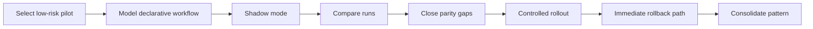

# AGENT_SPEC Migration Pattern

**Status**: Reusable baseline after Fase 7 pilot
**Pilot origin**: `insights`

---

## Goal

Convert the `insights` pilot migration into a reusable pattern for the next
agent or subflow.

This document defines:

- entry criteria
- migration sequence
- parity criteria
- rollout and rollback rules
- evidence required before promoting the next pilot

---

## Recommended Sequence



---

## Entry Criteria

Do not start a new migration pilot unless:

1. the current phase quality gates are green
2. the Go baseline of the candidate flow is documented
3. the declarative runtime needed for the candidate flow already exists
4. rollback to Go can be executed without schema or deploy changes

---

## Pilot Selection Rule

Choose the next pilot using this order of preference:

1. low business blast radius
2. low mutation surface
3. low approval sensitivity
4. high parity observability
5. easy rollback

This is why `insights` was selected before `support`, `prospecting`, or `kb`.

---

## Required Evidence By Stage

### 1. Selection

- explicit pilot recommendation
- reason for not choosing the other candidates

### 2. Declarative Modeling

- candidate workflow model
- known gaps listed before runtime execution

### 3. Shadow Mode

- Go primary path preserved
- declarative shadow run persisted
- link between primary run and shadow run

### 4. Comparison

- parity report per execution
- comparison of:
  - status
  - action
  - confidence
  - evidence IDs
  - approvals
  - tool calls

### 5. Parity Closure

- blocking gaps identified
- non-blocking gaps documented
- parity deemed acceptable for rollout

### 6. Controlled Rollout

- explicit segment gate
- reversible activation without deploy
- operational visibility in the response or trace

### 7. Rollback

- proven switch back to Go
- no data repair required
- no runtime rewiring required

---

## Rollout Rule

The rollout mechanism should be:

- explicit
- per workspace or segment
- reversible without redeploy
- auditable from run metadata

For the `insights` pilot this was implemented through `workspace.settings`.

---

## Rollback Rule

Rollback must:

- use the same control plane as rollout
- return traffic to the Go path immediately
- avoid schema changes, migrations, or restarts

If rollback needs new infrastructure, the pilot is not ready for rollout.

---

## Parity Rule

Do not require wording parity first.

Parity should be evaluated in this order:

1. run status
2. abstain vs non-abstain behavior
3. tool usage
4. approvals or policy behavior
5. evidence IDs and confidence
6. payload shape
7. human-readable wording

This keeps migration decisions tied to stable behavior rather than noisy output
formatting.

---

## Reusable Checklist

```text
[ ] Candidate selected with explicit risk rationale
[ ] Go baseline documented
[ ] Declarative workflow candidate documented
[ ] Shadow mode implemented
[ ] Shadow and primary runs linked
[ ] Per-run parity report implemented
[ ] Blocking parity gaps closed
[ ] Controlled segment gate implemented
[ ] Rollback path proven
[ ] Task docs updated with implemented diagrams and evidence
[ ] Phase quality gates green
```

---

## Lessons From `insights`

1. choose a read-oriented pilot first
2. compare structured behavior before wording
3. shadow mode is useful only if the evidence is directly readable
4. many apparent parity gaps are actually wiring issues, not agent logic issues
5. rollout and rollback should share the same control surface

---

## Recommendation For The Next Pilot

After `insights`, the next candidate should be a bounded subflow rather than a
full high-sensitivity agent.

Recommended direction:

- a constrained `support` subflow before full `support`

Reason:

- it increases mutation complexity gradually
- it exercises approvals and workflow effects more than `insights`
- it avoids jumping directly into the riskiest commercial or knowledge-writing
  paths
