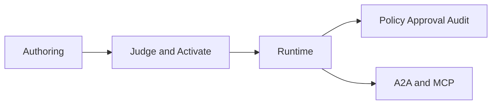

# AGENT_SPEC Overview

> Date: 2026-03-09
> Status: Active working baseline for naming, analysis, design, and transition planning

---

## Purpose

This document is the single entry point for the AGENT_SPEC effort.

It aligns:
- naming
- use cases
- analysis
- design
- implementation phases
- traceability

---

## Naming Convention

The repository already uses stable top-level use case IDs in the form `UC-<domain><number>`.

Existing IDs already in use:
- `UC-S1`, `UC-S2`, `UC-S3`
- `UC-C1`
- `UC-K1`
- `UC-D1`
- `UC-G1`
- `UC-A1`

To avoid collisions, the new AGENT_SPEC capabilities are reserved under the next free `A` namespace:

- `UC-A2` Workflow Authoring
- `UC-A3` Workflow Verification and Activation
- `UC-A4` Workflow Execution
- `UC-A5` Signal Detection and Lifecycle
- `UC-A6` Deferred Actions
- `UC-A7` Human Override and Approval
- `UC-A8` Workflow Versioning and Rollback
- `UC-A9` Agent Delegation

Rule:
- `UC-*` is the stable top-level use case identifier.
- `BEHAVIOR` names stay in `snake_case` and are scenario-level cases inside each `UC`.

Example:
- `UC-A4` is the top-level capability.
- `execute_workflow`, `execute_workflow_policy_blocked`, and `execute_workflow_approval_required` are behavior scenarios inside `UC-A4`.

---

## Collision Check

The current repository convention was checked against the existing catalog in `agentic_crm_requirements_agent_ready.md`.

Result:
- no existing `UC-A2` to `UC-A9`
- no collision with business use cases such as `UC-C1` or `UC-S2`
- the new IDs stay grouped under the agent platform domain already introduced by `UC-A1`

This keeps the naming consistent with what already exists and avoids mixing business flows with platform behaviors.

---

## Harmonized Catalog

| UC | Capability | Behavior family | Main components | Main phases |
|---|---|---|---|---|
| `UC-A2` | Workflow Authoring | `define_workflow*` | `WorkflowService`, `WorkflowRepository` | F2 |
| `UC-A3` | Workflow Verification and Activation | `verify_workflow*` | `Judge`, `SpecParser`, activation flow | F5 |
| `UC-A4` | Workflow Execution | `execute_workflow*` | `DSLRunner`, `DSLRuntime`, `RunnerRegistry` | F1, F3, F4 |
| `UC-A5` | Signal Detection and Lifecycle | `detect_signal*` | `SignalService`, `EventBus` | F2 |
| `UC-A6` | Deferred Actions | `defer_action*` | `Scheduler`, resume handler | F6 |
| `UC-A7` | Human Override and Approval | `human_override*` | `ApprovalService`, `agent_run`, audit | F1, F5 |
| `UC-A8` | Workflow Versioning and Rollback | `version_workflow*` | `WorkflowService`, versioning lifecycle | F2, F5 |
| `UC-A9` | Agent Delegation | `delegate_workflow*` | `ProtocolHandler`, A2A adapter, `RunnerRegistry` | F8 |

---

## Integral Solution View

The AGENT_SPEC effort is organized in three layers:

1. Authoring and verification
- workflows are created, versioned, verified, and activated
- represented by `UC-A2`, `UC-A3`, and `UC-A8`

2. Execution and control
- workflows run through a shared runtime contract
- policy, approvals, and audit remain mandatory
- represented by `UC-A4`, `UC-A6`, and `UC-A7`

3. Interoperability and external coordination
- signals become first-class outputs
- dispatch between agents uses A2A-first
- tools and context use MCP-first
- represented by `UC-A5` and `UC-A9`

High-level flow:

---

## Document Map

Read in this order:

1. `docs/agent-spec-overview.md`
2. `docs/agent-spec-use-cases.md`
3. `docs/agent-spec-design.md`
4. `docs/agent-spec-integration-analysis.md`
5. `docs/agent-spec-development-plan.md`
6. `docs/agent-spec-traceability.md`

Canonical documentation set:
- `docs/agent-spec-overview.md`
- `docs/agent-spec-use-cases.md`
- `docs/agent-spec-design.md`
- `docs/agent-spec-integration-analysis.md`
- `docs/agent-spec-development-plan.md`
- `docs/agent-spec-traceability.md`

Reference-only documents:
- `docs/agent-spec-transition-plan.md` keeps the original transition narrative
- `docs/AGENT_SPEC.md` keeps the original conceptual source

Rule:
- new naming decisions must be made in the canonical set
- legacy/reference documents must not become a second source of truth

Supporting baselines:
- `docs/agent-spec-regression-baseline.md`
- `docs/agent-spec-go-agents-baseline.md`
- `docs/agent-spec-core-contracts-baseline.md`
- `docs/agent-spec-phase1-quality-gates.md`

---

## Practical Decision

From this point on:
- all new top-level AGENT_SPEC references should use `UC-A2` to `UC-A9`
- existing `BEHAVIOR` names remain valid as detailed scenario identifiers
- analysis, design, and planning documents should point to this file as the naming source of truth
- every canonical documentation change should also update `docs/agent-spec-traceability.md`
