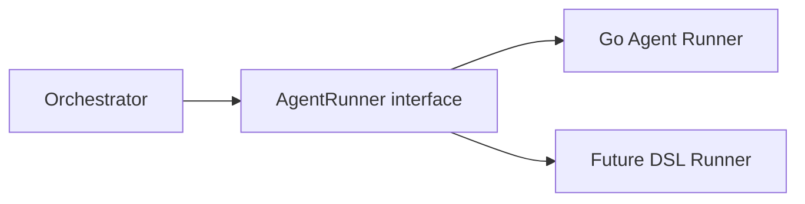
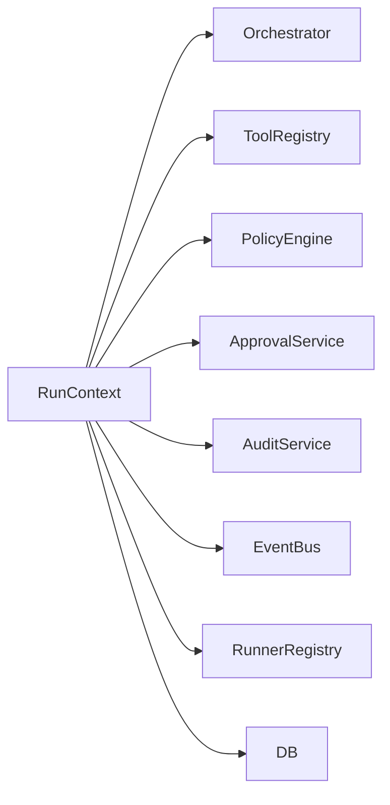
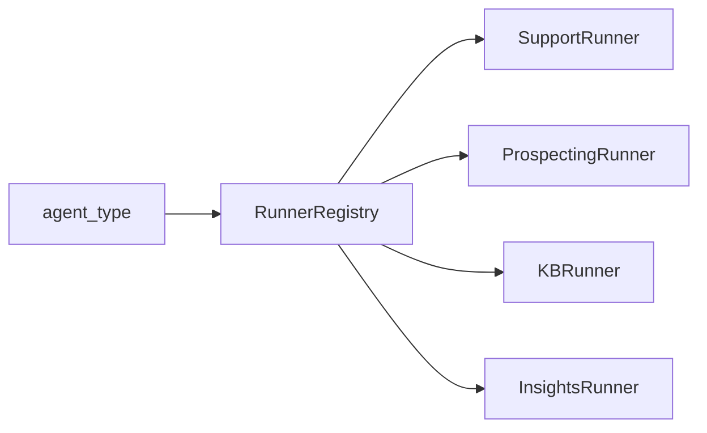
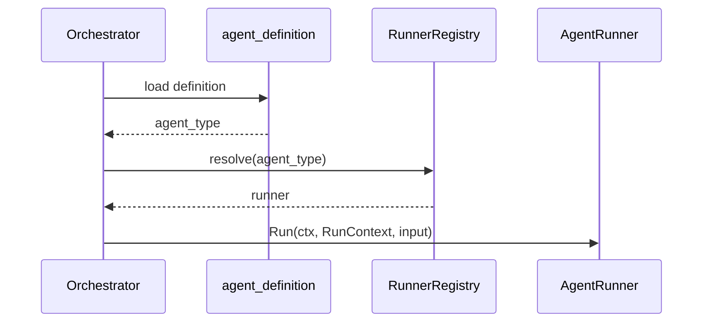
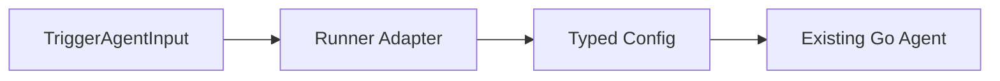
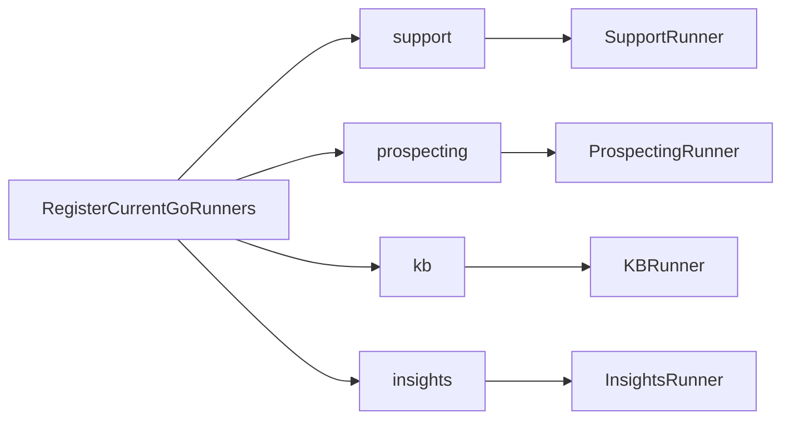
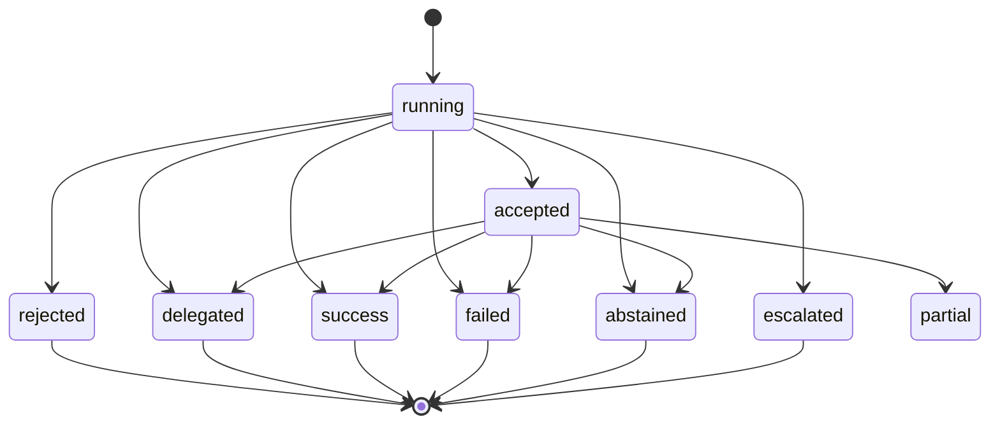
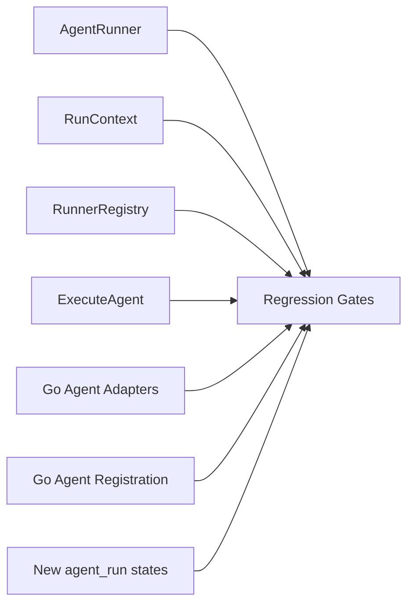
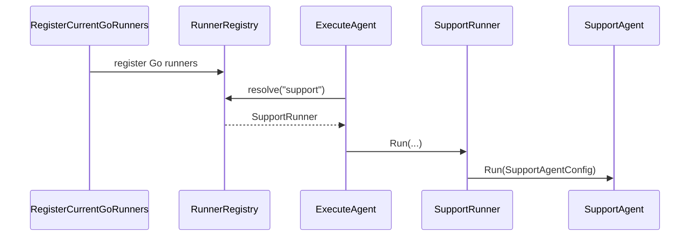
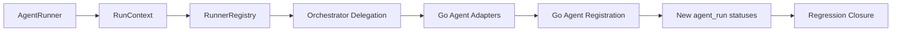

# AGENT_SPEC Phase 1 As Built

> Fecha: 2026-03-10
> Objetivo: dejar una referencia visual y verificable de lo implementado en Fase 1

---

## Alcance

Este documento describe lo implementado en:

- `F1.1` AgentRunner
- `F1.2` RunContext
- `F1.3` RunnerRegistry
- `F1.4` delegacion del orquestador
- `F1.5` adaptacion de agentes Go
- `F1.6` registro de agentes Go actuales
- `F1.7` nuevos estados de `agent_run`
- `F1.8` cobertura de no regresion y cierre de fase

---

## F1.1 AgentRunner

Se introdujo un contrato comun para cualquier agente ejecutable.

Implementacion:
- `internal/domain/agent/runner.go`

---

## F1.2 RunContext

Se introdujo un contexto runtime compartido para dependencias y metadatos de llamada.

Implementacion:
- `internal/domain/agent/runner.go`

---

## F1.3 RunnerRegistry

Se introdujo un registro `agent_type -> runner`.

Implementacion:
- `internal/domain/agent/runner_registry.go`

---

## F1.4 Orchestrator Delegation

El orquestador ahora puede resolver un runner y delegar la ejecucion por contrato comun.

Implementacion:
- `internal/domain/agent/orchestrator.go`

Nota:
- `TriggerAgent()` legacy se mantuvo intacto
- el nuevo camino entra por `ExecuteAgent()`

---

## F1.5 Go Agent Adapters

Los agentes Go actuales fueron adaptados sin cambiar su API publica tipada.

Adapters implementados:
- `SupportRunner`
- `ProspectingRunner`
- `KBRunner`
- `InsightsRunner`

Implementacion:
- `internal/domain/agent/agents/runner_adapters.go`

---

## F1.6 Registration of Current Go Agents

Se incorporo el wiring explicito de los cuatro agentes Go actuales.

Implementacion:
- `internal/domain/agent/agents/registry.go`

---

## F1.7 New agent_run statuses

Se agregaron estados nuevos compatibles con el flujo actual.

Implementacion:
- `internal/domain/agent/orchestrator.go`
- `internal/domain/agent/runtime_steps.go`

Semantica introducida:
- `accepted`: no terminal
- `rejected`: terminal
- `delegated`: terminal

---

## F1.8 Regression Closure

La fase quedo cerrada con evidencia de regresion sobre el camino nuevo y el comportamiento legacy.

Prueba integrada adicional:

Implementacion y evidencia:
- `internal/domain/agent/agents/registry_test.go`
- `docs/agent-spec-phase1-regression-status.md`
- `docs/tasks/task_agent_spec_f1_8.md`

---

## Resumen de Fase 1

Resultado:
- el runtime ya no depende solo de implementaciones concretas
- los agentes Go actuales conviven con el nuevo contrato
- la base queda lista para abrir Fase 2

---

## Documentos Base Utilizados

Los documentos usados como fuente para implementar, validar y cerrar toda la Fase 1 fueron:

### Canonicos de AGENT_SPEC

- `docs/agent-spec-overview.md`
- `docs/agent-spec-traceability.md`
- `docs/agent-spec-development-plan.md`
- `docs/agent-spec-design.md`
- `docs/agent-spec-use-cases.md`
- `docs/agent-spec-integration-analysis.md`

### Baselines y gates

- `docs/agent-spec-regression-baseline.md`
- `docs/agent-spec-go-agents-baseline.md`
- `docs/agent-spec-core-contracts-baseline.md`
- `docs/agent-spec-feature-flags.md`
- `docs/agent-spec-phase1-quality-gates.md`
- `docs/agent-spec-phase1-regression-status.md`

### Tareas individuales de Fase 1

- `docs/tasks/task_agent_spec_f1_1.md`
- `docs/tasks/task_agent_spec_f1_3.md`
- `docs/tasks/task_agent_spec_f1_4.md`
- `docs/tasks/task_agent_spec_f1_5.md`
- `docs/tasks/task_agent_spec_f1_6.md`
- `docs/tasks/task_agent_spec_f1_7.md`
- `docs/tasks/task_agent_spec_f1_8.md`

### Referencia historica y conceptual

- `docs/agent-spec-transition-plan.md`
- `docs/AGENT_SPEC.md`

---

## Criterio de contraste

Para contrastar implementacion vs. criterio:

1. revisar este documento
2. revisar las tareas individuales de Fase 1
3. revisar tests en:
   - `internal/domain/agent/`
   - `internal/domain/agent/agents/`
4. validar quality gates de Fase 1

Si hay diferencias entre codigo y criterio, la referencia principal debe ser:
- tareas individuales
- documentos canonicos
- tests existentes
