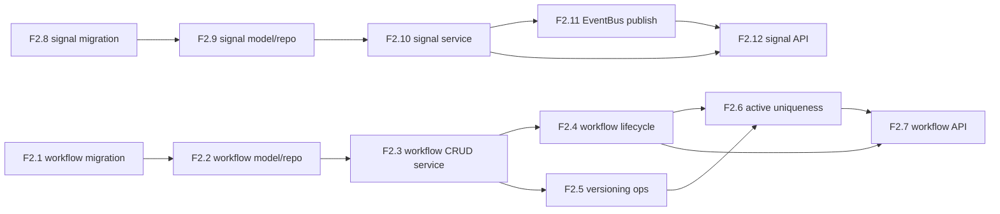

# AGENT_SPEC Phase 2 Analysis

**Status**: Active planning baseline
**Phase**: AGENT_SPEC - Fase 2 Workflow Foundation
**Naming source of truth**: `docs/agent-spec-overview.md`

---

## Objective

Construir la base persistente y de servicio para:

- `UC-A2` Workflow Authoring
- `UC-A5` Signal Detection and Lifecycle
- `UC-A8` Workflow Versioning and Rollback

El resultado esperado de Fase 2 no es ejecucion DSL todavia. El objetivo es
dejar listas las entidades, servicios y APIs minimas sobre las que luego
trabajaran `Judge`, `DSLRunner`, `Scheduler` y `DISPATCH`.

---

## Scope

La fase cubre dos bloques:

1. `workflow`
- modelo persistente
- lifecycle basico
- versionado y rollback
- API CRUD base

2. `signal`
- modelo persistente
- lifecycle basico
- eventos `signal.created` y `signal.dismissed`
- API de consulta y dismiss

---

## Out of Scope

- parser o runtime DSL
- `Judge.Verify`
- ejecucion de workflows
- `WAIT`, scheduler o resume
- `DISPATCH`, A2A o MCP
- UI o BFF avanzada para workflows/signals

---

## Dependency View



---

## Internal Analysis

### Workflow track

- `F2.1` y `F2.2` fijan el contrato de datos.
- `F2.3` introduce la superficie de servicio minima.
- `F2.4` agrega reglas de estado que despues usaran `verify` y `activate`.
- `F2.5` agrega operaciones de versionado necesarias para `UC-A8`.
- `F2.6` es el punto delicado: asegura que solo exista una version activa por
  `workspace + name`.
- `F2.7` expone el bloque workflow por API sin adelantar la semantica de Fase 5.

### Signal track

- `F2.8` y `F2.9` fijan persistencia de `signal`.
- `F2.10` implementa reglas de negocio de signals.
- `F2.11` conecta con `EventBus`.
- `F2.12` expone consulta y dismiss sin mezclar aun UI ni surfaces avanzadas.

---

## Critical Path

El camino critico de Fase 2 es:

1. `F2.1`
2. `F2.2`
3. `F2.3`
4. `F2.4`
5. `F2.5`
6. `F2.6`
7. `F2.7`

La rama de `signal` puede avanzar en paralelo despues de `F0.6` y `F1`.

---

## Parallel Work

Se puede paralelizar:

- `F2.1` con diseño de `F2.8`
- `F2.2` con `F2.9`
- `F2.7` puede arrancar cuando `F2.3` y `F2.4` esten estables
- `F2.12` puede arrancar cuando `F2.10` y `F2.11` esten estables

No conviene paralelizar:

- `F2.4` antes de cerrar `F2.3`
- `F2.6` antes de fijar lifecycle y versionado
- `F2.11` antes de cerrar semantica de `SignalService`

---

## Main Risks

### 1. Active uniqueness semantics

Riesgo:
- romper consistencia al activar o rollbackear versiones

Mitigacion:
- definir enforcement dual en service + DB
- cubrir colision de versiones activas y rollback concurrente

### 2. Lifecycle drift

Riesgo:
- introducir estados o transiciones que luego contradigan `Judge` y `activate`

Mitigacion:
- mantener solo `draft`, `testing`, `active`, `archived`
- no introducir semantica de verificacion completa todavia

### 3. Signal over-validation

Riesgo:
- bloquear creacion de signals por checks caros o prematuros

Mitigacion:
- validar evidencia minima y bounds de confianza
- no verificar exhaustivamente cada `evidence_id` en esta fase

### 4. API semantic leakage

Riesgo:
- exponer endpoints que prometan mas de lo que la fase implementa

Mitigacion:
- CRUD y lifecycle basico solamente
- dejar verify/activate para Fase 5

---

## Acceptance Model

Fase 2 se considera cerrada cuando:

- existe persistencia real de `workflow` y `signal`
- `WorkflowService` soporta CRUD, lifecycle y versionado base
- `SignalService` soporta create/list/get/dismiss
- `signal.created` y `signal.dismissed` salen por `EventBus`
- existen APIs base para workflows y signals
- quedan cubiertas las reglas centrales de `UC-A2`, `UC-A5` y `UC-A8`

---

## Suggested Gates

Gate corto:

```powershell
go test ./internal/domain/workflow/...
go test ./internal/domain/signal/...
go test ./internal/domain/eventbus/...
```

Gate de transicion:

```powershell
go test ./internal/domain/workflow/...
go test ./internal/domain/signal/...
go test ./internal/domain/eventbus/...
go test ./internal/api/handlers/... ./internal/api/middleware/...
go test ./internal/domain/agent/...
```

---

## Canonical References

- `docs/agent-spec-overview.md`
- `docs/agent-spec-use-cases.md`
- `docs/agent-spec-design.md`
- `docs/agent-spec-development-plan.md`
- `docs/agent-spec-traceability.md`
- `docs/agent-spec-core-contracts-baseline.md`

---

## Sources of Truth

Estas fueron las fuentes de verdad usadas para definir las tareas de Fase 2,
en este orden:

1. `docs/agent-spec-overview.md`
- naming canonico
- mapeo de `UC-A2`, `UC-A5`, `UC-A8`

2. `docs/agent-spec-development-plan.md`
- listado oficial de `F2.1` a `F2.12`
- dependencias macro entre tareas y fases

3. `docs/agent-spec-design.md`
- componentes responsables
- contratos de `WorkflowService` y `SignalService`
- modelo de datos
- lifecycle
- API design

4. `docs/agent-spec-use-cases.md`
- behaviors que cada tarea debe cubrir
- familias `define_workflow*`, `detect_signal*`, `version_workflow*`

5. `docs/agent-spec-traceability.md`
- regla canonica `UC -> behavior -> component -> task`

Fuentes de apoyo:

- `docs/agent-spec-core-contracts-baseline.md`
- `docs/agent-spec-phase1-quality-gates.md`

Regla:
- si aparece conflicto entre documentos, prevalece el set canonico definido en
  `docs/agent-spec-overview.md` y `docs/agent-spec-traceability.md`
