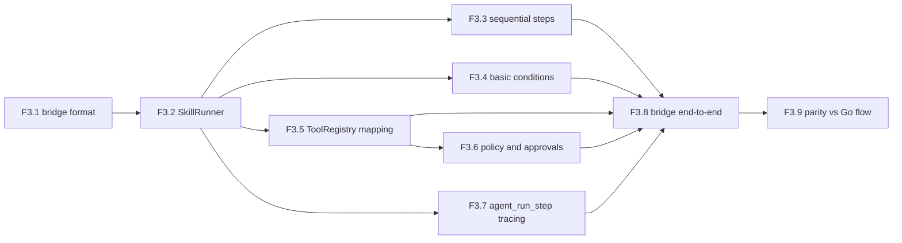

# AGENT_SPEC Phase 3 Analysis

**Status**: Active planning baseline
**Phase**: AGENT_SPEC - Fase 3 Declarative Bridge
**Naming source of truth**: `docs/agent-spec-overview.md`

---

## Objective

Construir una capa declarativa puente, anterior al DSL final, para validar que:

- el runtime unificado de Fase 1 soporta ejecucion declarativa real
- `workflow` y `signal` de Fase 2 ya pueden participar en un flujo operativo
- `ToolRegistry`, `PolicyEngine`, approvals y `agent_run_step` funcionan fuera de los agentes Go hardcodeados

El objetivo de Fase 3 no es el lenguaje definitivo. Es un puente controlado para probar el modelo operativo antes de introducir parser y AST completos en Fase 4.

---

## Scope

La fase cubre:

1. un formato declarativo minimo intermedio
2. un runner puente (`SkillRunner` o equivalente)
3. pasos secuenciales simples
4. condiciones basicas
5. mapeo de acciones a `ToolRegistry`
6. enforcement de `PolicyEngine` y approvals
7. trazabilidad por `agent_run_step`
8. un workflow end-to-end sobre el formato puente
9. comparacion con un flujo Go equivalente

---

## Out of Scope

- parser DSL final
- AST, lexer y grammar de Fase 4
- `WAIT` y scheduler
- `DISPATCH`
- Judge completo
- activacion productiva a escala

---

## Dependency View



---

## Internal Analysis

### Bridge format

- `F3.1` define el contrato intermedio y protege a Fase 4 de decisiones prematuras de sintaxis.
- `F3.2` crea el runner que ejecuta ese formato usando el runtime ya unificado.
- `F3.3` y `F3.4` prueban que el modelo declarativo puede cubrir control de flujo minimo.

### Execution integration

- `F3.5` conecta acciones declarativas con `ToolRegistry`.
- `F3.6` valida que policy y approvals no dependen de agentes Go.
- `F3.7` asegura observabilidad y trazabilidad desde el primer puente declarativo.

### End-to-end validation

- `F3.8` demuestra un flujo declarativo operativo.
- `F3.9` compara ese flujo contra un comportamiento Go equivalente para medir paridad real.

---

## Critical Path

El camino critico de Fase 3 es:

1. `F3.1`
2. `F3.2`
3. `F3.5`
4. `F3.6`
5. `F3.7`
6. `F3.8`
7. `F3.9`

`F3.3` y `F3.4` son necesarios para cerrar cobertura funcional minima del runner, pero pueden avanzar en paralelo despues de `F3.2`.

---

## Parallel Work

Se puede paralelizar:

- `F3.3`, `F3.4` y `F3.7` despues de cerrar `F3.2`
- `F3.5` en paralelo con `F3.4` si el formato puente ya esta fijado
- definicion del workflow piloto de `F3.8` mientras se estabiliza trazabilidad

No conviene paralelizar:

- `F3.2` antes de fijar `F3.1`
- `F3.6` antes de resolver mapping a `ToolRegistry`
- `F3.9` antes de tener un flujo declarativo end-to-end estable

---

## Main Risks

### 1. Bridge drift

Riesgo:
- que el formato puente se vuelva otro lenguaje permanente y genere deuda antes del DSL real

Mitigacion:
- mantenerlo minimo
- documentar expresamente que es transitorio
- alinearlo con los verbos y conceptos de Fase 4

### 2. Policy bypass

Riesgo:
- que el runner puente ejecute acciones fuera de `ToolRegistry` o sin `PolicyEngine`

Mitigacion:
- todas las mutaciones pasan por `ToolRegistry`
- approvals siguen el mismo punto de enforcement que agentes Go

### 3. False parity

Riesgo:
- declarar paridad con agentes Go sin comparar side effects y trazas

Mitigacion:
- `F3.9` debe contrastar resultado, tool calls y `agent_run_step`

---

## Acceptance Model

Fase 3 se considera cerrada cuando:

- existe un formato puente declarativo documentado
- existe un runner declarativo operativo sobre ese formato
- el flujo puente ejecuta pasos, condiciones y actions via `ToolRegistry`
- policy y approvals siguen aplicando
- cada paso deja traza en `agent_run_step`
- existe un flujo puente end-to-end con comparativa contra un flujo Go equivalente

---

## Suggested Gates

Gate corto:

```powershell
go test ./internal/domain/agent/...
go test ./internal/domain/tool/...
go test ./internal/domain/policy/...
```

Gate de transicion:

```powershell
go test ./internal/domain/agent/...
go test ./internal/domain/tool/...
go test ./internal/domain/policy/...
go test ./internal/domain/audit/...
go test ./internal/api/handlers/... ./internal/api/middleware/...
```

---

## Canonical References

- `docs/agent-spec-overview.md`
- `docs/agent-spec-use-cases.md`
- `docs/agent-spec-design.md`
- `docs/agent-spec-development-plan.md`
- `docs/agent-spec-traceability.md`
- `docs/agent-spec-core-contracts-baseline.md`

---

## Sources of Truth

Estas fueron las fuentes de verdad usadas para definir las tareas de Fase 3,
en este orden:

1. `docs/agent-spec-overview.md`
- naming canonico
- mapeo de `UC-A4` y `UC-A7`

2. `docs/agent-spec-development-plan.md`
- listado oficial de `F3.1` a `F3.9`
- dependencias macro entre tareas y fases

3. `docs/agent-spec-design.md`
- contrato de `AgentRunner`, `RunContext`, `ToolRegistry`, `PolicyEngine`
- responsabilidades de `SkillRunner`, `DSLRuntime` y `agent_run_step`

4. `docs/agent-spec-use-cases.md`
- behaviors `execute_workflow*`
- flows de policy, approval y trazabilidad

5. `docs/agent-spec-traceability.md`
- regla canonica `UC -> behavior -> component -> task`

Fuentes de apoyo:

- `docs/agent-spec-phase1-quality-gates.md`
- `docs/agent-spec-phase2-analysis.md`

Regla:
- si aparece conflicto entre documentos, prevalece el set canonico definido en
  `docs/agent-spec-overview.md` y `docs/agent-spec-traceability.md`
