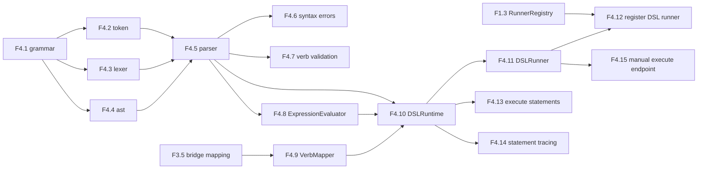

# AGENT_SPEC Phase 4 Analysis

**Status**: Active planning baseline
**Phase**: AGENT_SPEC - Fase 4 DSL Foundation
**Naming source of truth**: `docs/agent-spec-overview.md`

---

## Objective

Construir el runtime DSL real sobre la base validada en Fase 3 para que el
sistema pueda:

- parsear workflows declarativos estables
- evaluar expresiones y condiciones
- ejecutar statements sobre `ToolRegistry`, `PolicyEngine` y `RunnerRegistry`
- dejar trazabilidad statement-level en `agent_run_step`

Fase 4 no cierra activacion gobernada ni `WAIT`. Eso pertenece a Fases 5 y 6.

---

## Scope

La fase cubre:

1. gramatica inicial del DSL
2. tokenizacion, lexer, AST y parser
3. errores sintacticos con linea y columna
4. validacion basica de verbos y restricciones sintacticas
5. `ExpressionEvaluator`
6. `VerbMapper`
7. `DSLRuntime`
8. `DSLRunner`
9. integracion con `RunnerRegistry`
10. ejecucion de `SET`, `AGENT`, `NOTIFY`, `IF`
11. trazabilidad por statement
12. endpoint manual de ejecucion

---

## Out of Scope

- Judge completo
- activacion de versiones
- `WAIT`
- scheduler
- `DISPATCH`
- grammar avanzada o syntactic sugar

---

## Dependency View



---

## Critical Path

1. `F4.1`
2. `F4.2`
3. `F4.3`
4. `F4.4`
5. `F4.5`
6. `F4.8`
7. `F4.9`
8. `F4.10`
9. `F4.11`
10. `F4.12`
11. `F4.13`
12. `F4.14`
13. `F4.15`

---

## Main Risks

### 1. Grammar drift

Riesgo:
- que el DSL real diverja innecesariamente del bridge o de los use cases

Mitigacion:
- mantener una gramatica minima y verbos alineados con `UC-A3` y `UC-A4`

### 2. Runtime coupling

Riesgo:
- que parser, evaluator y runtime queden acoplados de forma que rompa testabilidad

Mitigacion:
- separar `lexer`, `parser`, `ast`, `ExpressionEvaluator`, `VerbMapper`, `DSLRuntime`

### 3. Hidden behavioral regressions

Riesgo:
- que el DSL ejecute side effects correctos pero pierda trazabilidad o enforcement

Mitigacion:
- mantener gates con `tool`, `policy`, `agent_run_step` y endpoint manual

---

## Suggested Gates

Gate corto:

```powershell
go test ./internal/domain/agent/...
go test ./internal/domain/tool/...
go test ./internal/domain/policy/...
```

Gate de transicion:

```powershell
go test ./internal/domain/agent/...
go test ./internal/domain/tool/...
go test ./internal/domain/policy/...
go test ./internal/domain/audit/...
go test ./internal/api/handlers/... ./internal/api/middleware/...
```

---

## Sources of Truth

Estas son las fuentes de verdad para definir las tareas de Fase 4, en este
orden:

1. `docs/agent-spec-overview.md`
- naming canonico
- mapeo de `UC-A3` y `UC-A4`

2. `docs/agent-spec-development-plan.md`
- listado oficial de `F4.1` a `F4.15`
- dependencias macro entre tareas

3. `docs/agent-spec-design.md`
- componentes `lexer`, `parser`, `VerbMapper`, `DSLRuntime`, `DSLRunner`

4. `docs/agent-spec-use-cases.md`
- behaviors de ejecucion, verify y statement-level tracing

5. `docs/agent-spec-traceability.md`
- regla canonica `UC -> behavior -> component -> task`

Regla:
- si hay conflicto, prevalece el set canonico definido en
  `docs/agent-spec-overview.md` y `docs/agent-spec-traceability.md`
