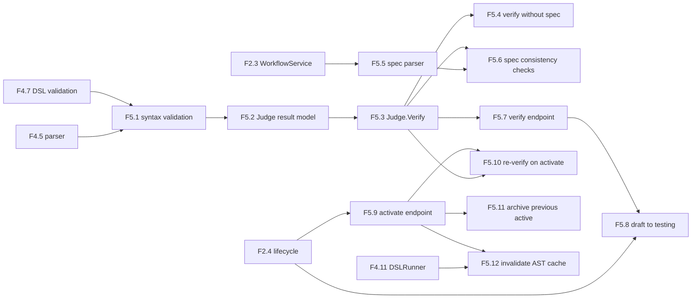

# AGENT_SPEC Phase 5 Analysis

**Status**: Active planning baseline
**Phase**: AGENT_SPEC - Fase 5 Judge y activacion
**Naming source of truth**: `docs/agent-spec-overview.md`

---

## Objective

Cerrar la capa de gobernanza del runtime DSL para que un workflow no pase de
`draft` a `active` sin verificacion consistente.

Fase 5 agrega:

- `Judge` como contrato de verificacion
- resultado estructurado con `passed`, `violations`, `warnings`
- endpoint `verify`
- endpoint `activate`
- re-verificacion en activacion
- promotion segura de versiones

---

## Scope

La fase cubre:

1. validacion sintactica del DSL como entrada del Judge
2. modelo de `JudgeResult`, `Violation`, `Warning`
3. `Judge.Verify`
4. verify sin `spec_source` con warnings
5. parser parcial de `spec_source`
6. checks iniciales `spec -> DSL`
7. endpoint `POST /workflows/{id}/verify`
8. transicion `draft -> testing` cuando verify pasa
9. endpoint `PUT /workflows/{id}/activate`
10. re-verificacion en activate
11. archive de la version activa anterior
12. invalidacion de cache AST al activar

---

## Out of Scope

- Judge avanzado de protocolo o ambiguedad
- `WAIT`
- scheduler
- `DISPATCH`
- checks semanticos profundos mas alla de consistencia inicial `spec -> DSL`

---

## Dependency View



---

## Critical Path

1. `F5.1`
2. `F5.2`
3. `F5.3`
4. `F5.7`
5. `F5.8`
6. `F5.9`
7. `F5.10`
8. `F5.11`
9. `F5.12`

`F5.5` y `F5.6` pueden avanzar en paralelo mientras se estabiliza `Judge.Verify`.

---

## Main Risks

### 1. Verify/activate drift

Riesgo:
- que `verify` y `activate` usen reglas distintas y permitan activar workflows no equivalentes a los verificados

Mitigacion:
- re-verificar en `activate`
- centralizar verificacion en `Judge.Verify`

### 2. Sintaxis duplicada

Riesgo:
- que API, service y Judge validen sintaxis de formas distintas

Mitigacion:
- reutilizar parser y validacion DSL de Fase 4
- exponer un contrato unico de errores y violations

### 3. Promotion insegura

Riesgo:
- activar una version nueva sin archivar la anterior o sin invalidar cache

Mitigacion:
- activar solo desde `testing`
- archive explicito + invalidacion de cache en el mismo flujo

---

## Suggested Gates

Gate corto:

```powershell
go test ./internal/domain/agent/...
go test ./internal/domain/workflow/...
```

Gate de transicion:

```powershell
go test ./internal/domain/agent/...
go test ./internal/domain/workflow/...
go test ./internal/api/handlers/... ./internal/api/middleware/...
```

---

## Sources of Truth

Estas son las fuentes de verdad para definir las tareas de Fase 5, en este
orden:

1. `docs/agent-spec-overview.md`
- naming canonico
- mapeo de `UC-A3`

2. `docs/agent-spec-development-plan.md`
- listado oficial de `F5.1` a `F5.12`
- dependencias macro entre tareas

3. `docs/agent-spec-design.md`
- contrato `Judge`
- `JudgeResult`, `Violation`, `Warning`
- endpoints `verify` y `activate`
- reglas de lifecycle

4. `docs/agent-spec-use-cases.md`
- behaviors `verify_workflow*`
- verify sin spec, warnings, syntax errors y activate con re-verify

5. `docs/agent-spec-traceability.md`
- regla canonica `UC -> behavior -> component -> task`

Regla:
- si hay conflicto, prevalece el set canonico definido en
  `docs/agent-spec-overview.md` y `docs/agent-spec-traceability.md`
