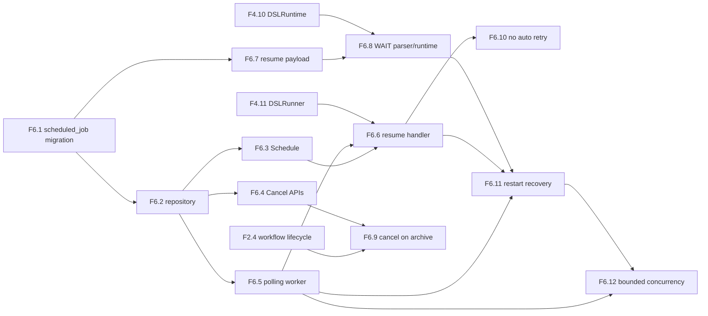

# AGENT_SPEC Phase 6 Analysis

**Status**: Active planning baseline
**Phase**: AGENT_SPEC - Fase 6 Scheduler y WAIT
**Naming source of truth**: `docs/agent-spec-overview.md`

---

## Objective

Cerrar la capa de acciones diferidas para que el runtime DSL soporte `WAIT`
con persistencia, resume seguro y recovery tras reinicio.

Fase 6 agrega:

- tabla `scheduled_job`
- repositorio de jobs programados
- contrato `Scheduler`
- worker de polling
- handler de resume de workflows
- persistencia de estado minimo de resume
- soporte real de `WAIT` en parser y runtime
- cancelacion al archivar workflows
- no retry automatico ante resume fallido
- recovery tras reinicio
- concurrencia limitada de resumes

---

## Scope

La fase cubre:

1. persistencia DB de jobs diferidos
2. `Scheduler.Schedule`
3. `Scheduler.Cancel` y `CancelBySource`
4. polling de jobs pendientes
5. resume de workflows desde payload persistido
6. estado minimo de resume: `workflow_id`, `run_id`, `resume_step_index`
7. soporte de `WAIT` en parser y runtime
8. cancelacion de jobs cuando el workflow se archiva
9. politica explicita de no retry automatico
10. recovery tras reinicio
11. limite de concurrencia de resumes

---

## Out of Scope

- cron externo o recurrente
- election distribuida de scheduler
- UI para jobs programados
- retry con backoff
- `DISPATCH`
- jobs arbitrarios fuera de `workflow_resume`

---

## Dependency View



---

## Critical Path

1. `F6.1`
2. `F6.2`
3. `F6.3`
4. `F6.6`
5. `F6.7`
6. `F6.8`
7. `F6.9`
8. `F6.10`
9. `F6.11`
10. `F6.12`

`F6.4` y parte de `F6.5` pueden avanzar en paralelo despues de cerrar el
repositorio.

---

## Main Risks

### 1. Duplicate resume

Riesgo:
- polling concurrente o recovery tras restart pueden ejecutar el mismo resume
  dos veces

Mitigacion:
- transicion explicita de `pending -> executed`
- fetch acotado y handler idempotente a nivel de job

### 2. Resume de workflow archivado

Riesgo:
- un job pendiente puede intentar retomar un workflow ya archivado

Mitigacion:
- cancelacion por source al archivar
- check defensivo en el resume handler

### 3. Partial side effects on failed resume

Riesgo:
- reintentar automaticamente puede duplicar side effects

Mitigacion:
- no retry automatico
- marcar job como ejecutado aunque falle el resume

### 4. Scheduler saturation

Riesgo:
- muchos jobs due al mismo tiempo saturan el sistema

Mitigacion:
- limite de concurrencia de resumes por ciclo

---

## Suggested Gates

Gate corto:

```powershell
go test ./internal/domain/agent/...
go test ./internal/domain/workflow/...
```

Gate de transicion:

```powershell
go test ./internal/domain/agent/...
go test ./internal/domain/workflow/...
go test ./internal/infra/sqlite/...
go test ./internal/api/handlers/... ./internal/api/middleware/...
```

---

## Sources of Truth

Estas son las fuentes de verdad para definir las tareas de Fase 6, en este
orden:

1. `docs/agent-spec-overview.md`
- naming canonico
- mapeo de `UC-A6`

2. `docs/agent-spec-development-plan.md`
- listado oficial de `F6.1` a `F6.12`
- dependencias macro entre tareas

3. `docs/agent-spec-design.md`
- contrato `Scheduler`
- `ScheduledJobRepository`
- resume handler
- reglas de `WAIT`, recovery y concurrencia

4. `docs/agent-spec-use-cases.md`
- behaviors `defer_action*`
- restart, archive, `WAIT 0`, estado fresco y no retry

5. `docs/agent-spec-traceability.md`
- regla canonica `UC -> behavior -> component -> task`

Regla:
- si hay conflicto, prevalece el set canonico definido en
  `docs/agent-spec-overview.md` y `docs/agent-spec-traceability.md`
