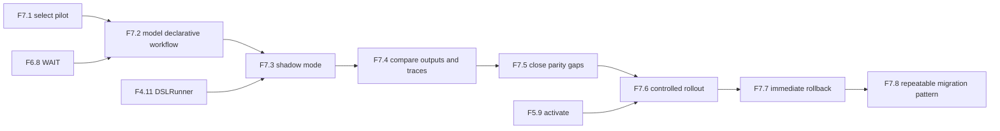

# AGENT_SPEC Phase 7 Analysis

**Status**: Active planning baseline
**Phase**: AGENT_SPEC - Fase 7 Migracion progresiva
**Naming source of truth**: `docs/agent-spec-overview.md`

---

## Objective

Cerrar la transicion desde agentes Go a workflows declarativos con una
migracion controlada, medible y reversible.

Fase 7 agrega:

- seleccion de un piloto de bajo riesgo
- modelado declarativo del flujo actual
- ejecucion en shadow mode
- comparacion de resultados y side effects
- correccion de brechas hasta paridad aceptable
- rollout segmentado
- rollback inmediato al flujo Go
- patron repetible para el siguiente agente o subflujo

---

## Scope

La fase cubre:

1. seleccion del piloto inicial
2. modelado del comportamiento actual como workflow declarativo
3. shadow mode entre runner Go y runner declarativo
4. comparacion funcional, operativa y de trazas
5. criterio de paridad aceptable
6. rollout controlado por segmento
7. rollback inmediato
8. patron reusable para siguientes migraciones

---

## Out of Scope

- migracion simultanea de todos los agentes
- reemplazo completo del stack Go en una sola entrega
- dispatch externo A2A
- UI avanzada de comparacion de shadow mode
- optimizacion de costos multi-modelo

---

## Dependency View



---

## Critical Path

1. `F7.1`
2. `F7.2`
3. `F7.3`
4. `F7.4`
5. `F7.5`
6. `F7.6`
7. `F7.7`
8. `F7.8`

---

## Main Risks

### 1. False parity

Riesgo:
- el workflow declarativo parece equivalente pero difiere en side effects o
  policy paths

Mitigacion:
- comparar resultados, tool calls, approvals y trazas, no solo status final

### 2. Pilot choice too risky

Riesgo:
- elegir un agente con demasiadas ramas o sensibilidad operacional

Mitigacion:
- seleccionar un piloto de bajo riesgo y alto valor observable

### 3. Rollout without safe rollback

Riesgo:
- activar declarativo sin posibilidad inmediata de volver al flujo Go

Mitigacion:
- rollback operativo explicito y segmentacion del rollout

### 4. Shadow mode with no usable evidence

Riesgo:
- ejecutar en paralelo sin una forma clara de medir diferencias

Mitigacion:
- contrato de comparacion y reporte minimo antes del shadow mode

---

## Suggested Gates

Gate corto:

```powershell
go test ./internal/domain/agent/...
go test ./internal/domain/workflow/...
```

Gate de transicion:

```powershell
go test ./internal/domain/agent/...
go test ./internal/domain/workflow/...
go test ./internal/domain/scheduler/...
go test ./internal/api/handlers/... ./internal/api/middleware/...
```

---

## Sources of Truth

Estas son las fuentes de verdad para definir las tareas de Fase 7, en este
orden:

1. `docs/agent-spec-overview.md`
- naming canonico
- mapeo de `UC-A4`, `UC-A7`, `UC-A8`

2. `docs/agent-spec-development-plan.md`
- listado oficial de `F7.1` a `F7.8`
- dependencias macro entre tareas

3. `docs/agent-spec-design.md`
- coexistencia Go + declarativo
- runner model
- workflow activation y rollback

4. `docs/agent-spec-use-cases.md`
- familias `execute_workflow*`
- approval y override
- versioning y rollback

5. `docs/agent-spec-traceability.md`
- regla canonica `UC -> behavior -> component -> task`

Regla:
- si hay conflicto, prevalece el set canonico definido en
  `docs/agent-spec-overview.md` y `docs/agent-spec-traceability.md`
