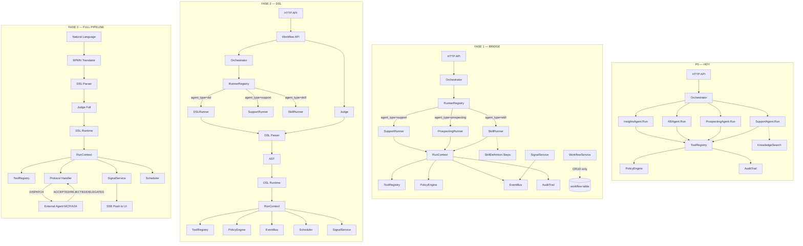
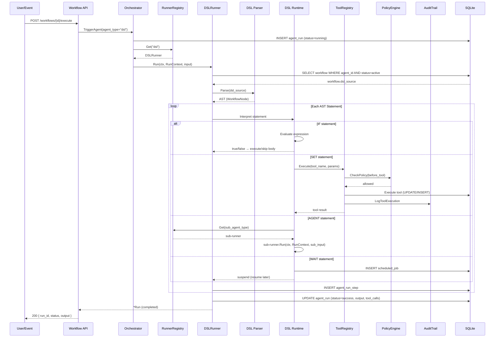
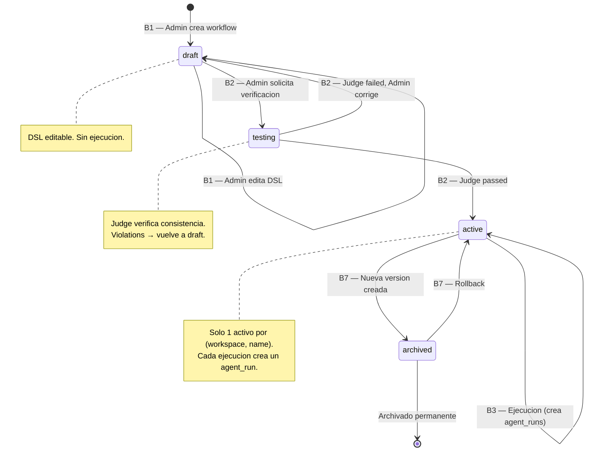
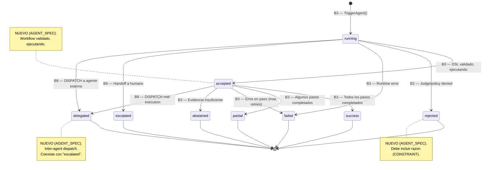
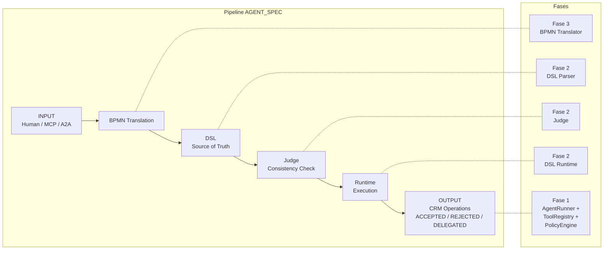

# Plan de Transicion: Arquitectura AGENT_SPEC

> **Fecha**: 2026-03-09
> **Status**: Aprobacion pendiente
> **Source**: `docs/AGENT_SPEC.md`
> **Pre-analisis**: `docs/agent-spec-integration-analysis.md`
> **Secuencia**: P0 completo → Fase 1 (bridge) → Fase 2 (DSL) → Fase 3 (full pipeline)

---

## Estado documental

Este documento queda como narrativa de transicion y referencia historica.

Fuentes canonicas actuales:
- `docs/agent-spec-overview.md`
- `docs/agent-spec-use-cases.md`
- `docs/agent-spec-design.md`
- `docs/agent-spec-integration-analysis.md`
- `docs/agent-spec-development-plan.md`

Regla:
- no introducir nuevas decisiones de naming aqui
- usar `docs/agent-spec-overview.md` como source of truth

---

## Parte 1: Especificacion (Casos de Uso)

### CONTEXT

Los equipos de ventas y soporte pierden oportunidades porque los workflows de negocio
estan codificados en logica Go que solo un desarrollador puede modificar. Cada nuevo
workflow requiere un ciclo completo de desarrollo, testing y deploy.

Este plan de transicion define como el sistema evoluciona para que los workflows
se describan declarativamente, se verifiquen automaticamente y se ejecuten sin
intervenir codigo. El CRM state deja de ser CRUD manual y emerge de la ejecucion.

### ACTORS

```
Admin           → define y gestiona workflows declarativos
Salesperson     → consume signals, aprueba/rechaza acciones de agentes
Support Agent   → resuelve casos usando workflows automatizados
Contact         → entidad externa cuyas interacciones generan signals
Workflow Engine → interpreta y ejecuta DSL workflows
Judge           → verifica consistencia entre spec y DSL antes de activacion
Agent           → ejecuta un workflow en nombre de un actor humano
Scheduler       → programa y dispara acciones diferidas (WAIT)
```

### BEHAVIORS

#### B1: Definicion de Workflow

```
BEHAVIOR define_workflow
  GIVEN   un Admin quiere automatizar un proceso de negocio
  WHEN    el Admin escribe un workflow en lenguaje DSL
  THEN    el sistema almacena el workflow como borrador versionado
  AND     el Admin puede editar el DSL hasta estar conforme
```

**Caso de uso funcional**: El admin escribe algo como:
```
WORKFLOW qualify_lead
  ON      lead.created
  IF      lead.source == "inbound"
    AGENT evaluate_intent(lead.interaction_history)
    IF    lead.intent_signal == "HIGH"
      SET lead.status = "qualified"
      NOTIFY salesperson WITH lead + reason
```
El sistema lo almacena como version 1, status=draft.

#### B2: Verificacion de Workflow

```
BEHAVIOR verify_workflow
  GIVEN   un workflow en estado borrador con spec y DSL
  WHEN    el Admin solicita verificacion
  THEN    el Judge valida consistencia entre spec y DSL
  AND     si hay violaciones, el Judge reporta cada una con detalle
  AND     si pasa, el workflow puede ser activado
```

**Caso de uso funcional**: Antes de activar, el Judge verifica:
- Cada BEHAVIOR del spec tiene un camino de ejecucion en el DSL
- Ningun BEHAVIOR contradice un CONSTRAINT
- Todos los actores referenciados existen
- Los signals y estados son alcanzables

#### B3: Ejecucion de Workflow

```
BEHAVIOR execute_workflow
  GIVEN   un workflow activo esta asociado a un tipo de agente
  WHEN    ocurre un evento que matchea la clausula ON del workflow
  THEN    el Workflow Engine parsea y ejecuta el DSL
  AND     cada accion (SET, NOTIFY, AGENT) se ejecuta via herramientas registradas
  AND     se crea un registro de ejecucion completo (agent_run)
  AND     el resultado es trazable de principio a fin
```

**Caso de uso funcional**: Un caso de soporte se crea → el evento `case.created` dispara el workflow `resolve_support_case` → el engine busca evidence, evalua condiciones, ejecuta tools, registra cada paso.

#### B4: Deteccion de Signals

```
BEHAVIOR detect_signal
  GIVEN   una entidad CRM (contact, lead, deal, case) tiene interacciones registradas
  WHEN    un workflow o agente evalua esas interacciones
  THEN    se crea un signal con tipo, confianza y evidencia
  AND     el signal es visible para el Salesperson responsable
  AND     la razon del signal se muestra junto a el
```

**Caso de uso funcional**: El agente de prospecting analiza las interacciones de un lead, detecta alta intencion, crea un signal `intent_high` con confianza 0.92. El salesperson ve el signal en su vista de leads con la explicacion.

#### B5: Accion Diferida

```
BEHAVIOR defer_action
  GIVEN   un workflow en ejecucion encuentra una clausula WAIT
  WHEN    se alcanza la duracion especificada (horas, dias)
  THEN    el workflow retoma ejecucion desde el paso siguiente al WAIT
  AND     el estado del workflow se preserva entre la pausa y el resume
```

**Caso de uso funcional**: Un workflow notifica al salesperson y espera 48 horas. Si no actua, envia un reminder automatico.

#### B6: Override Humano

```
BEHAVIOR human_override
  GIVEN   un agente ha propuesto una accion basada en un workflow
  WHEN    el Salesperson o Admin rechaza o modifica la accion
  THEN    la accion original se cancela o se reemplaza
  AND     el override se registra como feedback
  AND     el registro de ejecucion refleja el override
```

**Caso de uso funcional**: El agente propone cerrar un caso como resuelto, pero el support agent humano rechaza porque falta informacion. El override queda registrado en el agent_run.

#### B7: Versionado y Rollback

```
BEHAVIOR version_workflow
  GIVEN   un workflow activo necesita cambios
  WHEN    el Admin crea una nueva version del workflow
  THEN    la version anterior se archiva automaticamente
  AND     la nueva version entra como borrador
  AND     debe pasar verificacion antes de activarse
  AND     el Admin puede hacer rollback a la version anterior en un paso
```

#### B8: Delegacion entre Agentes

```
BEHAVIOR delegate_workflow
  GIVEN   un workflow en ejecucion determina que necesita un agente externo
  WHEN    el Runtime encuentra una clausula DISPATCH
  THEN    el DSL se envia al agente receptor
  AND     el receptor responde con ACCEPTED, REJECTED o DELEGATED
  AND     una respuesta REJECTED incluye la razon de divergencia
  AND     el workflow original registra la delegacion y su resultado
```

### CONSTRAINTS

```
CONSTRAINTS
  Un workflow no puede ejecutarse sin haber pasado verificacion del Judge
  Un workflow no puede mutar datos directamente — toda mutacion va via herramientas registradas
  Un agente no puede ejecutar una herramienta sin permisos validos
  Una accion sensible no puede ejecutarse sin aprobacion humana previa
  Un signal no puede crearse sin evidencia que lo respalde
  Un override humano no puede ser descartado silenciosamente
  Un workflow archivado no puede recibir nuevas ejecuciones
  Un REJECTED debe siempre incluir la razon — nunca puede ser silencioso
  Los agentes Go existentes deben seguir funcionando sin modificacion durante toda la transicion
```

---

## Parte 2: Diseño

### Principios de diseño

1. **Spec-driven**: Los behaviors definen que construir. No hay feature sin behavior.
2. **Incremental y estable**: No reescribir — extender. Cada fase es autonoma y funcional.
3. **Forward-compatible**: Las abstracciones de Fase 1 contemplan Fase 2/3 sin implementarlas.
4. **P0 intacto**: Constraint explicito. Los agentes Go existentes son fallback permanente.

### Diagrama: Evolucion Arquitectonica



### Mapping: Behavior → Componente de Diseño → Fase

| Behavior | Componente de Diseño | Fase | Reutiliza |
|---|---|---|---|
| B1: Definicion de Workflow | Workflow entity (DB + CRUD) | 1 | — |
| B2: Verificacion de Workflow | Judge (spec parser + DSL checks) | 2 | `domain/eval/` framework |
| B3: Ejecucion de Workflow | DSL Parser + Runtime + DSLRunner | 2 | `ToolRegistry`, `PolicyEngine`, `EventBus`, `AuditTrail` |
| B4: Deteccion de Signals | Signal entity + EventBus integration | 1 | `EventBus`, `domain/knowledge/evidence` |
| B5: Accion Diferida | Scheduler service + DB-backed state | 2 | — |
| B6: Override Humano | Approval flow extendido | 1 | `domain/policy/approval.go` (existente) |
| B7: Versionado y Rollback | Workflow versioning + lifecycle | 1+2 | — |
| B8: Delegacion entre Agentes | Protocol Handler (MCP/A2A) | 3 | Protocol response statuses (Fase 1) |

### Decision de interoperabilidad

- `DISPATCH` externo debe alinearse con A2A desde diseno.
- MCP debe ser el estandar objetivo para exposicion y consumo de tools/contexto.
- HTTP no debe definirse como protocolo propietario; solo como transporte del estandar cuando aplique.

### Diagrama: Flujo de Ejecucion DSL (B3)



### Diagrama: Maquina de Estados — Workflow Lifecycle (B1, B2, B7)



### Diagrama: Maquina de Estados — Agent Run (B3, B6, B8)



### Diagrama: Pipeline AGENT_SPEC → Fases de Implementacion



### Componentes de diseño (resumen)

| Componente | Responsabilidad | Package | Fase |
|---|---|---|---|
| **AgentRunner** | Contrato de ejecucion para cualquier tipo de agente | `domain/agent/` | 1 |
| **RunnerRegistry** | Mapea agent_type → runner implementation | `domain/agent/` | 1 |
| **RunContext** | Dependencias runtime compartidas entre todos los runners | `domain/agent/` | 1 |
| **SkillRunner** | Ejecuta skills JSON (proto-DSL) | `domain/agent/` | 1 |
| **Workflow** | Entidad: DSL source + spec + version + lifecycle | `domain/workflow/` | 1 |
| **Signal** | Entidad: tipo + confianza + evidencia + entity | `domain/signal/` | 1 |
| **DSL Parser** | Tokeniza y parsea DSL → AST | `domain/dsl/` | 2 |
| **DSL Runtime** | Interpreta AST y ejecuta via services existentes | `domain/dsl/` | 2 |
| **DSLRunner** | AgentRunner para agent_type="dsl" | `domain/dsl/` | 2 |
| **Judge** | Verifica consistencia spec ↔ DSL | `domain/dsl/` | 2 |
| **Scheduler** | Programa y ejecuta acciones diferidas | `infra/scheduler/` | 2 |
| **BPMN Translator** | NL → DSL via LLM | `domain/dsl/` | 3 |
| **Protocol Handler** | DISPATCH inter-agente (MCP/A2A) | `domain/dsl/` | 3 |

### Verb-to-Tool Mapping

| DSL Verb | Servicio Existente | Gap |
|---|---|---|
| `ON <event>` | `eventbus.Subscribe(topic)` | Estandarizar event names |
| `IF <condition>` | N/A | Expression evaluator |
| `SET entity.field = value` | `update_case`, `create_task` tools | Field→tool mapping table |
| `AGENT <fn>(<args>)` | `AgentRunner.Run()` via registry | Sub-agent invocation |
| `NOTIFY actor WITH data` | `send_reply` tool | Generalizar a notification service |
| `SURFACE entity TO view` | N/A | Signal + timeline + SSE push |
| `WAIT <duration>` | N/A | Scheduler service |
| `DISPATCH TO agent WITH wf` | N/A | Protocol handler |

---

## Parte 3: Implementacion

### Pre-requisito: Completar P0

Antes de cualquier trabajo AGENT_SPEC:
- Insights agent (`internal/domain/agent/agents/insights.go`)
- Mobile app (React Native screens)
- Docker Compose stack
- Documentacion actualizada

**Criterio de entrada a Fase 1**: `make test` verde, exit criteria de Phase 4 cumplidos.

### Inventario de componentes reutilizables

| Componente | Ubicacion | Relacion con AGENT_SPEC |
|---|---|---|
| Orchestrator | `internal/domain/agent/orchestrator.go` | Sustrato del Runtime. `TriggerAgent()` → `AgentRunner.Run()` |
| RunStep state machine | `internal/domain/agent/runtime_steps.go` | 4 step types: retrieve, reason, tool_call, finalize |
| ToolRegistry + pipeline | `internal/domain/tool/registry.go`, `execution_pipeline.go` | DSL verbs → tool calls. `ToolExecutor` interface intacta |
| Built-in tools (8) | `internal/domain/tool/builtin.go`, `builtin_executors.go` | create_task, update_case, send_reply, get_lead, get_account, etc. |
| Policy engine (4 points) | `internal/domain/policy/evaluator.go` | CONSTRAINTS → policy rules |
| Approval flow | `internal/domain/policy/approval.go` | B6 override/approval — sin cambios |
| EventBus (in-memory) | `internal/infra/eventbus/eventbus.go` | DSL `ON` → `bus.Subscribe(topic)` |
| Eval service | `internal/domain/eval/suite.go`, `runner.go` | Judge reutiliza framework |
| Audit trail (inmutable) | `internal/domain/audit/` | Runtime emite audit events |
| Handoff | `internal/domain/agent/handoff.go` | B6 escalation = DELEGATED |
| Agentes Go (4) | `internal/domain/agent/agents/*.go` | Fallback permanente (CONSTRAINT) |
| SkillDefinition | `internal/domain/agent/orchestrator.go:89-99` | `Steps json.RawMessage` — proto-DSL |
| Prompt versioning | `internal/domain/agent/prompt.go` | Sin cambios |

### Fase 1: Bridge Layer — ~3 semanas

**Behaviors cubiertos**: B1 (parcial: CRUD workflow), B4 (signals), B6 (override via approval existente), B7 (parcial: versionado)

#### 1.1 AgentRunner interface (contrato central)

**Habilita**: B3 futuro — cualquier tipo de agente ejecutable via un contrato unico.

**Archivo nuevo**: `internal/domain/agent/runner.go`

```go
type RunContext struct {
    Orchestrator *Orchestrator
    ToolRegistry *tool.ToolRegistry
    PolicyEngine *policy.Evaluator
    EventBus     eventbus.EventBus
    AuditLogger  audit.Service
    DB           *sql.DB
}

type AgentRunner interface {
    Run(ctx context.Context, rc *RunContext, input TriggerAgentInput) (*Run, error)
}

type RunnerRegistry struct {
    runners map[string]AgentRunner
}
```

**Archivos a modificar**: `orchestrator.go`, `agents/support.go`, `agents/prospecting.go`, `agents/kb.go`, `agents/insights.go`

#### 1.2 Workflow entity (B1, B7)

**Migracion**: `02X_workflows.up.sql`

```sql
CREATE TABLE workflow (
    id                  TEXT PRIMARY KEY,
    workspace_id        TEXT NOT NULL REFERENCES workspace(id),
    name                TEXT NOT NULL,
    description         TEXT,
    dsl_source          TEXT NOT NULL,
    spec_source         TEXT,
    version             INTEGER NOT NULL DEFAULT 1,
    status              TEXT NOT NULL DEFAULT 'draft',
    parent_version_id   TEXT REFERENCES workflow(id),
    agent_definition_id TEXT REFERENCES agent_definition(id),
    created_by          TEXT REFERENCES user_account(id),
    created_at          DATETIME NOT NULL DEFAULT CURRENT_TIMESTAMP,
    updated_at          DATETIME NOT NULL DEFAULT CURRENT_TIMESTAMP,
    UNIQUE(workspace_id, name, version)
);
```

**Service**: `internal/domain/workflow/service.go` — Create, Get, List, GetActiveByAgent, Activate, Archive, NewVersion.

#### 1.3 SkillRunner (B3 parcial — proto-DSL)

**Archivo nuevo**: `internal/domain/agent/skill.go`

```go
type SkillStep struct {
    Type      string          `json:"type"`
    ToolName  string          `json:"tool_name,omitempty"`
    Params    json.RawMessage `json:"params,omitempty"`
    Condition *SkillCondition `json:"condition,omitempty"`
    OnTrue    []SkillStep     `json:"on_true,omitempty"`
    OnFalse   []SkillStep     `json:"on_false,omitempty"`
}
```

Implementa AgentRunner. Ejecuta SkillStep[] via ToolRegistry.

#### 1.4 Signal entity (B4)

**Migracion**: `02Y_signals.up.sql`

```sql
CREATE TABLE signal (
    id              TEXT PRIMARY KEY,
    workspace_id    TEXT NOT NULL REFERENCES workspace(id),
    entity_type     TEXT NOT NULL,
    entity_id       TEXT NOT NULL,
    signal_type     TEXT NOT NULL,
    confidence      REAL NOT NULL,
    evidence_ids    TEXT,
    source_type     TEXT NOT NULL,
    source_id       TEXT,
    metadata        TEXT,
    status          TEXT NOT NULL DEFAULT 'active',
    created_at      DATETIME NOT NULL DEFAULT CURRENT_TIMESTAMP,
    expires_at      DATETIME
);
```

**Service**: `internal/domain/signal/service.go` — Create + EventBus publish, List, Dismiss, GetByEntity.

#### 1.5 Protocol responses (B8 parcial)

Agregar en `orchestrator.go`: `StatusAccepted`, `StatusRejected`, `StatusDelegated`. Extender state machine.

### Fase 2: DSL Foundation — ~4 semanas

**Behaviors cubiertos**: B2 (verificacion), B3 (ejecucion completa), B5 (acciones diferidas), B7 (activation via Judge)

#### 2.1 DSL Parser — Go nativo, recursive descent

**Package**: `internal/domain/dsl/`

**Gramatica** (pseudo-BNF):
```
workflow     = "WORKFLOW" IDENT NEWLINE body
body         = statement*
statement    = on_stmt | if_stmt | set_stmt | agent_stmt | notify_stmt
             | surface_stmt | wait_stmt | dispatch_stmt
on_stmt      = "ON" dotted_ident NEWLINE
if_stmt      = "IF" expression NEWLINE body
set_stmt     = "SET" dotted_ident "=" expression NEWLINE
agent_stmt   = "AGENT" IDENT "(" arg_list ")" NEWLINE
notify_stmt  = "NOTIFY" IDENT "WITH" expression NEWLINE
surface_stmt = "SURFACE" IDENT "TO" dotted_ident "WITH" IDENT NEWLINE
wait_stmt    = "WAIT" duration NEWLINE
dispatch_stmt= "DISPATCH" "TO" IDENT "WITH" IDENT NEWLINE
expression   = term (operator term)*
```

**Archivos**: `token.go`, `lexer.go`, `ast.go`, `parser.go`

#### 2.2 DSL Runtime (B3)

**Archivos**: `runtime.go`, `expression.go`, `verb_mapping.go`

Interpreta AST y ejecuta via RunContext (ToolRegistry, PolicyEngine, EventBus, AuditTrail).

#### 2.3 DSLRunner (B3)

**Archivo**: `dsl_runner.go` — implementa AgentRunner para `agent_type="dsl"`.

#### 2.4 Judge (B2)

**Archivo**: `judge.go` — 5 checks de consistencia spec ↔ DSL. Reutiliza `domain/eval/`.

#### 2.5 Scheduler (B5)

**Archivo**: `internal/infra/scheduler/scheduler.go` — DB-backed, polling cada 10s.

#### 2.6 Workflow API (B1, B2, B3, B7)

**Archivo**: `internal/api/handlers/workflow.go`

| Endpoint | Behavior |
|---|---|
| `POST /api/v1/workflows` | B1 — crear workflow |
| `POST /api/v1/workflows/{id}/verify` | B2 — Judge dry-run |
| `PUT /api/v1/workflows/{id}/activate` | B2+B7 — verify + activate |
| `POST /api/v1/workflows/{id}/execute` | B3 — trigger manual |
| `POST /api/v1/workflows/{id}/new-version` | B7 — nueva version |

### Fase 3: Full Pipeline — ~6 semanas

**Behaviors cubiertos**: B8 (delegacion completa), B1 (desde NL), B4 (SURFACE + SSE), B3 (migracion agentes)

| Sub-tarea | Behavior | Descripcion |
|---|---|---|
| 3.1 BPMN Translator | B1 | NL → DSL via LLM + parser + Judge |
| 3.2 Spec Parser completo | B2 | Parser formal para Judge checks 6-8 |
| 3.3 Protocol Handler | B8 | DISPATCH funcional A2A-first; MCP para tools/contexto |
| 3.4 SURFACE completo | B4 | Signal → SSE push a UI |
| 3.5 Agent migration | B3 | 4 agentes Go reescritos como DSL workflows |
| 3.6 Workflow Studio | B7 | Diff, eval-gated promotion, rollback |

### Estructura de Packages (post Fase 2)

```
internal/
├── domain/
│   ├── agent/
│   │   ├── orchestrator.go          ← TriggerAgent() → RunnerRegistry
│   │   ├── runner.go                ← NEW: AgentRunner + RunContext + RunnerRegistry
│   │   ├── skill.go                 ← NEW: SkillStep + SkillRunner
│   │   ├── runtime_steps.go         ← sin cambios
│   │   ├── handoff.go               ← sin cambios
│   │   └── agents/                  ← adaptar a AgentRunner interface
│   ├── dsl/                         ← NEW (Fase 2)
│   │   ├── token.go, lexer.go, ast.go, parser.go
│   │   ├── runtime.go, expression.go, verb_mapping.go
│   │   ├── judge.go
│   │   └── dsl_runner.go
│   ├── workflow/                    ← NEW (Fase 1)
│   │   └── service.go
│   ├── signal/                      ← NEW (Fase 1)
│   │   └── service.go
│   ├── tool/                        ← sin cambios
│   ├── policy/                      ← sin cambios
│   ├── eval/                        ← sin cambios
│   └── audit/                       ← sin cambios
├── infra/
│   ├── eventbus/                    ← sin cambios
│   ├── scheduler/                   ← NEW (Fase 2)
│   └── sqlite/migrations/
│       ├── 02X_workflows.up.sql     ← NEW (Fase 1)
│       ├── 02Y_signals.up.sql       ← NEW (Fase 1)
│       └── 02Z_scheduler.up.sql     ← NEW (Fase 2)
└── api/handlers/
    └── workflow.go                  ← NEW (Fase 2)
```

---

## Riesgos y Mitigaciones

| Riesgo | Probabilidad | Mitigacion |
|---|---|---|
| P0 no se termina y bloquea todo | Media | Criterio de entrada estricto |
| AgentRunner mal diseñada | Baja | RunContext por metodo, forward-compatible |
| DSL grammar requiere iteraciones | Media | SkillStep JSON (1.3) como fallback |
| Expression evaluator scope creep | Alta | Solo 6 operadores + AND/OR + IN |
| WAIT requiere state persistence | Baja | DB-backed scheduler desde el inicio |
| BPMN depende de LLM quality | Media | Output pasa por parser + Judge |
| Dos paradigmas confusos | Baja | Feature flag + docs claros |

---

## Verificacion (por fase)

### Fase 1
- `make test` verde, 0 regresiones
- B1: Workflow CRUD + version chain + activate/archive
- B4: Signal create → EventBus publica `signal.created`
- RunnerRegistry delega correctamente a cada agent_type
- SkillRunner ejecuta 2 tool_call steps en orden

### Fase 2
- B2: Judge detecta BEHAVIOR contradicting CONSTRAINT → violation
- B3: DSL `IF condition SET field = value` → tool call via ToolRegistry
- B5: WAIT 1s → scheduler resume → siguiente paso ejecutado
- E2E: workflow DSL → verify → activate → trigger → agent_run con tool calls

### Fase 3
- B1+NL: "qualify a lead" → DSL output parseable
- B8: DISPATCH → mock agent responde ACCEPTED → workflow continua
- B3: Support Agent DSL = mismos resultados que Go agent
