# Architecture & Design Document — MVP (P0) — Agentic CRM OS (FenixCRM)

> **Version**: 1.0
> **Status**: Approved
> **Last updated**: 2026-02-09
> **Source of truth**: `agentic_crm_requirements_agent_ready.md`

---

## Table of Contents

1. [Technology Stack](#1--technology-stack)
2. [Entity-Relationship Diagram (ERD)](#2--entity-relationship-diagram-erd)
3. [System Architecture Diagram](#3--system-architecture-diagram)
4. [Interaction Diagrams](#4--interaction-diagrams)
5. [Policy Engine: 4 Enforcement Points](#5--policy-engine-4-enforcement-points)
6. [Module Decomposition](#6--module-decomposition)
7. [REST API Design](#7--rest-api-design)
8. [LLM Adapter Design](#8--llm-adapter-design)
9. [Build Order](#9--build-order)
10. [Deployment Architecture](#10--deployment-architecture)
11. [Project Directory Structure](#appendix-project-directory-structure)
12. [Verification Checklist](#verification)

---

## 1 — Technology Stack

| Layer | Technology | Justification |
|-------|-----------|---------------|
| **Backend** | Go 1.22+ / go-chi (REST) | Excellent concurrency for LLM streaming. Single binary simplifies self-hosting. |
| **ORM/Queries** | sqlc + modernc.org/sqlite (pure Go) | Type-safe generated code. No CGO dependency, cross-compilation works. |
| **BFF (Gateway)** | Express.js 5 + TypeScript | Thin proxy between mobile and Go API. Request aggregation, auth relay, SSE proxy. No business logic. |
| **Mobile App** | React Native + Expo (managed workflow) + React Native Paper | Android-first, iOS later. Material Design 3 via RN Paper. Expo simplifies builds/OTA updates. |
| **Mobile Navigation** | React Navigation 7 (Stack + Drawer) | Standard navigation library for React Native. Deep linking support. |
| **Mobile State** | TanStack Query (React Query) + Zustand | Server state cache + client-only state. Same pattern as original plan, adapted for RN. |
| **Mobile SSE** | react-native-sse or EventSource polyfill | SSE streaming for Copilot chat. Proxied through BFF. |
| **Database** | SQLite 3 (embedded, WAL mode) | Zero infrastructure. Single file. Perfect for single-node self-hosted MVP. |
| **Vector Search** | sqlite-vec extension | Native SQLite vector similarity. Same DB file. |
| **Full-Text Search** | SQLite FTS5 | Built-in BM25 ranking. No external dependency. |
| **Event Bus** | In-process Go channels | MVP: in-process pub/sub. NATS JetStream for future multi-process. |
| **Job Queue** | Goroutine pool + SQLite-backed persistence | Jobs in SQLite table. Retries + backoff + DLQ built in. |
| **Cache** | In-process LRU (ristretto) | No Redis for MVP. Sessions, rate limits, idempotency keys in-memory. |
| **Auth** | Built-in JWT (MVP) + OIDC hook (future) | Keycloak optional. MVP starts with bcrypt + JWT. BFF relays tokens. |
| **LLM** | Custom Go interface (OpenAI-compatible) | Ollama/vLLM (local) + OpenAI/Anthropic (cloud). |
| **Streaming** | Server-Sent Events (SSE) | Unidirectional LLM streaming. Go → BFF proxy → Mobile client. |
| **Observability** | Structured JSON logs + OpenTelemetry (optional) + Sentry (mobile) | Logs to stdout. OTel + Grafana as optional upgrade. Sentry for mobile crash reporting. |
| **Deployment** | Go single binary + SQLite file + BFF Node process | `./fenixcrm serve` + `node bff/dist/index.js`. Docker Compose for convenience. |

---

## 2 — Entity-Relationship Diagram (ERD)

```mermaid
erDiagram
    %% ===== TENANT & AUTH =====
    workspace {
        text id PK "UUID v7"
        text name
        text slug "UNIQUE"
        text settings "JSON"
        text created_at
        text updated_at
    }

    user_account {
        text id PK "UUID v7"
        text workspace_id FK
        text external_idp_id "UNIQUE, nullable"
        text email "UNIQUE"
        text password_hash "nullable, for built-in auth"
        text display_name
        text avatar_url
        text status "active|suspended|deactivated"
        text preferences "JSON"
        text created_at
        text updated_at
    }

    role {
        text id PK "UUID v7"
        text workspace_id FK
        text name "UNIQUE per workspace"
        text description
        text permissions "JSON: object/field/action grants"
        text created_at
        text updated_at
    }

    user_role {
        text id PK "UUID v7"
        text user_id FK
        text role_id FK
        text created_at
    }

    policy_set {
        text id PK "UUID v7"
        text workspace_id FK
        text name
        integer version
        text status "draft|active|archived"
        text rules "JSON: ABAC rules array"
        text pii_rules "JSON: PII/no-cloud rules"
        text approval_rules "JSON: approval triggers"
        text created_at
        text updated_at
    }

    %% ===== CRM CORE =====
    account {
        text id PK "UUID v7"
        text workspace_id FK
        text name
        text domain
        text industry
        text size_segment "smb|mid|enterprise"
        text owner_id FK
        text address "JSON"
        text metadata "JSON"
        text created_at
        text updated_at
        text deleted_at "nullable, soft delete"
    }

    contact {
        text id PK "UUID v7"
        text workspace_id FK
        text account_id FK
        text first_name
        text last_name
        text email
        text phone
        text title
        text status "active|inactive|churned"
        text owner_id FK
        text metadata "JSON"
        text created_at
        text updated_at
        text deleted_at
    }

    lead {
        text id PK "UUID v7"
        text workspace_id FK
        text contact_id FK "nullable"
        text account_id FK "nullable"
        text source
        text status "new|contacted|qualified|converted|lost"
        text owner_id FK
        real score
        text metadata "JSON"
        text created_at
        text updated_at
        text deleted_at
    }

    pipeline {
        text id PK "UUID v7"
        text workspace_id FK
        text name
        text entity_type "deal|case"
        text settings "JSON"
        text created_at
        text updated_at
    }

    pipeline_stage {
        text id PK "UUID v7"
        text pipeline_id FK
        text name
        integer position
        real probability "nullable, for deals"
        integer sla_hours "nullable"
        text required_fields "JSON"
        text created_at
        text updated_at
    }

    deal {
        text id PK "UUID v7"
        text workspace_id FK
        text account_id FK
        text contact_id FK "nullable"
        text pipeline_id FK
        text stage_id FK
        text owner_id FK
        text title
        real amount
        text currency
        text expected_close "date"
        text status "open|won|lost"
        text metadata "JSON"
        text created_at
        text updated_at
        text deleted_at
    }

    case_ticket {
        text id PK "UUID v7"
        text workspace_id FK
        text account_id FK "nullable"
        text contact_id FK "nullable"
        text pipeline_id FK "nullable"
        text stage_id FK "nullable"
        text owner_id FK
        text subject
        text description
        text priority "low|medium|high|critical"
        text status "open|in_progress|waiting|resolved|closed"
        text channel "email|chat|phone|web"
        text sla_config "JSON"
        text sla_deadline "nullable"
        text metadata "JSON"
        text created_at
        text updated_at
        text deleted_at
    }

    activity {
        text id PK "UUID v7"
        text workspace_id FK
        text activity_type "task|event|call|email"
        text entity_type "account|contact|deal|case"
        text entity_id FK "polymorphic"
        text owner_id FK
        text assigned_to FK "nullable"
        text subject
        text body
        text status "pending|completed|cancelled"
        text due_at "nullable"
        text completed_at "nullable"
        text metadata "JSON"
        text created_at
        text updated_at
    }

    note {
        text id PK "UUID v7"
        text workspace_id FK
        text entity_type "account|contact|deal|case"
        text entity_id FK "polymorphic"
        text author_id FK
        text content
        integer is_internal "0|1"
        text metadata "JSON"
        text created_at
        text updated_at
    }

    attachment {
        text id PK "UUID v7"
        text workspace_id FK
        text entity_type
        text entity_id FK "polymorphic"
        text uploader_id FK
        text filename
        text content_type
        integer size_bytes
        text storage_path
        text sensitivity "public|internal|confidential|pii"
        text metadata "JSON"
        text created_at
    }

    timeline_event {
        text id PK "UUID v7"
        text workspace_id FK
        text entity_type
        text entity_id FK "polymorphic"
        text actor_id FK "nullable"
        text event_type "created|updated|stage_changed|note_added|agent_action"
        text old_value "JSON"
        text new_value "JSON"
        text context "JSON: agent_run_id, tool_call_id, etc"
        text created_at
    }

    %% ===== KNOWLEDGE & RETRIEVAL =====
    knowledge_item {
        text id PK "UUID v7"
        text workspace_id FK
        text source_type "email|doc|call_transcript|chat|kb_article|crm_record"
        text source_id "external system ID"
        text title
        text raw_content
        text normalized_content
        text source_metadata "JSON"
        text sensitivity "public|internal|confidential|pii"
        text entity_type "nullable, linked CRM entity type"
        text entity_id FK "nullable, linked CRM entity"
        text owner_id FK
        text source_timestamp
        text ttl_expires_at "nullable"
        text indexed_at
        text created_at
        text updated_at
    }

    embedding_document {
        text id PK "UUID v7"
        text workspace_id FK
        text knowledge_item_id FK
        integer chunk_index
        text chunk_text
        blob embedding "sqlite-vec BLOB"
        integer token_count
        text chunk_metadata "JSON"
        text created_at
    }

    evidence {
        text id PK "UUID v7"
        text workspace_id FK
        text agent_run_id FK "nullable"
        text copilot_session_id FK "nullable"
        text knowledge_item_id FK
        text embedding_document_id FK "nullable"
        text snippet
        real relevance_score
        real bm25_score "nullable"
        real vector_score "nullable"
        text retrieval_method "bm25|vector|hybrid"
        text permissions_snapshot "JSON"
        integer pii_redacted "0|1"
        text evidence_timestamp
        text created_at
    }

    %% ===== AGENT & TOOLS =====
    agent_definition {
        text id PK "UUID v7"
        text workspace_id FK
        text name "UNIQUE per workspace"
        text description
        text agent_type "support|prospecting|kb|insights|custom"
        text objective "JSON"
        text allowed_tools "JSON: array of tool_definition IDs"
        text limits "JSON: max_tokens_day, max_cost_day, max_runs_day"
        text trigger_config "JSON: event|schedule|manual"
        text policy_set_id FK
        text active_prompt_version_id FK "nullable"
        text status "active|paused|deprecated"
        text created_at
        text updated_at
    }

    skill_definition {
        text id PK "UUID v7"
        text workspace_id FK
        text name
        text description
        text steps "JSON: ordered array of tool calls + conditions"
        text agent_definition_id FK "nullable"
        text status "draft|active|deprecated"
        text created_at
        text updated_at
    }

    tool_definition {
        text id PK "UUID v7"
        text workspace_id FK
        text name "UNIQUE per workspace"
        text description
        text input_schema "JSON Schema"
        text output_schema "JSON Schema"
        text required_permissions "JSON: roles/attributes needed"
        integer requires_approval "0|1"
        text approval_config "JSON: approver roles, timeout"
        integer rate_limit_per_minute
        integer idempotent "0|1"
        text status "active|deprecated"
        text created_at
        text updated_at
    }

    agent_run {
        text id PK "UUID v7"
        text workspace_id FK
        text agent_definition_id FK
        text triggered_by_user_id FK "nullable"
        text trigger_type "event|schedule|manual|copilot"
        text trigger_context "JSON: event payload, entity ref"
        text status "running|success|partial|abstained|failed|escalated"
        text inputs "JSON"
        text retrieval_queries "JSON"
        text retrieved_evidence_ids "JSON"
        text reasoning_trace "JSON"
        text tool_calls "JSON: array of tool call records"
        text output "JSON"
        text abstention_reason "nullable"
        integer total_tokens
        real total_cost
        integer latency_ms
        text trace_id
        text started_at
        text completed_at
        text created_at
    }

    approval_request {
        text id PK "UUID v7"
        text workspace_id FK
        text agent_run_id FK "nullable"
        text requested_by FK
        text tool_definition_id FK
        text proposed_action "JSON: tool name + params"
        text evidence_ids "JSON"
        text status "pending|approved|denied|expired"
        text decided_by FK "nullable"
        text decision_reason "nullable"
        text decided_at "nullable"
        text expires_at
        text created_at
    }

    %% ===== AUDIT =====
    audit_event {
        text id PK "UUID v7"
        text workspace_id FK
        text actor_id FK
        text actor_type "user|agent|system"
        text action "create|update|delete|retrieve|tool_call|approval|login"
        text entity_type
        text entity_id FK "nullable"
        text details "JSON: old/new values, params, results"
        text permissions_checked "JSON"
        text outcome "success|denied|error"
        text trace_id
        text ip_address "nullable"
        text created_at
    }

    %% ===== PROMPT VERSIONING & EVAL =====
    prompt_version {
        text id PK "UUID v7"
        text workspace_id FK
        text agent_definition_id FK
        integer version_number
        text system_prompt
        text user_prompt_template
        text config "JSON: temperature, max_tokens, etc"
        text status "draft|testing|active|archived"
        text created_by FK
        text created_at
    }

    policy_version {
        text id PK "UUID v7"
        text workspace_id FK
        text policy_set_id FK
        integer version_number
        text rules "JSON"
        text status "draft|testing|active|archived"
        text created_by FK
        text created_at
    }

    eval_suite {
        text id PK "UUID v7"
        text workspace_id FK
        text name
        text domain "support|sales|general"
        text test_cases "JSON: array of input/expected pairs"
        text thresholds "JSON: groundedness, exactitude, abstention, policy"
        text created_at
        text updated_at
    }

    eval_run {
        text id PK "UUID v7"
        text workspace_id FK
        text eval_suite_id FK
        text prompt_version_id FK "nullable"
        text policy_version_id FK "nullable"
        text status "running|passed|failed"
        text scores "JSON: groundedness, exactitude, abstention, policy_adherence"
        text details "JSON: per-test-case results"
        text triggered_by FK
        text started_at
        text completed_at
        text created_at
    }

    %% ===== ALL RELATIONSHIPS =====
    workspace ||--o{ user_account : "has users"
    workspace ||--o{ role : "defines roles"
    workspace ||--o{ policy_set : "configures policies"
    workspace ||--o{ account : "contains accounts"
    workspace ||--o{ pipeline : "configures pipelines"
    workspace ||--o{ agent_definition : "registers agents"
    workspace ||--o{ tool_definition : "registers tools"
    workspace ||--o{ eval_suite : "contains eval suites"
    workspace ||--o{ knowledge_item : "stores knowledge"

    user_account ||--o{ user_role : "has roles"
    role ||--o{ user_role : "assigned to users"

    account ||--o{ contact : "has contacts"
    account ||--o{ deal : "has deals"
    account ||--o{ case_ticket : "has cases"
    account ||--o{ lead : "has leads"
    contact ||--o{ deal : "primary contact of"
    contact ||--o{ case_ticket : "reported by"
    contact ||--o{ lead : "converts from"

    pipeline ||--o{ pipeline_stage : "has stages"
    pipeline_stage ||--o{ deal : "current stage of"
    pipeline_stage ||--o{ case_ticket : "current stage of"

    user_account ||--o{ account : "owns"
    user_account ||--o{ deal : "owns"
    user_account ||--o{ case_ticket : "owns"
    user_account ||--o{ activity : "owns"
    user_account ||--o{ note : "authors"
    user_account ||--o{ knowledge_item : "owns"

    knowledge_item ||--o{ embedding_document : "chunked into"
    knowledge_item ||--o{ evidence : "referenced by"
    embedding_document ||--o{ evidence : "matched by"

    agent_definition ||--o{ agent_run : "executed as"
    agent_definition ||--o{ skill_definition : "uses skills"
    agent_definition ||--o{ prompt_version : "versioned prompts"
    policy_set ||--o{ agent_definition : "governs"
    policy_set ||--o{ policy_version : "versioned as"

    agent_run ||--o{ approval_request : "may trigger"
    agent_run ||--o{ evidence : "retrieves"
    tool_definition ||--o{ approval_request : "may require"

    eval_suite ||--o{ eval_run : "evaluated by"
    prompt_version ||--o{ eval_run : "tested in"
```

---

## 3 — System Architecture Diagram

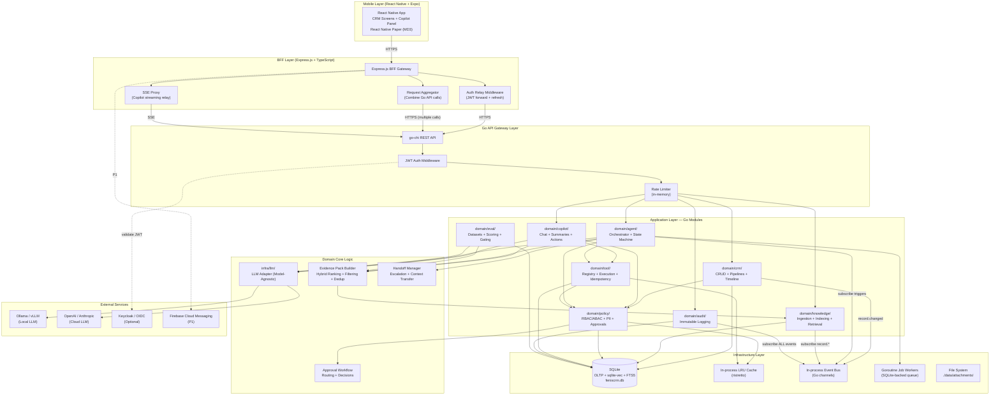

### 3.1 — BFF (Backend-for-Frontend) Responsibilities

The Express.js BFF is a **thin, stateless proxy** between mobile clients and the Go backend. It contains **zero business logic** and **never accesses SQLite directly**.

#### BFF Responsibilities

| Responsibility | Description | Example |
|---------------|-------------|---------|
| **Auth Relay** | Forward JWT tokens from mobile to Go API. Handle token refresh logic (detect 401, re-auth, retry). | Mobile sends `Authorization: Bearer <token>` → BFF forwards to Go. |
| **Request Aggregation** | Combine multiple Go API calls into a single mobile-optimized response. Reduces mobile round-trips. | Account detail screen: GET account + GET contacts + GET deals + GET timeline = 1 BFF call. |
| **Response Shaping** | Transform Go API responses for mobile consumption. Strip unnecessary fields, add mobile-specific metadata. | Pagination meta adapted to infinite scroll. |
| **SSE Proxy** | Relay Server-Sent Events from Go Copilot endpoint to mobile client. Handle connection management. | Mobile opens SSE to BFF `/bff/copilot/chat`. BFF opens SSE to Go `/api/v1/copilot/chat`. Chunks relayed. |
| **Mobile Headers** | Add mobile-specific headers to Go API requests: device info, app version, push token. | `X-Device-Id`, `X-App-Version`, `X-Push-Token` headers injected by BFF. |
| **Push Dispatch (P1)** | Listen for Go backend events and dispatch push notifications via FCM. | Agent run completed → BFF sends FCM push to user device. |
| **Health Check** | Independent health endpoint for BFF process monitoring. | `GET /bff/health` returns BFF status + Go backend reachability. |

#### BFF Architecture Constraints

1. **No direct DB access**: BFF never connects to SQLite. All data flows through Go REST API.
2. **No business logic**: Validation, authorization, policy enforcement all happen in Go.
3. **Stateless**: No session state in BFF. All state in JWT tokens or Go backend.
4. **Idempotent**: BFF relay preserves Go API idempotency keys (`X-Idempotency-Key` header pass-through).
5. **Transparent errors**: BFF forwards Go API error envelopes to mobile without transformation.

#### BFF API Routes

| Route | Method | Target | Type |
|-------|--------|--------|------|
| `/bff/auth/login` | POST | Go `/auth/login` | Relay |
| `/bff/auth/register` | POST | Go `/auth/register` | Relay |
| `/bff/accounts/:id/full` | GET | Go accounts + contacts + deals + timeline | Aggregated |
| `/bff/deals/:id/full` | GET | Go deals + account + contact + activities | Aggregated |
| `/bff/cases/:id/full` | GET | Go cases + account + contact + activities + handoff | Aggregated |
| `/bff/copilot/chat` | POST | Go `/api/v1/copilot/chat` | SSE Proxy |
| `/bff/api/v1/*` | * | Go `/api/v1/*` | Pass-through |
| `/bff/health` | GET | BFF status + Go ping | BFF-only |

---

## 4 — Interaction Diagrams

### Flow 1: UC-C1 — Support Agent Resolves a Case

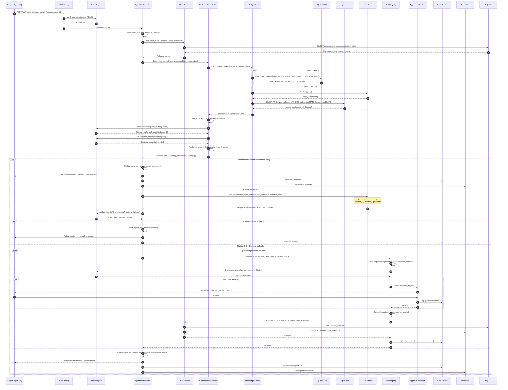

### Flow 2: Copilot Q&A — User Asks a Question In-Flow

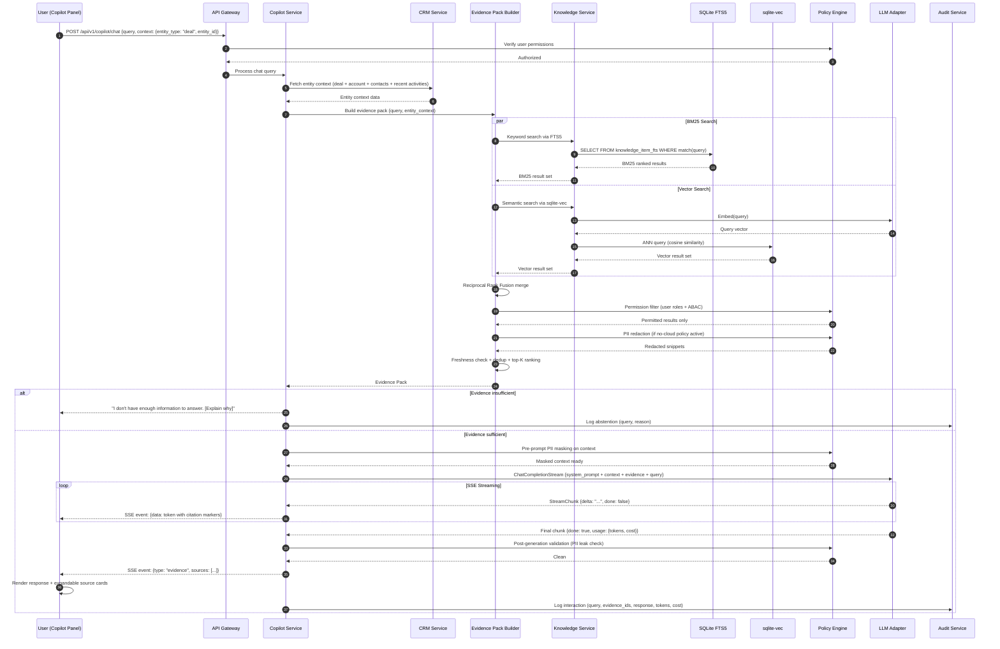

### Flow 3: Tool Execution — AI Executes an Action

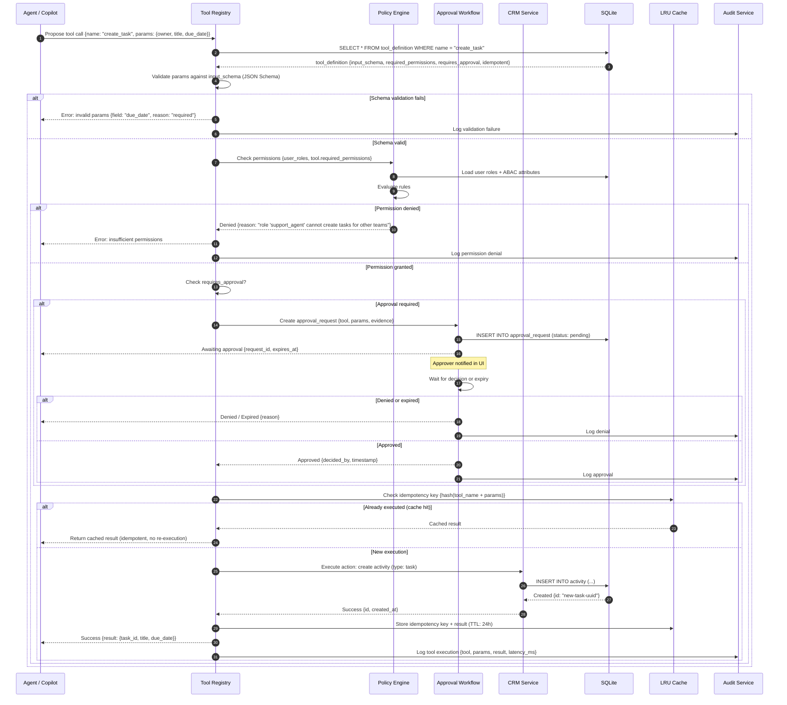

### Flow 4: Human Handoff — Agent Escalates to Human

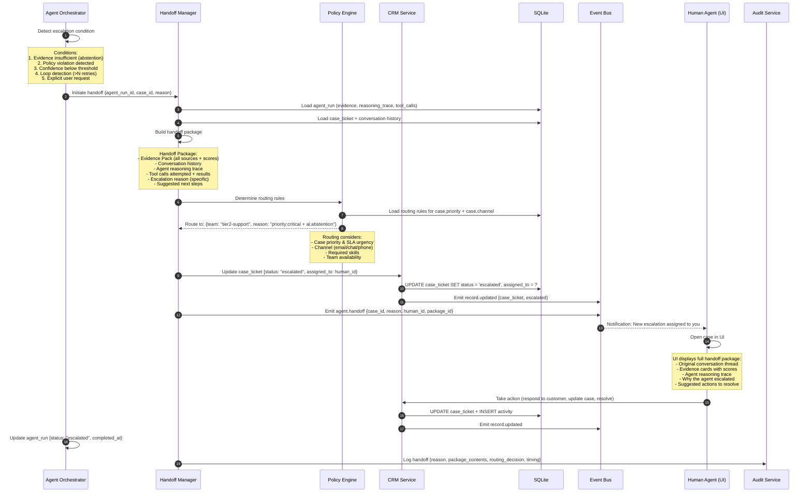

### Flow 5: Evidence Pack Assembly (Detail)

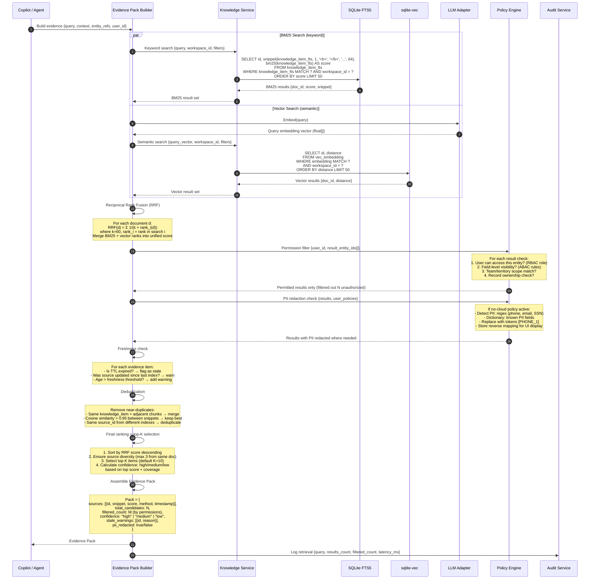

---

## 5 — Policy Engine: 4 Enforcement Points

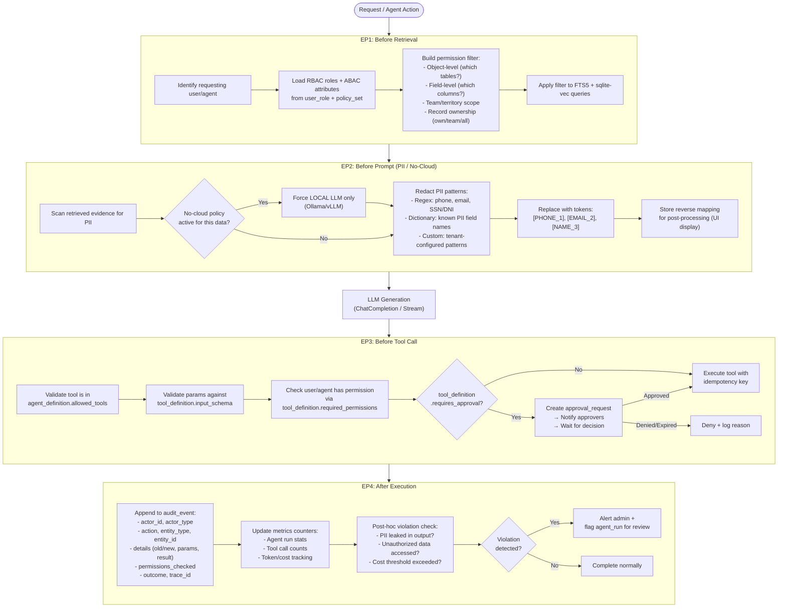

---

## 6 — Module Decomposition

8 internal modules within the modular monolith:

| Module | Responsibility | DB Tables Owned | Events Produced | Events Consumed |
|--------|---------------|-----------------|-----------------|-----------------|
| `domain/crm/` | CRUD entities, pipelines, timeline | account, contact, lead, deal, case_ticket, activity, note, attachment, pipeline, pipeline_stage, timeline_event | record.created/updated/deleted, stage.changed | — |
| `domain/knowledge/` | Ingestion, normalization, chunking, embedding, hybrid search | knowledge_item, embedding_document | knowledge.indexed/updated | record.created/updated |
| `domain/copilot/` | Chat Q&A, summaries, suggested actions, sessions | (copilot sessions in cache + SQLite) | copilot.interaction | — |
| `domain/agent/` | Agent orchestration, state machine, handoff, dry-run | agent_definition, skill_definition, agent_run | agent.started/completed/escalated/failed | record.*, approval.decided |
| `domain/policy/` | RBAC/ABAC, PII detection/masking, no-cloud, approvals | policy_set, policy_version, approval_request | approval.requested/decided, policy.violated | agent.started, tool.proposed |
| `domain/tool/` | Tool registry, schema validation, idempotent execution, rate limiting | tool_definition | tool.executed/failed | — |
| `domain/audit/` | Immutable append-only logging, queries, export | audit_event | — | ALL events (subscriber *) |
| `domain/eval/` | Evaluation suites, scoring, release gating | eval_suite, eval_run | eval.completed/passed/failed | prompt.promoted |

---

## 7 — REST API Design

### CRM Core (~15 endpoints)

- `GET/POST /api/v1/accounts`, `GET/PUT/DELETE /api/v1/accounts/{id}`
- `GET /api/v1/accounts/{id}/timeline`
- Same pattern for contacts, leads, deals, cases, activities
- `PUT /api/v1/deals/{id}/stage` (triggers pipeline event)
- `POST /api/v1/{entity_type}/{entity_id}/notes`
- `POST /api/v1/{entity_type}/{entity_id}/attachments`
- `GET/POST /api/v1/pipelines`, `GET/PUT /api/v1/pipelines/{id}/stages`

### Copilot (~7 endpoints)

- `POST /api/v1/copilot/chat` (SSE streaming response with citations)
- `POST /api/v1/copilot/summarize`
- `POST /api/v1/copilot/suggest-actions`
- `POST /api/v1/copilot/draft`
- `GET/DELETE /api/v1/copilot/sessions[/{id}]`

### Agents (~9 endpoints)

- `POST /api/v1/agents/trigger`, `POST /api/v1/agents/dry-run`
- `GET /api/v1/agents/runs`, `GET /api/v1/agents/runs/{id}`, `POST /api/v1/agents/runs/{id}/cancel`
- `GET/POST/PUT /api/v1/agents/definitions[/{id}]`

### Knowledge (~6 endpoints)

- `POST /api/v1/knowledge/search` (hybrid: BM25 + vector)
- `POST /api/v1/knowledge/ingest`
- `GET/DELETE /api/v1/knowledge/items[/{id}]`
- `POST /api/v1/knowledge/reindex`

### Governance (~11 endpoints)

- `GET /api/v1/audit/events`, `GET /api/v1/audit/events/{id}`, `POST /api/v1/audit/export`
- `GET/POST/PUT /api/v1/policies/sets[/{id}]`, `GET /api/v1/policies/sets/{id}/versions`
- `POST /api/v1/policies/evaluate`
- `GET/PUT /api/v1/approvals[/{id}]`

### Admin (~12 endpoints)

- `GET/POST/PUT /api/v1/admin/users[/{id}]`
- `GET/POST/PUT /api/v1/admin/roles[/{id}]`
- `GET/POST/PUT /api/v1/admin/tools[/{id}]`
- `GET/POST /api/v1/admin/prompts[/{id}]`, `PUT /api/v1/admin/prompts/{id}/promote`, `PUT /api/v1/admin/prompts/{id}/rollback`

### Common Patterns

- **Pagination**: `?page=1&per_page=25`
- **Filtering**: `?filter[status]=open`
- **Sorting**: `?sort=-created_at`
- **Envelope response**: `{data, meta, errors}`
- **Correlation headers**: `X-Request-Id`, `X-Trace-Id`, `X-Idempotency-Key`

---

## 8 — LLM Adapter Design

### Go Interface

```go
type LLMProvider interface {
    ChatCompletion(ctx context.Context, req ChatRequest) (*ChatResponse, error)
    ChatCompletionStream(ctx context.Context, req ChatRequest) (<-chan StreamChunk, error)
    Embed(ctx context.Context, req EmbedRequest) (*EmbedResponse, error)
    ModelInfo() ModelMeta
    HealthCheck(ctx context.Context) error
}
```

### Provider Router & Middleware

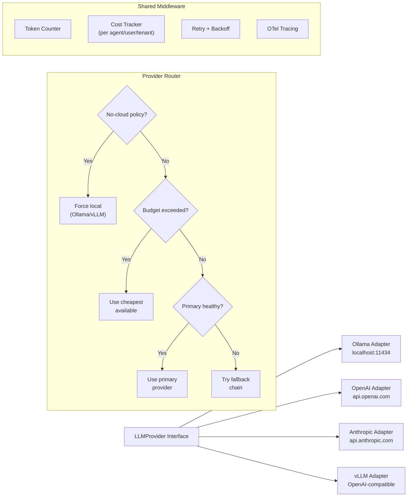

---

## 9 — Build Order

### Phase 1 — Foundation (Weeks 1-3)

- Go module scaffolding, directory structure
- SQLite setup: WAL mode, migrations, sqlc codegen
- Auth middleware (built-in JWT for MVP, OIDC hook for later)
- CRM CRUD APIs: Account, Contact, Lead, Deal, Case, Activity, Note, Attachment
- Pipeline + Stage management
- Timeline recording on entity changes
- **Resolves**: FR-001, FR-002, FR-060 (basic), FR-070 (basic), FR-051 (basic)

### Phase 2 — Knowledge & Retrieval (Weeks 4-6)

- Knowledge tables + FTS5 virtual table + sqlite-vec virtual table
- LLM Adapter: core interface + Ollama adapter + OpenAI adapter
- Ingestion pipeline: normalize → chunk (512 tokens, overlap) → embed → store
- Hybrid search: FTS5 BM25 + sqlite-vec ANN → Reciprocal Rank Fusion
- Evidence Pack Builder: permission filter + PII redaction + freshness + dedup + ranking
- CDC: trigger-based auto-reindex on CRM record changes
- **Resolves**: FR-090, FR-091 (basic), FR-092

### Phase 3 — AI Layer (Weeks 7-10)

- Policy Engine: RBAC/ABAC evaluator, PII detector/redactor, no-cloud routing, approval workflows
- Tool Registry: CRUD, JSON Schema validation, built-in tools, idempotency, rate limiting
- Copilot Service: chat with SSE streaming, summarize, suggest-actions, session management
- Agent Orchestrator: state machine, UC-C1 Support Agent end-to-end, handoff manager, dry-run
- Prompt versioning: CRUD, active version selection, rollback, diff
- **Resolves**: FR-200, FR-201, FR-202, FR-210, FR-211, FR-230, FR-231 (support), FR-232, FR-240, FR-061

### Phase 4 — Integration & Polish (Weeks 11-13)

- React frontend MVP: auth, CRM pages, pipeline board, copilot panel (SSE), evidence cards, agent runs, approvals, timeline
- Observability: structured logging, metrics endpoint, agent run dashboard
- Audit Service: immutable storage, query interface, export
- Eval Service (basic): suite CRUD, run evals, scoring, gating
- Integration + e2e tests: UC-C1 complete flow, permission bypass tests
- **Resolves**: All remaining P0 NFRs

### Build Order Dependency Graph

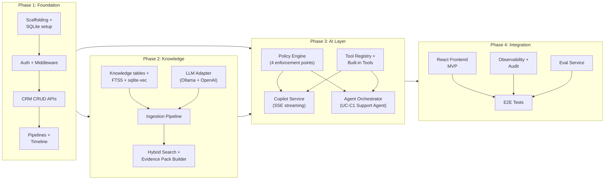

---

## 10 — Deployment Architecture

```mermaid
flowchart TB
    subgraph MVP["MVP Deployment (two processes)"]
        BIN["./fenixcrm serve --port 8080<br/>(Go backend)"]
        BFF_PROC["node bff/dist/index.js --port 3000<br/>(Express.js BFF)"]
        BIN --> SQLITE_F[("fenixcrm.db<br/>SQLite + sqlite-vec + FTS5")]
        BIN --> FS_F["./data/attachments/"]
        BFF_PROC -->|"HTTPS proxy"| BIN
    end

    subgraph Docker["Docker Compose (dev/prod)"]
        APP_GO["fenix-backend:8080<br/>Go backend"]
        APP_BFF["fenix-bff:3000<br/>Express.js BFF"]
        OLLAMA_D["ollama:11434<br/>Local LLM"]
        KC_D["keycloak:8180<br/>OIDC (optional)"]
        APP_BFF -->|"proxy"| APP_GO
        APP_GO --> OLLAMA_D
        APP_GO -.-> KC_D
    end

    subgraph MobileDist["Mobile Distribution"]
        APK["Android APK<br/>(Expo EAS Build)"]
        PLAY["Google Play Store<br/>(internal track)"]
        IOS["iOS (P1)<br/>(TestFlight → App Store)"]
        APK --> PLAY
    end

    subgraph Future["Future: Kubernetes (P1/P2)"]
        direction TB
        NOTE["Migrate SQLite → PostgreSQL<br/>Add Redis for distributed cache<br/>Add NATS for multi-instance events<br/>Helm charts: Go + BFF + Ollama"]
    end
```

**MVP commands**:
```bash
# Go backend
./fenixcrm serve --port 8080 --data ./data/fenixcrm.db

# BFF (separate terminal)
cd bff && node dist/index.js --port 3000 --backend http://localhost:8080

# Mobile (development)
cd mobile && npx expo start
```

**Docker Compose**:
```yaml
services:
  backend:
    build: .
    ports: ["8080:8080"]
    volumes: ["./data:/data"]
  bff:
    build: ./bff
    ports: ["3000:3000"]
    environment:
      BACKEND_URL: http://backend:8080
    depends_on: [backend]
  ollama:
    image: ollama/ollama
    ports: ["11434:11434"]
```

---

## Appendix: Project Directory Structure

> **Note**: Structure updated per ADR-001 (see `docs/implementation-plan.md` Section 11)
> **Decision**: Option B (with `internal/`) for application encapsulation

```
fenixcrm/                          # Monorepo root
├── mobile/                        # React Native app (Expo managed)
│   ├── app/                      # Expo Router pages
│   │   ├── (auth)/               # Auth screens (login, register)
│   │   ├── (tabs)/               # Main tab navigation
│   │   │   ├── accounts/         # Account list + detail
│   │   │   ├── contacts/         # Contact list + detail
│   │   │   ├── deals/            # Deal list + detail + pipeline board
│   │   │   ├── cases/            # Case list + detail
│   │   │   ├── copilot/          # Copilot chat screen
│   │   │   └── agents/           # Agent runs list + detail
│   │   └── _layout.tsx           # Root layout (drawer + stack)
│   ├── components/               # Shared UI components
│   │   ├── CopilotPanel.tsx      # SSE chat + evidence cards
│   │   ├── EvidenceCard.tsx      # Expandable source card
│   │   ├── EntityTimeline.tsx    # Timeline component
│   │   ├── CRMListScreen.tsx     # Reusable list with search/filter/pagination
│   │   └── ActionButton.tsx      # Tool execution confirmation
│   ├── hooks/                    # Custom React hooks
│   │   ├── useSSE.ts             # SSE streaming hook
│   │   ├── useAuth.ts            # JWT auth management
│   │   └── useCRM.ts             # TanStack Query hooks for CRM entities
│   ├── services/                 # API client layer
│   │   ├── api.ts                # Axios client pointing to BFF
│   │   └── sse.ts                # SSE client for Copilot
│   ├── stores/                   # Zustand stores
│   │   ├── authStore.ts          # JWT token, user info
│   │   └── uiStore.ts            # UI state (theme, drawer, etc.)
│   ├── theme/                    # React Native Paper theme config
│   ├── app.json                  # Expo config
│   ├── package.json
│   └── tsconfig.json
├── bff/                           # Express.js BFF Gateway
│   ├── src/
│   │   ├── index.ts              # Express server entry point
│   │   ├── middleware/
│   │   │   ├── authRelay.ts      # JWT forwarding + refresh
│   │   │   ├── mobileHeaders.ts  # Inject device info headers
│   │   │   └── errorHandler.ts   # Unified error handling
│   │   ├── routes/
│   │   │   ├── auth.ts           # /bff/auth/* → Go /auth/*
│   │   │   ├── proxy.ts          # /bff/api/v1/* → Go /api/v1/* (pass-through)
│   │   │   ├── aggregated.ts     # /bff/accounts/:id/full (multi-call aggregation)
│   │   │   └── copilot.ts        # /bff/copilot/chat (SSE proxy)
│   │   ├── services/
│   │   │   ├── goClient.ts       # HTTP client to Go backend
│   │   │   └── sseProxy.ts       # SSE relay service
│   │   └── config.ts             # BFF configuration
│   ├── tests/
│   │   ├── auth.test.ts          # Auth relay tests (Supertest)
│   │   ├── proxy.test.ts         # Proxy pass-through tests
│   │   ├── aggregated.test.ts    # Aggregation tests
│   │   └── sse.test.ts           # SSE proxy tests
│   ├── package.json
│   ├── tsconfig.json
│   └── Dockerfile
├── cmd/fenixcrm/                  # Go backend (UNCHANGED)
│   └── main.go
├── internal/                      # Go private application code (UNCHANGED)
│   ├── config/
│   ├── server/
│   ├── api/
│   │   ├── handlers/
│   │   ├── middleware/
│   │   └── routes.go
│   ├── domain/
│   │   ├── crm/
│   │   ├── copilot/
│   │   ├── agent/
│   │   ├── knowledge/
│   │   ├── policy/
│   │   ├── tool/
│   │   ├── audit/
│   │   └── eval/
│   └── infra/
│       ├── sqlite/
│       ├── cache/
│       ├── eventbus/
│       ├── llm/
│       └── otel/
├── pkg/                           # Go shared libraries (UNCHANGED)
├── deploy/
│   ├── Dockerfile                # Go backend Docker
│   ├── Dockerfile.bff            # BFF Docker
│   └── docker-compose.yml        # Go + BFF + Ollama
├── tests/
│   ├── integration/              # Go integration tests
│   ├── e2e/                      # Detox E2E tests (mobile)
│   │   ├── accounts.e2e.ts
│   │   ├── copilot.e2e.ts
│   │   └── agent-runs.e2e.ts
│   └── fixtures/
├── data/                          # Runtime data (gitignored)
│   ├── fenixcrm.db
│   └── attachments/
├── docs/
│   ├── architecture.md          # THIS DOCUMENT
│   ├── implementation-plan.md
│   └── CORRECTIONS-APPLIED.md
├── .github/
│   └── workflows/ci.yml         # CI pipeline (Go + BFF + Mobile)
├── sqlc.yaml
├── .golangci.yml
├── Makefile                       # Go targets (UNCHANGED)
├── go.mod
├── go.sum
├── CLAUDE.md
└── README.md
```

**Import Path Convention**:
- Internal packages: `github.com/yourorg/fenixcrm/internal/domain/crm`
- Public utilities: `github.com/yourorg/fenixcrm/pkg/uuid`
- Go compiler enforces: external projects **cannot** import `internal/*`

**Rationale**:
1. **Encapsulation**: `internal/` prevents accidental external dependencies on implementation details
2. **Go Convention**: Applications use `internal/`, libraries do not
3. **Clear API Surface**: Only `pkg/*` is intended for external use
4. **Future-proof**: Easier to extract reusable components to separate modules later

---

## Verification

1. **Requirements coverage**: Every P0 FR (FR-001/002/090/092/200/202/060/070/071 + UC-C1/FR-232 + NFR-030/031) has explicit coverage in the ERD, sequence diagrams, and build phases.
2. **Mermaid diagrams**: 10 complete Mermaid diagrams (1 erDiagram, 1 system architecture, 5 sequence diagrams, 1 policy flowchart, 1 LLM adapter, 1 build order + 1 deployment).
3. **ERD consistency**: All 27 entities from the requirements have tables with fields, types, PKs, FKs, and relationships.
4. **Interaction flows**: UC-C1 traced end-to-end through Flow 1 covering all steps from the L2 diagram in requirements.
5. **API coverage**: ~60 endpoints across 6 domains covering all FR acceptance criteria.
6. **SQLite feasibility**: sqlite-vec for vector ANN + FTS5 for BM25 + permission filtering via WHERE clauses.
7. **TDD**: Each build phase produces tests before implementation.
