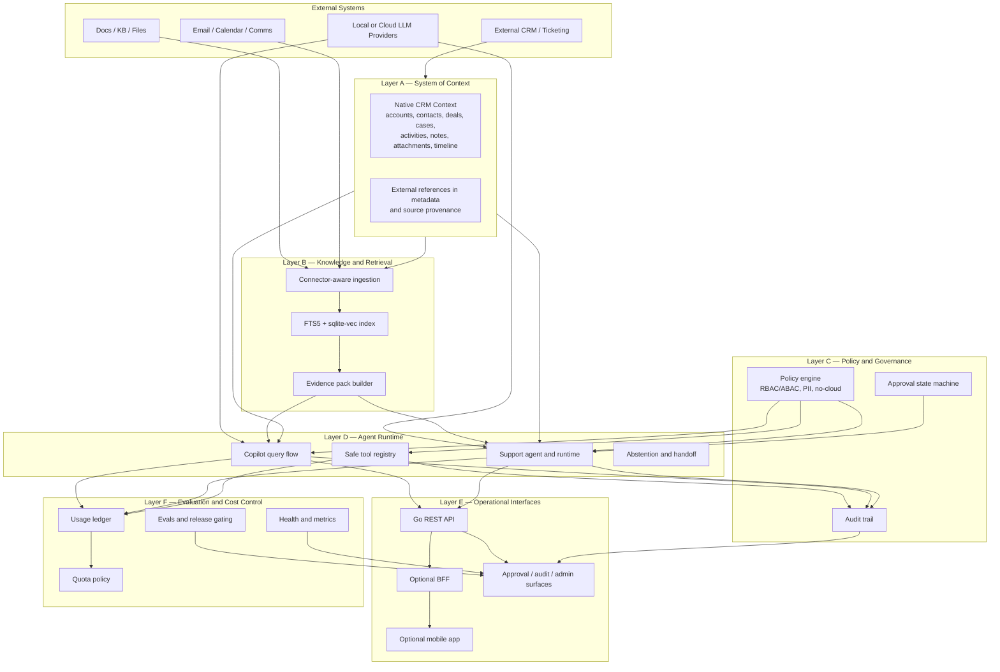
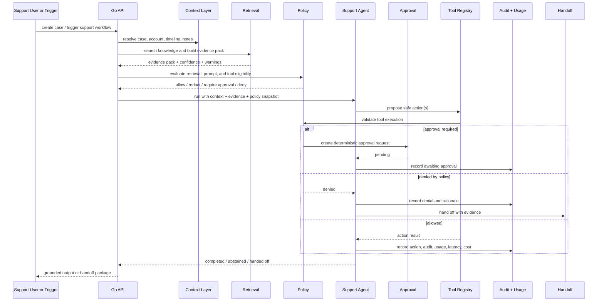
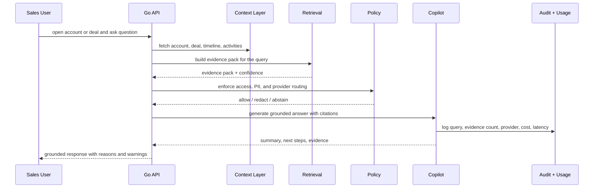
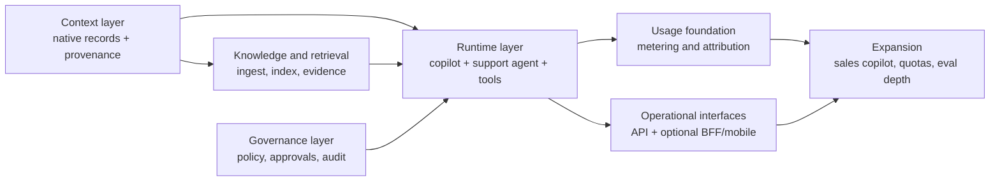
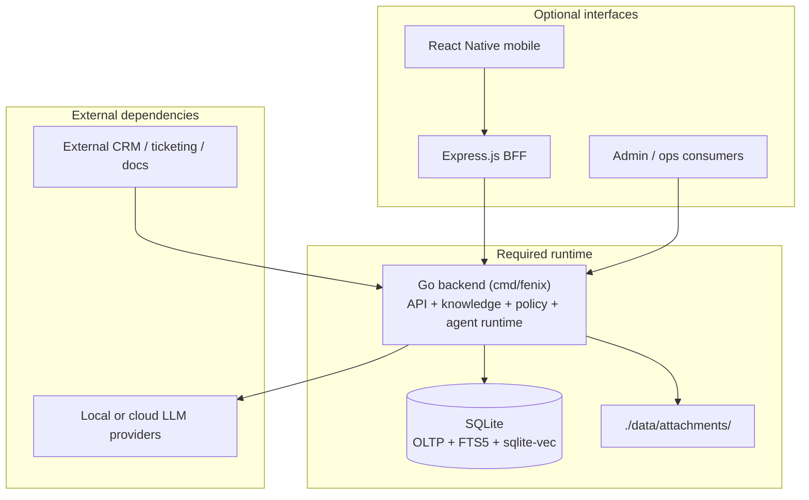

# Architecture & Design Document — Governed AI CRM Operations Layer (FenixCRM)

> **Version**: 1.1
> **Status**: Strategically realigned
> **Last updated**: 2026-04-06
> **Primary references**: `docs/requirements.md`, `docs/plans/fenixcrm_strategic_repositioning_spec.md`
> **Precedence rule**: when older documents imply broad CRM-replacement scope, this document and the strategic repositioning spec take precedence until the implementation plan and requirements are fully reprioritized.

---

## Table of Contents

0. [Strategic Positioning and Scope](#0--strategic-positioning-and-scope)
1. [Technology Stack](#1--technology-stack)
2. [Capability and Data Model](#2--capability-and-data-model)
3. [System Architecture Diagram](#3--system-architecture-diagram)
4. [Reference Interaction Flows](#4--reference-interaction-flows)
5. [Governance Enforcement Points](#5--governance-enforcement-points)
6. [Module Decomposition](#6--module-decomposition)
7. [API Design](#7--api-design)
8. [Runtime Contracts and LLM Routing](#8--runtime-contracts-and-llm-routing)
9. [Delivery Priorities and Build Order](#9--delivery-priorities-and-build-order)
10. [Deployment Architecture](#10--deployment-architecture)
11. [Project Directory Structure](#appendix-project-directory-structure)
12. [Verification Checklist](#verification)

---

## 0 — Strategic Positioning and Scope

### Product definition

FenixCRM is a **governed AI layer for customer operations** that turns CRM and knowledge context into grounded, auditable, approval-aware assistance and agent execution.

### Primary commercial wedge

The product shall optimize first for:

1. **Support Copilot** and **Support Agent** for case handling
2. **Sales Copilot** for account and deal context
3. **Evidence-grounded execution** with approvals, auditability, and policy enforcement

### Explicit non-goals for the wedge

The current architecture shall **not** optimize first for:

- broad CRM parity across every object or admin surface
- mobile parity as a launch gate
- Agent Studio as the initial commercial front door
- plugin marketplace breadth
- platform extensibility ahead of workflow validation

### Architecture stance

The system is organized as a governed AI execution layer attached to CRM workflows and customer knowledge. This means:

- CRM entities remain important, but they are treated as a **system of context**, not the core moat
- retrieval and evidence are a first-class boundary, not a helper utility
- policy, approvals, audit, and metering are runtime concerns, not add-ons
- integrations with external systems are strategic, even when native tables exist
- mobile and BFF remain supported interfaces, but they are optional delivery surfaces for the wedge

### Capability layers

| Layer | Purpose | Current posture |
|-------|---------|-----------------|
| **A. System of Context** | Accounts, contacts, deals, cases, activities, notes, attachments, timelines, and external references | Native CRM tables exist today; external context is expected to grow |
| **B. Knowledge and Retrieval** | Ingestion, chunking, indexing, hybrid search, evidence assembly | Implemented in Go/SQLite with FTS5 and sqlite-vec |
| **C. Policy and Governance** | RBAC/ABAC, approvals, no-cloud/PII controls, audit context | Implemented and cross-cutting |
| **D. Agent Runtime** | Copilot queries, support agent runs, tool orchestration, abstention, handoff | Implemented with evolving runtime contracts |
| **E. Operational Interfaces** | REST API, admin surfaces, optional BFF, optional mobile surfaces | Implemented; mobile is non-blocking for wedge completion |
| **F. Evaluation and Cost Control** | Evals, audit review, metering, quotas, replay/simulation | Audit/evals exist; usage/quota is now a required target domain |

### As-built versus target rule

This document intentionally distinguishes between:

- **implemented architecture**: present in `internal/*`, routes, migrations, and tests
- **target contract**: required shape for the next aligned iteration

When a target contract is newer than the current implementation, it is called out explicitly as a transition requirement rather than being described as already shipped.

The strategic direction in this document is frozen by:

- `docs/decisions/ADR-019-product-category-governed-ai-layer.md`
- `docs/decisions/ADR-020-cost-governance-runtime-concern.md`
- `docs/decisions/ADR-021-integration-first-context-strategy.md`
- `docs/decisions/ADR-022-mobile-deprioritized-for-wedge.md`

---

## 1 — Technology Stack

| Layer | Technology | Architectural note |
|-------|------------|--------------------|
| **Backend API** | Go 1.22+ / `go-chi` | Primary runtime for business logic, policy enforcement, audit, retrieval, and agents |
| **Persistence** | SQLite (WAL) + `sqlc` + `modernc.org/sqlite` | Single-node default; append-only audit and simple deployment remain priorities |
| **Vector search** | `sqlite-vec` | Co-located with OLTP data for wedge simplicity |
| **Keyword search** | SQLite FTS5 | BM25 component of hybrid retrieval |
| **Eventing** | In-process pub/sub and job workers | Sufficient for the current monolith; no distributed broker required for the wedge |
| **LLM integration** | Provider-agnostic Go adapter | Current wiring supports OpenAI-compatible chat and local embedding routes |
| **BFF** | Express.js + TypeScript | Optional thin proxy for mobile-specific concerns and aggregation; no business logic |
| **Mobile** | React Native + Expo | Supported client surface, not a wedge-defining dependency |
| **Observability** | Structured logs, `/metrics`, audit service | Usage and cost metering is now a required extension of this layer |
| **Deployment** | Go binary + SQLite file, optional BFF process, Docker Compose | Default architecture stays simple and self-hostable |

### Stack-level implications

- The Go backend is the **required** runtime.
- The BFF is justified when request aggregation, auth relay, or mobile transport behavior is needed.
- Mobile is an important interface, but architecture shall not block the wedge on mobile parity.
- Cost governance must be recorded close to runtime execution, not delegated to external billing logic.

---

## 2 — Capability and Data Model

### 2.1 Logical domain grouping

| Domain area | Key entities | Role in the repositioned product |
|-------------|--------------|----------------------------------|
| **Context layer** | `workspace`, `user_account`, `role`, `account`, `contact`, `lead`, `deal`, `case_ticket`, `activity`, `note`, `attachment`, `timeline_event` | Operational context for support and sales workflows |
| **Knowledge layer** | `knowledge_item`, `embedding_document`, `evidence` | Searchable knowledge corpus and persisted evidence records |
| **Governed runtime** | `policy_set`, `tool_definition`, `agent_definition`, `agent_run`, `approval_request`, `audit_event` | Execution control, action safety, approval state, immutable trace |
| **Versioning and eval** | `prompt_version`, `policy_version`, `eval_suite`, `eval_run`, `workflow` metadata | Controlled rollout, verification, and future replay/simulation |
| **Usage and quota** | `usage_event`, `quota_policy`, `quota_state` | Required target domain for per-run attribution and workspace-level cost controls |

### 2.2 Simplified ERD


```mermaid
erDiagram
    workspace {
        text id PK
        text slug
        text name
    }

    user_account {
        text id PK
        text workspace_id FK
        text email
        text status
    }

    role {
        text id PK
        text workspace_id FK
        text permissions
    }

    account {
        text id PK
        text workspace_id FK
        text name
        text metadata
    }

    contact {
        text id PK
        text workspace_id FK
        text account_id FK
        text metadata
    }

    deal {
        text id PK
        text workspace_id FK
        text account_id FK
        text stage_id FK
        text metadata
    }

    case_ticket {
        text id PK
        text workspace_id FK
        text account_id FK
        text contact_id FK
        text status
    }

    activity {
        text id PK
        text workspace_id FK
        text entity_type
        text entity_id
    }

    note {
        text id PK
        text workspace_id FK
        text entity_type
        text entity_id
    }

    attachment {
        text id PK
        text workspace_id FK
        text entity_type
        text entity_id
    }

    timeline_event {
        text id PK
        text workspace_id FK
        text entity_type
        text entity_id
        text context
    }

    knowledge_item {
        text id PK
        text workspace_id FK
        text source_type
        text entity_type
        text entity_id
        text source_metadata
    }

    embedding_document {
        text id PK
        text workspace_id FK
        text knowledge_item_id FK
        integer chunk_index
    }

    evidence {
        text id PK
        text workspace_id FK
        text knowledge_item_id FK
        text retrieval_method
        real relevance_score
    }

    policy_set {
        text id PK
        text workspace_id FK
        text status
    }

    tool_definition {
        text id PK
        text workspace_id FK
        text name
        integer requires_approval
    }

    agent_definition {
        text id PK
        text workspace_id FK
        text policy_set_id FK
        text status
    }

    agent_run {
        text id PK
        text workspace_id FK
        text agent_definition_id FK
        text trigger_type
        text status
        integer total_tokens
        real total_cost
        integer latency_ms
    }

    approval_request {
        text id PK
        text workspace_id FK
        text agent_run_id FK
        text status
        text decided_by
    }

    audit_event {
        text id PK
        text workspace_id FK
        text actor_id
        text action
        text outcome
        text trace_id
    }

    usage_event {
        text id PK
        text workspace_id FK
        text actor_id
        text run_id FK
        text tool_name
        text model_name
        integer input_units
        integer output_units
        real estimated_cost
        integer latency_ms
    }

    quota_policy {
        text id PK
        text workspace_id FK
        text policy_type
        real limit_value
        text reset_period
        text enforcement_mode
    }

    quota_state {
        text id PK
        text workspace_id FK
        text policy_id FK
        real current_value
        text period_start
        text period_end
    }

    prompt_version {
        text id PK
        text workspace_id FK
        text agent_definition_id FK
        integer version_number
        text status
    }

    eval_run {
        text id PK
        text workspace_id FK
        text prompt_version_id FK
        text status
    }

    workspace ||--o{ user_account : contains
    workspace ||--o{ role : defines
    workspace ||--o{ account : contains
    workspace ||--o{ deal : contains
    workspace ||--o{ case_ticket : contains
    workspace ||--o{ activity : contains
    workspace ||--o{ note : contains
    workspace ||--o{ attachment : contains
    workspace ||--o{ timeline_event : contains
    workspace ||--o{ knowledge_item : contains
    workspace ||--o{ policy_set : governs
    workspace ||--o{ tool_definition : registers
    workspace ||--o{ agent_definition : registers
    workspace ||--o{ agent_run : executes
    workspace ||--o{ audit_event : records
    workspace ||--o{ usage_event : meters
    workspace ||--o{ quota_policy : configures
    workspace ||--o{ quota_state : tracks

    account ||--o{ contact : has
    account ||--o{ deal : has
    account ||--o{ case_ticket : links

    knowledge_item ||--o{ embedding_document : chunks
    knowledge_item ||--o{ evidence : backs
    agent_definition ||--o{ agent_run : executes
    agent_definition ||--o{ prompt_version : versions
    policy_set ||--o{ agent_definition : constrains
    agent_run ||--o{ approval_request : may_trigger
    agent_run ||--o{ usage_event : emits
    quota_policy ||--o{ quota_state : accumulates
    prompt_version ||--o{ eval_run : tested_in
```

### 2.3 Required domain adjustments

1. **Context, not moat**: CRM entities are preserved because they power support and sales workflows, but architecture shall not treat broad CRM expansion as the core business axis.
2. **Integration-first context**: external system references shall be preserved in entity metadata and `knowledge_item.source_metadata` until a dedicated connector registry is introduced.
3. **Usage domain added**: `usage_event`, `quota_policy`, and `quota_state` now exist as first-class persistence and domain primitives; runtime emission is active on copilot, support-agent, and tool paths, while public read APIs remain follow-up work.
4. **Approval states formalized**: the target model uses `pending`, `approved`, `rejected`, `expired`, `cancelled`.
5. **Evidence pack is a contract**: the persisted `evidence` table supports a versioned evidence-pack response contract defined in Section 8.

---

## 3 — System Architecture Diagram


```mermaid
flowchart TB
    subgraph EXT["External Systems"]
        CRMX["External CRM / Ticketing"]
        KBX["Docs / KB / Files"]
        COMM["Email / Calendar / Comms"]
        LLMX["Local or Cloud LLM Providers"]
    end

    subgraph A["Layer A — System of Context"]
        NATIVE["Native CRM Context<br/>accounts, contacts, deals, cases,<br/>activities, notes, attachments, timeline"]
        EXTREF["External references in metadata<br/>and source provenance"]
    end

    subgraph B["Layer B — Knowledge and Retrieval"]
        INGEST["Connector-aware ingestion"]
        INDEX["FTS5 + sqlite-vec index"]
        EVIDENCE["Evidence pack builder"]
    end

    subgraph C["Layer C — Policy and Governance"]
        POLICY["Policy engine<br/>RBAC/ABAC, PII, no-cloud"]
        APPROVAL["Approval state machine"]
        AUDIT["Audit trail"]
    end

    subgraph D["Layer D — Agent Runtime"]
        COPILOT["Copilot query flow"]
        AGENTS["Support agent and runtime"]
        TOOLS["Safe tool registry"]
        HANDOFF["Abstention and handoff"]
    end

    subgraph E["Layer E — Operational Interfaces"]
        API["Go REST API"]
        BFF["Optional BFF"]
        MOBILE["Optional mobile app"]
        OPSUI["Approval / audit / admin surfaces"]
    end

    subgraph F["Layer F — Evaluation and Cost Control"]
        EVAL["Evals and release gating"]
        USAGE["Usage ledger"]
        QUOTA["Quota policy"]
        METRICS["Health and metrics"]
    end

    CRMX --> A
    KBX --> INGEST
    COMM --> INGEST
    LLMX --> COPILOT
    LLMX --> AGENTS

    A --> INGEST
    A --> COPILOT
    A --> AGENTS

    INGEST --> INDEX --> EVIDENCE
    EVIDENCE --> COPILOT
    EVIDENCE --> AGENTS

    POLICY --> COPILOT
    POLICY --> AGENTS
    POLICY --> TOOLS
    APPROVAL --> AGENTS
    TOOLS --> AUDIT
    COPILOT --> AUDIT
    AGENTS --> AUDIT

    COPILOT --> API
    AGENTS --> API
    API --> BFF
    BFF --> MOBILE
    API --> OPSUI

    COPILOT --> USAGE
    AGENTS --> USAGE
    TOOLS --> USAGE
    USAGE --> QUOTA
    AUDIT --> OPSUI
    EVAL --> OPSUI
    METRICS --> OPSUI
```

### Key architectural reading

- **Layer A** may be native, integrated, or mixed.
- **Layer B** is the trust boundary for grounding and freshness.
- **Layer C** is runtime-critical, not a post-processing concern.
- **Layer D** is where support workflows become product behavior.
- **Layer E** serves the runtime; it is not the moat by itself.
- **Layer F** makes the system operable and commercially governable.

---

## 4 — Reference Interaction Flows

### Flow 1: Support Agent with governed execution


```mermaid
sequenceDiagram
    participant U as Support User or Trigger
    participant API as Go API
    participant CTX as Context Layer
    participant RET as Retrieval
    participant POL as Policy
    participant AG as Support Agent
    participant APP as Approval
    participant TOOL as Tool Registry
    participant AUD as Audit + Usage
    participant H as Handoff

    U->>API: create case / trigger support workflow
    API->>CTX: resolve case, account, timeline, notes
    API->>RET: search knowledge and build evidence pack
    RET-->>API: evidence pack + confidence + warnings
    API->>POL: evaluate retrieval, prompt, and tool eligibility
    POL-->>API: allow / redact / require approval / deny
    API->>AG: run with context + evidence + policy snapshot
    AG->>TOOL: propose safe action(s)
    TOOL->>POL: validate tool execution
    alt approval required
        POL->>APP: create deterministic approval request
        APP-->>AG: pending
        AG->>AUD: record awaiting approval
    else denied by policy
        POL-->>AG: denied
        AG->>AUD: record denial and rationale
        AG->>H: hand off with evidence
    else allowed
        TOOL-->>AG: action result
        AG->>AUD: record action, audit, usage, latency, cost
    end
    AG-->>API: completed / abstained / handed off
    API-->>U: grounded output or handoff package
```

### Flow 2: Sales Copilot with grounded context


```mermaid
sequenceDiagram
    participant S as Sales User
    participant API as Go API
    participant CTX as Context Layer
    participant RET as Retrieval
    participant POL as Policy
    participant CP as Copilot
    participant AUD as Audit + Usage

    S->>API: open account or deal and ask question
    API->>CTX: fetch account, deal, timeline, activities
    API->>RET: build evidence pack for the query
    RET-->>API: evidence pack + confidence
    API->>POL: enforce access, PII, and provider routing
    POL-->>API: allow / redact / abstain
    API->>CP: generate grounded answer with citations
    CP->>AUD: log query, evidence count, provider, cost, latency
    CP-->>API: summary, next steps, evidence
    API-->>S: grounded response with reasons and warnings
```

---

## 5 — Governance Enforcement Points

The architecture keeps **four mandatory enforcement points**. Usage metering is emitted across them rather than treated as a separate approval layer.

### 5.1 Retrieval gate

- Apply workspace isolation and access filters before retrieval results are exposed.
- Preserve provenance of external systems in metadata.
- Reject or redact disallowed sources before they enter the evidence pack.

### 5.2 Evidence and prompt gate

- Build a versioned evidence pack.
- Apply PII or no-cloud rules before provider selection.
- Fail closed when the evidence set is insufficient for the requested action.

### 5.3 Tool routing and approval gate

- Every action must go through registered tools.
- Approvals are required by deterministic policy rules, not ad hoc branching.
- Denials are first-class runtime outcomes, not generic errors.

### 5.4 Output, handoff, and trace gate

- Every governed action emits audit events.
- Every run emits usage attribution where data is available.
- Handoff payloads preserve evidence, rationale, and workflow state.

---

## 6 — Module Decomposition

### 6.1 Backend modules

| Module | Status | Responsibility | Notes |
|--------|--------|----------------|-------|
| `internal/domain/crm` | implemented | Native context entities and supporting workflows | Context layer, not primary moat |
| `internal/domain/knowledge` | implemented | Ingestion, chunking, embedding, search, evidence assembly | Strategic trust boundary |
| `internal/domain/policy` | implemented | RBAC/ABAC, approvals, policy decisions, no-cloud/PII | Must become more machine-explainable |
| `internal/domain/tool` | implemented | Registered tool execution, schema validation, rate limits | All governed mutations route here |
| `internal/domain/copilot` | implemented | Grounded query and action suggestion flows | Primary wedge surface for sales and support assistance |
| `internal/domain/agent` | implemented | Support agent runtime, orchestration, handoff, DSL/bridge work | Public outcomes are normalized; support now carries evidence-pack handoff, audit, and usage traces end-to-end |
| `internal/domain/audit` | implemented | Immutable append-only audit logging, query, export | Already a core capability |
| `internal/domain/workflow` | implemented | Workflow definitions, activation metadata | Supports ongoing declarative transition |
| `internal/domain/signal` | implemented | Signal lifecycle over CRM context | Secondary to the current wedge |
| `internal/domain/eval` | implemented | Eval suites and runs | Needed for quality gates and later replay |
| `internal/domain/usage` | implemented | Usage ledger, per-run attribution, quota state | Persistence, service, runtime emission, and read APIs are now wired for workspace and run visibility |
| `internal/domain/connectors` | target | Formal connector contracts and source adapters | May begin inside knowledge before extraction |

### 6.2 Interface and infrastructure modules

| Module | Status | Responsibility |
|--------|--------|----------------|
| `internal/api` | implemented | REST handlers, middleware, route assembly |
| `internal/infra/sqlite` | implemented | Migrations, SQL, indexes, append-only audit protections |
| `internal/infra/llm` | implemented | Provider adapters and usage extraction |
| `internal/server` | implemented | Runtime bootstrapping |
| `bff/src` | implemented | Optional mobile-oriented proxy and transport layer |
| `mobile/` | implemented | Optional client interface; not a wedge dependency |

### 6.3 Structural clarification

The backend source of truth is the `internal/*` tree. Root-level `api/`, `domain/`, and `infra/` directories currently act as placeholders or transitional scaffolding and shall not be treated as the primary runtime architecture.

---

## 7 — API Design

### 7.1 Strategic APIs

These APIs define the product category more than generic CRUD does.

| Capability | Current route(s) | Required behavior |
|------------|------------------|-------------------|
| Knowledge ingestion | `POST /api/v1/knowledge/ingest` | Preserve source identity, tenant isolation, and provenance metadata |
| Knowledge retrieval | `POST /api/v1/knowledge/search` | Deterministic filters, relevance metadata, audit of strategic queries |
| Evidence assembly | `POST /api/v1/knowledge/evidence` | Return the versioned evidence-pack contract from Section 8 |
| Grounded copilot query | `POST /api/v1/copilot/chat` | Grounded answer, abstention path, audit, usage attribution |
| Sales copilot brief | `POST /api/v1/copilot/sales-brief` | Canonical account/deal summary, risks, next actions, and abstention under an evidence-pack contract |
| Support agent trigger | `POST /api/v1/agents/trigger`, `POST /api/v1/agents/support/trigger` | Create agent run, bind trace, preserve policy context |
| Agent run inspection | `GET /api/v1/agents/runs/{id}` | Return execution state, evidence linkage, audit trace references |
| Handoff package | `GET /api/v1/agents/runs/{id}/handoff`, `POST /api/v1/agents/runs/{id}/handoff` | Preserve rationale and evidence for human takeover |
| Approval review | `GET /api/v1/approvals`, `PUT /api/v1/approvals/{id}` | Deterministic state transitions, audit emission on decision |
| Audit review | `GET /api/v1/audit/events`, `GET /api/v1/audit/events/{id}`, `POST /api/v1/audit/export` | Append-only semantics and stable query/export behavior |
| Operability | `GET /health`, `GET /readyz`, `GET /metrics` | Health, dependency readiness, and runtime metrics |
| Usage and quota | `GET /api/v1/usage`, `GET /api/v1/quota-state` | Expose per-workspace and per-run attribution plus quota-state visibility |

### 7.2 Support APIs

The following remain necessary, but they are **support APIs**, not category-defining APIs:

- CRUD APIs for accounts, contacts, leads, deals, cases, activities, notes, attachments
- pipeline and stage management
- timeline and reporting endpoints
- workflow, signal, prompt, tool, and eval admin routes

### 7.3 API-wide contract rules

Every strategic API shall define:

1. input schema
2. output schema
3. deterministic error codes
4. audit-emission behavior
5. policy evaluation touchpoint
6. tenant isolation rule
7. correlation and idempotency semantics where writes occur

### 7.4 Current compatibility notes

- The current approval endpoint uses `PUT /api/v1/approvals/{id}` with a decision payload. The target state machine remains the authoritative model even if the route shape is unchanged.
- The current grounded-query endpoint is `POST /api/v1/copilot/chat`; architecture treats this as the strategic copilot query boundary.
- The future usage API is reserved so that metering can ship without changing attribution semantics later.

---

## 8 — Runtime Contracts and LLM Routing

### 8.1 LLM adapter role

The provider adapter remains model-agnostic. It must support:

- chat/completion calls
- streaming responses where needed
- embedding calls
- health checks
- extraction of token and latency data for usage metering

### 8.2 Evidence pack contract

The **target** evidence pack is a stable contract, not just an internal struct:

```json
{
  "schema_version": "v1",
  "query": "summarize this case and recommend next step",
  "source_count": 4,
  "dedup_count": 1,
  "filtered_count": 2,
  "confidence": "medium",
  "warnings": ["stale_knowledge_item"],
  "retrieval_methods_used": ["bm25", "vector"],
  "built_at": "2026-04-06T10:00:00Z",
  "sources": [
    {
      "evidence_id": "ev_123",
      "knowledge_item_id": "ki_456",
      "snippet": "...",
      "relevance_score": 0.91,
      "bm25_score": 12.3,
      "vector_score": 0.88,
      "retrieval_method": "hybrid",
      "pii_redacted": false,
      "source_timestamp": "2026-04-05T08:30:00Z",
      "provenance": {
        "source_type": "case",
        "source_system": "native",
        "source_object_id": "case_001"
      }
    }
  ]
}
```

**Current implementation note**: `knowledge.EvidencePack` now exposes `schema_version`, `query`, `source_count`, `dedup_count`, `confidence`, `warnings`, `retrieval_methods_used`, and `built_at`. Richer per-source provenance beyond the current evidence rows remains follow-up work for connector hardening.

### 8.3 Approval state model

The target state machine is:

| State | Meaning | Allowed next states |
|-------|---------|---------------------|
| `pending` | Waiting for approver or expiry | `approved`, `rejected`, `expired`, `cancelled` |
| `approved` | Action may proceed | terminal |
| `rejected` | Action denied by approver | terminal |
| `expired` | Approval window elapsed | terminal |
| `cancelled` | Request invalidated before decision | terminal |

**Current implementation note**: the public and persisted approval state now uses `rejected` plus `cancelled`. Legacy `denied` inputs remain accepted as compatibility aliases and old stored values are normalized on read/migration.

### 8.4 Public agent outcome model

The target public outcomes are:

| Target outcome | Meaning | Current status mapping |
|----------------|---------|------------------------|
| `completed` | Run finished successfully | `success` |
| `completed_with_warnings` | Run finished with non-fatal caveats | `partial` |
| `abstained` | No safe grounded answer or action | `abstained` |
| `awaiting_approval` | Run paused on deterministic approval | `accepted` + pending approval markers |
| `handed_off` | Human takeover required with context | `escalated` and delegate-to-human terminal flows |
| `denied_by_policy` | Policy prevented execution | `rejected` with policy-coded reason |
| `failed` | Runtime or infrastructure failure | `failed` and non-policy `rejected` cases |

`running` remains a transient public state for in-flight runs. `accepted` and `delegated` stay internal runtime statuses and are exposed only as `runtime_status` diagnostics where needed.

### 8.5 Usage and quota contract

The target usage event is:

```json
{
  "id": "use_001",
  "workspace_id": "ws_001",
  "actor_id": "user_001",
  "actor_type": "user",
  "run_id": "run_001",
  "tool_name": "update_case",
  "model_name": "gpt-4.1-mini",
  "input_units": 1240,
  "output_units": 285,
  "estimated_cost": 0.021,
  "latency_ms": 1430,
  "created_at": "2026-04-06T10:02:00Z"
}
```

Associated quota entities:

- `quota_policy`: what limit exists, how it resets, and whether enforcement is hard or soft
- `quota_state`: current accumulation for the active period

### 8.6 Connector contract expectations

Before a dedicated connector module exists, every ingestion path shall preserve:

- `source_system`
- `source_type`
- `source_object_id`
- `refresh_strategy`
- `delete_behavior`
- `permission_context`

This information may live in metadata today, but it is part of the stable architectural boundary.

---

## 9 — Delivery Priorities and Build Order

### 9.1 Priority order

#### Priority 0 — Must exist for the wedge

1. Support agent end-to-end
2. Support copilot grounded response flow
3. Evidence-pack quality and confidence behavior
4. Approval flow and handoff behavior
5. Immutable audit and policy trace
6. Usage and cost metering foundation
7. Connector-ready ingestion contracts

#### Priority 1 — Strongly valuable next

1. Sales copilot end-to-end
2. Better connector coverage
3. Eval suite for groundedness and action safety
4. Budget and quota enforcement
5. Replay and simulation

#### Priority 2 — Defer

1. Broad Agent Studio capabilities beyond wedge needs
2. Mobile breadth parity
3. Broad CRM expansion unrelated to support and sales workflows
4. Plugin marketplace

### 9.2 Build dependency graph


```mermaid
flowchart LR
    A["Context layer<br/>native records + provenance"]
    B["Knowledge and retrieval<br/>ingest, index, evidence"]
    C["Governance layer<br/>policy, approvals, audit"]
    D["Runtime layer<br/>copilot + support agent + tools"]
    E["Usage foundation<br/>metering and attribution"]
    F["Operational interfaces<br/>API + optional BFF/mobile"]
    G["Expansion<br/>sales copilot, quotas, eval depth"]

    A --> B
    A --> D
    B --> D
    C --> D
    D --> E
    D --> F
    E --> G
    F --> G
```

### 9.3 Planning note

The historical implementation plan contains useful execution detail but no longer reflects the correct business priority order in every area. Future planning shall use this architecture document, the strategic repositioning spec, and `docs/plans/fenixcrm_strategic_repositioning_implementation_plan.md` as the ordering source for follow-up work.

---

## 10 — Deployment Architecture


```mermaid
flowchart TB
    subgraph CORE["Required runtime"]
        GO["Go backend (cmd/fenix)<br/>API + knowledge + policy + agent runtime"]
        DB[("SQLite<br/>OLTP + FTS5 + sqlite-vec")]
        FILES["./data/attachments/"]
        GO --> DB
        GO --> FILES
    end

    subgraph OPTIONAL["Optional interfaces"]
        BFF["Express.js BFF"]
        MOBILE["React Native mobile"]
        OPS["Admin / ops consumers"]
        BFF --> GO
        MOBILE --> BFF
        OPS --> GO
    end

    subgraph EXT["External dependencies"]
        LLM["Local or cloud LLM providers"]
        CRM["External CRM / ticketing / docs"]
    end

    GO --> LLM
    CRM --> GO
```

### Deployment rules

1. The Go backend is the primary deployable unit.
2. The BFF is optional and should be deployed only when a client surface needs it.
3. Mobile deployment is not required to validate the commercial wedge.
4. Health checks should use `/health` and `/readyz`; metrics should use `/metrics`.
5. Usage metering must be emitted by the runtime regardless of whether the caller is mobile, BFF, or a direct API consumer.

### Current repo artifacts

- backend entry point: `cmd/fenix/main.go`
- BFF: `bff/`
- mobile app: `mobile/`
- reverse proxy and deployment assets: `deploy/`
- local orchestration: `docker-compose.yml`, `docker-compose.prod.yml`

---

## Appendix: Project Directory Structure

```text
fenixcrm/
|-- cmd/
|   |-- fenix/               # Go backend entry point
|   `-- frtrace/             # UC -> FR -> TST traceability tool
|-- internal/
|   |-- api/                 # Handlers, middleware, route composition
|   |-- domain/              # Business domains and runtime logic
|   |-- infra/               # SQLite, LLM adapters, supporting infra
|   |-- server/              # Runtime assembly
|   `-- version/             # Version metadata
|-- pkg/                     # Shared Go utilities intended for reuse
|-- bff/                     # Optional Express proxy for client-specific needs
|-- mobile/                  # Optional React Native client
|-- docs/                    # Architecture, plans, ADRs, handoffs, tasks
|-- reqs/                    # Doorstop requirements (UC / FR / TST)
|-- features/                # BDD feature files
|-- tests/                   # Integration and contract tests
|-- scripts/                 # Repo automation and QA entry points
|-- deploy/                  # Docker and proxy assets
|-- data/                    # Runtime data and attachments
|-- api/                     # Reserved / transitional root folder
|-- domain/                  # Reserved / transitional root folder
`-- infra/                   # Reserved / transitional root folder
```

### Structure rules

- The authoritative backend package tree is `internal/*`.
- `pkg/*` is the only intended reusable Go surface.
- Root-level `api/`, `domain/`, and `infra/` are not the primary application layout and should not be referenced as such in planning.

---

## Verification

1. Product positioning describes FenixCRM as a governed AI layer, not a broad CRM replacement.
2. The architecture explicitly separates the context layer from the governed AI layer.
3. Retrieval and evidence are formalized as first-class architectural boundaries.
4. Policy, approvals, audit, and denial outcomes are runtime-critical concerns.
5. Usage metering and quota concepts are implemented as a runtime-emitting domain; public read APIs and quota-state exposure remain pending.
6. Strategic APIs are defined with tenant isolation, policy touchpoints, and audit behavior.
7. Mobile and BFF are documented as optional wedge interfaces, not universal blockers.
8. The project structure reflects the actual codebase, with `internal/*` as backend source of truth.
