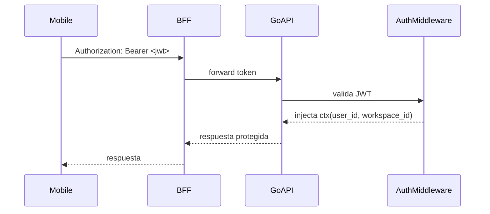
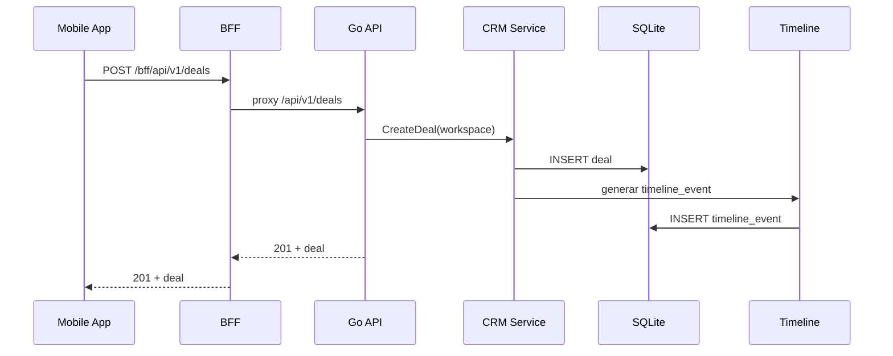
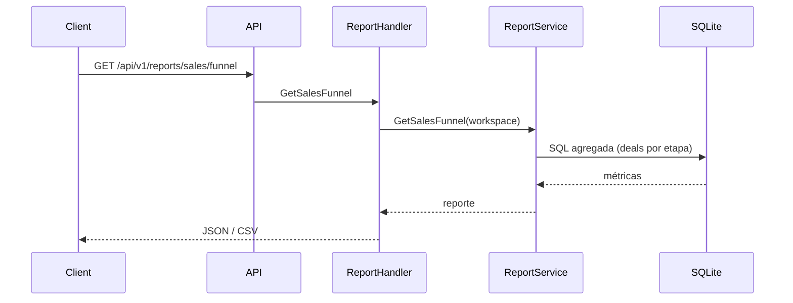
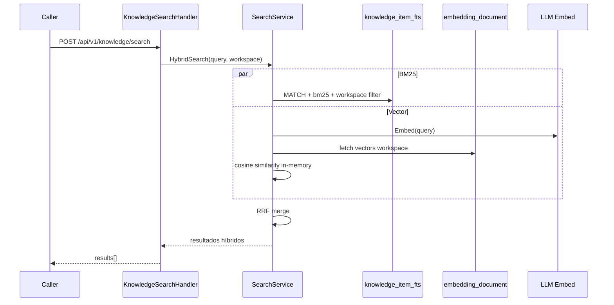
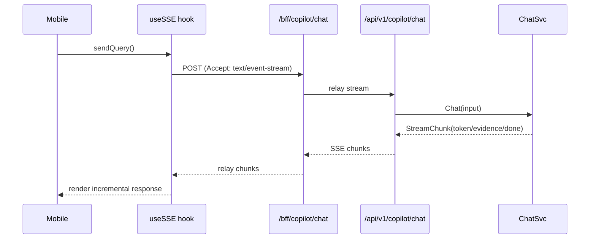
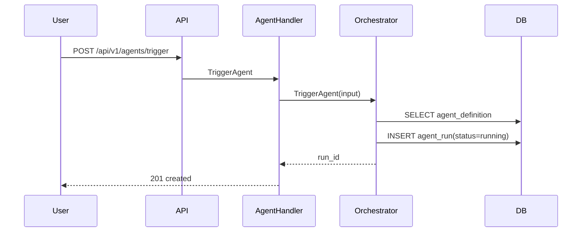
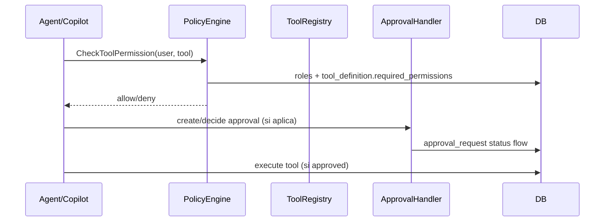
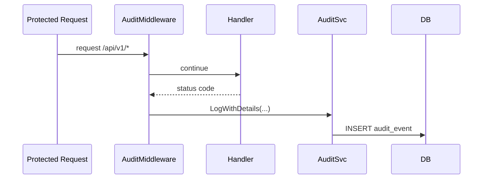
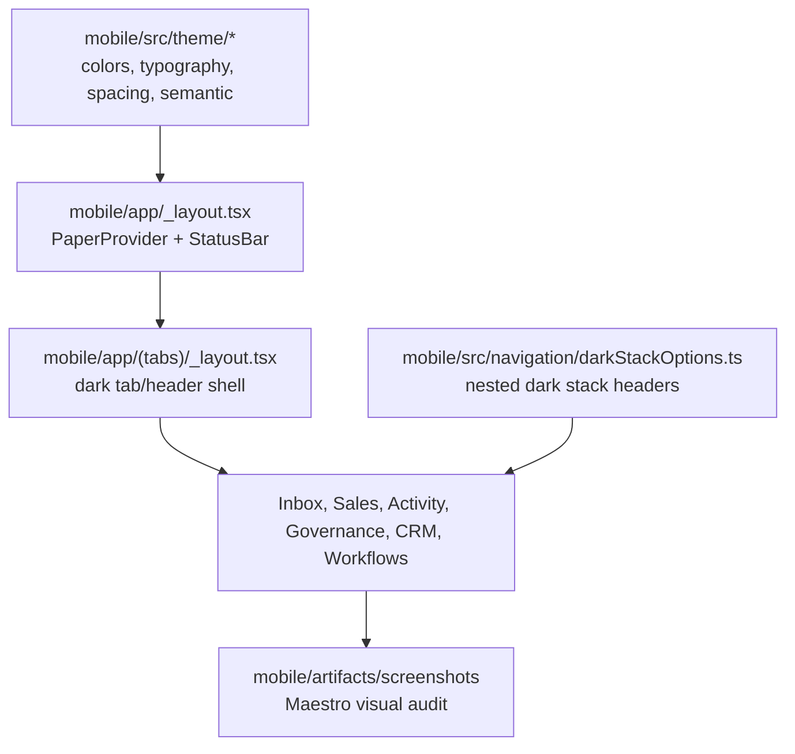

# FenixCRM — Diseño As-Built de Features Implementadas

> **Fecha**: 2026-04-21
> **Objetivo**: documentar el diseño real implementado (as-built), trazando requerimientos ↔ código ↔ datos.
> **Fuentes**: `docs/requirements.md`, `docs/architecture.md`, `docs/implementation-plan.md` + evidencia en `internal/*`, `bff/*`, `mobile/*`.

---

## 1) Matriz resumida de features implementadas

### 1.1 Cobertura exhaustiva de especificaciones versionadas (`reqs/FR/*.yml`)

> Estado evaluado contra requerimientos Doorstop actuales del repositorio.  
> Valores: **Implementado**, **Parcial**, **Pendiente (no implementado)**.

| Spec | Active | Estado as-built | Evidencia principal |
|---|---:|---|---|
| FR-001 Core CRM Entities | ✅ | **Parcial** | `internal/api/handlers/deal.go`, `internal/api/handlers/case.go`, `internal/domain/crm/deal.go`, `internal/domain/crm/case.go`, `internal/api/middleware/audit.go` |
| FR-002 Pipelines and Stages | ✅ | **Implementado** | `internal/infra/sqlite/migrations/004_crm_pipelines.up.sql`, `internal/domain/crm/pipeline.go`, `internal/api/handlers/pipeline.go` |
| FR-051 Timeline | ✅ | **Implementado** | `internal/api/handlers/timeline.go`, `internal/domain/crm/timeline.go`, `internal/infra/sqlite/migrations/008_crm_supporting.up.sql` |
| FR-052 Marketplace | ❌ | **Pendiente (fuera de scope P2)** | `reqs/FR/FR_052.yml` (`active: false`) |
| FR-060 Authentication RBAC/ABAC | ✅ | **Parcial** | `internal/domain/auth/service.go`, `internal/api/middleware/auth.go`, `internal/domain/policy/evaluator.go` |
| FR-061 Approval Workflows | ✅ | **Parcial** | `internal/domain/policy/approval.go`, `internal/api/handlers/approval.go`, migration `015_approval_requests.up.sql` |
| FR-070 Audit Trail | ✅ | **Parcial** | `internal/infra/sqlite/migrations/010_audit_base.up.sql`, `internal/api/middleware/audit.go`, `internal/domain/auth/service.go` |
| FR-071 Policy Engine | ✅ | **Parcial** | `internal/domain/policy/evaluator.go`, migration `014_policies.up.sql` |
| FR-090 Hybrid Indexing | ✅ | **Parcial** | `internal/domain/knowledge/ingest.go`, `internal/domain/knowledge/search.go`, migrations `011/012/013` |
| FR-091 CDC and Auto-Reindex | ✅ | **Parcial** | `internal/domain/knowledge/reindex.go`, `internal/domain/crm/account.go`, `internal/domain/crm/case.go` |
| FR-092 Evidence Packs and Embeddings | ✅ | **Implementado** | `internal/domain/knowledge/evidence.go`, `internal/domain/knowledge/embedder.go`, `internal/api/handlers/knowledge_evidence.go` |
| FR-200 Copilot Q&A | ❌ | **Parcial** | `internal/api/handlers/copilot_chat.go`, `internal/domain/copilot/chat.go`, `mobile/src/hooks/useSSE.ts`, `bff/src/routes/copilot.ts` |
| FR-201 Suggested Actions | ❌ | **Parcial** | `internal/domain/copilot/suggest_actions.go`, `internal/api/handlers/copilot_actions.go` |
| FR-202 Tool Registry | ✅ | **Parcial** | `internal/domain/tool/registry.go`, migration `016_tools.up.sql`, `internal/api/handlers/tool.go` |
| FR-211 Built-in Tools | ❌ | **Parcial** | `internal/domain/tool/builtin.go`, `internal/domain/tool/builtin_executors.go` |
| FR-230 Agent Runtime | ❌ | **Parcial** | `internal/domain/agent/orchestrator.go`, `internal/api/handlers/agent.go`, migration `018_agents.up.sql` |
| FR-231 Support Agent UC-C1 | ❌ | **Parcial** | `internal/domain/agent/agents/support.go`, `internal/domain/agent/agents/prospecting.go`, `internal/domain/agent/agents/kb.go`, `internal/domain/agent/agents/insights.go` |
| FR-232 Human Handoff | ❌ | **Parcial** | `internal/domain/agent/handoff.go`, `internal/api/handlers/handoff.go`, routes `/api/v1/agents/runs/{id}/handoff` |
| FR-240 Prompt Versioning | ❌ | **Parcial** | `internal/api/handlers/prompt.go`, migration `017_prompt_versions.up.sql`, `internal/domain/agent/prompt.go` |
| NFR-030 Performance Targets | ❌ | **Parcial** | `/metrics` en Go+BFF + instrumentación base (`internal/api/routes.go`, `bff/src/routes/metrics.ts`) |
| NFR-031 Traceability and Audit | ✅ | **Parcial** | `Makefile` (`trace-check`, `doorstop-check`, `coverage-*`), `internal/api/middleware/audit.go` |

### 1.2 Conclusión de cobertura

- **No**, la versión anterior del documento era un resumen por bloques y **no listaba explícitamente todos los FR/NFR versionados** de `reqs/FR` uno por uno.
- Con esta actualización sí queda la **matriz exhaustiva**, con estado real (implementado/parcial/pendiente) y evidencia de código por cada spec.

| Feature | FR/NFR principales | Evidencia as-built |
|---|---|---|
| Auth + contexto tenant | FR-060, NFR-030 | `internal/api/middleware/auth.go`, `internal/api/routes.go` |
| CRM Core CRUD + Timeline | FR-001, FR-002, FR-300 | `internal/api/routes.go`, `internal/domain/crm/*`, `mobile/app/(tabs)/*` |
| Reporting base | FR-003 | `internal/api/handlers/report.go`, `internal/domain/crm/report.go` |
| Knowledge híbrido + Evidence | FR-090, FR-092 | `internal/domain/knowledge/search.go`, `internal/api/handlers/knowledge_search.go`, migrations `011/012/013` |
| Copilot streaming (Go + BFF + Mobile) | FR-200, FR-201, FR-202, NFR-072 | `internal/api/handlers/copilot_chat.go`, `bff/src/routes/copilot.ts`, `mobile/src/hooks/useSSE.ts` |
| Runtime de agentes + catálogo mínimo | FR-230, FR-231, FR-232 | `internal/domain/agent/orchestrator.go`, `internal/domain/agent/agents/*`, `internal/api/handlers/agent.go` |
| Governance (policy + approvals + tools + prompts) | FR-071, FR-211, FR-240 | `internal/domain/policy/evaluator.go`, `internal/api/handlers/approval.go`, `internal/api/handlers/prompt.go`, migrations `014/015/016/017` |
| Audit + Observability + Eval básico | FR-070, FR-242, NFR-030/NFR-031 | `internal/api/middleware/audit.go`, `internal/api/handlers/audit.go`, `/metrics` en Go+BFF, `internal/api/handlers/eval.go`, migration `020_eval.up.sql` |

---

## 2) Feature: Auth + Contexto de Workspace

### Diagrama de interacción

### Modelo de datos (feature)

- `workspace`
- `user_account`
- `role`
- `user_role`

Relación clave: `user_account.workspace_id` define aislamiento multi-tenant en todas las rutas `/api/v1/*`.

---

## 3) Feature: CRM Core + Timeline (Accounts, Contacts, Leads, Deals, Cases, Activities, Notes, Attachments)

### Diagrama de interacción

### Modelo de datos (feature)

- Core: `account`, `contact`, `lead`, `deal`, `case_ticket`, `pipeline`, `pipeline_stage`
- Soporte: `activity`, `note`, `attachment`, `timeline_event`

Relaciones destacadas:
- `deal.account_id -> account.id`
- `deal.stage_id -> pipeline_stage.id`
- `case_ticket.owner_id -> user_account.id`
- `timeline_event(entity_type, entity_id)` como historial transversal.

---

## 4) Feature: Reporting Base

### Diagrama de interacción

### Modelo de datos (feature)

- Tablas usadas: `deal`, `pipeline_stage`, `case_ticket`, `activity`
- Salidas: agregaciones (funnel, aging, backlog, volume) + export CSV.

---

## 5) Feature: Knowledge Híbrido + Evidence Pack

### Diagrama de interacción

### Modelo de datos (feature)

- `knowledge_item`
- `embedding_document`
- `vec_embedding` (tabla/vector store asociado)
- `knowledge_item_fts` (FTS5)
- `evidence`

Notas as-built:
- FTS5 y triggers en migration separada `012_knowledge_fts.up.sql`.
- Aislamiento por `workspace_id` aplicado en búsquedas.

---

## 6) Feature: Copilot Streaming End-to-End (Go + BFF + Mobile)

### Diagrama de interacción

### Modelo de datos (feature)

- Datos de contexto CRM (`deal`, `case_ticket`, `activity`, `note`)
- Knowledge/Evidence (`knowledge_item`, `evidence`)
- Auditoría de interacción en `audit_event`.

---

## 7) Feature: Runtime de Agentes + Agentes Especializados

### Diagrama de interacción

### Modelo de datos (feature)

- `agent_definition`
- `skill_definition`
- `agent_run`
- `case_ticket` (handoff/escalado)

Agentes expuestos vía API:
- support
- prospecting
- kb
- insights

---

## 8) Feature: Governance (Policy, Approvals, Tooling, Prompt Versioning)

### Diagrama de interacción

### Modelo de datos (feature)

- `policy_set`, `policy_version`
- `approval_request`
- `tool_definition`
- `prompt_version`

Relación importante:
- `agent_definition.active_prompt_version_id -> prompt_version.id`.

---

## 9) Feature: Audit, Observabilidad y Eval Básico

### Diagrama de interacción

### Modelo de datos (feature)

- `audit_event`
- `eval_suite`
- `eval_run`

Observabilidad as-built:
- Go: `/health`, `/metrics`
- BFF: `/bff/health`, `/bff/metrics`
- Mobile: integración Sentry en `mobile/app/_layout.tsx`.

---

## 10) Feature: Mobile Operational UI Shell (FR-300)

### Diagrama de composición

### Estado as-built

- La app mobile usa `MD3DarkTheme` como base en `mobile/src/theme/index.ts`.
- `mobile/src/theme/colors.ts` define la paleta Command Center dark y `semanticColors`.
- `mobile/src/theme/semantic.ts` centraliza colores de estados de agent runs, CRM statuses, outcomes de audit, prioridad y confidence.
- `mobile/src/theme/typography.ts` y `mobile/src/theme/spacing.ts` centralizan tokens de tipografía, radius, spacing y elevación.
- `mobile/src/navigation/darkStackOptions.ts` evita headers blancos en stacks anidados como CRM y Workflows.
- La superficie visual cubierta por Maestro incluye login, Inbox, Support, Sales, Activity, Governance, Workflows y CRM hub/list/detail/form surfaces.

### Alcance

Este bloque actualiza la presentación de FR-300 y no introduce contratos funcionales nuevos. Por tanto, no requiere feature BDD nueva; la validación vive en TypeScript/lint/tests mobile y Maestro screenshots.

---

## 11) Notas de consistencia y gaps as-built detectados

1. **BFF aggregation y handoff**: en `bff/src/routes/aggregated.ts` se consulta `GET /api/v1/handoffs/{id}`; las rutas Go principales de handoff están bajo `/api/v1/agents/runs/{id}/handoff`.
2. **Search vector**: implementación actual usa recuperación de `embedding_document` + similitud coseno en memoria (`search.go`), además de FTS5 BM25 + RRF.
3. **Scope móvil**: Deals/Cases list-create-update y panel Copilot sí están implementados en rutas/screens de Expo Router.

---

## 12) Trazabilidad final (resumen)

- Requerimientos y arquitectura piden evidencia-first, actions via tools, governance y auditabilidad.
- Implementación as-built cubre los bloques núcleo: CRM, Knowledge, Copilot, Agents, Governance, Audit/Observability/Eval.
- El presente documento sirve como baseline de diseño técnico para auditoría de cumplimiento y evolución de features.
