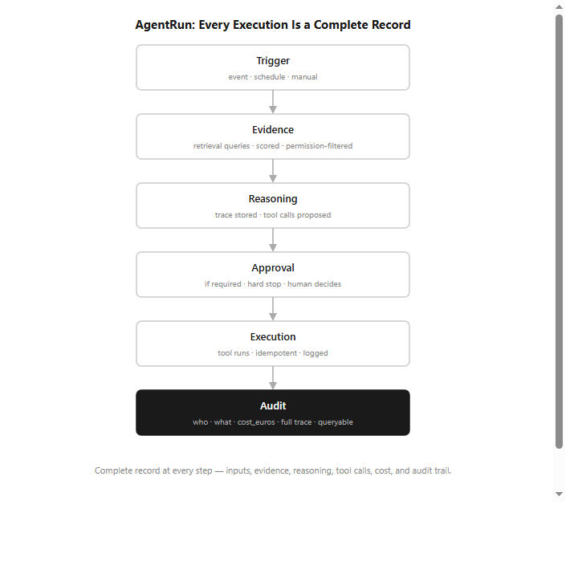
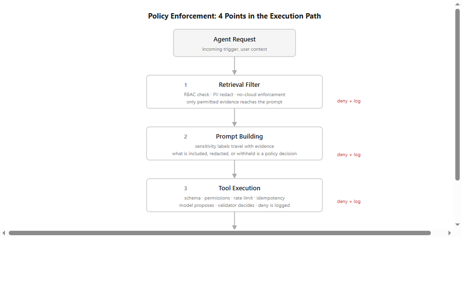

# FenixCRM: The Accountability Layer

*This follows [an earlier piece](https://iotforce.medium.com/crm-is-becoming-an-operating-system-not-a-database-bcf673429ffd) on making CRM an agent. But agents that act without accountability are just a faster way to lose control. This article is about how I built that accountability.*

---

The first article ended with a question: what stops a CRM agent from acting on bad data, leaking sensitive information, or running up costs no one approved?

That question is not hypothetical. It is the first real problem you hit when you start building agents that do actual work.

The answer is not better prompts. It is not a smarter model. It is a layer of accountability built into the system itself — so that every agent action is traceable, every sensitive decision requires human approval, every cost is visible, and every change to agent behavior is tested before it reaches production.

That is what this article is about.

---

## When the agent gets it wrong

Imagine a support agent in your CRM handles an incoming customer complaint. It retrieves the account history, reads recent interactions, drafts a response, and proposes to update the case status. Sounds useful.

Now imagine it gets it wrong. It cited a note from the wrong account. Or it proposed closing a case that should have been escalated. Or it sent a response before anyone approved it.

What happened? Where in that sequence did it break?

Without a complete record of what the agent did — what data it looked at, what it decided, what it tried to do — you have no way to answer that. You're reading scattered logs and guessing.

That is the problem FenixCRM is designed to avoid.

---

## Every action leaves a complete record

Every time an agent runs in FenixCRM, the system produces a single record that captures the full sequence: what triggered it, what data it retrieved, what it reasoned, what actions it proposed, whether those actions were approved, what the output was, and what it cost.

Not a log file. Not a status update. A complete, queryable record of a decision.

That record is what makes auditability possible. When something goes wrong, I'm not guessing. I can look at what actually happened, step by step, and find exactly where it broke.

---

## Humans stay in the loop — by design

Most AI CRM systems have an approval dashboard somewhere. You can review what the agent did after the fact. That is not human oversight. That is a notification.

Real oversight means the agent cannot take a sensitive action without a human decision first. Not a log you check later. A stop in the process.

In FenixCRM, every agent action passes through four points of control before anything happens:

1. **What data the agent can see** — filtered by permissions before it ever reaches the AI. The agent cannot hallucinate about data it was never allowed to access.

2. **What goes into the AI's context** — sensitive fields are redacted by policy, not by the model. The model cannot override this.

3. **What actions the agent can take** — the agent proposes actions, but cannot execute them. If an action requires approval, the process stops until a human says yes. This is a hard stop, not a suggestion.

4. **What the user sees in the output** — visibility rules apply before the response reaches anyone. A sales rep and a manager see different things from the same agent, by design.

The important point is that this is not a feature you turn on when you want oversight. It is the default. The agent cannot bypass it.

---

## The cost problem

AI agents are not cheap to run. A single interaction can involve multiple data retrievals, several calls to a language model, and one or more actions executed. Multiply that across a team, and the cost becomes invisible quickly.

Most AI systems show you a monthly total. That is not enough. If something is expensive, I need to know which agent is driving the cost. What kind of interactions. What the average cost per resolved case is.

FenixCRM records the cost of every single agent execution. That means I can see exactly where the money is going and set limits per agent, per role, or per team. When a limit is hit, the system doesn't just send an alert — it slows down or stops until the window resets, or degrades gracefully to a cheaper alternative.

---

## Changing agent behavior safely

A prompt is not configuration. When you change how you instruct the agent, you change how it behaves — and the consequences can be subtle and take weeks to surface.

Before any change to agent instructions or policies reaches production in FenixCRM, it has to pass a set of quality checks: Does the agent still ground its answers in actual evidence? Is it still abstaining correctly when it doesn't know something? Is it still respecting all policies?

If any check fails, the change doesn't ship. Every version is stored. Rolling back is one operation.

This is not about being cautious for the sake of it. It is about not finding out that something broke three weeks after it happened.

---

## Owning the infrastructure

None of this accountability is worth much if the audit trail lives in someone else's system. A vendor can change their terms, limit your access, or simply go down.

FenixCRM runs entirely on my own infrastructure. One command to start. No mandatory cloud service. The AI model can be local or cloud — swapping it out does not touch the governance layer.

The data sovereignty policy is enforced in code: when active, sensitive data is redacted before it leaves the system, regardless of which model is configured. This is not a setting. It is a guarantee.

---

## What this is, and what it isn't

FenixCRM is a working POC, not a production system. But I built these mechanisms in from the start — not as an afterthought.

The reason is simple: if I want to put agents in production at some point, I need to know I can trust them. That trust doesn't come from the model. It comes from the system around the model — the audit trail, the approval gates, the cost controls, the quality checks.

Most AI CRM demos show you what the agent can do. They skip the part about what happens when it does something wrong.

That gap is what I'm trying to close.

The code is open source: [REPO_URL]

---

*[earlier piece](https://iotforce.medium.com/crm-is-becoming-an-operating-system-not-a-database-bcf673429ffd)*
