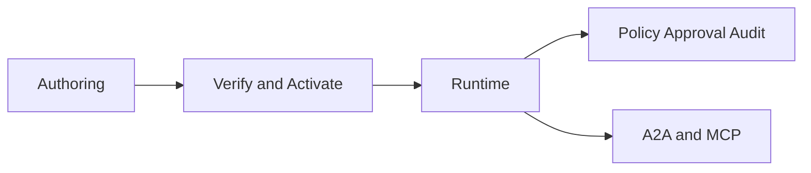
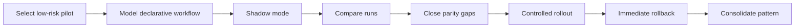

# CRM Is Becoming an Operating System, Not a Database

*The real shift is not adding AI to CRM. It is redesigning CRM so it can observe, decide, act, wait, delegate, and remain accountable.*

There is a point where a software category stops needing another feature and starts needing a new shape.

I think CRM has reached that point.

For years, SaaS sold a familiar promise: put your process into software, centralize the data, add dashboards, add permissions, add automation, and scale by adding more seats. That model worked. It built big companies and useful products. But it also produced a lot of software that feels heavy, expensive, and oddly passive.

CRM is one of the clearest examples.

Most CRMs are still very good at storing the past. They store contacts, deals, cases, timelines, notes, and activity logs. They are much less good at helping work move forward in the present. The real work still happens in conversations, decisions, escalations, and follow-ups. The CRM gets updated later, often manually, and the system ends up lagging behind reality.

Then the market adds a chatbot on top and calls it an AI strategy.

That is the part that no longer feels ambitious enough.

Even the strongest products in the market, including Salesforce, often frame the agent model as an extra layer around the product, not as the product's operating core. The CRM remains the same system underneath. The "agent" becomes a better interface, not a better operational model.

I think that misses the real opportunity.

The important shift is not from software without AI to software with AI.

It is from software that records work to software that can participate in the work itself.

That is the idea behind FenixCRM.

## The real problem is not intelligence. It is passivity.

Classic CRM assumes that the record is the center of gravity.

You create an account. You create a contact. You create a case. You create a deal. Then the team is responsible for keeping everything updated enough for the system to remain useful.

That creates a pattern everyone recognizes:

- the meaningful work happens somewhere else
- the CRM gets updated after the fact
- the system becomes a mirror of yesterday rather than a participant in today

There is also an economic problem hidden inside that model. A lot of enterprise software still charges for storage, visibility, seats, and integrations while the hardest part of execution remains manual. When software mostly documents work instead of helping do the work, the value starts to feel indirect.

That is why the current wave matters so much.

Once systems can observe context, use tools, ask for approval, wait for the right moment, and leave a trustworthy trace, it becomes harder to justify software that mainly waits to be updated by humans.

So the question is no longer:

**How do we add AI to the CRM?**

The better question is:

**What should a CRM look like if signals, workflows, approvals, and agents are part of the product from day one?**

## The center of gravity moves from the record to the signal

In FenixCRM, records still matter. You still need accounts, contacts, leads, deals, and cases. A CRM cannot stop being a CRM.

But the operational center is not the record. It is the signal.

A signal is a useful conclusion backed by evidence. It is not just raw data and it is not just a score floating in a dashboard. It is a meaningful operational statement. For example:

- this lead is showing real buying intent
- this support case should escalate now
- this account needs follow-up this morning
- this deal is likely to stall without intervention

That sounds like a small semantic shift.

It is not.

Once the signal becomes the key object, the product changes shape:

- data is no longer the final destination
- events can become evidence
- evidence can become signals
- signals can trigger workflows
- workflows can coordinate tools, approvals, and next actions

That turns CRM from a passive database into a system of action.

This is the core mental model:

> Records explain what exists. Signals explain what matters next.

That distinction is the difference between software that stores context and software that helps move a business forward.

## Why workflow has to become part of the product

A lot of business software still treats workflow as background plumbing. It is either hidden in code, buried in admin screens, or spread across internal habits that nobody fully documents.

That was tolerable when the product mostly stored information.

It becomes a real limitation when the system is expected to participate in execution.

If a CRM is going to react to a signal, decide what to do, ask for approval, wait, resume later, or delegate to another agent, then the workflow cannot remain hidden. It has to become explicit, inspectable, and governable.

That is why FenixCRM treats workflows as first-class product behavior, not as an implementation detail.

In practical terms, that means:

- workflows are authored as clear operational logic
- they are verified before activation
- they are versioned
- they can be tested, activated, archived, and rolled back
- they leave traces when they run

That may sound technical, but the product consequence is simple: the organization can see how the system behaves.

That matters more than it sounds.

Much of what businesses call "process" today is really a mixture of:

- code someone wrote long ago
- conventions that live in people's heads
- manual compensations when automation falls short

Once workflow becomes explicit, the system becomes easier to inspect, improve, and trust.

## Why chat is useful but not enough

Chat matters. It is a valuable interface. It can make a system more accessible, faster to use, and easier to explore.

But chat is still just an interface.

It is not the operating model.

The bigger opportunity appears when the system can do things like this:

- react to an event
- evaluate context
- run a workflow
- use tools safely
- ask for human approval when needed
- wait and resume later
- delegate work to another agent
- keep a trustworthy trace of what happened

That is a much larger shift than letting someone ask a CRM a question in natural language.

This is why I think the phrase "AI-powered CRM" often undersells the real transformation.

It makes the story sound like a smarter front end.

The more important story is the emergence of a new operating layer.

The future CRM is not just conversational.

It is active, structured, and accountable.

## What this looks like in a real operating loop

Support is a good example because it makes the change easy to see.

Imagine a customer sends an angry message after a delayed onboarding issue.

In a classic stack, something like this often happens:

1. a person reads the message
2. someone classifies the issue
3. someone updates the case
4. someone else notifies the owner
5. another person decides whether to escalate
6. the CRM reflects the situation only after several manual steps

The system mostly records the aftermath.

In the model FenixCRM is moving toward, the loop is different:

1. the incoming message becomes an event
2. the event becomes evidence
3. the evidence produces a signal
4. the signal triggers a workflow
5. the workflow can summarize the issue, classify urgency, update the case, notify the right owner, draft the next action, and ask for approval if a sensitive action is proposed

The important point is not full automation.

The important point is that the transition from observation to action becomes structured.

That changes how you evaluate quality too.

Instead of asking only whether the answer sounded smart, you can ask:

- was the signal correct?
- was the workflow appropriate?
- were sensitive actions stopped or approved correctly?
- did the human have enough context to make a decision?
- is the trail clear enough to audit afterward?

Those are stronger product questions than "did the assistant sound good?"

## What "agentic" should really mean in business software

The word "agentic" is already getting diluted.

Sometimes it means little more than "there is a chat box and a language model."

In a serious business system, I think it has to mean something stricter.

An agentic product should be able to:

- act on evidence, not only answer questions
- operate inside workflows, not only generate text
- use tools instead of improvising side effects
- respect approvals and rules
- remember that timing matters
- leave a clear audit trail

That is why the FenixCRM direction includes a few pieces that matter a lot conceptually:

- a **judge** that verifies workflows before they are activated
- a **runtime** that executes them consistently
- **signals** as first-class outputs
- **deferred actions** so the system can wait and resume later
- **human approval** for sensitive actions
- **delegation** so work can be handed off rather than forced into one monolithic agent

Those pieces are not decorative architecture.

They are what turns "AI behavior" into something product teams can actually govern.

## Why human control becomes more important, not less

One of the shallowest readings of the current wave is that the goal is to remove humans from the loop.

I do not think that is what serious systems should optimize for.

The better goal is to reduce low-value manual coordination while increasing control over meaningful decisions.

That is a different ambition.

In this model, humans are not there to micromanage every step. They are there to intervene where judgment, risk, policy, or accountability matter.

That is why approvals are so central.

If a system can draft a sensitive customer reply, escalate a case, update an important record, or delegate work to another agent, then "human in the loop" cannot just be a slogan. It needs to be built into the operating model.

That is also why trace matters so much.

A trustworthy system is not only one that can act. It is one that can explain:

- what signal was detected
- what workflow ran
- what tool was used
- whether approval was required
- who approved it
- what happened next

That is how you move from demo intelligence to operational trust.

## Why delayed work matters more than it first appears

One of the most underrated differences between a chatbot and an operational system is the ability to wait.

Real business work is not one uninterrupted session. It stretches across time.

A case may need a follow-up tomorrow. A lead may need a nudge in two days. A decision may depend on an approval arriving later. An agent may need to pause, resume, and continue with fresh state.

That is why deferred actions matter so much conceptually.

A system that can wait, resume, and continue work safely is starting to behave less like an interface and more like an operating layer.

That sounds like infrastructure, but it is actually product behavior.

Without that capability, a lot of "AI automation" remains trapped in a single interaction.

With it, the system starts to participate in the real rhythm of work.

## Why delegation changes the shape of the CRM

Another important shift is delegation.

Once the system can decide that another specialized agent should handle a task, the CRM no longer behaves like a single app with one helper attached to it. It starts to behave like a governed network of capabilities.

That matters because not all work belongs to the same specialist.

A support-related signal might need:

- a customer-facing response
- a risk classification
- an internal escalation
- an account-level commercial review

Those are different forms of work. In a mature system, they should not all be squeezed into one generic assistant.

This is where agent delegation becomes important: not as a gimmick, but as a way to preserve specialization without losing coordination.

## Why standards matter

If this model is real, it cannot stop at one application boundary.

That is why interoperability matters so much in the long term:

- **A2A** for agent-to-agent delegation
- **MCP** for tools, resources, and context

You do not need to know the acronyms to understand the product point.

The point is this: if agents are going to collaborate across systems, then the CRM should not be designed like a sealed workspace with one assistant trapped inside it. It should behave like a governed participant in a wider ecosystem.

That is a much better fit for the current wave of software than the old model of a monolithic SaaS product with a few AI features stapled onto it.

## This changes how software gets built too

One reason I find this shift so interesting is that it changes not only the product, but also the shape of product work.

Once workflow becomes explicit, a lot of hidden logic becomes visible.

Once approvals and signals become first-class concepts, the handoff between product, engineering, operations, and policy becomes clearer.

Once agent behavior is structured, the quality conversation improves too. Teams can stop arguing only about whether the output sounded clever and start asking better questions:

- is the workflow right?
- is the signal definition right?
- are the approvals in the right place?
- are the traces useful?
- is the system safe enough to trust with real work?

That is one reason this feels bigger than a feature trend.

It changes the software, but it also changes the way teams think about what software is for.

## The short version

FenixCRM is an attempt to rethink CRM for an agentic era.

Not as a database with a chatbot attached.

Not as another SaaS layer that mostly documents work after it happens.

But as a system where:

- evidence produces signals
- signals trigger workflows
- workflows drive governed actions
- humans stay in control where it matters
- work can pause, resume, and delegate safely

The old CRM was built to remember.

The next CRM will be built to participate.

To me, that is a much stronger foundation for what CRM is becoming.
