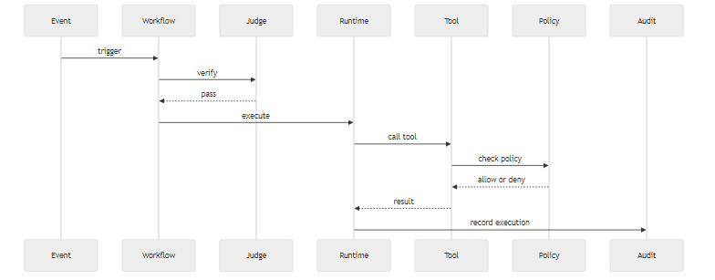
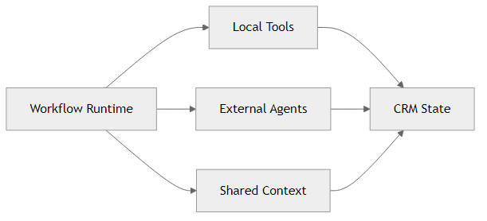

# The CRM Needs Agents Around It, Not Layered on Top.

For years, SaaS kept shipping the same basic promise: put your process in software, add dashboards, add automation, add seats, and grow.

That worked for a while. Now it feels tired.

A lot of software became expensive systems of record that people update because they have to, not because the product is truly helping work move forward.

That is especially obvious in CRM.

Most CRMs are still built around the same old idea: store contacts, store deals, store cases, and ask humans to keep everything up to date. Then bolt on a copilot and call it AI.

Even the strongest commercial products, including platforms like Salesforce, still tend to position the agentic model as an annex to the core product, not as the core product itself. The CRM remains the old system underneath, and the "agent" is presented as a smarter interface sitting on top of it.

That is not enough anymore.

The new wave is agentic software. Not just chat. Not just generation. Systems that can observe, reason, act, ask for approval, and operate inside a business process.

That is also why I think chat is a poor approximation of the opportunity. Chat can be useful as an entry point, but it is not the model. A conversation box is still just an interface. The real value appears when the system can hold context, trigger workflows, use tools, ask for approvals, coordinate actions, and leave a reliable trace of what happened.

That changes the question completely.

Instead of asking, "How do we add AI to a CRM?", the better question is:

**what should a CRM look like if agents are part of the operating model from day one?**

That is the idea behind FenixCRM.

## The old model is breaking

The classic SaaS model is starting to show its limits: too much manual data entry, too many stale records, too many tools pretending to be workflows, and too much "system of record" with too little "system of action."

In practice, the real work is happening somewhere else: in conversations, support threads, research, follow-ups, decisions, and small operational signals that never get modeled properly.

So the CRM ends up lagging behind reality.

There is also a business problem behind this. A lot of SaaS became harder to justify because the value is often indirect: pay for more seats, pay for more dashboards, pay for more integrations, and then still depend on people to keep the machine alive.

That is fine when software is mainly a place to store information. It is much less convincing when teams expect software to help execute the work itself.

The post-SaaS shift, at least to me, is about that difference. The next generation of software will not win because it stores more objects. It will win because it helps teams move with less friction between observation, decision, and action.

There is a psychological part to this too. People have learned to tolerate software that creates admin work around the real work. They update the CRM after the call, rewrite the context for the next team, copy the same information into tickets, and maintain a fiction of cleanliness because the system needs it. Once agents enter the picture, that tradeoff starts to look ridiculous. If software can understand context, execute steps, and keep state consistent, then forcing humans to do bookkeeping starts to feel like a design failure.

## A different starting point

We are building from a different assumption:

**the key unit is not the record. It is the signal.**

A signal is a useful operational conclusion backed by evidence. It could be that a lead has high intent, a deal is at risk, a case should escalate, or an account needs follow-up now.

Once you think like that, the CRM stops being a passive database.

It becomes a system that can detect what matters and help act on it.

And that feels much closer to how teams already behave in reality. Sales, support, and operations do not wake up thinking in tables. They think in urgency, risk, momentum, blockers, and next steps. Those are all signals.

## So what is FenixCRM?

FenixCRM is a CRM designed for humans and agents to work in the same loop.

It combines:

- CRM entities like accounts, contacts, leads, deals, and cases
- agents that can execute work
- workflows that describe what should happen
- policy, approvals, and audit so the whole thing stays under control

The point is not to let agents run wild. The point is to make the CRM operational without turning it into chaos.

That means agents use tools instead of mutating data however they want, policy can allow or block actions, humans can approve sensitive steps, and every important execution leaves an audit trail.

If you zoom out, the product is trying to connect three worlds that are usually fragmented:

- the data model of the business
- the operating logic of the team
- the execution capabilities of agents

Normally those live in different places. The CRM stores data, people improvise process in meetings and documents, and automation gets stitched together later. FenixCRM tries to close that gap.

I think that is one of the most important product opportunities right now. Not building yet another interface for existing systems, but collapsing layers that should have been together in the first place.

## The big shift

Most software today still treats workflows like hidden implementation details.

We want the opposite.

In FenixCRM, the workflow should become visible.

It should be understandable, verifiable, and executable.

That is why the direction is moving toward declarative workflows: a workflow defines what should happen, a judge verifies it before activation, a runtime executes it, and tools perform the concrete operations.

This matters because business logic should not live forever as hidden code and tribal knowledge.

It should be something the system can explain and the team can evolve.

## Why this feels more adapted to the new wave

The current AI wave is not only about better answers. It is about better execution.

Companies do not just want language models that sound smart. They want systems that can resolve support work with traceability, trigger outreach from real evidence, detect risk before it becomes visible in a dashboard, and coordinate actions across humans and agents.

That is where a new CRM model starts to make sense.

Not "AI on top of CRM."

A CRM designed around execution from the start.

In most current products, the agentic layer is still framed like an assistant feature: ask a question, get a response, maybe trigger an action. That keeps the center of gravity in the old model. What we are building is different: a system where workflows, signals, approvals, and governed actions are part of the operating core, not a helpful add-on.

The interface is no longer the whole product. The system behavior is part of the product. The quality of the workflow, the approvals, the audit, and the trace are now part of the user experience too.

## This is also an experiment

There is another reason to build this now: we are still learning what post-SaaS software should feel like.

So FenixCRM is not only a product idea. It is also a product experiment.

The experiment is simple: take a familiar category like CRM, rebuild it around signals, workflows, agents, approvals, and audit, and see if that produces a better operating model than the classic record-and-dashboard approach.

One concrete product exercise could be this:

build a support and revenue workflow for a B2B company where the system can detect escalation risk, suggest the next action, draft the response, update the case, notify the owner, and ask for approval only when the action is sensitive.

That is much more interesting than building "a CRM with AI features."

It is a focused test of whether software can move from passive storage to governed execution.

And it is a good test because it is messy enough to be real. Support, success, and sales often overlap in these situations. There are multiple stakeholders, multiple sources of context, and a lot of chances to either over-automate or under-automate. If the model works there, it is a decent sign that the product is solving something structural rather than just producing a nice demo.

## What this could look like in practice

Imagine a customer sends a frustrated message after a delayed onboarding issue.

In a traditional stack, that message might sit in support, someone might update the case later, an account manager may or may not be notified, and the CRM will reflect the situation after several manual steps.

In the model we are aiming for, the message becomes an event. The event becomes evidence. The evidence produces a signal like "escalation risk is high." That signal can trigger a workflow: summarize the issue, draft a response, notify the owner, create the right follow-up task, and ask for approval before sending anything sensitive.

The important thing is not that everything is automated. The important thing is that the handoff between detection, action, and human control becomes structured.

That is the kind of product exercise that makes this idea tangible. You stop talking about generic AI possibilities and start looking at a concrete operating loop that can actually be improved.

It also creates a better way to evaluate product quality. Instead of asking whether the AI answer sounded good, you can ask more useful questions: Was the signal correct? Was the workflow appropriate? Did policy intervene where it should? Did the human see enough context to approve or reject confidently? Did the system leave a trustworthy trail afterward? Those are much stronger product questions.

## The work format matters too

This new wave is not only changing products. It is changing how products are built.

A useful workflow for teams working this way looks more like this: define the use case clearly, make the workflow explicit, decide which steps are automated and which require approval, verify the logic before activation, observe the run, the trace, and the result, and adjust the workflow instead of endlessly patching hidden code.

That matters because the user experience is no longer just a screen.

It is also about how humans delegate work, how agents ask for approval, how the system explains what it did, and how a team improves a workflow over time.

So part of the product is the runtime, but part of the product is also the working method around it.

That is why we care so much about workflows, traceability, and explicit decisions. They are not just technical details. They shape the experience.

## It also has to work with the outside world

If this is going to be a serious system, it cannot be closed.

That is why the interoperability direction matters too: **A2A-first** — the emerging standard for agent-to-agent delegation across systems — and **MCP-first** — Model Context Protocol, the standard for sharing tools, resources, and context across system boundaries.

And I do not see that as some peripheral integration concern. I think it belongs in the core model.

If agents are going to operate across systems, teams, and products, then standard interaction protocols should not be treated like optional adapters that get added at the end. They should shape the product from the start.

In practice, that means workflows should be able to delegate work to external agents, tools and context should cross system boundaries cleanly, and the CRM should be able to participate in a larger network of systems instead of pretending everything important happens inside one app.

This matters for product design as much as for engineering. Once you assume A2A and MCP are part of the core, the CRM stops looking like a closed workspace and starts looking more like an operational node in a broader ecosystem.

So the system can stay internally coherent while still participating in the broader agent ecosystem.

Another way to picture it is this:

That is closer to the mental model we are aiming for. FenixCRM is not just software that stores customer information. It is a governed execution layer sitting between human teams, business events, external agents, and shared operational context.

To me, that is a much stronger framing than "add a chatbot to the CRM." A chatbot can help you access the system. These protocols help the system become part of a wider operational fabric. That is a very different ambition, and I think it is much closer to where this wave is actually going.

## The short version

FenixCRM is our attempt to rethink CRM for an agentic era.

Not as a database with a chatbot attached. Not as another SaaS wrapper around manual work.

But as an operational system where evidence produces signals, signals trigger workflows, workflows drive actions, and humans stay in control where it matters.

That feels like a much better foundation for what customer work is becoming.
