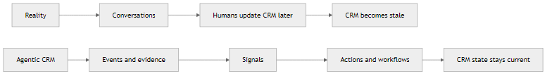
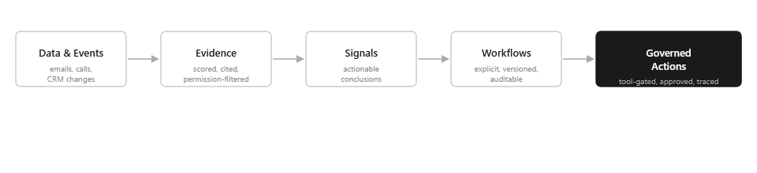
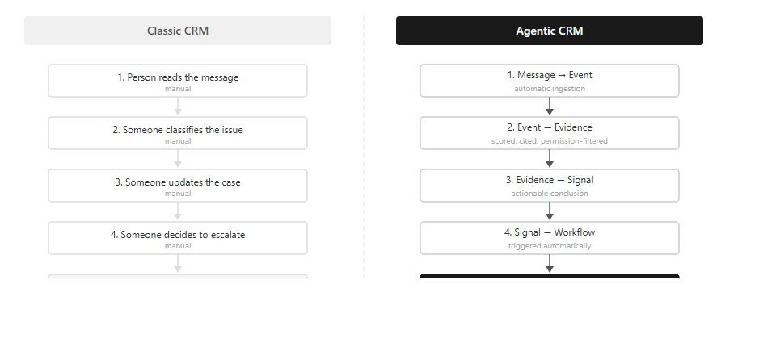
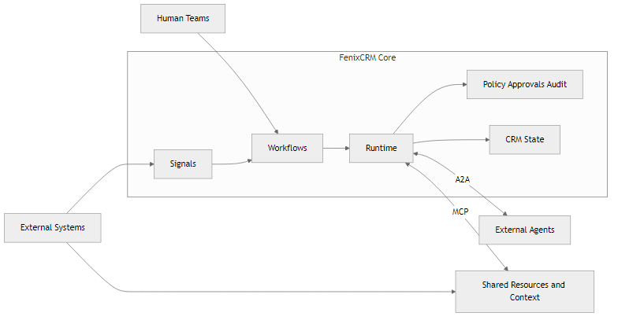

# CRM Is Becoming an Operating System, Not a Database

I have been following the "AI CRM" wave for a while now. And the more I watch it, the more I think most of it is solving the wrong problem.

The demos are impressive. The marketing is confident. But when you look closely, what most products are shipping is a smarter front end on top of the same passive system underneath. A better way to summarize a deal. A faster way to draft an email. A chatbot that can answer questions about your pipeline.

That is useful. It is not transformative.

I started building FenixCRM because I wanted to see what it looked like to take the other direction — to redesign the system itself, not just the interface. To ask: what if the CRM could observe, decide, act, wait, delegate, and remain accountable? Not as an add-on, but as the operating model from day one.

This is what I have learned so far.

---

Most CRMs are still very good at storing the past. The real work — conversations, decisions, escalations, follow-ups — happens somewhere else. The CRM gets updated after the fact, and the system ends up lagging behind reality.

Then the market adds a chatbot on top and calls it an AI strategy.

The important shift is not from software without AI to software with AI. It is from software that records work to software that can participate in the work itself.

That is the idea behind FenixCRM — an open-source project where some of this is already built, some is being built, and this article is about the direction.

## The center of gravity moves from the record to the signal

In FenixCRM, records still matter. You still need accounts, contacts, leads, deals, and cases. A CRM cannot stop being a CRM.

But the operational center is not the record. It is the signal.

A signal is a useful conclusion backed by evidence. It is not just raw data and it is not just a score floating in a dashboard. It is a meaningful operational statement. For example:

- this lead is showing real buying intent
- this support case should escalate now
- this account needs follow-up this morning
- this deal is likely to stall without intervention

That sounds like a small semantic shift.

It is not.

Once the signal becomes the key object, the product changes shape:

- data is no longer the final destination
- events can become evidence
- evidence can become signals
- signals can trigger workflows
- workflows can coordinate tools, approvals, and next actions

That turns CRM from a passive database into a system of action.

> Records explain what exists. Signals explain what matters next.

## What this looks like in a real operating loop

Support is a good example because it makes the change easy to see.

Imagine a customer sends an angry message after a delayed onboarding issue.

In a classic stack, something like this often happens:

1. a person reads the message
2. someone classifies the issue
3. someone updates the case
4. someone else notifies the owner
5. another person decides whether to escalate
6. the CRM reflects the situation only after several manual steps

The system mostly records the aftermath.

In the model FenixCRM is moving toward, the loop is different:

1. the incoming message becomes an event
2. the event becomes evidence
3. the evidence produces a signal
4. the signal triggers a workflow
5. the workflow can summarize the issue, classify urgency, update the case, notify the right owner, draft the next action, and ask for approval if a sensitive action is proposed

The important point is not full automation.

The important point is that the transition from observation to action becomes structured.

That changes how you evaluate quality too.

Instead of asking only whether the answer sounded smart, you can ask:

- was the signal correct?
- was the workflow appropriate?
- were sensitive actions stopped or approved correctly?
- did the human have enough context to make a decision?
- is the trail clear enough to audit afterward?

Those are stronger product questions than "did the assistant sound good?"

## What "agentic" should actually mean

The word is already getting diluted. Sometimes it means little more than "there is a chat box and a language model."

In a serious business system, an agentic product should act on evidence, operate inside governed workflows, use registered tools, respect approvals, and leave a clear audit trail. Not generate text — participate in work.

That also means the goal is not to remove humans from the loop. The goal is to reduce low-value coordination while increasing control over meaningful decisions. Approvals, trace, and accountability are not overhead — they are what turns demo intelligence into operational trust.

And three capabilities separate a real system from a chatbot with a CRM connection: the ability to **wait** (work stretches across time), the ability to **delegate** (different signals need different specialists), and the ability to **collaborate across systems** — where standards like A2A and MCP will matter in the longer term.

## The short version

FenixCRM is an attempt to rethink CRM for an agentic era.

Not as a database with a chatbot attached.

Not as another SaaS layer that mostly documents work after it happens.

But as a system where:

- evidence produces signals
- signals trigger workflows
- workflows drive governed actions
- humans stay in control where it matters
- work can pause, resume, and delegate safely

The old CRM was built to remember.

The next CRM will be built to participate.

But participation without accountability is just a faster way to lose control. That is what the next article is about.

## What's built today

FenixCRM is not a slide deck. It is a working codebase. The governance layer, eval-gating, cost control, and audit trail described in this series are implemented — not planned.

The backend is written in **Go 1.22+** with go-chi, using **SQLite** in WAL mode as the single data store — with FTS5 for full-text search and sqlite-vec for vector similarity. An **Express.js BFF** (Backend-for-Frontend) sits between the mobile client and the Go API, handling auth relay, request aggregation, and SSE streaming proxy. The mobile app uses **React Native + Expo** with React Native Paper (Material Design 3).

What is implemented and tested today:

- **CRM core**: Account, Contact, Lead, Deal, Case, Activity, Note, Attachment — full CRUD with multi-tenancy, pipelines, and timeline events
- **Hybrid retrieval**: BM25 keyword + vector similarity search with permission-aware filtering and configurable ranking weights
- **Evidence packs**: Every AI output must cite sources with IDs, snippets, scores, and timestamps — or abstain
- **Tool-gated actions**: AI executes only through registered tools with schema validation, permission checks, and idempotency
- **Governance**: RBAC/ABAC evaluator, approval workflows for sensitive actions, immutable audit trail
- **Copilot service**: SSE-streamed chat with contextual actions, evidence display, and "explain why" support
- **Agent runtime**: Event/schedule/manual triggers, dry-run mode, retry with backoff, dead-letter queue
- **Handoff manager**: Configurable escalation rules with full context transfer to human operators
- **Prompt/policy versioning**: Versioned prompts and policies per agent, with rollback and environment separation
- **Eval gating**: Quality gates (groundedness, accuracy, abstention correctness, policy adherence) before production promotion
- **Model-agnostic**: LLM adapter supporting Ollama/vLLM (local) and OpenAI/Anthropic (cloud) with no-cloud policy enforcement

Deployment is a single `docker-compose up` — Go backend + BFF + Ollama. No vendor dependencies.

The project is open source: [REPO_URL]

---

## What comes next

Redesigning the record layer is the first step. But a system that can participate in work raises an immediate question: what stops it from acting on bad data, leaking sensitive information, or running up costs no one approved?

That is what the next article is about.

Not more architecture. The specific mechanisms — governance enforcement, cost control, eval-gating, and audit trails — that turn a capable agent into a trustworthy one. The layer most AI CRM demos quietly skip.

*Part 2: [The Missing Layer in Every AI CRM Demo — coming soon]*

---

*FenixCRM is in active development. The core CRM, evidence-based retrieval, tool-gated actions, governance layer, copilot service, and agent runtime are implemented and tested. Capabilities described in this article like declarative workflow authoring, agent delegation, deferred actions, and protocol interoperability (A2A/MCP) are part of the architectural direction being built incrementally. Contributions and feedback are welcome.*
