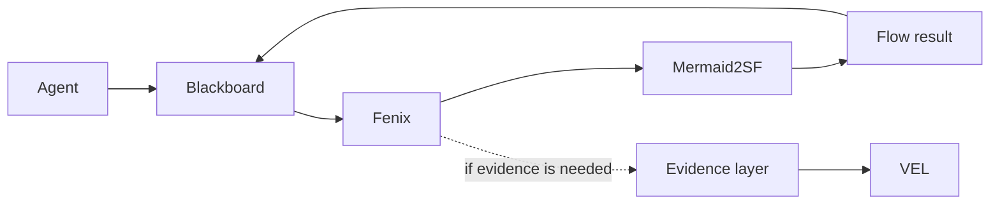
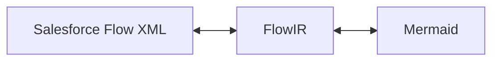
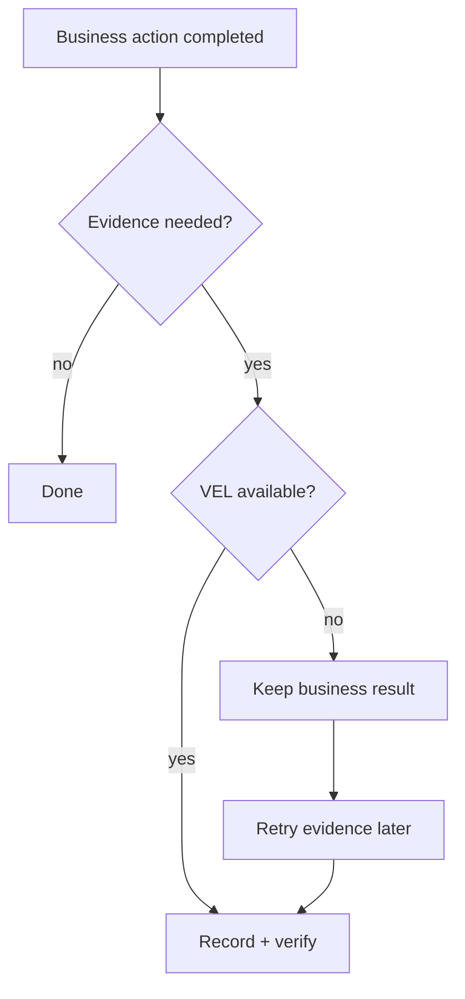

# Fenix + Mermaid2SF + VEL

[← Back to README](../README.md)

## The idea

Fenix remains in charge of execution. It can use two external specialists:

- **[Mermaid2SF](https://github.com/krukmat/Mermaid2SF)** — bidirectional Salesforce Flow ↔ Mermaid tooling built around FlowIR and Salesforce-aware validation.
- **[Verifiable Event Ledger (VEL)](https://github.com/krukmat/verifiable-event-ledger)** — proof-of-concept ledger for audit evidence that can be independently verified rather than simply trusted because it is stored.

They are independent.



## Salesforce Flow path

Mermaid2SF owns the translation layer; Fenix does not duplicate it.



This supports both directions:

```text
Salesforce Flow → Mermaid
Mermaid         → Salesforce Flow
```

## Responsibilities

| Component | Responsibility |
|---|---|
| **Fenix** | coordination, governance, approvals, execution and operational audit |
| **Blackboard** | shared multi-agent work area |
| **ToolRegistry** | governed business-capability execution |
| **Mermaid2SF** | Salesforce Flow / FlowIR semantics |
| **Evidence Runtime / Outbox** | durable evidence delivery and recovery |
| **VEL** | cryptographic evidence and verification |

VEL is **not** a ToolRegistry tool. Agents do not call VEL directly.

VEL verifies integrity of recorded evidence; it does not prove that the business decision itself was correct.

## Optionality

| Mermaid2SF | VEL | Result |
|---|---|---|
| yes | no | Salesforce Flow work without cryptographic evidence |
| yes | yes | Salesforce Flow work plus evidence |
| no | yes | another governed Fenix action with evidence |
| no | no | ordinary governed Fenix execution |

## Failure behavior



The central rule is: **evidence recovery never repeats the completed business action.**

| Situation | Behavior |
|---|---|
| Mermaid2SF temporarily fails | bounded retry with the same execution ID |
| Mermaid2SF keeps failing | explicit failure; no invented result |
| VEL unavailable | preserve business result; evidence unresolved |
| verification fails | preserve business result; never claim verified |
| Fenix restarts | resume evidence recovery without business replay |

## What is demonstrated

The W6 proof covers:

- Blackboard → plan → governed execution → Mermaid2SF;
- evidence on/off independently;
- multi-agent planning;
- stable execution identity across retries;
- provider and verification failure behavior;
- restart-safe evidence reconciliation.

Main proof file:

`internal/api/integration_runtime_w6_test.go`

## Validation boundary

The technical integration is closed according to the W0-W6 scope, but this is not being represented as a fresh fully-green production validation:

- W5-C closed with an accepted 82.9% vs 83.0% coverage waiver;
- W6 proof changes did not trigger another global QA run;
- a live Fenix + Mermaid2SF + VEL three-process smoke remains an optional acceptance step.

## Detailed contracts

- [W2 — Mermaid2SF contract](plans/fenix-integration-w2-mermaid2sf-contract.md)
- [W3 — VEL contract](plans/fenix-integration-w3-vel-contract.md)
- [W4 — governance contract](plans/fenix-integration-w4-governance-contract.md)
- [W5-C — operational readiness](plans/fenix-integration-w5c-operational-readiness.md)
- [W6 — functional execution](plans/fenix-integration-w6-functional-execution.md)
