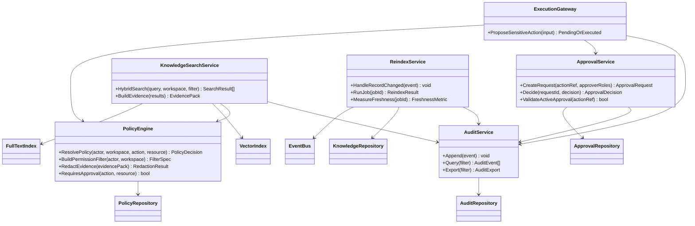
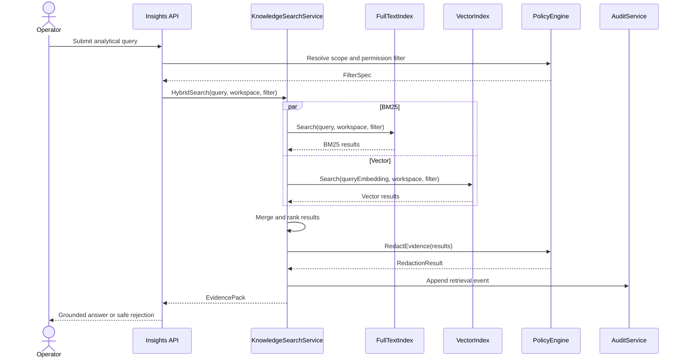
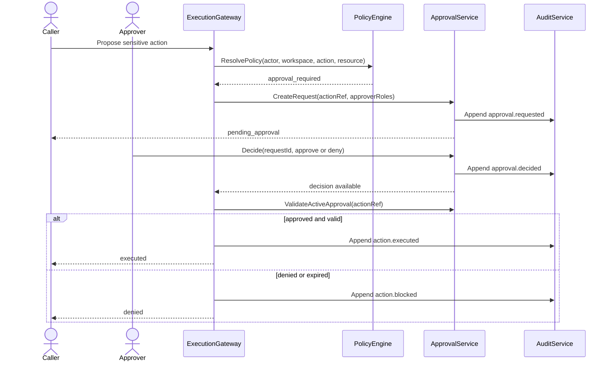
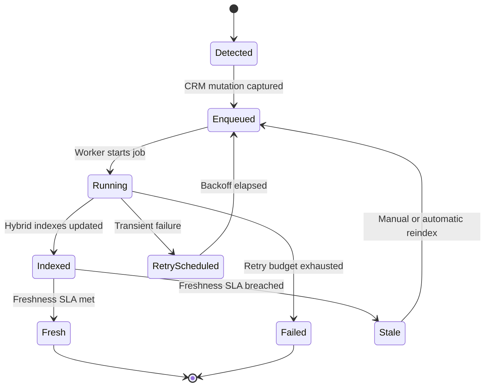

# Wave 1 Analysis, UML Design, and Development Plan

## 1. Purpose

This document defines the implementation-ready analysis for **Wave 1: Governance, Audit, Retrieval Foundations**.

Wave 1 covers:

- `WS-01` Governance Core
- `WS-02` Audit Hardening
- `WS-03` Knowledge Reliability

Primary closure scope:

- `FR-060`
- `FR-061`
- `FR-070`
- `FR-071`
- `FR-090`
- scoped `FR-091`
- `GOV-PII`

Wave objective:

- freeze the authorization, approval, audit, and retrieval contracts before Wave 2 opens tooling, copilot, prompt, and runtime work
- keep each workstream isolated enough to support parallel execution and narrow LLM context packs

## 2. Documentary Dependency Model

### 2.1 Core planning dependency

| Purpose | Primary source | Why it is mandatory |
|---------|----------------|---------------------|
| Wave sequencing | `docs/parallel_requirements.md` | Defines `WS-01`, `WS-02`, `WS-03`, gates, scope boundaries, and downstream dependencies |
| Business intent | `docs/requirements.md` sections `7.2` and `7.8` | Defines the expected business semantics for knowledge, governance, audit, and PII handling |
| Operational FR canon | `reqs/FR/FR_060.yml`, `reqs/FR/FR_061.yml`, `reqs/FR/FR_070.yml`, `reqs/FR/FR_071.yml` | Defines the Doorstop wording used by current codebase-facing artifacts |
| Current target architecture | `docs/architecture.md` sections `5`, `6`, `7` and the policy / retrieval / audit flows | Defines enforcement points, service boundaries, data model, and sequencing assumptions |
| As-built baseline | `docs/as-built-design-features.md` | Identifies what already exists and what is only partially closed |
| Gap closure criteria | `docs/fr-gaps-implementation-criteria.md` sections `FR-060`, `FR-061`, `FR-070`, `FR-071`, `FR-090`, `FR-091` | Defines the concrete missing behaviors that must be closed |
| Behavioral acceptance | `features/uc-g1-governance.feature`, `features/uc-a4-workflow-execution.feature`, `features/uc-a5-signal-detection-and-lifecycle.feature`, `features/uc-d1-data-insights-agent.feature` | Defines stable behavior contracts already present in the repo |

### 2.2 LLM context packs

These packs should be loaded independently to avoid polluting sessions with unrelated Wave 2 and Wave 3 context.

| Pack | Use | Load only these docs |
|------|-----|----------------------|
| `W1-CORE` | Wave sequencing and cross-lane handoff | `docs/parallel_requirements.md`, this document |
| `W1-GOV` | `WS-01` execution sessions | `docs/requirements.md` section `7.8`, `reqs/FR/FR_060.yml`, `reqs/FR/FR_061.yml`, `reqs/FR/FR_071.yml`, `docs/architecture.md` policy sections, `docs/fr-gaps-implementation-criteria.md` sections `FR-060`, `FR-061`, `FR-071`, `features/uc-g1-governance.feature` |
| `W1-AUDIT` | `WS-02` execution sessions | `docs/requirements.md` section `7.8`, `reqs/FR/FR_070.yml`, audit sections in `docs/architecture.md`, `docs/as-built-design-features.md` audit block, `docs/fr-gaps-implementation-criteria.md` section `FR-070`, `features/uc-g1-governance.feature`, `features/uc-a4-workflow-execution.feature` |
| `W1-KNOW` | `WS-03` execution sessions | `docs/requirements.md` section `7.2`, knowledge sections in `docs/architecture.md`, knowledge block in `docs/as-built-design-features.md`, `docs/fr-gaps-implementation-criteria.md` sections `FR-090`, `FR-091`, `features/uc-a5-signal-detection-and-lifecycle.feature`, `features/uc-d1-data-insights-agent.feature` |

### 2.3 Traceability rule

Wave 1 must keep one explicit traceability note in every implementation task:

- use `docs/parallel_requirements.md` as the sequencing canon
- use `docs/requirements.md` as the business meaning canon
- when a numbering conflict appears between `requirements.md` and Doorstop / fr-gaps, document the chosen mapping in the task output before changing code

## 3. Scope and Constraints

### 3.1 In-scope closure

- `WS-01`: RBAC/ABAC, approval workflows, policy evaluation, and `GOV-PII`
- `WS-02`: append-only audit hardening, event taxonomy, trace correlation, query and export behavior
- `WS-03`: compliant hybrid retrieval and scoped CDC / auto-reindex for already-unlocked source families

### 3.2 Explicit scope boundaries

- `FR-091` in Wave 1 is **scoped** to reliability and freshness for already-unlocked source families
- connector breadth stays outside Wave 1 and remains tied to `FR-050`
- `GOV-PII` may be partially gated by `FR-320`; Wave 1 should still close local tagging, redaction, and provider-routing contracts even if full external dependency closure is postponed
- retrieval permission filtering can stay workspace-scoped inside `WS-03`, but the contract must be ready for `WS-05` and `WS-07` to consume policy output later

## 4. Use Case Analysis

### 4.1 UC-W1-01 Inspect a governed run and its trace

- Workstream: `WS-01` + `WS-02`
- Primary actor: Governance operator
- Goal: inspect an agent run with enough policy and audit detail to justify replay, rollback, or denial
- Preconditions:
  - actor is authenticated
  - actor has access scope for the workspace and run
  - run has stored trace and audit events
- Main flow:
  1. operator requests run details
  2. policy layer resolves workspace and actor scope
  3. audit layer returns ordered events with actor, action, timestamp, outcome, and trace correlation
  4. UI or API returns run state plus audit trail
- Alternate paths:
  - policy denies visibility because workspace or role scope does not match
  - run exists but trace is incomplete; response is degraded and flagged as non-compliant
- Outputs:
  - ordered trace view
  - auditable reason chain for each decision
- Documentary basis:
  - `features/uc-g1-governance.feature`
  - `docs/fr-gaps-implementation-criteria.md` sections `FR-060` and `FR-070`
  - `docs/architecture.md` audit and policy flow

### 4.2 UC-W1-02 Replay or rollback only when policy allows it

- Workstream: `WS-01` + `WS-02`
- Primary actor: Governance operator
- Goal: allow replay or rollback only under explicit policy and leave durable evidence of the decision
- Preconditions:
  - run is replayable or rollback-capable by design
  - policy set and policy version are resolvable for the workspace
- Main flow:
  1. operator submits replay or rollback request
  2. policy engine evaluates action, actor, scope, and current state
  3. if allowed, the request is accepted and the decision is recorded in audit
  4. if denied, the denial reason is returned and also recorded in audit
- Alternate paths:
  - conflicting policy versions resolve to deny and the trace must show precedence
  - missing policy version is treated as hard failure, not implicit allow
- Outputs:
  - allow or deny decision with reason
  - traceable policy evaluation record
- Documentary basis:
  - `features/uc-g1-governance.feature`
  - `docs/fr-gaps-implementation-criteria.md` sections `FR-071` and `FR-070`
  - `docs/architecture.md` policy-set and approval data model

### 4.3 UC-W1-03 Block a sensitive action until approval exists

- Workstream: `WS-01`
- Primary actors: Operator, approver
- Goal: create an approval request before execution and unblock the action only after a valid decision
- Preconditions:
  - action is classified as sensitive by policy or tool metadata
  - approval service can create and persist a request
- Main flow:
  1. caller proposes a sensitive action
  2. policy engine marks the action as approval-required
  3. approval service creates a pending request and links it to the blocked action
  4. approver decides
  5. execution gateway revalidates the approval and proceeds only if the decision is valid and not expired
- Alternate paths:
  - approval is denied or expires; action remains blocked
  - approval exists but actor or payload changed; approval must be invalidated
- Outputs:
  - approval request lifecycle
  - blocked or released execution state
- Documentary basis:
  - `docs/fr-gaps-implementation-criteria.md` section `FR-061`
  - `docs/architecture.md` approval flow
  - `features/uc-a4-workflow-execution.feature` approval scenario

### 4.4 UC-W1-04 Answer an analytical query with grounded retrieval

- Workstream: `WS-03`
- Primary actor: Operator
- Goal: answer a query using grounded evidence from compliant hybrid retrieval
- Preconditions:
  - workspace has indexed data
  - BM25 and vector retrieval are both available
  - evidence can be filtered by workspace scope
- Main flow:
  1. operator submits analytical query
  2. system performs BM25 and vector retrieval
  3. results are merged, filtered, ranked, and prepared as evidence
  4. downstream consumer returns an answer tied to available evidence
- Alternate paths:
  - vector backend is unavailable; request must fail explicitly instead of silently falling back to non-compliant in-memory search
  - retrieved evidence is insufficient; system rejects unsupported conclusion
- Outputs:
  - grounded result set or safe rejection
  - retrieval telemetry and freshness evidence
- Documentary basis:
  - `features/uc-d1-data-insights-agent.feature`
  - `docs/fr-gaps-implementation-criteria.md` sections `FR-090` and `FR-091`
  - `docs/architecture.md` hybrid search flow

### 4.5 UC-W1-05 Create signals only from grounded evidence

- Workstream: `WS-03`
- Primary actor: Platform operator
- Goal: create actionable signals only when the source evidence is grounded and linked
- Preconditions:
  - signal evaluation produced evidence
  - evidence pack is available
- Main flow:
  1. workflow or evaluator submits grounded evidence
  2. system validates evidence linkage and confidence
  3. signal is created as an active item
  4. signal remains linked to evidence sources for later audit and replay
- Alternate paths:
  - evidence lacks source linkage; signal creation is rejected
  - evidence becomes stale; signal is marked for re-evaluation
- Outputs:
  - stored signal with evidence linkage
  - traceable origin for future governance actions
- Documentary basis:
  - `features/uc-a5-signal-detection-and-lifecycle.feature`
  - `docs/requirements.md` section `7.2`
  - `docs/architecture.md` evidence and retrieval model

### 4.6 UC-W1-06 Reindex CRM mutations within the freshness contract

- Workstream: `WS-03` with audit hooks from `WS-02`
- Primary actor: System
- Goal: detect CRM mutations, enqueue reindex work, and keep retrieval freshness observable
- Preconditions:
  - CRM mutations emit domain events
  - reindex worker can resolve affected entities
- Main flow:
  1. a CRM record is created or updated
  2. system emits a domain change event
  3. reindex service enqueues and executes reindex
  4. knowledge indexes and freshness metrics are updated
  5. failure, retry, and stale states are observable
- Alternate paths:
  - unsupported entity type is ignored and flagged as missing coverage
  - retries exceed budget and record remains stale
- Outputs:
  - refreshed index
  - observable freshness SLA data
- Documentary basis:
  - `docs/fr-gaps-implementation-criteria.md` section `FR-091`
  - `docs/as-built-design-features.md` `FR-091` block
  - `docs/architecture.md` CDC and retrieval sections

## 5. Technical Design

### 5.1 Design principles

- keep `WS-01`, `WS-02`, and `WS-03` independently executable
- freeze data contracts before optimizing implementation details
- never allow implicit success on missing policy, missing approval, or missing audit correlation
- prefer explicit failure over silent fallback when retrieval or compliance guarantees are broken
- publish handoff notes at the end of each workstream so Wave 2 can load only frozen contracts

### 5.2 Wave 1 contracts to freeze

| Contract | Producer | Consumer | Why it matters |
|----------|----------|----------|----------------|
| `PolicyDecision` | `WS-01` | `WS-02`, `WS-04`, `WS-05`, `WS-07` | Defines allow, deny, approval-required, and rule-trace semantics |
| `ApprovalRequest` | `WS-01` | `WS-04`, `WS-07` | Defines how blocked execution becomes pending approval |
| `AuditEvent` | `WS-02` | All later waves | Defines immutable event taxonomy and `trace_id` correlation |
| `RetrievalQuery` | `WS-03` | `WS-05`, `WS-07` | Defines hybrid search inputs, workspace filters, and evidence expectations |
| `ReindexEvent` | `WS-03` | `WS-02`, `WS-07`, `FX-03` | Defines CDC payload, retry semantics, and freshness telemetry |

### 5.3 UML class diagram

### 5.4 UML sequence diagram: governed analytical retrieval

### 5.5 UML sequence diagram: approval-before-execution

### 5.6 UML state diagram: reindex lifecycle

## 6. Development Task Plan

### 6.1 Execution strategy

- run `WS-01`, `WS-02`, and `WS-03` in parallel
- keep one owner per workstream and one integrator for cross-lane contract freeze
- require a short handoff note at the end of each task that changes a shared contract

### 6.2 Task backlog

| ID | Lane | Task | Depends on tasks | Documentary dependency | Done when |
|----|------|------|------------------|------------------------|-----------|
| `W1-00` | Core | Freeze Wave 1 glossary, FR mapping note, and shared contracts | - | `docs/parallel_requirements.md`, `docs/requirements.md`, this document | One shared glossary exists for policy, approval, audit, retrieval, and reindex |
| `W1-01` | `WS-01` | Freeze `PolicyDecision` schema and rule-trace output | `W1-00` | `docs/architecture.md`, `docs/fr-gaps-implementation-criteria.md` `FR-060` and `FR-071` | Allow, deny, approval-required, and trace metadata are explicit and stable |
| `W1-02` | `WS-01` | Implement workspace-scoped policy-set and policy-version resolution | `W1-01` | `reqs/FR/FR_071.yml`, `docs/architecture.md`, `docs/as-built-design-features.md` | Runtime does not authorize from ambiguous or missing policy version |
| `W1-03` | `WS-01` | Implement approval-before-execution linkage | `W1-01`, `W1-02` | `reqs/FR/FR_061.yml`, `docs/fr-gaps-implementation-criteria.md` `FR-061`, `features/uc-a4-workflow-execution.feature` | Sensitive actions create approval requests and remain blocked until decision |
| `W1-04` | `WS-01` | Close `GOV-PII` local slice: tags, redaction, provider-routing contract | `W1-01` | `docs/requirements.md` `FR-061` business meaning, `docs/architecture.md` PII flow | Redaction and no-cloud routing behavior are explicit and testable |
| `W1-05` | `WS-01` | Add governance integration tests for ABAC, approval flow, and denial trace | `W1-02`, `W1-03`, `W1-04` | `features/uc-g1-governance.feature`, `docs/fr-gaps-implementation-criteria.md` | Governance flows are testable end-to-end |
| `W1-06` | `WS-02` | Freeze audit taxonomy and `trace_id` correlation rules | `W1-00` | `reqs/FR/FR_070.yml`, `docs/architecture.md`, `docs/as-built-design-features.md` audit block | One stable event taxonomy exists for request, domain, approval, and replay actions |
| `W1-07` | `WS-02` | Harden `audit_event` as append-only at DB policy level | `W1-06` | `docs/fr-gaps-implementation-criteria.md` `FR-070`, `docs/parallel_requirements.md` | Update and delete paths are blocked by DB-level controls |
| `W1-08` | `WS-02` | Replace generic audit actions with domain-specific action names | `W1-06` | `docs/fr-gaps-implementation-criteria.md` `FR-070`, `features/uc-g1-governance.feature` | Critical workflows emit domain-level audit events |
| `W1-09` | `WS-02` | Harden query and export behavior for governance operators | `W1-06`, `W1-07` | `docs/architecture.md` audit API section, `features/uc-g1-governance.feature` | Audit query and export are filterable, scoped, and reproducible |
| `W1-10` | `WS-03` | Replace in-memory vector search with `sqlite-vec` or approved equivalent | `W1-00` | `docs/fr-gaps-implementation-criteria.md` `FR-090`, `docs/architecture.md`, `docs/as-built-design-features.md` | Hybrid retrieval no longer depends on in-memory cosine over JSON vectors |
| `W1-11` | `WS-03` | Freeze hybrid ranking contract: BM25 + vector + merge semantics | `W1-10` | `docs/architecture.md` hybrid search flow, `docs/as-built-design-features.md` knowledge block | Retrieval ranking semantics are deterministic and documented |
| `W1-12` | `WS-03` | Expand CDC coverage to all already-unlocked CRM entities | `W1-00` | `docs/fr-gaps-implementation-criteria.md` `FR-091`, `docs/parallel_requirements.md` scope boundary | Every in-scope entity mutation produces reindex work |
| `W1-13` | `WS-03` | Add reindex retries, observability, and freshness metrics | `W1-11`, `W1-12` | `docs/fr-gaps-implementation-criteria.md` `FR-091`, `docs/architecture.md` | Reindex failures, retries, and SLA breaches are visible |
| `W1-14` | `WS-03` | Add knowledge reliability tests for grounded answers and safe rejection | `W1-11`, `W1-12`, `W1-13` | `features/uc-a5-signal-detection-and-lifecycle.feature`, `features/uc-d1-data-insights-agent.feature` | Grounded result and unsupported conclusion behaviors are covered |
| `W1-15` | Integration | Publish Wave 1 handoff note for Wave 2 and Wave 3 consumers | `W1-05`, `W1-09`, `W1-14` | `docs/parallel_requirements.md`, this document | Shared contracts are frozen and discoverable without reloading full Wave 1 history |

### 6.3 Recommended parallel breakdown

| Owner | Primary lane | Start set | Cross-lane touch allowed |
|-------|--------------|-----------|--------------------------|
| Team or agent A | `WS-01` | `W1-01` to `W1-05` | Only shared contract review with `W1-00` and `W1-15` |
| Team or agent B | `WS-02` | `W1-06` to `W1-09` | Only shared event taxonomy review with `W1-15` |
| Team or agent C | `WS-03` | `W1-10` to `W1-14` | Only retrieval contract review with `W1-15` |
| Integrator | Cross-lane | `W1-00`, `W1-15` | All frozen contracts, no feature-level scope expansion |

### 6.4 Exit gates

Wave 1 should be considered documentary-ready for implementation and integration only when:

- `WS-01` publishes a stable `PolicyDecision` and `ApprovalRequest` contract
- `WS-02` publishes a stable `AuditEvent` taxonomy and append-only rule set
- `WS-03` publishes a stable `RetrievalQuery` and `ReindexEvent` contract
- all three lanes publish a short handoff note for downstream waves

## 7. Risks and Early Decisions

- **FR numbering drift**: Wave 1 touches the area where `requirements.md` and Doorstop do not fully align. Every task must log the FR mapping it used.
- **`GOV-PII` dependency ambiguity**: if `FR-320` is still unresolved, implement the local redaction and provider-routing slice first and keep external-provider blocking behind an explicit gate.
- **`FR-091` scope creep**: do not mix connector expansion into Wave 1. Stop at already-unlocked source families.
- **silent retrieval fallback**: do not accept a hidden fallback from compliant vector search to legacy in-memory cosine logic.

## 8. Output Expected From Each Workstream

Each Wave 1 workstream should end with:

- one contract note
- one task completion summary
- one explicit list of affected downstream waves
- one minimal context pack for the next session
