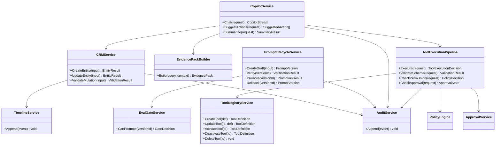
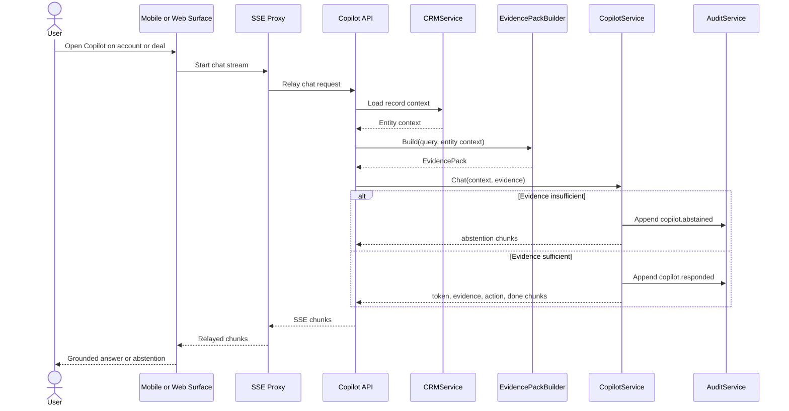
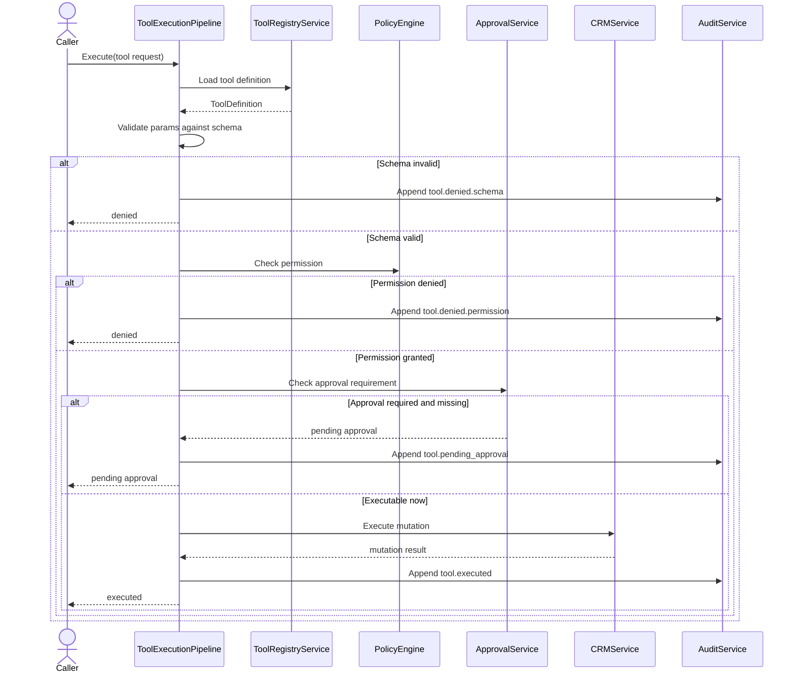
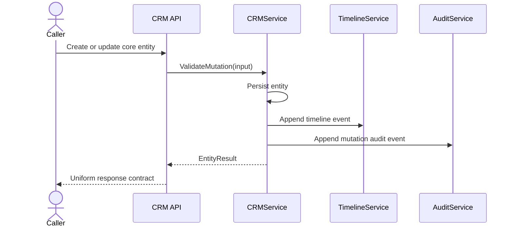
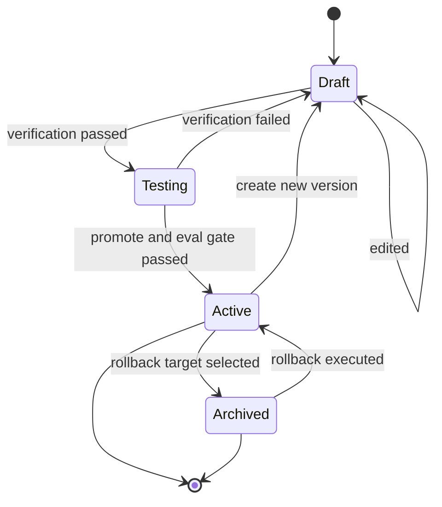

# Wave 2 Analysis, UML Design, and Development Plan

## 1. Purpose

This document defines the implementation-ready analysis for **Wave 2: Tooling, Copilot, Prompting, CRM Hardening**.

Wave 2 covers:

- `WS-04` Tooling Safety
- `WS-05` Copilot Safety
- `WS-06` Prompt Lifecycle
- `WS-08` CRM Consistency Hardening

Primary closure scope:

- `FR-202`
- `FR-211`
- `FR-200`
- `FR-201`
- embedded `FR-210`
- `FR-240`
- `FR-001`
- baseline gate `FR-092`

Wave objective:

- freeze the tool execution, copilot response, prompt lifecycle, and CRM mutation contracts before Wave 3 opens runtime completion
- keep each workstream narrow enough to support parallel execution and small LLM context windows

## 2. Documentary Dependency Model

### 2.1 Core planning dependency

| Purpose | Primary source | Why it is mandatory |
|---------|----------------|---------------------|
| Wave sequencing | `docs/parallel_requirements.md` | Defines `WS-04`, `WS-05`, `WS-06`, `WS-08`, dependencies on Wave 1, and the `FR-092` pre-gate |
| Business intent | `docs/requirements.md` sections `7.1`, `7.3`, `7.4`, `7.6` | Defines expected CRM, Copilot, tool, abstention, and prompt lifecycle behavior |
| API contract baseline | `docs/openapi.yaml` | Defines current public route surface for admin tools, prompts, and copilot endpoints |
| Current target architecture | `docs/architecture.md` CRM, Copilot, tool execution, prompt versioning, and Evidence Pack flows | Defines service boundaries, transport expectations, and shared contracts |
| As-built baseline | `docs/as-built-design-features.md` | Identifies which Wave 2 features already exist partially |
| Gap closure criteria | `docs/fr-gaps-implementation-criteria.md` sections `FR-001`, `FR-200`, `FR-201`, `FR-202`, `FR-211`, `FR-240` | Defines the missing behaviors required to close Wave 2 |
| Behavioral acceptance | `features/uc-b1-safe-tool-routing.feature`, `features/uc-a1-agent-studio.feature`, `features/uc-a2-workflow-authoring.feature`, `features/uc-a3-workflow-verification-and-activation.feature`, `features/uc-a8-workflow-versioning-and-rollback.feature`, `features/uc-s1-sales-copilot.feature`, `features/uc-c1-support-agent.feature` | Defines the observable behavior contracts already present in the repo |

### 2.2 LLM context packs

These packs should be loaded independently so Wave 2 sessions do not reopen all Wave 1 and Wave 3 context.

| Pack | Use | Load only these docs |
|------|-----|----------------------|
| `W2-CORE` | Wave sequencing, pre-gates, and shared handoff | `docs/parallel_requirements.md`, this document |
| `W2-EVIDENCE` | `FR-092` pre-gate and shared evidence contract | `docs/parallel_requirements.md` gate section, `docs/requirements.md` `FR-092`, `docs/as-built-design-features.md` evidence block, `docs/architecture.md` Evidence Pack flow |
| `W2-TOOL` | `WS-04` execution sessions | `docs/requirements.md` sections `7.3` and `7.4`, `docs/openapi.yaml` tool routes, `docs/architecture.md` tool execution flow, `docs/fr-gaps-implementation-criteria.md` `FR-202` and `FR-211`, `features/uc-b1-safe-tool-routing.feature`, `features/uc-a1-agent-studio.feature` |
| `W2-COPILOT` | `WS-05` execution sessions | `docs/requirements.md` sections `7.3` and `7.4`, Copilot sections in `docs/architecture.md`, Copilot block in `docs/as-built-design-features.md`, `docs/fr-gaps-implementation-criteria.md` `FR-200` and `FR-201`, `features/uc-s1-sales-copilot.feature`, `features/uc-c1-support-agent.feature` |
| `W2-PROMPT` | `WS-06` execution sessions | `docs/requirements.md` section `7.6`, prompt and eval sections in `docs/architecture.md`, `docs/openapi.yaml` prompt routes, `docs/fr-gaps-implementation-criteria.md` `FR-240`, `features/uc-a2-workflow-authoring.feature`, `features/uc-a3-workflow-verification-and-activation.feature`, `features/uc-a8-workflow-versioning-and-rollback.feature` |
| `W2-CRM` | `WS-08` execution sessions | `docs/requirements.md` section `7.1`, CRM sections in `docs/architecture.md`, CRM block in `docs/as-built-design-features.md`, `docs/fr-gaps-implementation-criteria.md` `FR-001`, `docs/openapi.yaml` CRM routes |

### 2.3 Traceability rule

Wave 2 must keep one explicit traceability note in every implementation task:

- record whether the task changes an admin API, SSE chunk contract, prompt lifecycle state, or CRM mutation side-effect contract
- record whether the task consumes `FR-092` as a stable baseline or changes its consumer assumptions
- if a Wave 2 task changes a Wave 3 dependency, publish a short handoff note before opening runtime work

## 3. Scope and Constraints

### 3.1 In-scope closure

- `WS-04`: tool registry lifecycle, strong schema validation, unified execution pipeline, and safe built-in tool routing
- `WS-05`: grounded copilot response path, deterministic abstention, suggested actions contract, and downstream Go+BFF+mobile alignment
- `WS-06`: prompt version state model, rollback semantics, experiment surface, and eval-gated promotion
- `WS-08`: uniform CRM CRUD contract, business validation, and timeline plus audit side-effects across core entities

### 3.2 Explicit scope boundaries

- `FR-092` is a blocking pre-gate for `WS-05`; if the Evidence Pack contract is unstable, fix the gate before opening copilot work
- `FR-210` stays embedded inside Wave 2 and Wave 3 consumer lanes; it is not a standalone workstream here
- `FR-242` is only an integration point in `WS-06`; full release-gating maturity stays outside Wave 2
- mobile and BFF remain downstream consumer surfaces inside `WS-05`, not standalone Wave 2 lanes
- `WS-08` hardens `FR-001` only; it must not expand into `FR-002`, `FR-003`, or custom-object scope
- `WS-04`, `WS-05`, `WS-06`, and `WS-08` consume Wave 1 policy, audit, and retrieval contracts as frozen inputs

## 4. Use Case Analysis

### 4.1 UC-W2-01 Validate a tool-enabled draft before promotion

- Workstream: `WS-04` with `WS-06` handoff
- Primary actor: Platform operator
- Goal: validate an agent or workflow draft that uses tools before promotion or activation
- Preconditions:
  - draft exists and references tools
  - governance checks and prompt state rules are available
- Main flow:
  1. operator submits draft validation
  2. system validates referenced tools, schemas, permissions, and prompt state
  3. validation outcome is recorded for governance review
  4. draft is either accepted for the next lifecycle step or rejected with reasons
- Alternate paths:
  - tool schema is weak or inconsistent with runtime contract
  - tool requires permissions that the target actor profile cannot satisfy
- Outputs:
  - validation result with reasons
  - traceable governance record
- Documentary basis:
  - `features/uc-a1-agent-studio.feature`
  - `docs/fr-gaps-implementation-criteria.md` sections `FR-202` and `FR-240`
  - `docs/architecture.md` tool and prompt model

### 4.2 UC-W2-02 Execute or deny a tool request through one managed pipeline

- Workstream: `WS-04`
- Primary actor: Agent or copilot caller
- Goal: ensure every tool call runs through one execution path with validation, authorization, approval, and audit gates
- Preconditions:
  - tool is registered in the workspace
  - policy and audit contracts from Wave 1 are available
- Main flow:
  1. caller proposes a tool action
  2. system loads tool definition and validates params against schema
  3. policy checks permissions
  4. if required, approval is requested before execution
  5. if all gates pass, tool executes and result is audited
- Alternate paths:
  - tool is not allowlisted
  - params are dangerous or malformed
  - permission is denied
  - approval is missing, denied, or expired
- Outputs:
  - executed or denied tool decision
  - stable error and audit contract
- Documentary basis:
  - `features/uc-b1-safe-tool-routing.feature`
  - `docs/fr-gaps-implementation-criteria.md` sections `FR-202` and `FR-211`
  - `docs/architecture.md` tool execution flow

### 4.3 UC-W2-03 Launch Sales Copilot from a CRM record with grounded context

- Workstream: `WS-05` with `WS-08` as context provider
- Primary actor: CRM user
- Goal: open Copilot from an account or deal and get grounded in-flow guidance
- Preconditions:
  - authenticated workspace user opens a CRM detail screen
  - CRM record has available context and evidence
  - `FR-092` gate is stable
- Main flow:
  1. user opens Copilot from account or deal detail
  2. system loads CRM context and builds Evidence Pack
  3. Copilot returns a response tied to evidence-backed context
  4. downstream surfaces render the response consistently
- Alternate paths:
  - CRM context is incomplete
  - evidence exists but fails grounding threshold
- Outputs:
  - grounded copilot response
  - stable response shape across Go, BFF, and mobile
- Documentary basis:
  - `features/uc-s1-sales-copilot.feature`
  - `docs/fr-gaps-implementation-criteria.md` section `FR-200`
  - `docs/architecture.md` Copilot Q&A flow

### 4.4 UC-W2-04 Abstain safely when evidence is insufficient

- Workstream: `WS-05`
- Primary actor: CRM user or support operator
- Goal: prevent fabricated answers or recommendations when evidence confidence is too low
- Preconditions:
  - Copilot or support path has built an Evidence Pack
  - abstention criteria are defined deterministically
- Main flow:
  1. caller asks for a recommendation or resolution
  2. system evaluates evidence confidence and context sufficiency
  3. if thresholds are not met, response becomes abstention instead of action
  4. response explains missing evidence and next safe step
- Alternate paths:
  - evidence is contradictory rather than simply insufficient
  - confidence is borderline and must still resolve deterministically
- Outputs:
  - abstention response with rationale
  - auditable missing-evidence explanation
- Documentary basis:
  - `features/uc-s1-sales-copilot.feature`
  - `features/uc-c1-support-agent.feature`
  - `docs/fr-gaps-implementation-criteria.md` section `FR-200`

### 4.5 UC-W2-05 Suggest only eligible actions and attach confidence

- Workstream: `WS-05` with `WS-04` as execution contract provider
- Primary actor: CRM user
- Goal: return suggested actions that are both context-eligible and confidence-scored
- Preconditions:
  - evidence and CRM context are available
  - tool/action eligibility rules are defined
- Main flow:
  1. system analyzes record context and evidence
  2. candidate actions are produced
  3. each candidate is checked against entity-state guardrails and execution eligibility
  4. output returns suggestions with confidence metadata
- Alternate paths:
  - no action is eligible
  - high-confidence action fails a business rule and must be removed
- Outputs:
  - deterministic `SuggestedAction` contract
  - eligibility-safe action set
- Documentary basis:
  - `docs/fr-gaps-implementation-criteria.md` section `FR-201`
  - `docs/requirements.md` sections `7.3` and `7.4`
  - `docs/architecture.md` Copilot plus tool loop

### 4.6 UC-W2-06 Save, verify, and promote a prompt version safely

- Workstream: `WS-06`
- Primary actor: Platform admin
- Goal: manage prompt or workflow versions through draft, testing, and active states without bypassing verification
- Preconditions:
  - agent or workflow definition exists
  - prompt version routes and audit support are available
- Main flow:
  1. admin creates a draft version
  2. admin requests verification
  3. draft moves to testing only if verification passes
  4. promotion is allowed only when gate conditions are satisfied
- Alternate paths:
  - verification fails
  - eval gate blocks promotion
- Outputs:
  - stable lifecycle state transition
  - auditable verification and promotion history
- Documentary basis:
  - `features/uc-a2-workflow-authoring.feature`
  - `features/uc-a3-workflow-verification-and-activation.feature`
  - `docs/fr-gaps-implementation-criteria.md` section `FR-240`

### 4.7 UC-W2-07 Create a new draft version and rollback without ambiguity

- Workstream: `WS-06`
- Primary actor: Platform operator
- Goal: make version creation and rollback unambiguous in identity and outcome
- Preconditions:
  - one active version exists
  - archived or prior versions are queryable
- Main flow:
  1. operator creates a new draft from the active source
  2. system stores a new version with explicit status and lineage
  3. operator rolls back using version identity, not ambiguous agent identity
  4. rollback outcome is audited and visible
- Alternate paths:
  - no valid rollback target exists
  - requested identity does not match the expected version scope
- Outputs:
  - unambiguous rollback contract
  - deterministic active-version outcome
- Documentary basis:
  - `features/uc-a8-workflow-versioning-and-rollback.feature`
  - `docs/openapi.yaml` prompt routes
  - `docs/fr-gaps-implementation-criteria.md` section `FR-240`

### 4.8 UC-W2-08 Apply one uniform CRM mutation contract across core entities

- Workstream: `WS-08`
- Primary actor: CRM user, copilot, or internal service
- Goal: ensure create and update flows across core CRM entities behave uniformly and emit consistent side effects
- Preconditions:
  - entity APIs exist
  - audit and timeline taxonomy from Wave 1 are stable
- Main flow:
  1. caller creates or updates a core CRM entity
  2. system applies entity validation and persistence rules
  3. system emits timeline and audit side effects
  4. API response shape remains consistent with OpenAPI and downstream consumers
- Alternate paths:
  - one entity type misses side effects or uses inconsistent validation
  - API route shape diverges from the documented contract
- Outputs:
  - uniform CRUD behavior
  - reproducible mutation side effects
- Documentary basis:
  - `docs/fr-gaps-implementation-criteria.md` section `FR-001`
  - `docs/openapi.yaml`
  - `docs/as-built-design-features.md` CRM block

## 5. Technical Design

### 5.1 Design principles

- treat `FR-092` as a contract gate, not just a feature already present
- never let tools mutate CRM state outside the unified execution pipeline
- make Copilot output deterministic at the contract boundary even if the model output is probabilistic
- keep prompt lifecycle state transitions explicit and auditable
- enforce one mutation contract across all `FR-001` entities before adding more entity-specific behavior

### 5.2 Wave 2 contracts to freeze

| Contract | Producer | Consumer | Why it matters |
|----------|----------|----------|----------------|
| `EvidencePackContract` | `W2-EVIDENCE` gate | `WS-05`, `WS-07` | Defines the baseline evidence shape Copilot and Runtime depend on |
| `ToolDefinitionLifecycle` | `WS-04` | `WS-05`, `WS-07`, admin surfaces | Defines create, update, activate, deactivate, and delete semantics |
| `ToolExecutionDecision` | `WS-04` | `WS-05`, `WS-07` | Defines execute, deny, pending-approval, and error outcomes |
| `CopilotResponseChunk` | `WS-05` | Go API, BFF, mobile | Defines chunk types and grounded response shape |
| `SuggestedAction` | `WS-05` | UI and future runtime consumers | Defines confidence, eligibility, and reason metadata |
| `PromptVersionLifecycle` | `WS-06` | `WS-07`, `FX-05`, governance flows | Defines draft, testing, active, archived, and rollback semantics |
| `CRMMutationContract` | `WS-08` | `WS-05`, `WS-07`, reporting and timeline consumers | Defines response shape, validation rules, and mutation side effects |

### 5.3 UML class diagram

### 5.4 UML sequence diagram: grounded copilot from a CRM record

### 5.5 UML sequence diagram: unified tool execution pipeline

### 5.6 UML sequence diagram: CRM mutation with side effects

### 5.7 UML state diagram: prompt version lifecycle

## 6. Development Task Plan

### 6.1 Execution strategy

- run `WS-04`, `WS-05`, `WS-06`, and `WS-08` in parallel after Wave 1 contracts are frozen
- assign one owner per lane and one integrator for shared contract freeze
- treat `FR-092` as the first gate; do not let `WS-05` drift ahead of the Evidence Pack baseline

### 6.2 Task backlog

| ID | Lane | Task | Depends on tasks | Documentary dependency | Done when |
|----|------|------|------------------|------------------------|-----------|
| `W2-00` | Core | Freeze Wave 2 glossary, lane boundaries, and shared contracts | - | `docs/parallel_requirements.md`, this document | Wave 2 has one shared glossary for evidence, tool execution, copilot chunks, prompt lifecycle, and CRM mutation side effects |
| `W2-01` | Core | Publish `FR-092` pre-gate result and consumer assumptions | `W2-00` | `docs/parallel_requirements.md`, `docs/requirements.md` `FR-092`, `docs/architecture.md` Evidence Pack flow | Wave 2 has a stable statement of what Evidence Pack consumers may rely on |
| `W2-02` | `WS-04` | Freeze `ToolDefinitionLifecycle` and `ToolExecutionDecision` contracts | `W2-00` | `docs/openapi.yaml`, `docs/architecture.md`, `docs/fr-gaps-implementation-criteria.md` `FR-202` and `FR-211` | Tool lifecycle and execution outcomes are explicit and stable |
| `W2-03` | `WS-04` | Complete managed admin lifecycle for tool definitions | `W2-02` | `docs/openapi.yaml`, `docs/fr-gaps-implementation-criteria.md` `FR-202`, `features/uc-a1-agent-studio.feature` | Create, update, activate, deactivate, and delete are coherent operations |
| `W2-04` | `WS-04` | Strengthen schema validation and runtime parameter validation | `W2-02` | `docs/fr-gaps-implementation-criteria.md` `FR-202`, `features/uc-b1-safe-tool-routing.feature` | Weak or malformed schemas and params are rejected deterministically |
| `W2-05` | `WS-04` | Enforce one execution pipeline with validation, policy, approval, and audit gates | `W2-02`, `W2-03`, `W2-04` | `docs/architecture.md` tool flow, `docs/fr-gaps-implementation-criteria.md` `FR-211` | All built-in tools use one hardened execution path |
| `W2-06` | `WS-04` | Add security and audit coverage for allow, deny, and pending-approval tool decisions | `W2-05` | `features/uc-b1-safe-tool-routing.feature`, `features/uc-a1-agent-studio.feature` | Tool routing behaviors are covered end to end |
| `W2-07` | `WS-05` | Freeze Copilot response chunk, abstention, and `SuggestedAction` contracts | `W2-00`, `W2-01` | `docs/architecture.md` Copilot flow, `docs/fr-gaps-implementation-criteria.md` `FR-200` and `FR-201` | The grounded response boundary is explicit across transports |
| `W2-08` | `WS-05` | Harden CRM context injection for account, deal, and case paths | `W2-07` | `docs/requirements.md` `FR-200`, `features/uc-s1-sales-copilot.feature`, `features/uc-c1-support-agent.feature` | Copilot context is grounded enough to support stable behavior |
| `W2-09` | `WS-05` | Implement deterministic abstention and missing-evidence explanations | `W2-07`, `W2-08` | `docs/fr-gaps-implementation-criteria.md` `FR-200`, `features/uc-s1-sales-copilot.feature`, `features/uc-c1-support-agent.feature` | Low-confidence cases always resolve to abstention with a clear explanation |
| `W2-10` | `WS-05` | Add confidence and eligibility enforcement to suggested actions | `W2-07`, `W2-08`, `W2-05` | `docs/fr-gaps-implementation-criteria.md` `FR-201`, `docs/requirements.md` `FR-201` | Suggested actions include confidence and obey entity-state guardrails |
| `W2-11` | `WS-05` | Align Go, BFF, and mobile consumer surfaces to the frozen Copilot contract | `W2-09`, `W2-10` | Copilot block in `docs/as-built-design-features.md`, `docs/architecture.md`, `docs/openapi.yaml` | Downstream surfaces consume one stable response contract |
| `W2-12` | `WS-06` | Freeze prompt version state machine and rollback identity semantics | `W2-00` | `docs/requirements.md` `FR-240`, `docs/openapi.yaml`, `docs/architecture.md` | Draft, testing, active, archived, and rollback semantics are unambiguous |
| `W2-13` | `WS-06` | Audit existing experiment and eval infrastructure before adding new logic | `W2-12` | `docs/parallel_requirements.md`, `docs/fr-gaps-implementation-criteria.md` `FR-240`, `docs/architecture.md` eval model | The team knows what is already implemented versus only schema-deep |
| `W2-14` | `WS-06` | Implement eval-gated promotion and experiment support boundary | `W2-12`, `W2-13` | `docs/fr-gaps-implementation-criteria.md` `FR-240`, `features/uc-a3-workflow-verification-and-activation.feature` | Promotion respects gate outcomes and experiment semantics are explicit |
| `W2-15` | `WS-06` | Add versioning, promotion, rollback, and audit-trace coverage | `W2-14` | `features/uc-a2-workflow-authoring.feature`, `features/uc-a3-workflow-verification-and-activation.feature`, `features/uc-a8-workflow-versioning-and-rollback.feature` | Prompt lifecycle behavior is covered end to end |
| `W2-16` | `WS-08` | Freeze core entity coverage matrix and `CRMMutationContract` | `W2-00` | `docs/requirements.md` `FR-001`, `docs/openapi.yaml`, `docs/fr-gaps-implementation-criteria.md` `FR-001` | In-scope entities and mutation guarantees are explicit |
| `W2-17` | `WS-08` | Normalize route and response semantics across all `FR-001` entities | `W2-16` | `docs/openapi.yaml`, `docs/as-built-design-features.md` CRM block | CRUD routes behave consistently for core entities |
| `W2-18` | `WS-08` | Harden business validation and timeline plus audit side effects | `W2-16`, `W2-17` | `docs/fr-gaps-implementation-criteria.md` `FR-001`, `docs/architecture.md` CRM flow | Every in-scope mutation produces required validation and side effects |
| `W2-19` | `WS-08` | Extend mutation side-effect coverage to all in-scope entities | `W2-18` | `docs/parallel_requirements.md`, `docs/fr-gaps-implementation-criteria.md` `FR-001` | Side-effect coverage matches the full `FR-001` entity matrix |
| `W2-20` | Integration | Publish Wave 2 handoff note for Wave 3 runtime consumers | `W2-06`, `W2-11`, `W2-15`, `W2-19` | `docs/parallel_requirements.md`, this document | Runtime work can consume Wave 2 contracts without reloading all implementation history |

### 6.3 Recommended parallel breakdown

| Owner | Primary lane | Start set | Cross-lane touch allowed |
|-------|--------------|-----------|--------------------------|
| Team or agent A | `WS-04` | `W2-02` to `W2-06` | Only shared contract review with `W2-00`, `W2-01`, and `W2-20` |
| Team or agent B | `WS-05` | `W2-07` to `W2-11` | Only contract review with `WS-04` and `W2-20` |
| Team or agent C | `WS-06` | `W2-12` to `W2-15` | Only prompt and release-gate review with `W2-20` |
| Team or agent D | `WS-08` | `W2-16` to `W2-19` | Only CRM contract review with `W2-20` |
| Integrator | Cross-lane | `W2-00`, `W2-01`, `W2-20` | All frozen contracts, no lane-level scope expansion |

### 6.4 Exit gates

Wave 2 should be considered documentary-ready for implementation and integration only when:

- the `FR-092` pre-gate is published and stable for `WS-05` consumers
- `WS-04` publishes a stable tool lifecycle and execution decision contract
- `WS-05` publishes a stable Copilot chunk and suggested-action contract
- `WS-06` publishes a stable prompt version lifecycle and promotion gate contract
- `WS-08` publishes a stable CRM mutation and side-effect contract
- Wave 2 publishes one handoff note that Wave 3 can consume directly

## 7. Risks and Early Decisions

- **`FR-092` drift**: if Evidence Pack shape or confidence semantics drift mid-wave, `WS-05` and later `WS-07` will both destabilize
- **tool versus copilot boundary**: `WS-05` must not invent action semantics that bypass the `WS-04` execution pipeline
- **`FR-240` versus `FR-242` boundary**: Wave 2 should freeze the integration point, not absorb full release-gating scope
- **consumer surface drift**: BFF and mobile must reflect the frozen Copilot contract without creating parallel semantics
- **`FR-001` scope creep**: CRM hardening must stop at uniform CRUD plus side effects, not reopen reporting or pipeline scope

## 8. Output Expected From Each Workstream

Each Wave 2 workstream should end with:

- one contract note
- one task completion summary
- one list of downstream consumers affected by the frozen contract
- one minimal context pack for the next session
