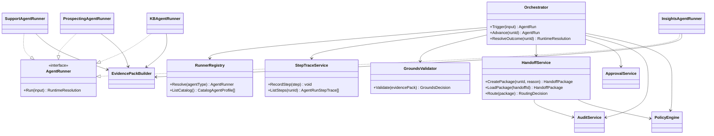
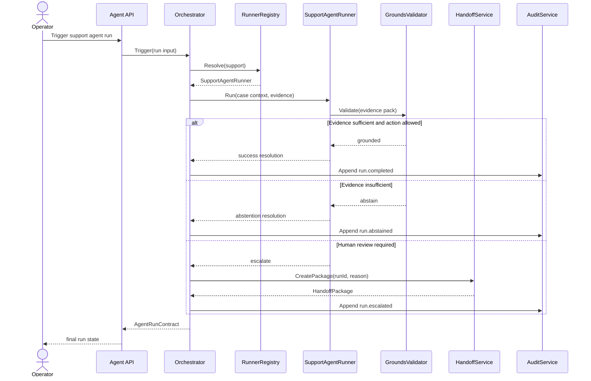
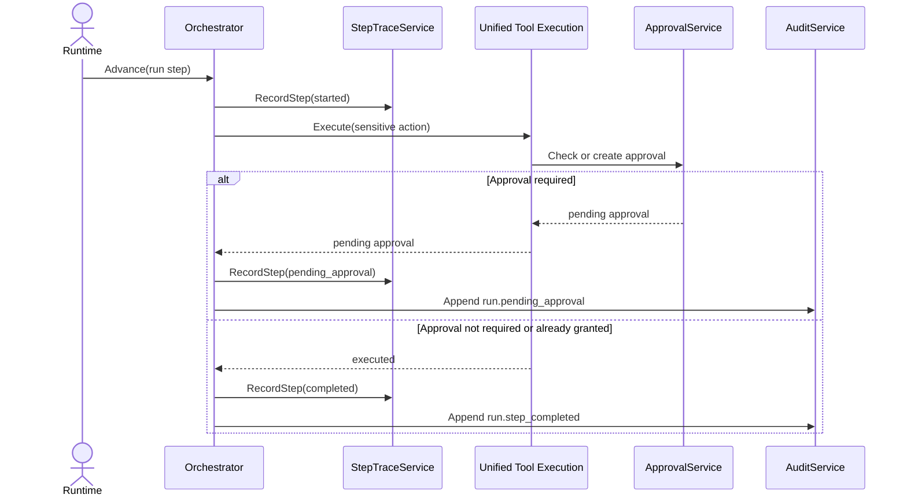
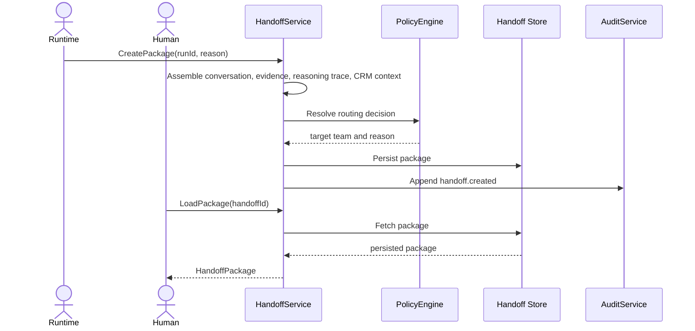
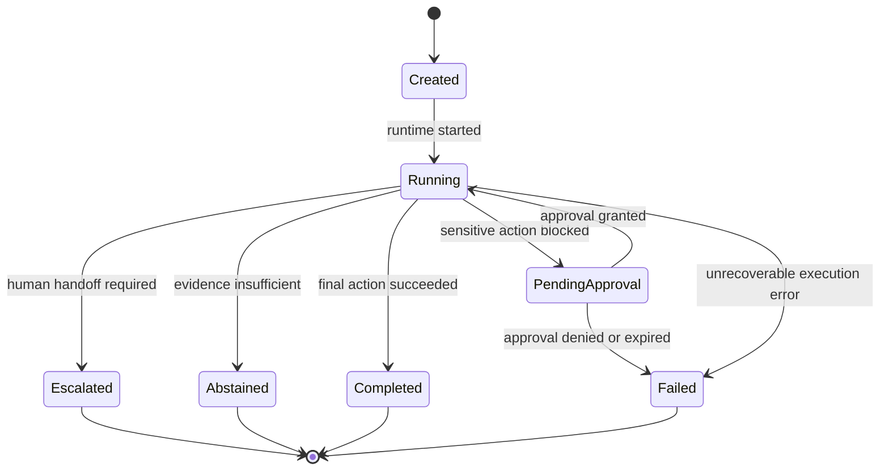

# Wave 3 Analysis, UML Design, and Development Plan

## 1. Purpose

This document defines the implementation-ready analysis for **Wave 3: Runtime Closure**.

Wave 3 covers:

- `WS-07` Agent Runtime Completion

Primary closure scope:

- `FR-230`
- `FR-231`
- `FR-232`
- runtime-facing closure of embedded `FR-210`
- baseline dependency `FR-092`

Wave objective:

- freeze the runtime state machine, step trace, handoff package, and minimum agent catalog contracts after Wave 1 and Wave 2 have already frozen governance, audit, retrieval, tool, copilot, prompt, and CRM contracts
- close the production-complete execution path for the minimum runtime scope without reopening later-wave work such as quotas, scheduling UI, or mobile expansion

## 2. Documentary Dependency Model

### 2.1 Core planning dependency

| Purpose | Primary source | Why it is mandatory |
|---------|----------------|---------------------|
| Wave sequencing | `docs/parallel_requirements.md` | Defines `WS-07`, its prerequisites, hotspots, and handoff into later waves |
| Business intent | `docs/requirements.md` sections `7.4` and `7.5` | Defines agent runtime, minimum agent catalog, human handoff, and abstention behavior |
| Contract prerequisites from prior waves | `docs/wave1-governance-audit-retrieval-analysis.md`, `docs/wave2-tooling-copilot-prompt-crm-analysis.md` | Wave 3 consumes frozen policy, audit, retrieval, tool, copilot, prompt, and CRM contracts from prior waves |
| API contract baseline | `docs/openapi.yaml` | Defines the current public route surface for approvals, agent runs, and handoff, even where FR trace tags are currently inconsistent |
| Current target architecture | `docs/architecture.md` runtime, approval, handoff, and support flows | Defines the target orchestration model, handoff package contents, and enforcement sequence |
| As-built baseline | `docs/as-built-design-features.md` | Identifies which runtime, catalog, and handoff pieces already exist partially |
| Gap closure criteria | `docs/fr-gaps-implementation-criteria.md` sections `FR-230`, `FR-231`, `FR-232` | Defines the runtime and handoff behaviors still missing for closure |
| Behavioral acceptance | `features/uc-c1-support-agent.feature`, `features/uc-a4-workflow-execution.feature`, `features/uc-a7-human-override-and-approval.feature`, `features/uc-s2-prospecting-agent.feature`, `features/uc-k1-kb-agent.feature`, `features/uc-d1-data-insights-agent.feature` | Defines stable behavior contracts already present in the repo for support, approval, and the minimum catalog surfaces |

### 2.2 LLM context packs

These packs should be loaded independently so runtime sessions do not reload the full history of Waves 1 and 2.

| Pack | Use | Load only these docs |
|------|-----|----------------------|
| `W3-CORE` | Wave sequencing and dependency gates | `docs/parallel_requirements.md`, this document |
| `W3-PREREQ` | Frozen upstream contracts | `docs/wave1-governance-audit-retrieval-analysis.md`, `docs/wave2-tooling-copilot-prompt-crm-analysis.md` |
| `W3-RUNTIME` | Orchestrator and step-trace sessions | `docs/requirements.md` section `7.5`, runtime sections in `docs/architecture.md`, `docs/fr-gaps-implementation-criteria.md` `FR-230`, `features/uc-a4-workflow-execution.feature` |
| `W3-HANDOFF` | Handoff and escalation sessions | `docs/requirements.md` sections `7.4` and `7.5`, handoff sections in `docs/architecture.md`, `docs/fr-gaps-implementation-criteria.md` `FR-232`, `features/uc-c1-support-agent.feature`, `features/uc-a7-human-override-and-approval.feature` |
| `W3-CATALOG` | Minimum agent catalog sessions | `docs/requirements.md` section `7.5`, runtime block in `docs/as-built-design-features.md`, `docs/fr-gaps-implementation-criteria.md` `FR-231`, `features/uc-c1-support-agent.feature`, `features/uc-s2-prospecting-agent.feature`, `features/uc-k1-kb-agent.feature`, `features/uc-d1-data-insights-agent.feature` |

### 2.3 Traceability rule

Wave 3 must keep one explicit traceability note in every implementation task:

- record which Wave 1 and Wave 2 contracts the task consumes unchanged
- record whether the task changes `agent_run`, `handoff`, or approval-related API semantics
- if the task touches `docs/openapi.yaml`, note that current agent-run and handoff routes are traced to `FR-202` and should be reconciled with runtime ownership

## 3. Scope and Constraints

### 3.1 In-scope closure

- explicit runtime state machine and step-level traceability for `FR-230`
- production-complete UC-C1 support flow for `FR-231`
- minimum agent catalog closure for support, prospecting, KB, and insights under one shared runtime contract
- deterministic human handoff package and escalation rules for `FR-232`
- runtime-facing enforcement of embedded `FR-210`

### 3.2 Explicit scope boundaries

- Wave 3 starts only after Wave 1 and Wave 2 contracts are frozen; it must not redefine policy, audit, retrieval, tool, copilot, prompt, or CRM contracts
- `FR-210` remains embedded in runtime behavior, not a standalone runtime lane
- `FR-233` quotas and `FR-234` scheduling or trigger configuration remain out of scope, even though runtime files already contain some related infrastructure
- compatibility with deferred resume and delegation should be preserved, but Wave 3 must not expand into a dedicated scheduling or delegation roadmap
- the P0 catalog in `requirements.md` is support, prospecting, KB, and insights; `UC-S3` deal-risk may be used as a secondary validation surface but is not the primary closure target for `FR-231`
- mobile and BFF remain downstream consumer surfaces for run and handoff contracts, not standalone Wave 3 lanes

## 4. Use Case Analysis

### 4.1 UC-W3-01 Trigger and track an agent run through an explicit state machine

- Workstream: `WS-07`
- Primary actor: Operator or system caller
- Goal: start an agent run, persist its lifecycle, and expose a stable run contract with step-level traceability
- Preconditions:
  - agent definition exists and is active
  - Wave 1 and Wave 2 contracts are frozen
- Main flow:
  1. caller triggers an agent run
  2. runtime resolves the agent definition and creates an `agent_run`
  3. runtime executes steps through a controlled state machine
  4. each step is recorded with status, reason, and trace metadata
  5. final run status is persisted with metrics
- Alternate paths:
  - a step fails and runtime enters controlled failure
  - a step requires approval and runtime moves to a pending state
  - runtime must abstain because evidence is insufficient
- Outputs:
  - stable `agent_run` contract
  - explicit per-step trace and final status
- Documentary basis:
  - `docs/fr-gaps-implementation-criteria.md` section `FR-230`
  - `docs/architecture.md` runtime flow
  - `features/uc-a4-workflow-execution.feature`

### 4.2 UC-W3-02 Resolve, abstain, or hand off a support case deterministically

- Workstream: `WS-07`
- Primary actor: Support operator
- Goal: close UC-C1 with a real data-driven support path that can resolve, abstain, or hand off predictably
- Preconditions:
  - support case has CRM context and Evidence Pack
  - runtime can call the support agent using frozen upstream contracts
- Main flow:
  1. support agent loads case context and evidence
  2. runtime evaluates whether the case can be resolved safely
  3. if evidence and permissions are sufficient, the action executes and is recorded
  4. if evidence is insufficient, runtime abstains deterministically
  5. if human review is required, runtime creates a handoff package and escalates
- Alternate paths:
  - sensitive case action requires approval before execution
  - evidence is grounded but policy blocks the action
- Outputs:
  - production-complete UC-C1 resolution path
  - deterministic abstention and escalation behavior
- Documentary basis:
  - `features/uc-c1-support-agent.feature`
  - `docs/fr-gaps-implementation-criteria.md` sections `FR-231` and `FR-232`
  - `docs/architecture.md` support and handoff flows

### 4.3 UC-W3-03 Leave the runtime pending when approval is required

- Workstream: `WS-07` using Wave 1 and Wave 2 contracts
- Primary actor: Runtime
- Goal: keep execution safe when a nested action requires approval
- Preconditions:
  - sensitive action is proposed by workflow or agent path
  - approval workflow from Wave 1 is available
  - unified tool execution path from Wave 2 is available
- Main flow:
  1. runtime proposes a sensitive action
  2. unified execution path determines that approval is required
  3. approval request is created
  4. runtime records the pending-approval state in the step trace
  5. execution remains blocked until approval result is available
- Alternate paths:
  - approval is denied
  - approval expires and runtime resolves as blocked
- Outputs:
  - pending-approval runtime state
  - traceable linkage between blocked step and approval request
- Documentary basis:
  - `features/uc-a4-workflow-execution.feature`
  - `features/uc-a7-human-override-and-approval.feature`
  - `docs/parallel_requirements.md` `WS-07` notes

### 4.4 UC-W3-04 Create and retrieve a complete human handoff package

- Workstream: `WS-07`
- Primary actors: Runtime, human operator
- Goal: preserve enough context for a human to continue safely from the agent state
- Preconditions:
  - handoff trigger condition is met
  - runtime has access to conversation, evidence, reasoning trace, and CRM context
- Main flow:
  1. runtime initiates handoff
  2. handoff service assembles package contents
  3. policy determines escalation route
  4. package is persisted and exposed through retrieval APIs
  5. human operator reviews the package and continues the case
- Alternate paths:
  - partial package exists but one required section is missing
  - routing decision changes because policy or audience changed
- Outputs:
  - stable `HandoffPackage` contract
  - deterministic persistence and retrieval behavior
- Documentary basis:
  - `features/uc-c1-support-agent.feature`
  - `docs/fr-gaps-implementation-criteria.md` section `FR-232`
  - `docs/architecture.md` handoff flow

### 4.5 UC-W3-05 Run the minimum agent catalog on one shared contract

- Workstream: `WS-07`
- Primary actor: Operator
- Goal: run support, prospecting, KB, and insights agents under the same runtime, trace, and handoff model
- Preconditions:
  - agent registry and definitions exist
  - runtime contract is frozen
- Main flow:
  1. operator or system triggers a catalog agent
  2. runtime resolves the agent profile, goals, allowed tools, and limits
  3. agent executes under the shared orchestration model
  4. result is returned with stable trace metadata
- Alternate paths:
  - agent module exists but diverges from shared contract expectations
  - one agent depends on a missing upstream contract and remains non-closable
- Outputs:
  - one minimum catalog contract
  - aligned execution semantics across required agents
- Documentary basis:
  - `docs/requirements.md` `FR-231`
  - `docs/as-built-design-features.md` runtime block
  - `features/uc-s2-prospecting-agent.feature`, `features/uc-k1-kb-agent.feature`, `features/uc-d1-data-insights-agent.feature`

### 4.6 UC-W3-06 Preserve deferred and delegated compatibility without scope expansion

- Workstream: `WS-07`
- Primary actor: Runtime
- Goal: avoid breaking deferred resume and delegated execution while keeping them out of primary Wave 3 scope
- Preconditions:
  - resume and delegation infrastructure already exists in the codebase
- Main flow:
  1. runtime executes a normal run
  2. compatibility checks ensure step trace and run state still support deferred resume and delegated runs
  3. no Wave 3 task expands into scheduling UI or separate delegation product work
- Alternate paths:
  - a contract change breaks archived-resume or delegation trace metadata
- Outputs:
  - compatibility guarantee for adjacent runtime behaviors
  - no silent regression of existing infrastructure
- Documentary basis:
  - `features/uc-a6-deferred-actions.feature`
  - `features/uc-a9-agent-delegation.feature`
  - `internal/domain/agent/workflow_resume_handler.go`, `internal/domain/agent/delegate_evaluator.go`

## 5. Technical Design

### 5.1 Design principles

- do not rebuild runtime infrastructure that already exists; close gaps in the existing orchestrator and registry first
- make the run state machine explicit before extending any catalog behavior
- never allow approval, abstention, or handoff outcomes to exist only in logs; they must appear in the step trace and persisted run state
- keep the minimum catalog aligned to one shared runtime contract
- treat OpenAPI trace mismatches as traceability defects that must be resolved before downstream waves depend on runtime routes

### 5.2 Wave 3 contracts to freeze

| Contract | Producer | Consumer | Why it matters |
|----------|----------|----------|----------------|
| `AgentRunContract` | `WS-07` | UI, APIs, downstream waves | Defines persisted run state, metrics, and outcome semantics |
| `AgentRunStepTrace` | `WS-07` | Governance, approvals, support operations | Defines step-level status, reasons, transitions, and trace metadata |
| `RuntimeResolution` | `WS-07` | Support, prospecting, KB, insights, handoff | Defines success, abstention, pending-approval, escalated, and failed outcomes |
| `HandoffPackage` | `WS-07` | Human operators, BFF/mobile, later waves | Defines preserved context, evidence, reasoning trace, and routing metadata |
| `CatalogAgentProfile` | `WS-07` | Agent registry and later waves | Defines agent objective, allowed tools, limits, and KPIs for the minimum catalog |

### 5.3 UML class diagram

### 5.4 UML sequence diagram: support run resolve, abstain, or hand off

### 5.5 UML sequence diagram: runtime pending approval and step trace

### 5.6 UML sequence diagram: handoff package creation and retrieval

### 5.7 UML state diagram: agent run lifecycle

## 6. Development Task Plan

### 6.1 Execution strategy

- run `WS-07` as one lane with three subtracks: runtime core, handoff, and catalog alignment
- assign one runtime owner, one handoff owner, and one catalog owner, plus one integrator for shared contracts
- start by reading the existing runtime files and migrations before proposing structural rewrites

### 6.2 Task backlog

| ID | Lane | Task | Depends on tasks | Documentary dependency | Done when |
|----|------|------|------------------|------------------------|-----------|
| `W3-00` | Core | Freeze Wave 3 glossary, prerequisites, and shared contracts | - | `docs/parallel_requirements.md`, this document | Wave 3 has one shared glossary for runs, step traces, runtime outcomes, handoff packages, and catalog profiles |
| `W3-01` | Core | Audit existing runtime infrastructure before changing behavior | `W3-00` | `internal/domain/agent/orchestrator.go`, `internal/domain/agent/runner_registry.go`, `internal/domain/agent/grounds_validator.go`, `internal/domain/agent/handoff.go`, migrations `018_agents` and `021_agent_run_steps` | The team knows which runtime pieces are already real and which remain partial |
| `W3-02` | Runtime | Freeze `AgentRunContract`, `AgentRunStepTrace`, and `RuntimeResolution` | `W3-00`, `W3-01` | `docs/architecture.md`, `docs/fr-gaps-implementation-criteria.md` `FR-230`, `docs/openapi.yaml` agent-run routes | Run state, step trace, and outcome semantics are explicit and stable |
| `W3-03` | Runtime | Implement the explicit multi-step runtime state machine | `W3-02` | `docs/fr-gaps-implementation-criteria.md` `FR-230`, `docs/parallel_requirements.md` `WS-07` brief | Runtime advances through explicit states instead of partial ad hoc transitions |
| `W3-04` | Runtime | Standardize retries, recovery, and per-run metrics | `W3-03` | `docs/requirements.md` `FR-230`, `docs/fr-gaps-implementation-criteria.md` `FR-230` | Runs expose tokens, cost, latency, final status, and controlled retry or recovery behavior |
| `W3-05` | Runtime | Close deterministic runtime abstention using `grounds_validator` | `W3-02`, `W3-03` | `docs/parallel_requirements.md` `FR-210` note, `features/uc-c1-support-agent.feature` | Low-confidence runtime paths always resolve to abstention deterministically |
| `W3-06` | Runtime | Implement pending-approval runtime transitions and trace linkage | `W3-03` | `features/uc-a4-workflow-execution.feature`, `features/uc-a7-human-override-and-approval.feature`, Wave 1 and Wave 2 contracts | Blocked actions move the run into a traceable pending-approval state |
| `W3-07` | Catalog | Freeze the minimum `CatalogAgentProfile` contract | `W3-00`, `W3-01` | `docs/requirements.md` `FR-231`, `docs/as-built-design-features.md` runtime block | Support, prospecting, KB, and insights share one contract for objective, tools, limits, and KPIs |
| `W3-08` | Catalog | Close the real UC-C1 support path without placeholder logic | `W3-02`, `W3-05`, `W3-06`, `W3-07` | `docs/fr-gaps-implementation-criteria.md` `FR-231`, `features/uc-c1-support-agent.feature` | Support flow can resolve, abstain, or hand off using real data and runtime contracts |
| `W3-09` | Catalog | Align prospecting, KB, and insights runners to the shared runtime contract | `W3-07` | `features/uc-s2-prospecting-agent.feature`, `features/uc-k1-kb-agent.feature`, `features/uc-d1-data-insights-agent.feature` | The minimum catalog runs under one shared orchestration model |
| `W3-10` | Catalog | Validate secondary catalog compatibility without reopening scope | `W3-09` | `features/uc-s3-deal-risk-agent.feature`, `features/uc-a9-agent-delegation.feature`, `features/uc-a6-deferred-actions.feature` | Existing adjacent runtime surfaces remain compatible but do not expand Wave 3 scope |
| `W3-11` | Handoff | Freeze `HandoffPackage` contents and routing metadata | `W3-00`, `W3-01` | `docs/architecture.md` handoff flow, `docs/fr-gaps-implementation-criteria.md` `FR-232` | Handoff contents and routing semantics are explicit and stable |
| `W3-12` | Handoff | Implement deterministic handoff persistence and retrieval | `W3-11` | `docs/fr-gaps-implementation-criteria.md` `FR-232`, `docs/openapi.yaml` handoff route | Handoff state can be stored and loaded without ambiguity |
| `W3-13` | Handoff | Close human-consumable handoff continuity for UC-C1 | `W3-08`, `W3-11`, `W3-12` | `features/uc-c1-support-agent.feature`, `docs/architecture.md` handoff package contents | Human operators receive the preserved context required to continue the case |
| `W3-14` | Traceability | Reconcile runtime and handoff API ownership in `openapi.yaml` | `W3-02`, `W3-11` | `docs/openapi.yaml` routes `/api/v1/agents/runs*`, `/api/v1/approvals*` | Runtime and handoff routes no longer trace only to `FR-202` if runtime ownership is canonical |
| `W3-15` | Integration | Add runtime closure coverage for success, abstention, handoff, and pending approval | `W3-04`, `W3-08`, `W3-13`, `W3-14` | `features/uc-c1-support-agent.feature`, `features/uc-a4-workflow-execution.feature`, `features/uc-a7-human-override-and-approval.feature` | Runtime closure behavior is covered end to end |
| `W3-16` | Integration | Publish Wave 3 handoff note for Wave 4 and deferred expansion consumers | `W3-09`, `W3-13`, `W3-15` | `docs/parallel_requirements.md`, this document | Later waves can consume runtime, handoff, and catalog contracts without reloading all implementation history |

### 6.3 Recommended parallel breakdown

| Owner | Primary lane | Start set | Cross-lane touch allowed |
|-------|--------------|-----------|--------------------------|
| Team or agent A | Runtime core | `W3-02` to `W3-06` | Only shared contract review with `W3-00`, `W3-01`, and `W3-16` |
| Team or agent B | Catalog closure | `W3-07` to `W3-10` | Only runtime contract review with `W3-16` |
| Team or agent C | Handoff | `W3-11` to `W3-13` | Only runtime and API contract review with `W3-16` |
| Integrator | Cross-lane | `W3-00`, `W3-01`, `W3-14`, `W3-16` | All frozen contracts, no expansion into quotas, scheduling UI, or mobile work |

### 6.4 Exit gates

Wave 3 should be considered documentary-ready for implementation and integration only when:

- `WS-07` publishes a stable `AgentRunContract`, `AgentRunStepTrace`, and `RuntimeResolution`
- UC-C1 is modeled as a complete resolve, abstain, or handoff path
- the minimum catalog contract is explicit for support, prospecting, KB, and insights
- `HandoffPackage` is frozen and retrieval semantics are explicit
- runtime and handoff route ownership is reconciled in API traceability
- Wave 3 publishes one handoff note consumable by Wave 4 and deferred expansion lanes

## 7. Risks and Early Decisions

- **runtime rebuild risk**: the codebase already contains substantial runtime infrastructure; Wave 3 must close gaps rather than restart the design from zero
- **`FR-210` drift**: abstention logic must be deterministic in runtime, not just in Copilot
- **catalog ambiguity**: the repo contains additional agents such as deal-risk, but the P0 minimum catalog in `requirements.md` is support, prospecting, KB, and insights
- **handoff contract incompleteness**: a partial package is worse than a failed handoff because it creates false operational confidence
- **traceability drift in OpenAPI**: current agent-run and handoff routes are still traced to `FR-202`, which is not sufficient once runtime ownership becomes the canonical interpretation

## 8. Output Expected From Each Workstream

Each Wave 3 subtrack should end with:

- one contract note
- one task completion summary
- one list of downstream consumers affected by the frozen contract
- one minimal context pack for the next session
