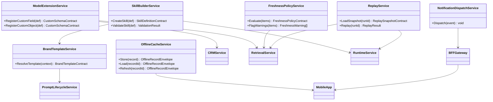
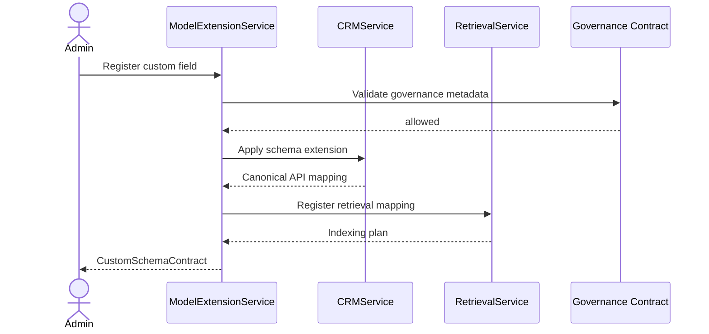
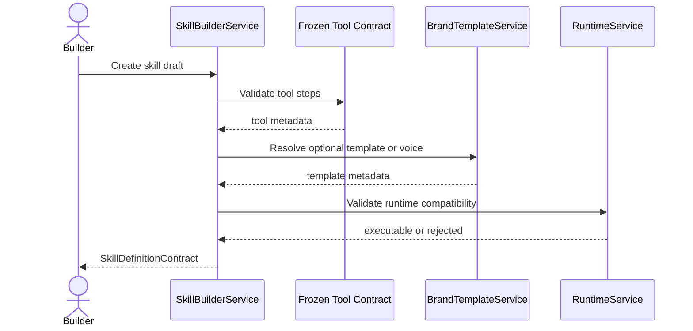
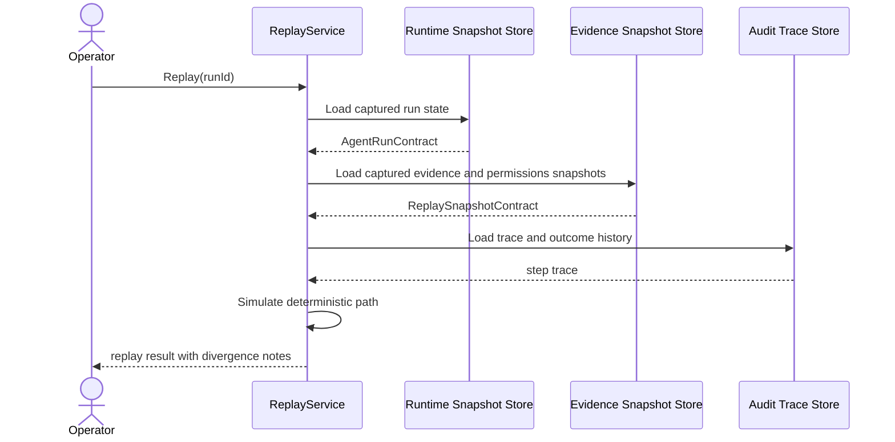
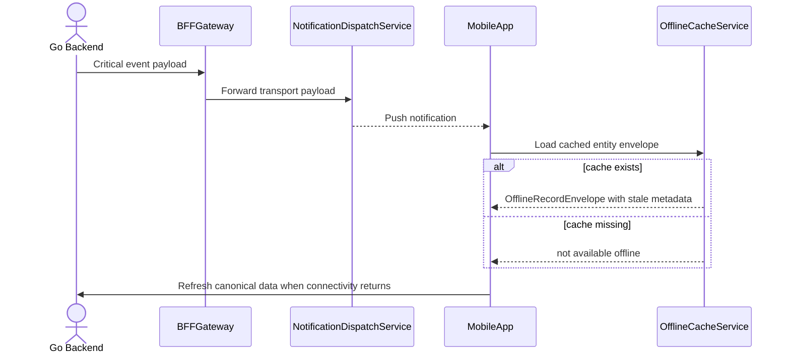
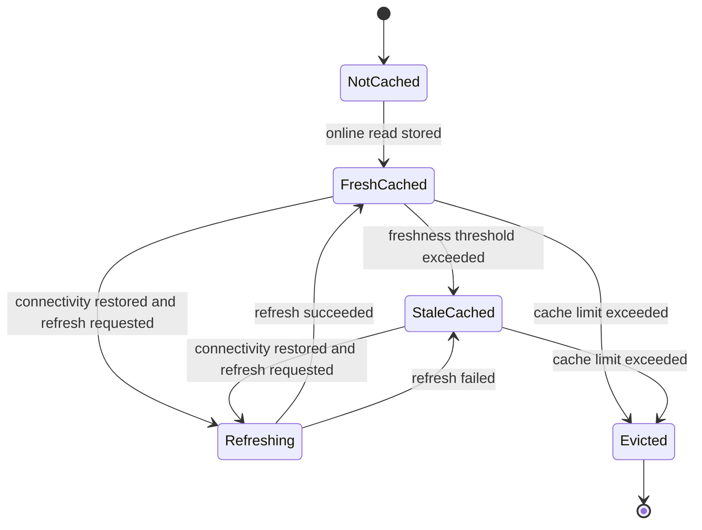

# Wave 4 Analysis, UML Design, and Development Plan

## 1. Purpose

This document defines the implementation-ready analysis for **Wave 4: Unblocked Expansion After P0 Closure**.

Wave 4 covers:

- `FX-02` CRM Extensibility
- `FX-03` Retrieval Freshness and Replay
- `FX-05` Authoring, Templates, and Skills
- `FX-06` Mobile Expansion

Primary Wave 4 scope:

- `FR-004`
- `FR-093`
- `FR-203`
- `FR-241`
- `FR-243`
- `FR-302`
- `FR-303`

Wave objective:

- open the first post-P0 expansion wave without external blockers
- extend the platform only through contracts already frozen by Waves 1-3
- make explicit where Wave 4 relies on direct documentation and where it must be derived from surrounding architecture and existing repo surfaces

## 2. Documentary Dependency Model

### 2.1 Core planning dependency

| Purpose | Primary source | Why it is mandatory |
|---------|----------------|---------------------|
| Wave sequencing | `docs/parallel_requirements.md` | Defines Wave 4 membership, start conditions, and mapping to `FX-02`, `FX-03`, `FX-05`, and `FX-06` |
| Business intent | `docs/requirements.md` sections `7.1`, `7.2`, `7.3`, `7.6`, `7.9` | Defines the expected behavior for extensible CRM schema, freshness, brand templates, skills builder, replay, push, and offline cache |
| Upstream contracts | `docs/wave1-governance-audit-retrieval-analysis.md`, `docs/wave2-tooling-copilot-prompt-crm-analysis.md`, `docs/wave3-agent-runtime-handoff-analysis.md` | Wave 4 consumes frozen governance, retrieval, tool, copilot, prompt, runtime, and handoff contracts |
| Current target architecture | `docs/architecture.md` | Defines BFF constraints, `skill_definition`, freshness behavior, and mobile/BFF responsibilities |
| Current API surface | `docs/openapi.yaml` | Shows which public surfaces already exist and which Wave 4 surfaces are still undocumented |
| As-built baseline | `docs/as-built-design-features.md` | Anchors the current mobile, BFF, CRM, and runtime consumer surfaces that Wave 4 must extend without breaking |
| Program-level roadmap | `docs/implementation-plan.md` | Provides the only additional roadmap-level mention of `FR-243` beyond `requirements.md` |

### 2.2 Codebase anchors when higher-level docs are thin

These are not treated as replacement sources of truth. They are the nearest implementation anchors when direct narrative docs do not exist.

| Area | Anchor | Why it matters |
|------|--------|----------------|
| Skills builder | `internal/infra/sqlite/migrations/018_agents.up.sql`, `internal/infra/sqlite/queries/agent.sql`, `internal/domain/agent/skill_runner.go` | Shows `skill_definition` already exists as a data and runtime surface |
| Freshness | `internal/domain/knowledge/models.go`, `internal/domain/knowledge/evidence_test.go`, `internal/domain/knowledge/reindex_test.go` | Shows freshness warnings and SLA-oriented behavior already exist partially |
| Replay snapshots | `internal/infra/sqlite/migrations/011_knowledge.up.sql`, `internal/infra/sqlite/queries/knowledge.sql` | Shows ranked search result snapshots exist and can anchor replay design |
| Mobile consumer baseline | `mobile/src/services/api.ts`, `mobile/src/services/api.agents.ts`, `mobile/src/hooks/useCRM.ts` | Shows current mobile behavior is online-first and API-relay based |
| BFF consumer baseline | `bff/src/routes/copilot.ts`, `bff/src/services/goClient.ts` | Shows BFF is currently a thin proxy with no domain logic beyond relay concerns |

### 2.3 LLM context packs

These packs should be loaded independently because Wave 4 spans multiple domains and lacks uniform BDD coverage.

| Pack | Use | Load only these docs |
|------|-----|----------------------|
| `W4-CORE` | Wave sequencing and handoff | `docs/parallel_requirements.md`, this document |
| `W4-EXT` | `FR-004` sessions | `docs/requirements.md` `FR-004`, `docs/wave1-governance-audit-retrieval-analysis.md`, `docs/wave2-tooling-copilot-prompt-crm-analysis.md`, CRM and retrieval sections in `docs/architecture.md` |
| `W4-FRESH` | `FR-093` and `FR-243` sessions | `docs/requirements.md` `FR-093` and `FR-243`, `docs/wave1-governance-audit-retrieval-analysis.md`, `docs/wave3-agent-runtime-handoff-analysis.md`, freshness and evidence sections in `docs/architecture.md`, `docs/implementation-plan.md` |
| `W4-SKILL` | `FR-203` and `FR-241` sessions | `docs/requirements.md` `FR-203` and `FR-241`, `docs/wave2-tooling-copilot-prompt-crm-analysis.md`, `docs/wave3-agent-runtime-handoff-analysis.md`, `docs/architecture.md` prompt and `skill_definition` model |
| `W4-MOBILE` | `FR-302` and `FR-303` sessions | `docs/requirements.md` `FR-302` and `FR-303`, `docs/wave2-tooling-copilot-prompt-crm-analysis.md`, `docs/wave3-agent-runtime-handoff-analysis.md`, BFF and mobile sections in `docs/architecture.md`, `docs/as-built-design-features.md` mobile/BFF block |

### 2.4 Documentary confidence map

This table makes explicit where Wave 4 is directly documented and where the design must be derived by integration.

| FR | Documentary confidence | Direct support | Integration fallback |
|----|------------------------|----------------|----------------------|
| `FR-004` | Medium | `docs/requirements.md`, `docs/parallel_requirements.md` | derive from Wave 1 governance and Wave 1 retrieval closure |
| `FR-093` | Medium | `docs/requirements.md`, `docs/architecture.md` freshness note | derive from existing evidence warnings and reindex SLA surfaces |
| `FR-203` | Low-medium | `docs/requirements.md` only | derive from Wave 2 prompt lifecycle and existing drafting surfaces |
| `FR-241` | Medium | `docs/requirements.md`, `docs/architecture.md` `skill_definition` model | derive from existing `skill_definition` persistence and Wave 2 tooling |
| `FR-243` | Low-medium | `docs/requirements.md`, `docs/implementation-plan.md` | derive from Wave 1 audit, Wave 3 runtime traces, and search-result snapshots |
| `FR-302` | Medium | `docs/requirements.md`, `docs/architecture.md` BFF push responsibility | derive from Wave 3 runtime and handoff events plus BFF relay constraints |
| `FR-303` | Low-medium | `docs/requirements.md` only | derive from current mobile API access pattern and explicit no-offline-write rule |

### 2.5 Traceability rule

Wave 4 must keep one explicit traceability note in every implementation task:

- say whether the task is backed by direct repo documentation or by derived integration design
- if the task adds a public API or transport contract not present in `docs/openapi.yaml`, publish the contract note before implementation
- for `FR-302`, note that `docs/requirements.md` depends on `FR-071` while `docs/parallel_requirements.md` uses the codebase-numbering convention; document the dependency by semantic meaning, not just by numeric ID

## 3. Scope and Constraints

### 3.1 In-scope closure

- extensible CRM schema that can flow into APIs and retrieval without reopening P0 CRM foundations
- freshness policies and stale warnings for volatile knowledge
- reusable drafting templates and brand voice layered on top of Wave 2 prompt lifecycle
- low-code skills builder built on top of existing tools and Wave 3 runtime contracts
- deterministic replay or simulation based on persisted snapshots and traces
- mobile push notifications for critical runtime and governance events
- read-only offline cache for recent CRM data with stale indication and reconnect sync

### 3.2 Explicit scope boundaries

- Wave 4 consumes previous-wave contracts; it must not redefine governance, audit, retrieval, copilot, prompt, runtime, or handoff foundations
- `FR-004` must not reopen full reporting or pipeline scope
- `FR-243` must not depend on replaying live mutable state by default; snapshot-based or captured-state replay is the safe baseline
- `FR-302` must respect the BFF rule of zero business logic; event interpretation stays in Go
- `FR-303` is read-only offline cache only; offline writes stay out of scope
- if a Wave 4 area lacks direct BDD or API documentation, the task must freeze a derived contract note before code work starts

## 4. Use Case Analysis

### 4.1 UC-W4-01 Add a custom field and make it queryable without downtime

- Scope: `FR-004`
- Confidence: derived integration design
- Primary actor: CRM admin
- Goal: add a custom field or object without downtime and make it visible to API and retrieval consumers
- Preconditions:
  - Wave 1 governance and Wave 1 retrieval contracts are frozen
  - tenant-level schema metadata can be registered safely
- Main flow:
  1. admin defines a custom field or object
  2. system validates schema and governance metadata
  3. API layer exposes the new field through the canonical CRM contract
  4. retrieval layer indexes the extensible field with correct permissions and sensitivity handling
- Alternate paths:
  - custom field lacks governance classification
  - retrieval mapping is missing, so the field must remain API-only until indexed safely
- Outputs:
  - extensible schema contract
  - aligned API and retrieval behavior
- Documentary basis:
  - `docs/requirements.md` `FR-004`
  - `docs/parallel_requirements.md`
  - Wave 1 and Wave 2 contract docs

### 4.2 UC-W4-02 Warn when evidence is stale according to entity-type TTL

- Scope: `FR-093`
- Confidence: medium
- Primary actor: Copilot, runtime, or user-facing consumer
- Goal: flag volatile evidence when it has aged beyond the expected freshness threshold
- Preconditions:
  - Wave 1 reindex and evidence contracts are frozen
  - knowledge items carry timestamps and source metadata
- Main flow:
  1. consumer requests evidence-backed output
  2. evidence builder evaluates TTL policy per item type
  3. stale evidence is flagged before response assembly
  4. caller receives warnings or degraded confidence
- Alternate paths:
  - stale evidence exists but fresher evidence is unavailable
  - TTL policy for the type is missing and must fall back to a documented default
- Outputs:
  - `FreshnessWarning` contract
  - deterministic stale-evidence behavior
- Documentary basis:
  - `docs/requirements.md` `FR-093`
  - `docs/architecture.md` freshness note
  - knowledge freshness anchors in the codebase

### 4.3 UC-W4-03 Generate a branded draft using tenant-level templates

- Scope: `FR-203`
- Confidence: derived integration design
- Primary actor: Sales or support operator
- Goal: produce a draft that respects tenant or unit templates and brand voice without bypassing prompt lifecycle controls
- Preconditions:
  - Wave 2 prompt lifecycle is frozen
  - drafting path already exists in Copilot or agents
- Main flow:
  1. operator requests a draft
  2. system resolves the applicable tenant or segment template
  3. template version and brand voice are applied through the existing prompt lifecycle
  4. generated draft returns with traceable template provenance
- Alternate paths:
  - no template exists for the segment
  - template exists but is not active or verified
- Outputs:
  - `BrandTemplate` contract
  - version-aware drafting behavior
- Documentary basis:
  - `docs/requirements.md` `FR-203`
  - `docs/wave2-tooling-copilot-prompt-crm-analysis.md`

### 4.4 UC-W4-04 Build a reusable skill from existing tools and runtime steps

- Scope: `FR-241`
- Confidence: medium
- Primary actor: Platform builder
- Goal: compose a reusable multi-step skill on top of existing tools and runtime semantics
- Preconditions:
  - Wave 2 tool contracts are frozen
  - Wave 3 runtime contracts are frozen
  - `skill_definition` persistence exists
- Main flow:
  1. builder selects tools and step order
  2. system validates auth, retries, and rate-limit metadata
  3. skill is stored as a reusable definition
  4. runtime can execute the skill through the shared orchestration model
- Alternate paths:
  - one tool lacks compatible auth or retry semantics
  - skill uses a step not representable in the shared runtime contract
- Outputs:
  - `SkillDefinition` lifecycle
  - reusable low-code execution unit
- Documentary basis:
  - `docs/requirements.md` `FR-241`
  - `docs/architecture.md` `skill_definition` model
  - `internal/infra/sqlite/migrations/018_agents.up.sql`

### 4.5 UC-W4-05 Replay an agent run from captured evidence and trace data

- Scope: `FR-243`
- Confidence: derived integration design
- Primary actor: Governance operator
- Goal: reproduce or simulate a prior run using captured snapshots instead of live mutable state
- Preconditions:
  - Wave 1 audit and Wave 3 runtime contracts are frozen
  - the system can access captured evidence, trace, and permissions snapshot data
- Main flow:
  1. operator requests replay for a prior run
  2. replay service loads captured run state, evidence snapshots, and trace metadata
  3. system replays deterministically or simulates the run under a documented mode
  4. replay result is returned with divergence notes if full determinism is not possible
- Alternate paths:
  - snapshot coverage is incomplete and the system can only produce a partial simulation
  - current policies differ from captured policies and the replay must show that difference explicitly
- Outputs:
  - `ReplaySnapshot` contract
  - deterministic or explicitly-scoped simulation result
- Documentary basis:
  - `docs/requirements.md` `FR-243`
  - `docs/implementation-plan.md`
  - Wave 1 and Wave 3 contract docs

### 4.6 UC-W4-06 Notify mobile users about critical runtime and governance events

- Scope: `FR-302`
- Confidence: medium
- Primary actor: Mobile user
- Goal: receive push notifications for approval, handoff, and run-completion events without moving business logic into the BFF
- Preconditions:
  - BFF consumer surface and runtime/handoff events are frozen
  - mobile device can provide push-token metadata
- Main flow:
  1. Go backend emits a critical event
  2. BFF receives or polls the event stream as a transport layer
  3. BFF dispatches a push through FCM
  4. mobile app routes the user to the relevant screen or refresh path
- Alternate paths:
  - user disabled that notification type
  - event exists but payload lacks the route context needed by the mobile client
- Outputs:
  - `MobileNotificationEvent` contract
  - notification preference and routing behavior
- Documentary basis:
  - `docs/requirements.md` `FR-302`
  - `docs/architecture.md` BFF push responsibility
  - Wave 3 runtime and handoff docs

### 4.7 UC-W4-07 Read recent CRM data offline with stale indication and reconnect sync

- Scope: `FR-303`
- Confidence: derived integration design
- Primary actor: Mobile user
- Goal: consult recently viewed CRM data offline without allowing offline mutation
- Preconditions:
  - mobile consumer surfaces are stable
  - canonical CRM API contracts are frozen
- Main flow:
  1. user views CRM records online
  2. mobile app stores a bounded read-only cache of recent records
  3. user loses connectivity and opens cached records
  4. app marks the record as offline or stale
  5. once connectivity returns, app refreshes from canonical APIs
- Alternate paths:
  - record was never cached and cannot be shown offline
  - cached record is too old and must be displayed as stale-only
- Outputs:
  - `OfflineRecordEnvelope` contract
  - read-only offline behavior with reconnect sync
- Documentary basis:
  - `docs/requirements.md` `FR-303`
  - current mobile service and hook baseline
  - BFF and mobile constraints in `docs/architecture.md`

## 5. Technical Design

### 5.1 Design principles

- where direct documentation is missing, extend the nearest frozen contract instead of inventing a parallel abstraction
- keep Go as the owner of domain decisions; BFF stays transport-only even in Wave 4
- make replay explicit about the provenance of its data, especially when it cannot be fully deterministic
- treat mobile offline as a cache concern, not as an alternative domain contract
- require every new public surface in Wave 4 to publish its contract note before implementation

### 5.2 Wave 4 contracts to freeze

| Contract | Producer | Consumer | Why it matters |
|----------|----------|----------|----------------|
| `CustomSchemaContract` | `FR-004` | CRM API, retrieval, reporting follow-ons | Defines extensible field and object metadata, validation, and governance hooks |
| `FreshnessPolicyContract` | `FR-093` | Copilot, runtime, replay, UI | Defines TTL, stale thresholds, warnings, and confidence degradation |
| `BrandTemplateContract` | `FR-203` | Copilot drafting, skills, future channels | Defines tenant or segment template resolution and version linkage |
| `SkillDefinitionContract` | `FR-241` | Agent builder, runtime, future packaging | Defines reusable multi-step skill metadata and execution semantics |
| `ReplaySnapshotContract` | `FR-243` | Governance, runtime debugging, evals | Defines which captured state is sufficient for replay or simulation |
| `MobileNotificationEvent` | `FR-302` | Go backend, BFF, mobile | Defines critical event payloads and client routing metadata |
| `OfflineRecordEnvelope` | `FR-303` | Mobile app | Defines cached record payload, stale metadata, and reconnect refresh behavior |

### 5.3 UML class diagram

### 5.4 UML sequence diagram: add a custom field and propagate it into retrieval

### 5.5 UML sequence diagram: build a reusable skill from existing tools

### 5.6 UML sequence diagram: replay an agent run from captured state

### 5.7 UML sequence diagram: dispatch push and refresh offline cache

### 5.8 UML state diagram: offline record lifecycle

## 6. Development Task Plan

### 6.1 Execution strategy

- run Wave 4 as four coordinated subtracks: extensibility, freshness and replay, templates and skills, mobile expansion
- require every subtrack to publish a derived contract note before any implementation task that lacks direct BDD or API documentation
- use one integrator to prevent new public surfaces from bypassing `openapi.yaml` or the BFF thin-proxy rule

### 6.2 Task backlog

| ID | Lane | Task | Depends on tasks | Documentary dependency | Done when |
|----|------|------|------------------|------------------------|-----------|
| `W4-00` | Core | Freeze Wave 4 glossary, confidence map, and shared contracts | - | `docs/parallel_requirements.md`, this document | Wave 4 has one shared glossary for extensibility, freshness, templates, skills, replay, push, and offline cache |
| `W4-01` | Core | Publish documentary confidence note per FR before lane work starts | `W4-00` | this document | Every Wave 4 lane states whether it is direct-doc or derived integration design |
| `W4-02` | `FR-004` | Freeze `CustomSchemaContract` and governance hooks | `W4-00`, `W4-01` | `docs/requirements.md` `FR-004`, Wave 1 and Wave 2 docs | Extensible schema metadata, validation, and sensitivity hooks are explicit |
| `W4-03` | `FR-004` | Define API reflection and retrieval mapping for extensible fields | `W4-02` | `docs/requirements.md` `FR-004`, `docs/architecture.md`, Wave 1 retrieval contracts | Custom schema reaches canonical APIs and retrieval safely |
| `W4-04` | `FR-004` | Publish no-downtime migration and indexing handoff note | `W4-03` | `docs/parallel_requirements.md`, this document | Extensible schema changes can be staged without reopening P0 CRM hardening |
| `W4-05` | `FR-093` | Freeze `FreshnessPolicyContract` and warning semantics | `W4-00`, `W4-01` | `docs/requirements.md` `FR-093`, `docs/architecture.md` freshness note | TTL, warnings, and degraded-confidence behavior are explicit |
| `W4-06` | `FR-093` | Align TTL policy with evidence builder and user-facing warnings | `W4-05` | knowledge freshness anchors, Wave 1 contracts | Stale evidence behavior is deterministic across consumers |
| `W4-07` | `FR-243` | Freeze `ReplaySnapshotContract` from existing traces and snapshots | `W4-00`, `W4-01` | `docs/requirements.md` `FR-243`, `docs/implementation-plan.md`, Wave 1 and Wave 3 docs | Replay states exactly which captured data is required and what determinism means |
| `W4-08` | `FR-243` | Define replay and simulation modes without relying on live mutable state | `W4-07` | Wave 1 audit, Wave 3 runtime, snapshot anchors | Replay behavior is safe, deterministic where possible, and explicit where not |
| `W4-09` | `FR-203` | Freeze `BrandTemplateContract` on top of Wave 2 prompt lifecycle | `W4-00`, `W4-01` | `docs/requirements.md` `FR-203`, Wave 2 prompt doc | Templates and brand voice are version-aware and tenant-scoped |
| `W4-10` | `FR-203` | Define drafting path integration for tenant or segment templates | `W4-09` | `docs/requirements.md` `FR-203`, Wave 2 Copilot and prompt docs | Draft generation can consume templates without bypassing existing prompt controls |
| `W4-11` | `FR-241` | Freeze `SkillDefinitionContract` and builder lifecycle | `W4-00`, `W4-01` | `docs/requirements.md` `FR-241`, `docs/architecture.md`, `018_agents` migration | Skill builder semantics are explicit before public surfaces are added |
| `W4-12` | `FR-241` | Align skills with frozen tool, runtime, and template contracts | `W4-09`, `W4-11` | Wave 2 and Wave 3 docs plus skill anchors | Skills compose existing tools and runtime steps without parallel semantics |
| `W4-13` | `FR-302` | Freeze `MobileNotificationEvent` and preference contract | `W4-00`, `W4-01` | `docs/requirements.md` `FR-302`, `docs/architecture.md`, Wave 3 handoff/runtime docs | Push payloads and preference semantics are explicit |
| `W4-14` | `FR-302` | Define Go to BFF to FCM dispatch path without BFF business logic | `W4-13` | `docs/architecture.md` BFF constraints, Wave 3 event sources | Notification transport stays thin and domain meaning remains in Go |
| `W4-15` | `FR-303` | Freeze `OfflineRecordEnvelope` and read-only cache boundaries | `W4-00`, `W4-01` | `docs/requirements.md` `FR-303`, mobile service and hook anchors | Offline cache semantics are explicit and do not allow mutation |
| `W4-16` | `FR-303` | Define reconnect refresh and stale-indicator behavior on top of current mobile consumers | `W4-15` | mobile API and hook anchors, `docs/architecture.md` BFF/mobile constraints | Offline reads and reconnect sync behave consistently |
| `W4-17` | API | Reconcile missing public surface documentation for skills, replay, push, and offline behavior | `W4-08`, `W4-12`, `W4-14`, `W4-16` | `docs/openapi.yaml`, this document | Any new public contract is documented before implementation |
| `W4-18` | Integration | Publish Wave 4 handoff note for Wave 5 and later conditional waves | `W4-04`, `W4-06`, `W4-08`, `W4-10`, `W4-12`, `W4-14`, `W4-16`, `W4-17` | `docs/parallel_requirements.md`, this document | Later waves can consume Wave 4 contracts without reopening integration analysis |

### 6.3 Recommended parallel breakdown

| Owner | Primary lane | Start set | Cross-lane touch allowed |
|-------|--------------|-----------|--------------------------|
| Team or agent A | Extensibility | `W4-02` to `W4-04` | Only shared contract review with `W4-00`, `W4-01`, and `W4-18` |
| Team or agent B | Freshness and replay | `W4-05` to `W4-08` | Only runtime and audit contract review with `W4-18` |
| Team or agent C | Templates and skills | `W4-09` to `W4-12` | Only prompt, tool, and runtime contract review with `W4-18` |
| Team or agent D | Mobile expansion | `W4-13` to `W4-16` | Only BFF and runtime consumer review with `W4-18` |
| Integrator | Cross-lane | `W4-00`, `W4-01`, `W4-17`, `W4-18` | All frozen contracts, no expansion into externally gated waves |

### 6.4 Exit gates

Wave 4 should be considered documentary-ready for implementation and integration only when:

- every Wave 4 FR has a confidence note stating whether its design is direct-doc or derived
- `CustomSchemaContract`, `FreshnessPolicyContract`, `BrandTemplateContract`, `SkillDefinitionContract`, `ReplaySnapshotContract`, `MobileNotificationEvent`, and `OfflineRecordEnvelope` are frozen
- no new BFF behavior violates the thin-proxy rule
- no new offline behavior permits mutation
- any newly exposed public surface is reflected in `docs/openapi.yaml`
- Wave 4 publishes one handoff note consumable by Wave 5 and later conditional waves

## 7. Risks and Early Decisions

- **thin documentary coverage**: several Wave 4 FRs do not have direct BDD or gap docs, so design drift is a real risk if contract notes are skipped
- **schema versus governance drift**: `FR-004` can break permissions or sensitivity handling if custom schema metadata bypasses Wave 1 governance contracts
- **freshness ambiguity**: `FR-093` must degrade confidence predictably or stale warnings will become cosmetic only
- **replay nondeterminism**: `FR-243` becomes misleading if it silently replays against live mutable state
- **BFF scope creep**: `FR-302` can accidentally move event interpretation into the BFF, which would violate architecture constraints
- **offline divergence**: `FR-303` can create a second client-side domain contract if cached payloads stop matching canonical API envelopes

## 8. Output Expected From Each Workstream

Each Wave 4 subtrack should end with:

- one contract note
- one task completion summary
- one explicit confidence note describing whether the result is direct-doc or derived integration design
- one list of downstream consumers affected by the frozen contract
- one minimal context pack for the next session
