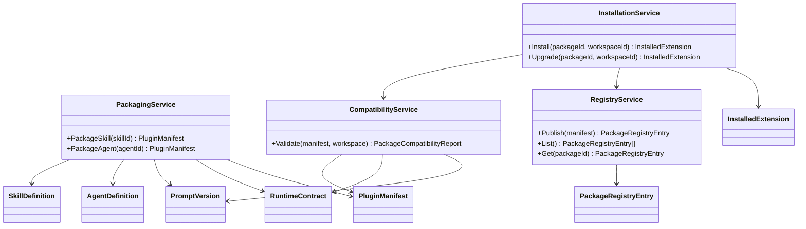
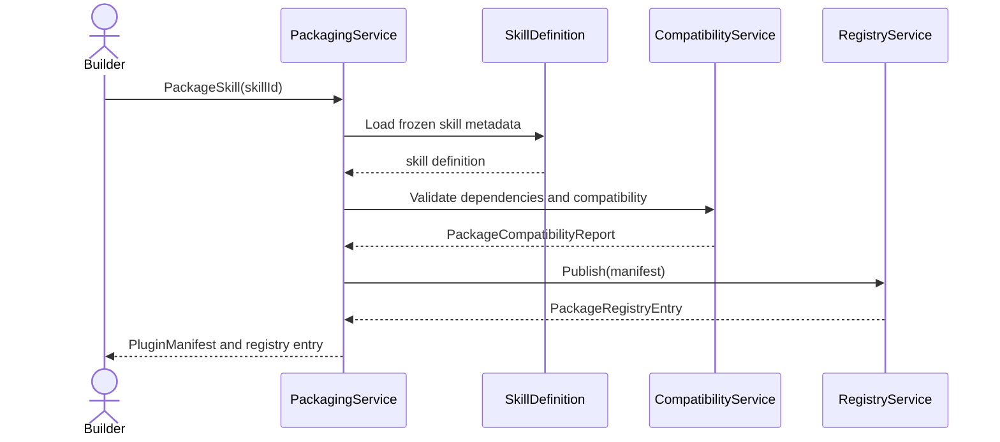
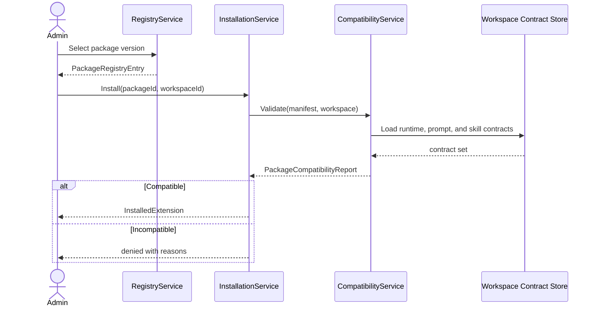
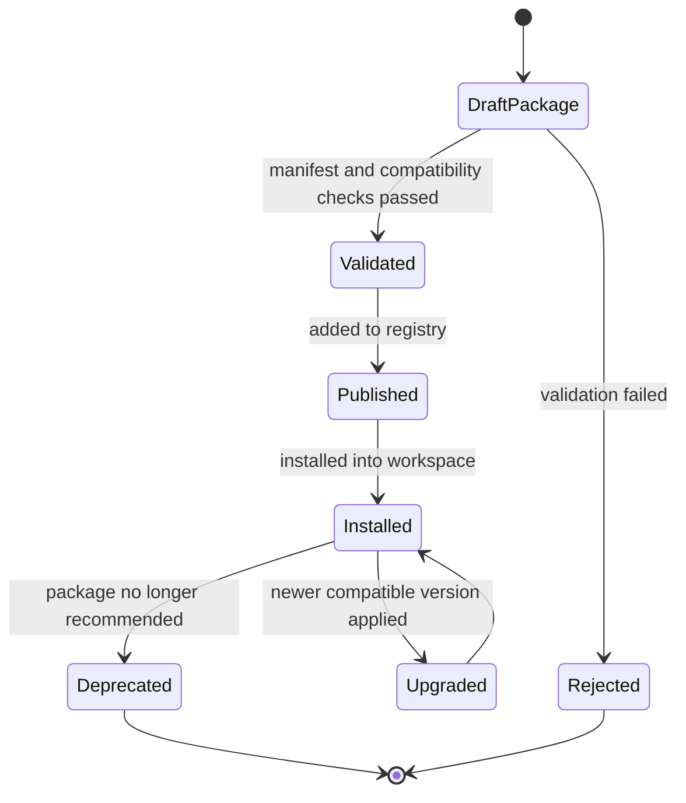

# Wave 5 Analysis, UML Design, and Development Plan

## 1. Purpose

This document defines the implementation-ready analysis for **Wave 5: Packaging and Distribution**.

Wave 5 covers:

- `FR-052`

Wave objective:

- define the first safe packaging model for installable extensions after Wave 4 has already frozen reusable skills and the upstream prompt lifecycle
- keep the slice conservative and traceable because the repo has very limited direct documentation for marketplace behavior
- avoid inventing UI extension or third-party distribution semantics that are not grounded in existing repo artifacts

## 2. Documentary Dependency Model

### 2.1 Core planning dependency

| Purpose | Primary source | Why it is mandatory |
|---------|----------------|---------------------|
| Wave sequencing | `docs/parallel_requirements.md` | Defines Wave 5 as `FR-052` after `FR-241` and `FR-240` |
| Business intent | `docs/requirements.md` `FR-052` | Defines the marketplace goal and the only explicit acceptance criterion: stable SDK contracts |
| Operational FR baseline | `reqs/FR/FR_052.yml` | Confirms the repo still treats marketplace as future scope and frames it as plugin SDK plus store |
| Program roadmap | `docs/implementation-plan.md` | Provides the only additional planning note: `FR-052: Plugin SDK + marketplace` |
| Upstream contracts | `docs/wave2-tooling-copilot-prompt-crm-analysis.md`, `docs/wave3-agent-runtime-handoff-analysis.md`, `docs/wave4-unblocked-expansion-analysis.md` | Wave 5 depends on prompt lifecycle, skills builder, runtime, and Wave 4 packaging-related contracts |
| Current target architecture | `docs/architecture.md` | Provides `agent_definition`, `skill_definition`, `prompt_version`, and BFF constraints that bound the packaging model |
| As-built baseline | `docs/as-built-design-features.md` | Confirms marketplace remains pending and outside current implemented scope |

### 2.2 Codebase anchors when narrative docs are thin

These are implementation anchors, not replacement sources of truth.

| Area | Anchor | Why it matters |
|------|--------|----------------|
| Skills persistence | `internal/infra/sqlite/migrations/018_agents.up.sql`, `internal/infra/sqlite/queries/agent.sql` | Shows `skill_definition` already exists as a packageable unit candidate |
| Skill execution | `internal/domain/agent/skill_runner.go` | Shows skill execution already has a runtime anchor |
| Prompt lifecycle | `internal/infra/sqlite/queries/prompt.sql`, `internal/domain/agent/prompt.go`, `internal/infra/sqlite/migrations/022_prompt_experiments.up.sql` | Shows prompt versions already have lifecycle semantics that packaging must not bypass |
| Agent definitions | `internal/domain/agent/runner_registry.go`, `internal/infra/sqlite/queries/agent.sql` | Shows agent packaging can reuse existing catalog and definition semantics |
| Eval linkage | `internal/infra/sqlite/queries/eval.sql`, `internal/infra/sqlite/migrations/020_eval.up.sql` | Shows package promotion can later attach to eval status, even if marketplace does not own eval design |

### 2.3 LLM context packs

Wave 5 should stay extremely narrow because direct docs are sparse.

| Pack | Use | Load only these docs |
|------|-----|----------------------|
| `W5-CORE` | Wave sequencing and scope | `docs/parallel_requirements.md`, this document |
| `W5-PKG` | Packaging design | `docs/requirements.md` `FR-052`, `reqs/FR/FR_052.yml`, `docs/implementation-plan.md`, this document |
| `W5-UPSTREAM` | Frozen dependency contracts | `docs/wave2-tooling-copilot-prompt-crm-analysis.md`, `docs/wave3-agent-runtime-handoff-analysis.md`, `docs/wave4-unblocked-expansion-analysis.md` |
| `W5-ANCHOR` | Codebase anchors for non-documented surfaces | `docs/architecture.md` agent and prompt model, skill and prompt persistence anchors listed above |

### 2.4 Documentary confidence map

`FR-052` has unusually thin direct support. The initial slice must therefore be conservative.

| Area | Confidence | Direct support | Integration fallback |
|------|------------|----------------|----------------------|
| Plugin SDK contracts | Medium | `docs/requirements.md`, `reqs/FR/FR_052.yml` | derive from Wave 2 tool and prompt contracts plus Wave 4 skill contracts |
| Packageable skills | Medium | Wave 4 `FR-241` plus `skill_definition` anchors | derive packaging metadata from existing skill lifecycle |
| Packageable agents | Low-medium | agent definition model in `docs/architecture.md` | derive packaging metadata from Wave 3 catalog contracts |
| Marketplace store surface | Low | `reqs/FR/FR_052.yml`, `docs/implementation-plan.md` only | derive minimal registry model, not a full commercial marketplace |
| Packageable widgets | Low | `docs/requirements.md` only | no supporting architecture, API, or code anchors exist today |

### 2.5 Traceability rule

Wave 5 must keep one explicit traceability note in every implementation task:

- state whether the task is grounded in direct documentation or only in derived integration design
- if the task introduces a public package manifest, installation route, or registry API, publish the contract note before any code work
- widgets must remain explicitly out of the initial slice unless a documented extension surface is added first

## 3. Scope and Constraints

### 3.1 In-scope closure

- packaging model for skills and agent-oriented extension units
- stable SDK and manifest contracts for installable extensions
- compatibility checks against prompt lifecycle, runtime, and skill contracts
- minimal internal marketplace or registry semantics sufficient to install and validate packages

### 3.2 Explicit scope boundaries

- Wave 5 starts only after `FR-241` and `FR-240` are frozen; it must not redefine skills or prompt lifecycle
- the initial `FR-052` slice should package **skills and agents first**
- `widgets` are **out of the initial slice** because the repo does not currently document any widget extension surface in architecture, OpenAPI, BFF, or mobile
- Wave 5 should define a registry or store contract only to the extent needed for installation, versioning, and compatibility; it should not assume payments, public publishing workflows, or multi-tenant storefront behavior
- any new API surface introduced by Wave 5 must be added to `docs/openapi.yaml` before implementation

## 4. Use Case Analysis

### 4.1 UC-W5-01 Package a reusable skill as an installable extension

- Scope: `FR-052`
- Confidence: derived integration design
- Primary actor: Platform builder
- Goal: package a skill into an installable artifact without breaking Wave 4 skill semantics
- Preconditions:
  - `FR-241` is frozen
  - the skill uses tool and runtime contracts already closed by earlier waves
- Main flow:
  1. builder selects a reusable skill definition
  2. packaging service resolves its metadata, dependencies, and compatibility requirements
  3. system emits a package manifest plus installable bundle metadata
  4. package is stored in the internal registry
- Alternate paths:
  - skill references tools or prompts outside the declared compatibility range
  - skill lacks required metadata for installation
- Outputs:
  - `PluginManifest`
  - `PackageCompatibilityReport`
- Documentary basis:
  - `docs/requirements.md` `FR-052`
  - `reqs/FR/FR_052.yml`
  - Wave 4 skill contracts

### 4.2 UC-W5-02 Install an extension into a workspace under compatibility rules

- Scope: `FR-052`
- Confidence: derived integration design
- Primary actor: Workspace admin
- Goal: install an extension only when runtime, prompt, and skill dependencies are satisfied
- Preconditions:
  - package exists in the registry
  - workspace has required upstream contracts available
- Main flow:
  1. admin requests installation
  2. installer validates package manifest, version compatibility, and permission requirements
  3. package is registered into the workspace
  4. installed extension becomes discoverable by the relevant runtime or builder surfaces
- Alternate paths:
  - dependency is missing
  - package requests a capability not supported by the workspace
- Outputs:
  - `InstalledExtension`
  - explicit install or deny decision
- Documentary basis:
  - `docs/requirements.md` `FR-052`
  - Wave 2, Wave 3, and Wave 4 frozen contracts

### 4.3 UC-W5-03 Version and upgrade a packaged extension safely

- Scope: `FR-052`
- Confidence: derived integration design
- Primary actor: Workspace admin or platform operator
- Goal: upgrade a package without ambiguous compatibility or hidden breakage
- Preconditions:
  - one package version is already installed
  - package metadata includes version and compatibility information
- Main flow:
  1. operator selects a newer package version
  2. system compares compatibility against installed runtime, prompts, and skills
  3. if compatible, the new version is installed
  4. prior package version remains traceable for rollback or audit
- Alternate paths:
  - package update changes required capabilities incompatibly
  - rollback target is missing or invalid
- Outputs:
  - versioned package lifecycle
  - explicit upgrade or rejection reason
- Documentary basis:
  - `docs/requirements.md` `FR-052`
  - Wave 2 prompt lifecycle and Wave 4 skill contracts

### 4.4 UC-W5-04 Expose a minimal internal marketplace or registry surface

- Scope: `FR-052`
- Confidence: low
- Primary actor: Platform operator
- Goal: provide the smallest registry surface needed to list, validate, and install internal packages
- Preconditions:
  - package manifest contract is frozen
- Main flow:
  1. package author publishes a package to the internal registry
  2. operator lists available packages
  3. operator inspects compatibility and install metadata
  4. operator initiates installation into a workspace
- Alternate paths:
  - package is deprecated or superseded
  - package fails validation and never becomes installable
- Outputs:
  - `PackageRegistryEntry`
  - minimal marketplace lifecycle
- Documentary basis:
  - `reqs/FR/FR_052.yml`
  - `docs/implementation-plan.md`

### 4.5 UC-W5-05 Explicitly defer widget packaging until the extension surface exists

- Scope: `FR-052` boundary control
- Confidence: direct constraint from absent documentation
- Primary actor: Platform architect
- Goal: avoid inventing a plugin mechanism for widgets without architectural backing
- Preconditions:
  - widget packaging has no documented extension surface in the current repo
- Main flow:
  1. Wave 5 reviews packageable extension kinds
  2. skills and agents are accepted into the initial slice
  3. widgets are flagged as unsupported in the first marketplace contract
  4. widget packaging remains blocked until a dedicated UI extension contract is documented
- Outputs:
  - safe initial Wave 5 scope
  - explicit non-goal note for widgets
- Documentary basis:
  - `docs/requirements.md` `FR-052`
  - repo-wide absence of widget extension docs

## 5. Technical Design

### 5.1 Design principles

- package only extension units that already have a frozen internal contract
- start with internal registry semantics, not a full marketplace business model
- do not let packaging bypass prompt lifecycle, skill validation, or runtime compatibility checks
- require manifest-first design before discussing transport or store APIs
- treat widgets as unsupported until a documented extension surface exists

### 5.2 Wave 5 contracts to freeze

| Contract | Producer | Consumer | Why it matters |
|----------|----------|----------|----------------|
| `PluginManifest` | `FR-052` | Registry, installer, workspace admin | Defines package identity, version, dependencies, and extension kind |
| `PackageCompatibilityReport` | `FR-052` | Installer, operators | Defines what upstream contracts and versions are required |
| `InstalledExtension` | `FR-052` | Runtime, builders, admin UI | Defines installation state and workspace binding |
| `PackageRegistryEntry` | `FR-052` | Registry and listing surfaces | Defines publishable package metadata and status |

### 5.3 Initial packageable units

Wave 5 should explicitly start with these units:

- `skill_definition` packages
- `agent_definition` packages that depend on frozen runtime and prompt contracts

Wave 5 should explicitly exclude these units from the initial slice:

- UI widgets
- arbitrary mobile or BFF plugins
- payment or storefront mechanics

### 5.4 UML class diagram

### 5.5 UML sequence diagram: package and publish a skill

### 5.6 UML sequence diagram: install a package into a workspace

### 5.7 UML state diagram: package lifecycle

## 6. Development Task Plan

### 6.1 Execution strategy

- run Wave 5 as one narrow lane with three concerns: manifest design, compatibility logic, and registry or installation surface
- require a contract note before any API or registry route is proposed
- keep the first iteration internal-only and conservative

### 6.2 Task backlog

| ID | Lane | Task | Depends on tasks | Documentary dependency | Done when |
|----|------|------|------------------|------------------------|-----------|
| `W5-00` | Core | Freeze Wave 5 glossary, confidence note, and initial slice boundaries | - | `docs/parallel_requirements.md`, this document | Wave 5 has one shared glossary for package, manifest, compatibility, registry, installation, and unsupported widget scope |
| `W5-01` | Core | Publish the initial Wave 5 scope note: skills and agents in, widgets out | `W5-00` | `docs/requirements.md`, `reqs/FR/FR_052.yml`, this document | The first packageable units are explicit and widgets are formally deferred |
| `W5-02` | Manifest | Freeze `PluginManifest` and `PackageCompatibilityReport` | `W5-00`, `W5-01` | `docs/requirements.md` `FR-052`, Wave 2-4 docs, code anchors | Package identity, versioning, dependencies, and compatibility checks are explicit |
| `W5-03` | Manifest | Map `skill_definition` and `agent_definition` to packageable units | `W5-02` | `docs/architecture.md`, `018_agents` migration, Wave 3 and Wave 4 docs | Skills and agents can be packaged without inventing new core abstractions |
| `W5-04` | Compatibility | Define compatibility checks against prompt lifecycle, runtime, and skill contracts | `W5-02`, `W5-03` | Wave 2, Wave 3, and Wave 4 contract docs | Package installation can be allowed or denied deterministically |
| `W5-05` | Registry | Freeze `PackageRegistryEntry` and minimal internal registry lifecycle | `W5-02` | `reqs/FR/FR_052.yml`, `docs/implementation-plan.md` | Registry surface is sufficient for publish, list, inspect, and install |
| `W5-06` | Installation | Freeze `InstalledExtension` semantics for install and upgrade | `W5-04`, `W5-05` | this document, upstream contract docs | Installed state, version transitions, and rollback expectations are explicit |
| `W5-07` | API | Reconcile any new package or registry surface into `docs/openapi.yaml` before implementation | `W5-05`, `W5-06` | `docs/openapi.yaml` | Any public package surface is documented before code work starts |
| `W5-08` | Integration | Publish Wave 5 handoff note for Wave 6 and later conditional waves | `W5-03`, `W5-04`, `W5-06`, `W5-07` | `docs/parallel_requirements.md`, this document | Later waves can consume packaging contracts without reopening Wave 5 analysis |

### 6.3 Recommended parallel breakdown

| Owner | Primary lane | Start set | Cross-lane touch allowed |
|-------|--------------|-----------|--------------------------|
| Team or agent A | Manifest and packaging | `W5-02` to `W5-03` | Only shared contract review with `W5-00`, `W5-01`, and `W5-08` |
| Team or agent B | Compatibility and installation | `W5-04` to `W5-06` | Only upstream contract review with `W5-08` |
| Integrator | Registry and API | `W5-05`, `W5-07`, `W5-08` | All frozen contracts, no widget or storefront scope expansion |

### 6.4 Exit gates

Wave 5 should be considered documentary-ready for implementation and integration only when:

- the initial slice is explicit: skills and agents only
- `PluginManifest`, `PackageCompatibilityReport`, `PackageRegistryEntry`, and `InstalledExtension` are frozen
- widgets remain explicitly unsupported until a documented extension surface exists
- any newly proposed public package surface is reflected in `docs/openapi.yaml`
- Wave 5 publishes one handoff note consumable by later waves

## 7. Risks and Early Decisions

- **very thin direct documentation**: Wave 5 has only minimal direct repo support, so contract-first discipline is mandatory
- **scope inflation**: marketplace can easily drift into commercial storefront concerns that the repo does not document
- **widget invention risk**: packaging UI widgets now would be speculative because no extension surface is documented
- **compatibility drift**: a package model that ignores prompt, skill, or runtime versions will break downstream install safety
- **registry without API traceability**: if registry semantics are designed but never reflected in `docs/openapi.yaml`, later waves will inherit an undocumented surface

## 8. Output Expected From Each Workstream

Wave 5 should end with:

- one contract note
- one task completion summary
- one explicit confidence note describing the derived parts of the design
- one list of downstream consumers affected by the frozen packaging contracts
- one minimal context pack for the next session
