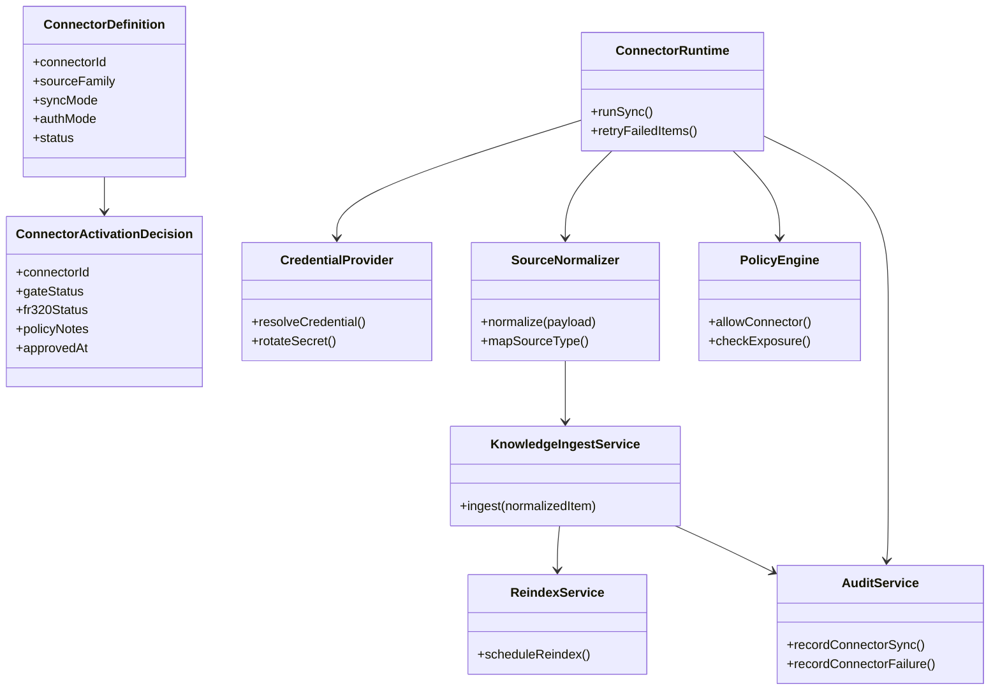
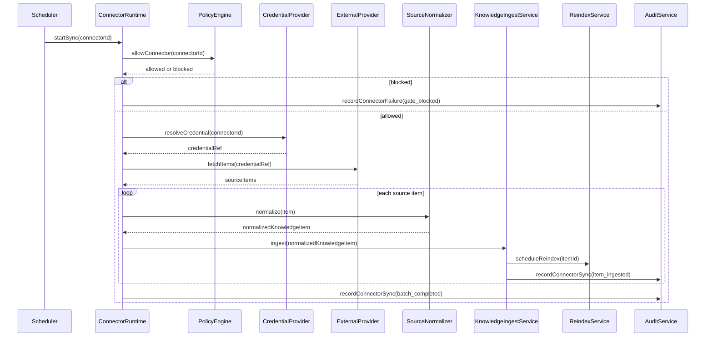
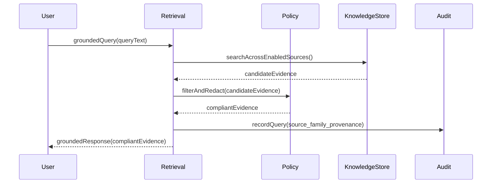
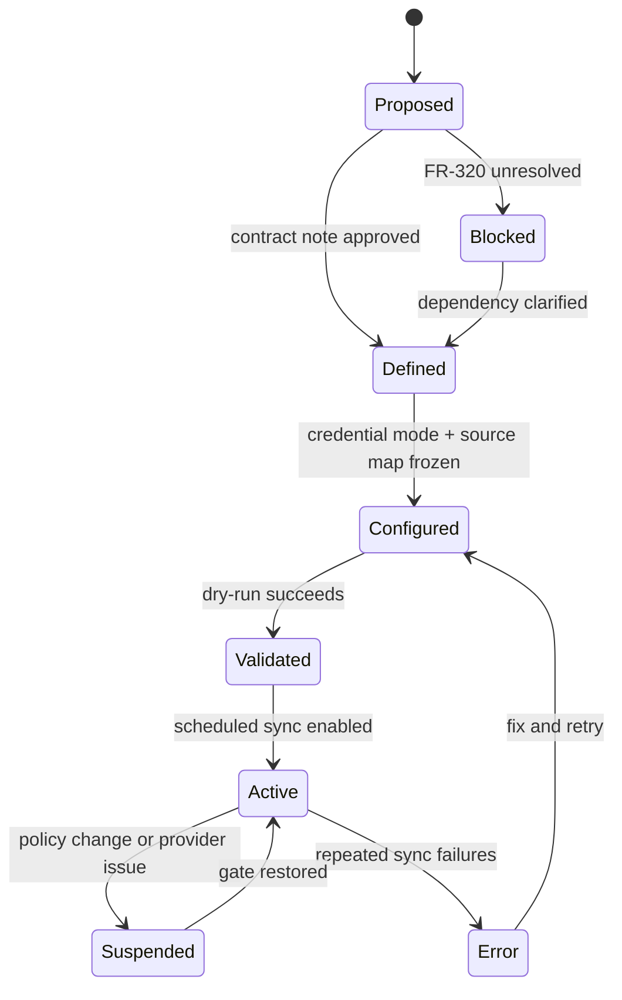

# Wave 6 Analysis, UML Design, and Development Plan

## 1. Purpose

This document defines the implementation analysis for **Wave 6: Connector Expansion Gate**.

Wave 6 covers:

- `FR-050`
- breadth expansion of `FR-091` beyond the already-unlocked source families closed in Wave 1

Wave objective:

- unlock connector-based source ingestion without breaking the governance, audit, and retrieval contracts already frozen by Waves 1 to 3
- treat this wave as a gated expansion, not as immediately executable product work
- make traceability gaps explicit before any connector-specific implementation starts

## 2. Documentary Dependency Model

### 2.1 Core planning dependency

| Purpose | Primary source | Why it is mandatory |
|---------|----------------|---------------------|
| Wave sequencing | `docs/parallel_requirements.md` | Declares Wave 6 as the connector expansion gate and states that it starts only when `FR-320` is clarified or implemented |
| Business intent for connectors | `docs/requirements.md` `FR-050` | Defines the connector framework goal, supported source families, token or secret handling, and per-connector audit expectation |
| Business intent for source breadth | `docs/requirements.md` `FR-091` | Defines multi-source ingestion breadth as a business requirement for the knowledge layer |
| Current operational baseline | `docs/as-built-design-features.md`, `docs/fr-gaps-implementation-criteria.md`, `reqs/FR/FR_091.yml` | Shows that current implemented and traceable `FR-091` scope is CDC and auto-reindex, not full connector breadth |
| Upstream frozen contracts | `docs/wave1-governance-audit-retrieval-analysis.md`, `docs/wave3-agent-runtime-handoff-analysis.md` | Wave 6 must inherit governance, audit, and retrieval guarantees instead of redefining them |
| Knowledge target architecture | `docs/architecture.md` | Provides the intended `knowledge_item` source model and the normalization target for external sources |
| Public API baseline | `docs/openapi.yaml` | Confirms the repo currently exposes generic knowledge ingestion, not connector-specific public APIs |
| Program roadmap note | `docs/implementation-plan.md` | Mentions connector examples such as IMAP, Google Docs, and call transcript ingestion, but does not provide a full design |

### 2.2 Codebase anchors when narrative docs are incomplete

These are implementation anchors, not replacement sources of truth.

| Area | Anchor | Why it matters |
|------|--------|----------------|
| Generic ingest surface | `internal/api/handlers/knowledge_ingest.go` | Shows connector ingestion must land on an existing generic knowledge ingest path unless a new public surface is documented first |
| Generic ingest contract | `internal/domain/knowledge/ingest.go` | Shows the repo already has a normalization entry point for knowledge ingestion |
| Current public route | `docs/openapi.yaml` `/api/v1/knowledge/ingest` | Shows only the generic ingestion surface is documented today |
| Current persistence model | `internal/infra/sqlite/migrations/011_knowledge.up.sql` | Shows the implemented `knowledge_item.source_type` enum and highlights that persistence semantics are narrower than the architecture doc implies |
| Current reindex baseline | `internal/domain/knowledge/reindex.go` | Anchors the already-implemented `FR-091` reliability slice that Wave 6 must extend rather than replace |

### 2.3 LLM context packs

Wave 6 should stay narrow and dependency-aware because the documentary base is fragmented.

| Pack | Use | Load only these docs |
|------|-----|----------------------|
| `W6-CORE` | Wave sequencing and gate status | `docs/parallel_requirements.md`, this document |
| `W6-BIZ` | Connector and source-breadth intent | `docs/requirements.md` `FR-050`, `FR-091`, this document |
| `W6-BASELINE` | Existing operational reality | `docs/as-built-design-features.md`, `docs/fr-gaps-implementation-criteria.md`, `reqs/FR/FR_091.yml` |
| `W6-KNOWLEDGE` | Ingestion and normalization contract | `docs/architecture.md`, `docs/openapi.yaml`, `internal/domain/knowledge/ingest.go`, `internal/api/handlers/knowledge_ingest.go`, `internal/infra/sqlite/migrations/011_knowledge.up.sql` |
| `W6-UPSTREAM` | Frozen guardrails from earlier waves | `docs/wave1-governance-audit-retrieval-analysis.md`, `docs/wave3-agent-runtime-handoff-analysis.md` |

### 2.4 Documentary confidence map

Wave 6 has a real traceability problem. The plan must stay conservative until it is resolved.

| Area | Confidence | Direct support | Integration fallback |
|------|------------|----------------|----------------------|
| `FR-050` connector framework intent | Medium | `docs/requirements.md` `FR-050` | derive initial contract boundaries from generic ingest, audit, and policy surfaces already documented |
| `FR-050` operational traceability | Low | no `reqs/FR/FR_050.yml` exists today | create traceability artifact before implementation |
| `FR-091` connector breadth | Low-medium | `docs/requirements.md` `FR-091` | treat breadth expansion as a business extension layered on top of the already-traceable CDC baseline |
| `FR-091` implemented baseline | Medium-high | `reqs/FR/FR_091.yml`, as-built docs, reindex code | preserve as the current closure slice and extend carefully |
| `FR-320` dependency gate | Low | referenced in `docs/requirements.md`, not defined in repo docs or Doorstop | wave remains blocked until clarified or implemented |
| Source normalization target | Medium | `docs/architecture.md`, ingest path, migration `011` | reconcile enum mismatch before connector rollout |

### 2.5 Mandatory traceability note

Every Wave 6 task must state one of these labels:

- `directly documented`
- `derived integration design`
- `blocked by missing source`

Wave 6 must not pretend that low-confidence areas are implementation-ready.

## 3. Scope and Constraints

### 3.1 In-scope closure

- define the connector activation gate and its dependency on `FR-320`
- freeze a connector contract that can reuse the existing generic knowledge ingest surface
- define source normalization rules for new external source families
- extend retrieval coverage to new source families only after governance, audit, and source mapping are frozen
- add the missing traceability artifacts needed to make connector work implementation-safe

### 3.2 Explicit scope boundaries

- Wave 6 does **not** reopen Wave 1 closure for CDC and reindex; that remains the current implemented slice of `FR-091`
- Wave 6 does **not** assume connector-specific REST routes, OAuth flows, webhook contracts, or secret stores unless those surfaces are documented first
- Wave 6 does **not** treat `FR-320` as solved; it stays a hard gate until clarified or implemented
- Wave 6 must reconcile the semantic drift between `docs/requirements.md` and `reqs/FR/FR_091.yml` before claiming full `FR-091` closure
- Wave 6 must reconcile the `knowledge_item.source_type` mismatch between `docs/architecture.md` and migration `011` before enabling new source families

### 3.3 Immediate blockers

| Blocker | Why it matters | Required action |
|---------|----------------|-----------------|
| `FR-320` is referenced but not defined | connector enablement and PII/no-cloud gates cannot be implemented safely without it | clarify the dependency or publish the missing requirement artifact |
| `reqs/FR/FR_050.yml` is missing | connector work has no Doorstop traceability anchor | create the artifact before implementation |
| `FR-091` means different things in business docs vs operational traceability | closure claims become ambiguous | split `FR-091` into baseline reliability vs breadth expansion in the implementation narrative |
| `source_type` enums diverge between architecture and persistence | connector ingestion can store inconsistent source semantics | freeze one canonical normalization map before coding connectors |

## 4. Use Case Analysis

### 4.1 UC-W6-01 Clarify whether a connector family can be activated

- Scope: `FR-050`
- Confidence: blocked by missing source
- Primary actor: Platform architect
- Goal: decide whether a connector family can move from planned to implementable status
- Preconditions:
  - Wave 1 governance and audit contracts are frozen
  - the missing `FR-320` dependency is clarified or explicitly deferred with a narrower local scope
- Main flow:
  1. architect reviews `FR-050`, `FR-061`, and the unresolved `FR-320` dependency
  2. team determines whether the source family is allowed under current tenant, sensitivity, and deployment constraints
  3. activation decision is recorded as a contract note for that source family
- Alternate paths:
  - `FR-320` remains undefined, so the source family stays blocked
  - the source family can proceed only in a restricted self-host or local-processing mode
- Outputs:
  - `ConnectorActivationDecision`
  - `ConnectorPolicyNote`
- Documentary basis:
  - `docs/requirements.md` `FR-050`, `FR-061`
  - `docs/parallel_requirements.md`
  - Wave 1 governance analysis

### 4.2 UC-W6-02 Normalize an external source into the knowledge model

- Scope: `FR-050`, breadth expansion of `FR-091`
- Confidence: derived integration design
- Primary actor: Connector ingest service
- Goal: map a connector payload into the normalized knowledge model already used by retrieval
- Preconditions:
  - the source family is activation-approved
  - the canonical `source_type` mapping has been frozen
- Main flow:
  1. connector ingest service receives a source payload plus connector metadata
  2. source normalizer maps the payload into `knowledge_item` fields and metadata
  3. ingest service sends the normalized record through the existing knowledge ingest path
  4. audit service records source family, connector id, actor, and ingest outcome
- Alternate paths:
  - payload lacks mandatory fields for normalization
  - source type cannot be mapped to the canonical enum
  - the source is rejected by governance policy before prompt exposure
- Outputs:
  - `NormalizedKnowledgeItem`
  - `ConnectorIngestAuditEvent`
- Documentary basis:
  - `docs/requirements.md` `FR-050`, `FR-091`
  - `docs/architecture.md` knowledge model
  - existing generic ingest surfaces

### 4.3 UC-W6-03 Sync a connector source family through the generic ingest pipeline

- Scope: `FR-050`
- Confidence: derived integration design
- Primary actor: Connector scheduler or connector runtime
- Goal: ingest source-family content without bypassing governance, audit, or retrieval contracts
- Preconditions:
  - connector credentials or secrets are available through an approved mechanism
  - source-family activation note exists
- Main flow:
  1. connector runtime fetches source items from the external system
  2. each item is normalized into the generic ingest contract
  3. generic knowledge ingest persists the content and triggers indexing or reindex behavior
  4. audit service records per-connector sync outcome
  5. retrieval can now discover the newly ingested source family under existing access controls
- Alternate paths:
  - external provider rejects the credential or scope
  - sync job partially succeeds and marks failed items for retry
  - ingest succeeds but indexing lags, keeping the item out of retrieval until freshness completes
- Outputs:
  - `ConnectorSyncBatch`
  - `ConnectorSyncResult`
  - indexed knowledge items reachable by existing retrieval
- Documentary basis:
  - `docs/requirements.md` `FR-050`, `FR-091`
  - `docs/openapi.yaml` knowledge ingest baseline
  - Wave 1 retrieval and audit contracts

### 4.4 UC-W6-04 Extend retrieval coverage to a newly enabled source family

- Scope: breadth expansion of `FR-091`
- Confidence: derived integration design
- Primary actor: Analyst or support agent
- Goal: retrieve grounded evidence from a connector-enabled source family without bypassing governance
- Preconditions:
  - connector sync has ingested the new source family
  - retrieval permissions and redaction rules already apply to the normalized source
- Main flow:
  1. actor issues a grounded query
  2. retrieval searches across the existing and newly-enabled source families
  3. policy enforcement filters unauthorized items
  4. response includes evidence from the new source family where allowed
- Alternate paths:
  - no compliant evidence exists for that source family
  - evidence exists but is redacted or excluded by policy
- Outputs:
  - grounded response with connector-origin evidence
  - retrieval audit trail including source-family provenance
- Documentary basis:
  - `docs/requirements.md` `FR-091`
  - Wave 1 governance, audit, and retrieval contracts

## 5. Design Decisions to Freeze Before Implementation

### 5.1 Contract set

| Contract | Why it must be frozen first | Documentary basis |
|----------|-----------------------------|-------------------|
| `ConnectorDefinition` | identifies source family, sync mode, auth mode, and audit identity | `FR-050`, Wave 6 derived design |
| `ConnectorActivationDecision` | records whether the family is allowed under current `FR-320` and governance assumptions | `docs/parallel_requirements.md`, `FR-050`, `FR-061` |
| `SourceNormalizationMap` | prevents source-type drift between architecture and persistence | `docs/architecture.md`, migration `011` |
| `ConnectorCredentialContract` | prevents connector work from inventing secret handling ad hoc | `FR-050`, Wave 1 governance constraints |
| `ConnectorSyncBatch` | gives one auditable unit for retries, failures, and metrics | `FR-050`, `FR-070` |
| `ConnectorIngestAuditEvent` | enforces the requirement for per-connector logs | `FR-050`, Wave 1 audit model |

### 5.2 Canonical interpretation rule for `FR-091`

Until repo-wide traceability is reconciled, Wave 6 must use this split:

- **`FR-091 baseline`**: CDC and auto-reindex already represented in Doorstop and as-built documentation
- **`FR-091 breadth extension`**: multi-source ingestion coverage described in `docs/requirements.md`

Wave 6 owns only the second slice. It must not overwrite the first one.

### 5.3 Canonical source-type rule

Wave 6 must publish one normalization table before implementation that maps:

- business-level source families from `docs/requirements.md`
- architecture-level source types from `docs/architecture.md`
- persistence-level source types from migration `011`

No connector may be implemented until that table is frozen.

## 6. UML Design

### 6.1 Connector enablement and ingest model

### 6.2 Sequence: gated connector sync through generic ingest

### 6.3 Sequence: retrieval after source-family expansion

### 6.4 State: connector lifecycle

## 7. Development Plan

### 7.1 Exit criteria

Wave 6 is ready to start implementation only when all of these are true:

- `FR-320` has a documented disposition: implemented, clarified, or formally narrowed for Wave 6
- `reqs/FR/FR_050.yml` exists
- the `FR-091 baseline` versus `FR-091 breadth extension` split is documented and accepted
- the canonical source-type normalization table is frozen
- the connector activation and audit contracts are published

### 7.2 Task backlog

| ID | Task | Type | Dependency | Traceability label | Output |
|----|------|------|------------|--------------------|--------|
| `W6-00` | publish Wave 6 glossary and traceability note | governance | none | directly documented | agreed terminology for connector, source family, sync batch, activation gate |
| `W6-01` | resolve the missing `FR-320` disposition for connector enablement | prerequisite | `W6-00` | blocked by missing source | dependency note or requirement artifact |
| `W6-02` | create `reqs/FR/FR_050.yml` from approved business intent | traceability | `W6-00` | directly documented | Doorstop artifact for `FR-050` |
| `W6-03` | reconcile `FR-091` naming split between business breadth and operational CDC baseline | traceability | `W6-00` | directly documented | implementation note and updated closure language |
| `W6-04` | freeze canonical source-type normalization table | design | `W6-03` | derived integration design | source mapping contract |
| `W6-05` | freeze `ConnectorDefinition`, `ConnectorActivationDecision`, and `ConnectorSyncBatch` contracts | design | `W6-01`, `W6-02`, `W6-04` | derived integration design | connector contract note |
| `W6-06` | freeze credential and secret-handling contract for connectors | design | `W6-01`, `W6-05` | derived integration design | connector credential contract |
| `W6-07` | freeze per-connector audit event schema and failure taxonomy | design | `W6-05` | derived integration design | connector audit contract |
| `W6-08` | document whether connector-specific public APIs are needed or whether the generic ingest route remains sufficient | API | `W6-05`, `W6-06` | derived integration design | API decision note |
| `W6-09` | if new public routes are needed, add them to `docs/openapi.yaml` before implementation | API | `W6-08` | derived integration design | OpenAPI delta |
| `W6-10` | define the first connector-family slice that can run safely under the resolved gate | scope | `W6-01`, `W6-06`, `W6-07` | derived integration design | approved first-family rollout note |
| `W6-11` | design batch sync, retry, and idempotency behavior over the generic ingest path | design | `W6-05`, `W6-07`, `W6-10` | derived integration design | connector sync flow spec |
| `W6-12` | define retrieval validation criteria for newly-enabled source families | validation | `W6-04`, `W6-10`, `W6-11` | derived integration design | source-family retrieval acceptance note |

### 7.3 Recommended parallelization model

Wave 6 should not be treated as a single large connector epic. Split it into four parallel tracks with hard gates:

| Track | Tasks | Purpose |
|-------|-------|---------|
| `T6-A Gate and traceability` | `W6-00` to `W6-03` | resolve the missing requirement and naming gaps first |
| `T6-B Canonical contracts` | `W6-04` to `W6-07` | freeze source mapping, activation, credentials, and audit before any provider work |
| `T6-C Public surface decision` | `W6-08`, `W6-09` | prevent hidden API drift |
| `T6-D First-family rollout design` | `W6-10` to `W6-12` | define only the first safe connector-family slice after all earlier tracks are green |

This structure keeps LLM context windows small:

- `T6-A` needs planning and requirement docs only
- `T6-B` needs knowledge model and Wave 1 constraints
- `T6-C` needs OpenAPI plus contract notes
- `T6-D` needs the frozen outputs of `T6-A` to `T6-C`, not the whole historical repo

## 8. Risks and Open Decisions

| Area | Risk | Required decision |
|------|------|-------------------|
| Dependency gate | `FR-320` may hide non-local assumptions about provider usage, cloud routing, or sensitive data handling | publish the actual meaning of `FR-320` before enabling any connector family |
| Traceability | connector work can drift because `FR-050` has no Doorstop artifact | add the missing requirement artifact before implementation |
| Requirement semantics | `FR-091` breadth work may be mistaken for already-closed CDC work | maintain the baseline versus breadth split in every plan and implementation note |
| Persistence model | connector families may introduce source types that the current DB enum cannot represent cleanly | freeze and document the canonical source map before coding |
| Security model | connector credential handling can become ad hoc without a documented contract | force credential contract publication before provider-specific work |

## 9. Expected Outputs

At the end of Wave 6 analysis, the repo should have:

- one implementation-safe connector gate definition
- one restored traceability path for `FR-050`
- one canonical interpretation note for `FR-091`
- one source normalization contract aligned across business docs, architecture, and persistence
- one connector contract pack small enough for later provider-specific slices

Wave 6 should **not** claim provider implementation closure yet. Its main job is to make later connector work safe, bounded, and traceable.
