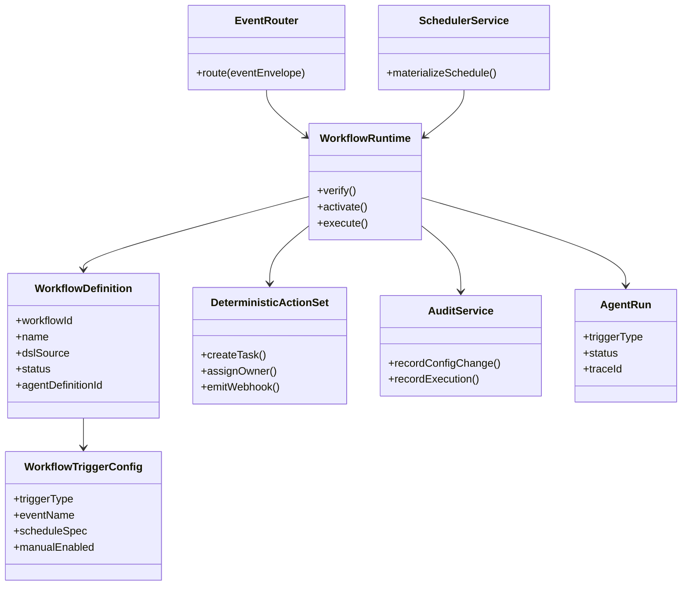
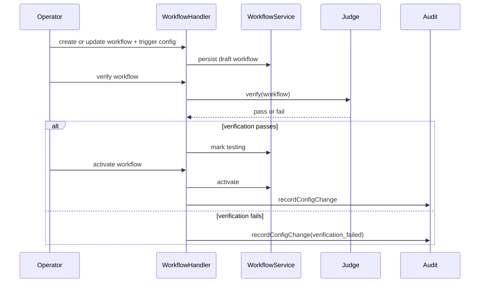
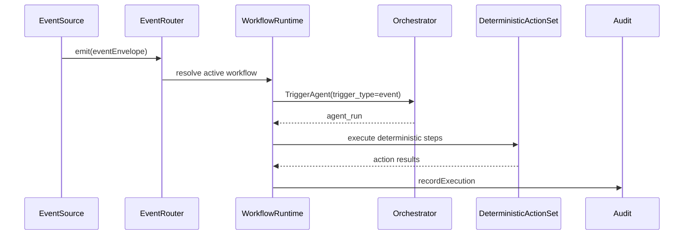
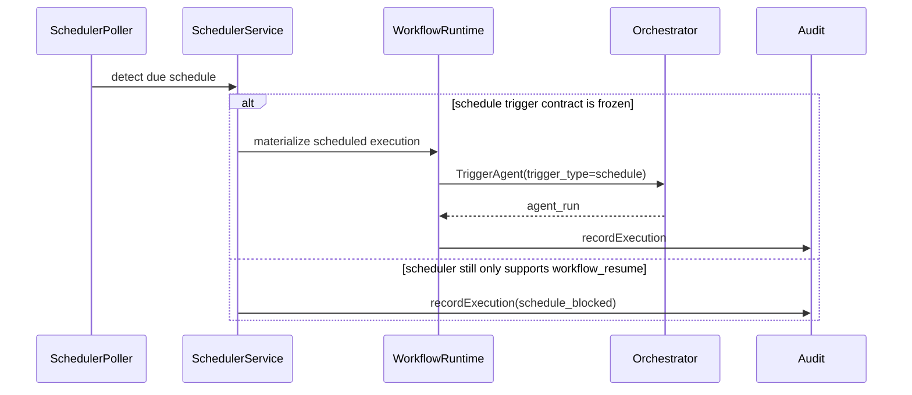
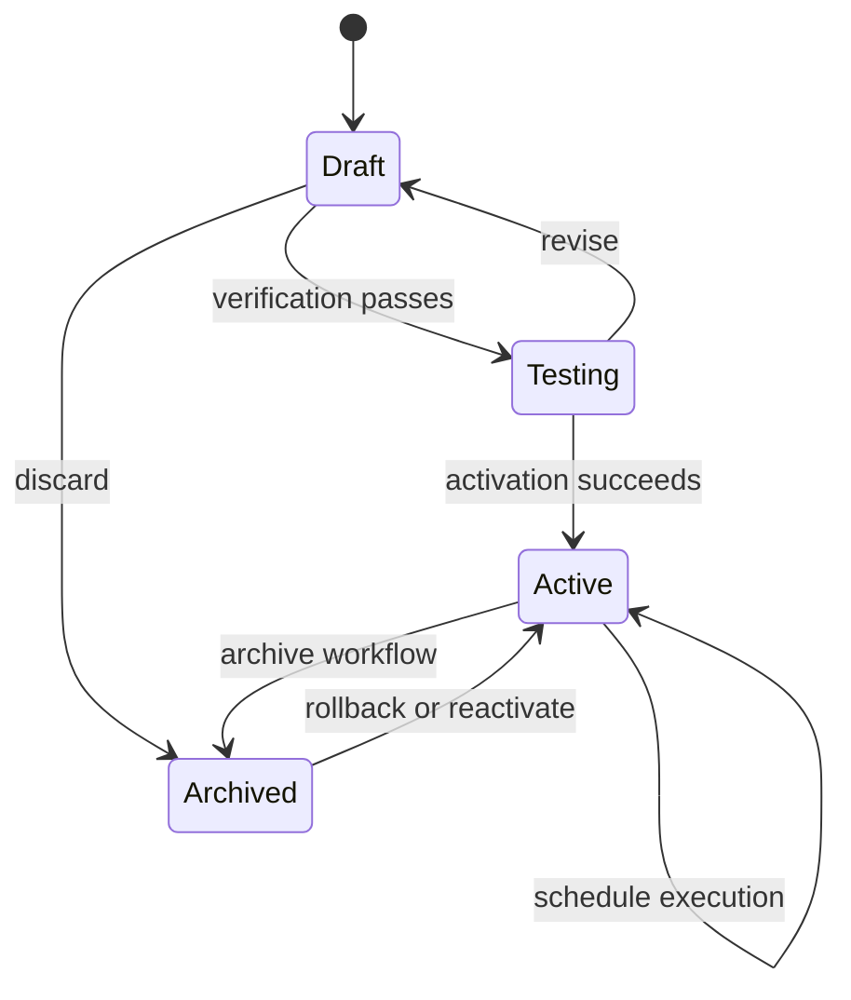

# Wave 7 Analysis, UML Design, and Development Plan

## 1. Purpose

This document defines the implementation analysis for **Wave 7: Non-LLM Automation and Triggering**.

Wave 7 covers:

- `FR-005`
- `FR-234`

Wave objective:

- enable deterministic automation without LLM reasoning by reusing the workflow and runtime substrate already established in earlier waves
- freeze the trigger model for `manual`, `event`, and `schedule` execution without reopening Wave 3 runtime closure
- make the unresolved dependency and traceability gaps explicit before any production rollout claim

## 2. Documentary Dependency Model

### 2.1 Core planning dependency

| Purpose | Primary source | Why it is mandatory |
|---------|----------------|---------------------|
| Wave sequencing | `docs/parallel_requirements.md` | Declares Wave 7 as `FR-005` plus `FR-234`, starting only when `FR-120` is available |
| Business intent for non-LLM automation | `docs/requirements.md` `FR-005` | Defines the non-LLM workflow goal and the standard action subset: create task, assign owner, webhook |
| Business intent for triggers | `docs/requirements.md` `FR-234` | Defines `event`, `schedule`, and `manual` triggers plus configuration audit |
| Baseline dependency for webhook actions | `docs/requirements.md` `FR-051` | `FR-005` depends on the public API and webhook baseline, so webhook actions cannot be assumed without that surface |
| Audit dependency | `docs/requirements.md` `FR-070` | `FR-234` requires auditable trigger configuration changes |
| External blocker | `docs/requirements.md` dependency references to `FR-120` | Wave 7 cannot be considered implementation-ready while `FR-120` remains undefined in the repo |
| Upstream frozen contracts | `docs/wave1-governance-audit-retrieval-analysis.md`, `docs/wave2-tooling-copilot-prompt-crm-analysis.md`, `docs/wave3-agent-runtime-handoff-analysis.md` | Wave 7 consumes governance, audit, CRM mutation, and runtime contracts already frozen earlier |
| Runtime and workflow architecture | `docs/architecture.md` | Provides `workflow`, `agent_definition.trigger_config`, `agent_run.trigger_type`, and lifecycle states that bound the automation design |
| Behavioral execution baseline | `features/uc-a4-workflow-execution.feature` | Defines the stable workflow execution contract already present in the repo |
| Scheduler and WAIT design baseline | `docs/agent-spec-phase6-analysis.md`, `docs/agent-spec-use-cases.md`, `docs/agent-spec-transition-plan.md` | These docs provide the only direct design material for scheduled execution and resume behavior |
| Public API baseline | `docs/openapi.yaml` | Shows the currently documented API surface and reveals where workflow runtime routes are still undocumented |

### 2.2 Codebase anchors when narrative docs are incomplete

These are implementation anchors, not replacement sources of truth.

| Area | Anchor | Why it matters |
|------|--------|----------------|
| Workflow CRUD and runtime handler | `internal/api/handlers/workflow.go` | Shows the repo already has create, verify, activate, and execute workflow handlers, even though not all are reflected in OpenAPI |
| Triggered run baseline | `internal/api/handlers/agent.go` | Shows the current trigger input and `agent_run` access pattern reused by workflow execution |
| Runtime trigger model | `internal/domain/agent/orchestrator.go` | Shows the canonical `TriggerAgentInput` and `trigger_type` handling already in production code |
| Deterministic workflow execution | `internal/domain/agent/dsl_runner.go`, `internal/domain/agent/dsl_runtime_executor.go` | Shows the current DSL execution substrate and how delayed resume already works |
| Scheduled job persistence | `internal/infra/sqlite/migrations/027_scheduled_jobs.up.sql`, `internal/domain/scheduler/repository.go` | Shows the scheduler exists, but only for `workflow_resume`, not for general schedule-trigger materialization |
| Workflow lifecycle | `internal/domain/workflow/repository.go`, `internal/domain/workflow/service.go` | Shows `draft`, `testing`, `active`, `archived` lifecycle semantics already exist and cancel scheduled jobs on archive |
| Trigger metadata persistence | `internal/infra/sqlite/migrations/018_agents.up.sql` | Shows `agent_definition.trigger_config` and `agent_run.trigger_type` are already modeled in persistence |

### 2.3 LLM context packs

Wave 7 should keep sessions small and explicit because the repo mixes business requirements, runtime design, and partial implementation.

| Pack | Use | Load only these docs |
|------|-----|----------------------|
| `W7-CORE` | Wave sequencing and gate status | `docs/parallel_requirements.md`, this document |
| `W7-BIZ` | Business scope and dependency gates | `docs/requirements.md` `FR-005`, `FR-051`, `FR-234`, this document |
| `W7-RUNTIME` | Existing workflow and trigger behavior | `docs/wave3-agent-runtime-handoff-analysis.md`, `features/uc-a4-workflow-execution.feature`, `internal/api/handlers/workflow.go`, `internal/domain/agent/orchestrator.go` |
| `W7-SCHED` | Delayed and scheduled execution | `docs/agent-spec-phase6-analysis.md`, `docs/agent-spec-use-cases.md`, `internal/infra/sqlite/migrations/027_scheduled_jobs.up.sql`, `internal/domain/scheduler/repository.go` |
| `W7-API` | Public route exposure and gaps | `docs/openapi.yaml`, `internal/api/handlers/workflow.go`, `internal/api/handlers/agent.go` |

### 2.4 Documentary confidence map

Wave 7 has a usable implementation substrate, but it still lacks clean requirement traceability.

| Area | Confidence | Direct support | Integration fallback |
|------|------------|----------------|----------------------|
| `FR-005` deterministic automation intent | Medium | `docs/requirements.md` `FR-005` | derive the initial slice from workflow runtime and CRM mutation surfaces already frozen |
| `FR-234` trigger taxonomy | Medium | `docs/requirements.md` `FR-234`, `docs/architecture.md` | derive activation and runtime details from existing workflow handler and `agent_run.trigger_type` |
| `FR-005` webhook action | Low | only named in `FR-005` acceptance criteria | keep gated behind `FR-051` baseline clarification |
| `FR-234` scheduled execution | Low-medium | `FR-234`, scheduler docs, scheduler code | requires an explicit decision because current scheduler only supports `workflow_resume` |
| `FR-120` dependency gate | Low | referenced in `docs/requirements.md`, not defined in repo docs or Doorstop | wave remains blocked until clarified or implemented |
| Operational traceability for `FR-005` and `FR-234` | Low | no `reqs/FR/FR_005.yml` or `reqs/FR/FR_234.yml` exists today | create requirement artifacts before implementation |
| Public API coverage for workflow runtime routes | Low-medium | handler code exists, OpenAPI coverage is partial | publish OpenAPI contract before rollout |

### 2.5 Mandatory traceability note

Every Wave 7 task must state one of these labels:

- `directly documented`
- `derived integration design`
- `blocked by missing source`

Wave 7 must also state whether it relies on:

- existing workflow runtime behavior
- new schedule-trigger behavior not yet represented in persistence
- webhook semantics not yet published in `docs/openapi.yaml`

## 3. Scope and Constraints

### 3.1 In-scope closure

- define the Wave 7 dependency gate around `FR-120`
- freeze a deterministic automation subset for `FR-005`
- freeze the `manual`, `event`, and `schedule` trigger contract for `FR-234`
- reuse workflow lifecycle, runtime trace, and audit contracts already closed in earlier waves
- define the first standard action bundle for non-LLM automation: create task, assign owner, webhook
- document how scheduled execution fits, or does not yet fit, into the current scheduler design

### 3.2 Explicit scope boundaries

- Wave 7 does **not** reopen prompting, retrieval reasoning, copilot, or agentic planning
- Wave 7 does **not** claim full UI closure for trigger configuration unless that public or admin surface is documented first
- Wave 7 does **not** replace `agent_run` with a new automation-run model; it reuses the current runtime execution record
- Wave 7 does **not** absorb `FR-233` quotas, `FR-212` behavior contracts, or any connector work
- Wave 7 does **not** assume webhook delivery contracts beyond what is already documented by the `FR-051` baseline
- any workflow action that delegates to LLM-dependent agent behavior falls outside the Wave 7 non-LLM core slice

### 3.3 Immediate blockers

| Blocker | Why it matters | Required action |
|---------|----------------|-----------------|
| `FR-120` is referenced but not defined | the wave has no implementation-safe dependency gate | clarify the dependency or publish the missing requirement artifact |
| `reqs/FR/FR_005.yml` and `reqs/FR/FR_234.yml` are missing | Wave 7 has no Doorstop traceability path | create the artifacts before implementation |
| workflow `verify`, `activate`, and `execute` routes exist in handlers but are not represented in `docs/openapi.yaml` | public contract and implementation are out of sync | publish the intended API surface before rollout |
| `scheduled_job` supports only `workflow_resume` | schedule triggers cannot be implemented by configuration alone | choose and document a schedule-trigger materialization model |
| `FR-051` baseline is not explicit about webhook action contracts in the current docs | `FR-005` webhook action can drift into undocumented behavior | document or explicitly defer webhook delivery semantics |

## 4. Use Case Analysis

### 4.1 UC-W7-01 Configure a deterministic workflow and its trigger

- Scope: `FR-005`, `FR-234`
- Confidence: derived integration design
- Primary actor: Platform operator
- Goal: define a workflow that can be triggered without LLM reasoning
- Preconditions:
  - `FR-120` has a documented disposition
  - workflow lifecycle and audit contracts from earlier waves are frozen
- Main flow:
  1. operator creates or updates a workflow definition
  2. operator declares a `manual`, `event`, or `schedule` trigger configuration
  3. workflow is verified and promoted through `draft` to `testing`
  4. workflow is activated for execution
  5. configuration change is recorded in the audit trail
- Alternate paths:
  - trigger configuration is unsupported by the current execution substrate
  - workflow remains in `draft` or `testing` because verification fails
  - configuration surface exists only in API or admin form, not in end-user UI
- Outputs:
  - `WorkflowDefinition`
  - `WorkflowTriggerConfig`
  - `ConfigurationAuditEvent`
- Documentary basis:
  - `docs/requirements.md` `FR-005`, `FR-234`
  - `docs/architecture.md` workflow and trigger model
  - `internal/api/handlers/workflow.go`

### 4.2 UC-W7-02 Execute an event-driven deterministic automation

- Scope: `FR-005`, `FR-234`
- Confidence: derived integration design
- Primary actor: Event source
- Goal: execute deterministic automation when a CRM event occurs
- Preconditions:
  - workflow is active
  - event taxonomy and trigger envelope are frozen
  - actions stay within the deterministic standard subset
- Main flow:
  1. a supported domain event is emitted
  2. runtime resolves the active workflow bound to that event
  3. workflow executes through the existing runtime substrate
  4. workflow performs deterministic actions such as create task or assign owner
  5. execution and step outcomes are recorded in audit and runtime trace
- Alternate paths:
  - no workflow matches the event
  - action would require agentic or LLM reasoning and is rejected from the non-LLM slice
  - action fails and the execution terminates with a controlled error
- Outputs:
  - `agent_run` with `trigger_type=event`
  - action result trace
  - audit trail
- Documentary basis:
  - `docs/requirements.md` `FR-005`, `FR-234`
  - `features/uc-a4-workflow-execution.feature`
  - `internal/domain/agent/orchestrator.go`

### 4.3 UC-W7-03 Execute a deterministic workflow manually

- Scope: `FR-234`
- Confidence: medium
- Primary actor: Platform operator
- Goal: launch an already-active workflow manually through the current runtime path
- Preconditions:
  - workflow is active and linked to an agent definition
  - workflow runtime is configured in the API layer
- Main flow:
  1. operator calls the workflow execute surface
  2. handler validates workflow lifecycle state
  3. runtime launches execution through `TriggerAgentInput`
  4. run is persisted and returned to the caller
- Alternate paths:
  - workflow is not active
  - workflow is not linked to an executable agent definition
  - runtime dependencies are not configured
- Outputs:
  - `agent_run` with `trigger_type=manual`
- Documentary basis:
  - `docs/requirements.md` `FR-234`
  - `internal/api/handlers/workflow.go`
  - `features/uc-a4-workflow-execution.feature`

### 4.4 UC-W7-04 Execute a scheduled deterministic workflow

- Scope: `FR-234`
- Confidence: low-medium
- Primary actor: Scheduler service
- Goal: trigger deterministic automation on a schedule
- Preconditions:
  - a schedule-trigger materialization model has been frozen
  - schedule configuration is linked to an active workflow
- Main flow:
  1. scheduler detects a due automation trigger
  2. scheduler materializes that trigger into a workflow execution request
  3. runtime launches the workflow with `trigger_type=schedule`
  4. execution result is recorded in audit and runtime trace
- Alternate paths:
  - current scheduler remains limited to `workflow_resume`, so schedule-trigger execution stays blocked
  - configuration is valid but the workflow was archived before execution time
- Outputs:
  - `ScheduledTriggerJob`
  - `agent_run` with `trigger_type=schedule`
- Documentary basis:
  - `docs/requirements.md` `FR-234`
  - `docs/agent-spec-phase6-analysis.md`
  - `internal/domain/scheduler/repository.go`

### 4.5 UC-W7-05 Emit a webhook as a deterministic standard action

- Scope: `FR-005`
- Confidence: low
- Primary actor: Workflow runtime
- Goal: execute the webhook action named in `FR-005` without silently inventing delivery semantics
- Preconditions:
  - `FR-051` baseline is clarified for webhook behavior
  - webhook action contract is frozen
- Main flow:
  1. workflow reaches a webhook action step
  2. runtime validates that webhook dispatch is allowed for this workflow
  3. system emits the outbound call or event under the approved contract
  4. dispatch outcome is recorded in audit
- Alternate paths:
  - webhook baseline is not documented, so the action remains disabled
  - webhook dispatch fails and execution records a controlled failure
- Outputs:
  - `WebhookDispatchRecord`
  - `WebhookAuditEvent`
- Documentary basis:
  - `docs/requirements.md` `FR-005`, `FR-051`

## 5. Design Decisions to Freeze Before Implementation

### 5.1 Contract set

| Contract | Why it must be frozen first | Documentary basis |
|----------|-----------------------------|-------------------|
| `WorkflowTriggerConfig` | gives one canonical shape for `manual`, `event`, and `schedule` triggers | `FR-234`, `docs/architecture.md`, workflow handler |
| `DeterministicActionSet` | defines which actions count as Wave 7 non-LLM scope | `FR-005` |
| `EventTriggerEnvelope` | prevents event-source drift and ambiguous trigger routing | `FR-234`, workflow runtime behavior |
| `ScheduledTriggerJob` | makes scheduled execution explicit instead of overloading resume semantics silently | `FR-234`, scheduler anchors |
| `ConfigurationAuditEvent` | satisfies the requirement for auditable trigger configuration | `FR-234`, `FR-070` |
| `WebhookActionContract` | prevents undocumented webhook behavior from leaking into production | `FR-005`, `FR-051` |

### 5.2 Canonical non-LLM boundary

Wave 7 must freeze one explicit rule:

- a Wave 7 automation step may be deterministic, policy-checked, and auditable
- it may **not** depend on prompt generation, retrieval reasoning, or agentic planning
- if a workflow step delegates into agentic runtime behavior, that step exits the Wave 7 core slice and must be treated as downstream runtime integration, not as `FR-005` closure

### 5.3 Canonical execution record

Wave 7 must reuse the existing execution record:

- `workflow` stores definition and lifecycle
- `agent_run` stores execution state and trigger provenance

Wave 7 must **not** introduce a parallel `rule_run` model unless the repo first documents why `agent_run` is insufficient.

### 5.4 Scheduler extension rule

Wave 7 must decide one of these two options before implementing scheduled triggers:

- extend `scheduled_job.job_type` beyond `workflow_resume`
- or introduce a separate schedule-trigger materializer contract

Until that decision is frozen, `schedule` remains partially blocked.

### 5.5 Public API rule

If workflow `verify`, `activate`, or `execute` are intended public or supported admin routes, Wave 7 must add them to `docs/openapi.yaml` before claiming closure.

### 5.6 Webhook baseline rule

Wave 7 may expose `webhook` as a standard action only after the repo documents:

- the delivery contract
- the auth model
- the failure handling model
- the audit payload shape

Otherwise `webhook` stays explicitly deferred inside `FR-005`.

## 6. UML Design

### 6.1 Deterministic automation model

### 6.2 Sequence: configure and activate a deterministic workflow

### 6.3 Sequence: event-driven deterministic execution

### 6.4 Sequence: scheduled deterministic execution

### 6.5 State: workflow automation lifecycle

## 7. Development Plan

### 7.1 Exit criteria

Wave 7 is ready to start implementation only when all of these are true:

- `FR-120` has a documented disposition
- `reqs/FR/FR_005.yml` and `reqs/FR/FR_234.yml` exist
- the deterministic automation boundary is frozen
- the canonical trigger contract for `manual`, `event`, and `schedule` is frozen
- the schedule execution model is chosen relative to the current `scheduled_job` design
- workflow runtime public routes are documented in `docs/openapi.yaml` if they are intended supported surfaces
- webhook action is either documented or explicitly deferred

### 7.2 Task backlog

| ID | Task | Type | Dependency | Traceability label | Output |
|----|------|------|------------|--------------------|--------|
| `W7-00` | publish Wave 7 glossary and traceability note | governance | none | directly documented | shared terminology for workflow, trigger, deterministic action, scheduled trigger |
| `W7-01` | resolve the missing `FR-120` disposition for non-LLM automation | prerequisite | `W7-00` | blocked by missing source | dependency note or requirement artifact |
| `W7-02` | create `reqs/FR/FR_005.yml` from approved business intent | traceability | `W7-00` | directly documented | Doorstop artifact for `FR-005` |
| `W7-03` | create `reqs/FR/FR_234.yml` from approved business intent | traceability | `W7-00` | directly documented | Doorstop artifact for `FR-234` |
| `W7-04` | publish the canonical non-LLM boundary note | scope | `W7-01` | derived integration design | explicit in-scope and out-of-scope automation actions |
| `W7-05` | freeze `WorkflowTriggerConfig` and trigger taxonomy | design | `W7-01`, `W7-03` | derived integration design | trigger contract note |
| `W7-06` | freeze `EventTriggerEnvelope` and supported domain-event taxonomy | design | `W7-05` | derived integration design | event trigger contract |
| `W7-07` | freeze the deterministic standard action subset for `FR-005` | design | `W7-02`, `W7-04` | derived integration design | action contract note |
| `W7-08` | decide whether `webhook` is enabled now or deferred behind `FR-051` baseline clarification | design | `W7-07` | derived integration design | webhook disposition note |
| `W7-09` | choose the schedule-trigger materialization model over the current scheduler | design | `W7-03`, `W7-05` | derived integration design | scheduler extension decision |
| `W7-10` | publish workflow `verify`, `activate`, and `execute` API surfaces in `docs/openapi.yaml` if they are intended supported routes | API | `W7-05` | derived integration design | OpenAPI delta |
| `W7-11` | freeze configuration-audit payloads for trigger changes and activation | audit | `W7-05` | derived integration design | configuration audit contract |
| `W7-12` | define acceptance criteria for manual and event-driven deterministic execution | validation | `W7-06`, `W7-07`, `W7-11` | derived integration design | execution acceptance note |
| `W7-13` | define acceptance criteria for schedule-trigger execution or explicit partial deferral | validation | `W7-09`, `W7-11` | derived integration design | schedule acceptance note |
| `W7-14` | publish the Wave 7 handoff note for later budget and behavior-governance waves | handoff | `W7-08`, `W7-13` | derived integration design | downstream dependency note |

### 7.3 Recommended parallelization model

Wave 7 should run as four narrow tracks rather than one large workflow epic:

| Track | Tasks | Purpose |
|-------|-------|---------|
| `T7-A Gate and traceability` | `W7-00` to `W7-04` | resolve the missing dependency and restore FR traceability first |
| `T7-B Trigger and action contracts` | `W7-05` to `W7-08` | freeze trigger model and deterministic action subset |
| `T7-C Public surface alignment` | `W7-10`, `W7-11` | align OpenAPI and audit semantics with the actual runtime surface |
| `T7-D Scheduled execution decision` | `W7-09`, `W7-12` to `W7-14` | decide how schedule triggers fit into the current scheduler and validate the resulting slice |

This structure keeps LLM context windows small:

- `T7-A` needs requirement and planning docs only
- `T7-B` needs workflow runtime and action semantics only
- `T7-C` needs handler code and OpenAPI only
- `T7-D` needs scheduler docs plus the frozen trigger contract, not the full repo

## 8. Risks and Open Decisions

| Area | Risk | Required decision |
|------|------|-------------------|
| Dependency gate | `FR-120` may hide eventing or orchestration assumptions not visible elsewhere in the repo | publish the actual meaning of `FR-120` before implementation |
| Traceability | Wave 7 can drift because `FR-005` and `FR-234` have no Doorstop artifacts | add the missing requirement artifacts before implementation |
| Non-LLM boundary | current workflow runtime can call richer agentic behavior than Wave 7 should allow | freeze the deterministic action boundary before implementation |
| Schedule semantics | the scheduler currently models delayed resume, not general scheduled triggering | choose and document a schedule-trigger model before coding |
| Public API drift | handler code exposes workflow runtime routes not yet reflected in OpenAPI | publish the supported route surface before rollout |
| Webhook semantics | webhook action can become an undocumented side effect if `FR-051` stays vague | either document it or defer it explicitly |

## 9. Expected Outputs

At the end of Wave 7 analysis, the repo should have:

- one implementation-safe gate decision for `FR-120`
- restored traceability for `FR-005` and `FR-234`
- one canonical non-LLM automation boundary
- one frozen trigger contract for `manual`, `event`, and `schedule`
- one documented decision on how scheduled execution fits the current scheduler
- one clear statement on whether webhook actions are enabled or deferred

Wave 7 should **not** claim full production closure yet if `FR-120`, webhook semantics, or schedule materialization remain unresolved. Its main job is to turn workflow automation from a partial runtime capability into a bounded, traceable, and dependency-safe wave.
