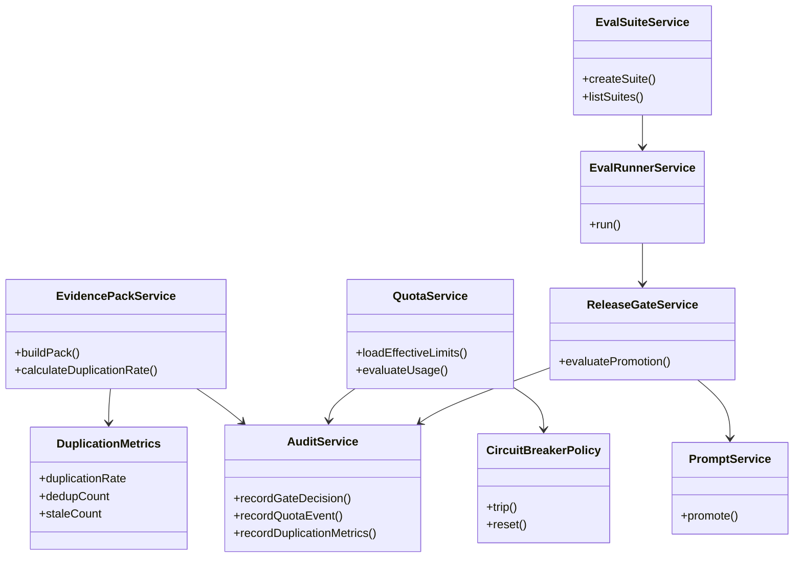
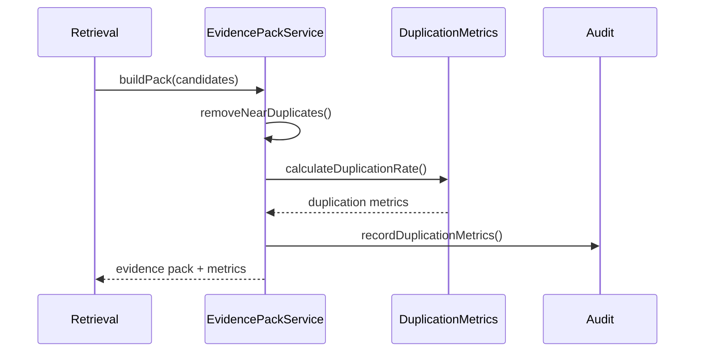
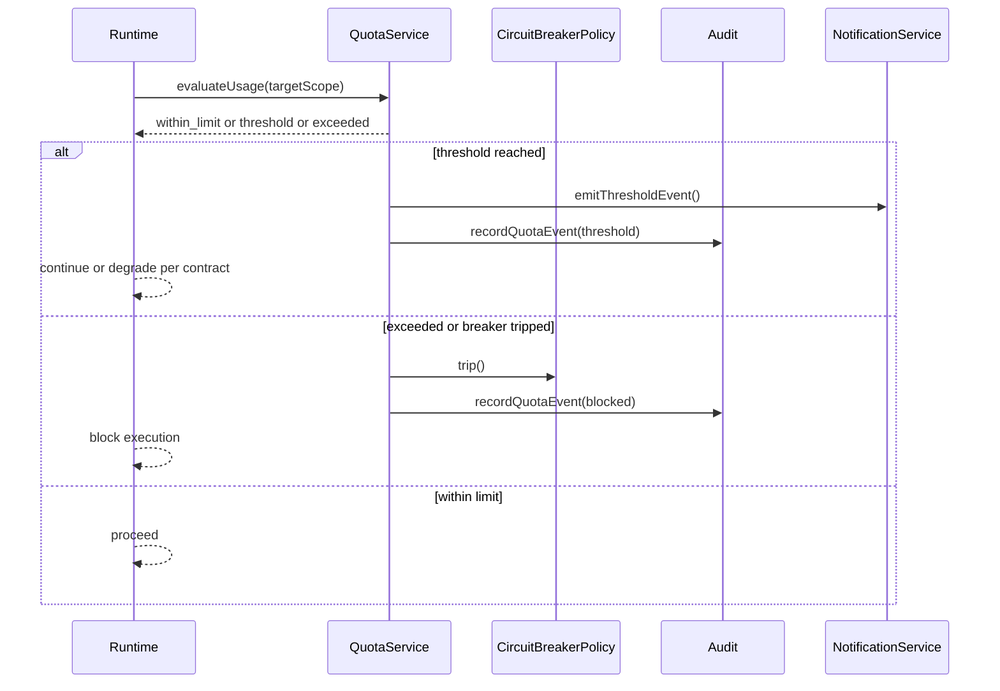
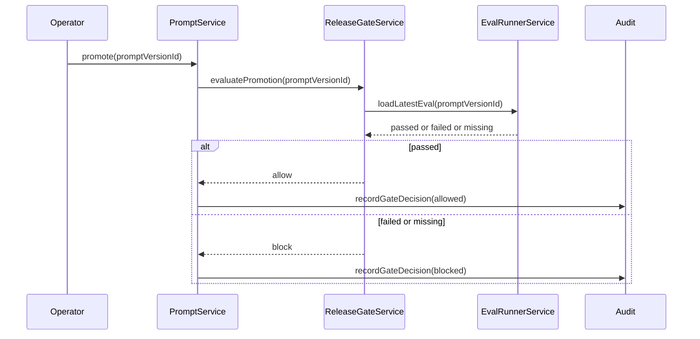
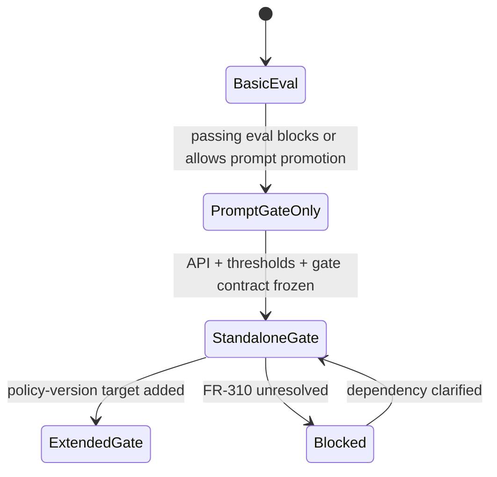

# Wave 8 Analysis, UML Design, and Development Plan

## 1. Purpose

This document defines the implementation analysis for **Wave 8: Dedupe, Budgets, and Full Release Gating**.

Wave 8 covers:

- `FR-094`
- `FR-233`
- standalone maturity of `FR-242`

Wave objective:

- harden retrieval quality by turning partial deduplication into a measurable and traceable capability
- unify budget and quota behavior across runtime, prompt lifecycle, and agent execution instead of leaving scattered local checks
- lift `FR-242` from embedded release criterion to a standalone release-gating capability without reopening the basic eval groundwork already present in the repo

## 2. Documentary Dependency Model

### 2.1 Core planning dependency

| Purpose | Primary source | Why it is mandatory |
|---------|----------------|---------------------|
| Wave sequencing | `docs/parallel_requirements.md` | Declares Wave 8 as `FR-094`, `FR-233`, and full standalone maturity of `FR-242`, starting only when `FR-310` is available |
| Business intent for dedupe | `docs/requirements.md` `FR-094` | Defines chunk and evidence deduplication plus the required `duplication rate` metric |
| Business intent for operational limits | `docs/requirements.md` `FR-233` | Defines quotas by agent, role, and tenant plus circuit breaker and threshold notifications |
| Business intent for release gating | `docs/requirements.md` `FR-242` | Defines domain datasets, groundedness or exactitude or abstention or policy scoring, and eval-before-promotion thresholds |
| External blocker | `docs/requirements.md` dependency references to `FR-310` | Wave 8 cannot be considered implementation-ready while `FR-310` remains undefined in the repo |
| Upstream retrieval baseline | `docs/wave1-governance-audit-retrieval-analysis.md` | Wave 8 extends retrieval quality but must not reopen Wave 1 reliability and governance closure |
| Upstream prompt and runtime baseline | `docs/wave2-tooling-copilot-prompt-crm-analysis.md`, `docs/wave3-agent-runtime-handoff-analysis.md` | Wave 8 consumes prompt lifecycle, runtime trace, and promotion surfaces frozen earlier |
| Current architecture target | `docs/architecture.md` | Provides the intended evidence-pack dedupe flow, `agent_definition.limits`, and eval entities |
| Program roadmap note | `docs/implementation-plan.md` | Confirms `FR-242` basics exist and mentions quotas as later work, but does not provide a complete Wave 8 design |
| As-built baseline | `docs/as-built-design-features.md` | Confirms `FR-242` exists only as basic eval support and gives no equivalent closure baseline for `FR-094` or `FR-233` |
| Gap closure baseline | `docs/fr-gaps-implementation-criteria.md` | Confirms prompt versioning still expects eval-gated promotion and helps define what standalone gating still lacks |

### 2.2 Codebase anchors when narrative docs are incomplete

These are implementation anchors, not replacement sources of truth.

| Area | Anchor | Why it matters |
|------|--------|----------------|
| Evidence-pack deduplication | `internal/domain/knowledge/evidence.go`, `internal/domain/knowledge/evidence_test.go` | Shows the repo already deduplicates near-duplicate evidence items and emits warnings, but does not expose the required `duplication rate` metric or answer-consolidation contract |
| Eval API and persistence | `internal/api/handlers/eval.go`, `internal/api/routes.go`, `internal/infra/sqlite/migrations/020_eval.up.sql`, `internal/domain/eval/suite.go`, `internal/domain/eval/runner.go` | Shows `FR-242` basic suite and run support already exists, but only as an MVP |
| Prompt promotion gate | `internal/domain/agent/prompt.go` | Shows prompt promotion is already blocked by the latest passing eval, which is a key baseline for Wave 8 standalone gating |
| Budget metadata storage | `internal/infra/sqlite/migrations/018_agents.up.sql`, `docs/architecture.md` | Shows `agent_definition.limits` already exists as the current persistence anchor for quotas |
| Workflow budget bridge | `internal/domain/workflow/service.go`, `internal/domain/agent/carta_policy_bridge.go`, `internal/domain/agent/carta_parser.go` | Shows Carta budget fields can already flow into agent limits, but only as a partial bridge |
| Local agent-specific limits | `internal/domain/agent/agents/insights.go`, `internal/domain/agent/agents/kb.go`, `internal/domain/agent/agents/prospecting.go` | Shows the repo has scattered per-agent daily-limit checks, not a unified quota service |

### 2.3 LLM context packs

Wave 8 should split along retrieval, quotas, and release-gating lines so sessions stay narrow.

| Pack | Use | Load only these docs |
|------|-----|----------------------|
| `W8-CORE` | Wave sequencing and blockers | `docs/parallel_requirements.md`, this document |
| `W8-BIZ` | Business scope and dependency gates | `docs/requirements.md` `FR-094`, `FR-233`, `FR-242`, this document |
| `W8-DEDUPE` | Retrieval quality sessions | `docs/wave1-governance-audit-retrieval-analysis.md`, `docs/architecture.md` evidence-pack flow, `internal/domain/knowledge/evidence.go`, `internal/domain/knowledge/evidence_test.go` |
| `W8-QUOTA` | Budget and runtime-guard sessions | `docs/wave3-agent-runtime-handoff-analysis.md`, `docs/architecture.md`, `internal/domain/workflow/service.go`, local agent limit anchors listed above |
| `W8-EVAL` | Release-gating sessions | `docs/wave2-tooling-copilot-prompt-crm-analysis.md`, `docs/architecture.md` eval entities, `internal/api/handlers/eval.go`, `internal/domain/eval/*`, `internal/domain/agent/prompt.go` |

### 2.4 Documentary confidence map

Wave 8 has a stronger implementation baseline than Waves 6 and 7, but the traceability and dependency story is still incomplete.

| Area | Confidence | Direct support | Integration fallback |
|------|------------|----------------|----------------------|
| `FR-094` evidence deduplication | Medium | `docs/requirements.md`, `docs/architecture.md`, evidence-pack code | extend the current evidence dedupe path into a measurable contract |
| `FR-094` response consolidation | Low | only named in `FR-094` text | keep scoped until a concrete consolidation contract is frozen |
| `FR-233` quota intent | Medium | `docs/requirements.md`, `docs/architecture.md` limits field | unify local limit checks and Carta budget bridge into one quota contract |
| `FR-233` operational implementation | Low-medium | local agent daily-limit checks and `agent_definition.limits` only | derive the first unified quota slice from existing agent-run and prompt surfaces |
| `FR-242` eval basics | Medium-high | eval handler, suite and runner services, migration `020`, as-built baseline | preserve as the already-implemented base |
| `FR-242` standalone release gating | Medium-low | prompt promotion already requires a passing eval | extend from prompt-only gate to explicit standalone release-gate contracts |
| `FR-310` dependency gate | Low | referenced in `docs/requirements.md`, not defined in repo docs or Doorstop | wave remains blocked until clarified or implemented |
| Requirement traceability for `FR-094`, `FR-233`, `FR-242` | Low | no `reqs/FR/FR_094.yml`, `FR_233.yml`, or `FR_242.yml` exists today | create requirement artifacts before implementation |

### 2.5 Mandatory traceability note

Every Wave 8 task must state one of these labels:

- `directly documented`
- `derived integration design`
- `blocked by missing source`

Wave 8 must also state whether it changes:

- retrieval evidence quality semantics
- quota enforcement semantics
- prompt or policy promotion semantics

## 3. Scope and Constraints

### 3.1 In-scope closure

- define the Wave 8 dependency gate around `FR-310`
- harden deduplication at evidence-pack level and publish a measurable `duplication rate` contract
- define how answer consolidation does, or does not, fit the first `FR-094` slice
- unify quota semantics across agent, role, and tenant scopes for `FR-233`
- define threshold notifications and circuit-breaker behavior as explicit contracts instead of local ad hoc checks
- promote `FR-242` from basic eval CRUD or run support to a standalone release-gating capability

### 3.2 Explicit scope boundaries

- Wave 8 does **not** reopen Wave 1 retrieval freshness or access-control closure
- Wave 8 does **not** replace the existing evidence-pack pipeline; it extends and hardens it
- Wave 8 does **not** introduce billing, invoicing, or commercial usage accounting
- Wave 8 does **not** assume policy-version release gating is already implemented just because `docs/architecture.md` models it
- Wave 8 does **not** claim full `FR-242` closure if standalone gating remains prompt-only
- any quota, notification, or circuit-breaker model must reuse current runtime and audit contracts instead of inventing a parallel control plane

### 3.3 Immediate blockers

| Blocker | Why it matters | Required action |
|---------|----------------|-----------------|
| `FR-310` is referenced but not defined | dedupe maturity, quotas, and standalone eval gating are all formally blocked by it | clarify the dependency or publish the missing requirement artifact |
| `reqs/FR/FR_094.yml`, `reqs/FR/FR_233.yml`, and `reqs/FR/FR_242.yml` are missing | Wave 8 has no complete Doorstop traceability path | create the artifacts before implementation |
| `admin/eval` routes exist in runtime wiring but are absent from `docs/openapi.yaml` | release-gating public contract is incomplete | publish the intended eval API surface before rollout |
| `docs/architecture.md` models `eval_run.policy_version_id`, but migration `020` and runtime services do not | standalone gating scope is ambiguous | choose whether Wave 8 gates prompts only or extends schema and services |
| quotas exist today only as local checks and metadata fields | `FR-233` cannot be claimed through scattered behavior | freeze a unified quota contract before implementation |
| `FR-094` requires a `duplication rate` metric, but current dedupe emits warnings only | evidence dedupe is not yet measurable enough for closure | define and publish the metric contract |

## 4. Use Case Analysis

### 4.1 UC-W8-01 Build a deduplicated evidence pack with measurable duplication

- Scope: `FR-094`
- Confidence: derived integration design
- Primary actor: Retrieval service
- Goal: produce a grounded evidence pack that removes near-duplicates and exposes measurable duplication quality
- Preconditions:
  - Wave 1 retrieval baseline is frozen
  - `FR-310` dependency has a documented disposition
- Main flow:
  1. retrieval produces candidate evidence items
  2. evidence-pack service removes near-duplicates and stale items according to the frozen dedupe rule
  3. system calculates a `duplication rate` metric for the pack or query
  4. response includes the selected evidence plus quality metadata
  5. audit or metrics pipeline records dedupe outcomes
- Alternate paths:
  - no duplicates are found, so duplication rate is near zero
  - dedupe removes too aggressively and requires tuning against retrieval quality thresholds
  - answer consolidation remains out of the initial slice and is explicitly deferred
- Outputs:
  - `EvidencePack`
  - `DuplicationMetrics`
- Documentary basis:
  - `docs/requirements.md` `FR-094`
  - `docs/architecture.md` evidence-pack flow
  - `internal/domain/knowledge/evidence.go`

### 4.2 UC-W8-02 Enforce a quota before an agent run or promotion path proceeds

- Scope: `FR-233`
- Confidence: derived integration design
- Primary actor: Runtime guard
- Goal: block or degrade execution when a configured quota has been exceeded
- Preconditions:
  - quota contract is frozen
  - the target scope for enforcement is known: agent, role, or tenant
- Main flow:
  1. runtime loads the effective limits for the candidate execution
  2. runtime evaluates token, cost, and execution counters against thresholds
  3. if usage is within limits, execution proceeds
  4. if a threshold is reached, the system emits a notification
  5. if a hard limit is exceeded or repeated failures trip the circuit breaker, execution is blocked or shifted to the configured `on_exceed` behavior
- Alternate paths:
  - local agent-specific limits exist but no unified quota record exists, so the action stays partially enforced
  - thresholds are configured but notification delivery is not yet documented
- Outputs:
  - `QuotaDecision`
  - `QuotaThresholdEvent`
  - `CircuitBreakerState`
- Documentary basis:
  - `docs/requirements.md` `FR-233`
  - `docs/architecture.md` limits field
  - local limit anchors in agent implementations

### 4.3 UC-W8-03 Run a domain eval suite before release promotion

- Scope: `FR-242`
- Confidence: medium
- Primary actor: Platform operator
- Goal: evaluate a release candidate against configurable thresholds before promotion
- Preconditions:
  - eval suite exists for the target domain
  - release target and gating target are frozen
- Main flow:
  1. operator selects an eval suite and release candidate
  2. eval service runs the suite and calculates scores
  3. scores are compared with configured thresholds
  4. system records a `passed` or `failed` gate decision
  5. promotion flow consumes the gate result
- Alternate paths:
  - eval suite exists but threshold semantics are incomplete
  - release target is a policy version, but the schema still supports prompt-only linkage
- Outputs:
  - `EvalRun`
  - `ReleaseGateDecision`
- Documentary basis:
  - `docs/requirements.md` `FR-242`
  - `internal/domain/eval/suite.go`
  - `internal/domain/eval/runner.go`

### 4.4 UC-W8-04 Block prompt promotion when the eval gate fails or is missing

- Scope: standalone maturity of `FR-242`
- Confidence: medium
- Primary actor: Prompt promotion service
- Goal: turn the existing prompt-eval dependency into an explicit release-gating contract
- Preconditions:
  - prompt version exists
  - eval result exists or is intentionally absent
- Main flow:
  1. operator attempts to promote a prompt version
  2. prompt service looks up the latest eval run
  3. if the latest eval passed, promotion proceeds
  4. if no eval exists or the latest eval failed, promotion is blocked and audited
- Alternate paths:
  - the release gate later expands to cover policy versions, but that extension is not yet implemented
- Outputs:
  - `PromotionDecision`
  - `PromptBlockedAuditEvent`
- Documentary basis:
  - `docs/fr-gaps-implementation-criteria.md` `FR-240`
  - `internal/domain/agent/prompt.go`
  - `internal/domain/eval/*`

## 5. Design Decisions to Freeze Before Implementation

### 5.1 Contract set

| Contract | Why it must be frozen first | Documentary basis |
|----------|-----------------------------|-------------------|
| `DuplicationMetrics` | `FR-094` explicitly requires a duplication metric, not just dedupe warnings | `FR-094`, evidence-pack anchors |
| `DedupeScopePolicy` | separates evidence dedupe from answer consolidation so Wave 8 does not overclaim | `FR-094`, architecture evidence-pack flow |
| `QuotaPolicyContract` | unifies agent or role or tenant scopes and supported limit fields | `FR-233`, limits anchors |
| `QuotaThresholdEvent` | makes threshold notifications explicit instead of implicit | `FR-233` |
| `CircuitBreakerPolicy` | formalizes repeated-error cutoffs and recovery semantics | `FR-233` |
| `EvalTargetContract` | chooses whether standalone gating covers prompt versions only or extends to policy versions | `FR-242`, architecture versus migration drift |
| `ReleaseGateDecision` | provides one canonical contract for promotion blocked, allowed, or missing-eval outcomes | `FR-242`, prompt promotion gate |

### 5.2 Canonical interpretation rule for `FR-242`

Wave 8 must use this split until repo-wide traceability is restored:

- **`FR-242 basics`**: suite CRUD, eval runs, simple scoring, and prompt-promotion dependency already present in the repo
- **`FR-242 standalone maturity`**: explicit release-gating contract, documented API surface, stable threshold semantics, and clarified target scope

Wave 8 owns the second slice. It must not pretend the first slice was absent, and it must not overclaim the second one until the contract is frozen.

### 5.3 Canonical quota rule

Wave 8 must publish one unified quota table before implementation that maps:

- local agent-specific checks already present in the repo
- `agent_definition.limits`
- Carta budget fields such as `daily_tokens`, `daily_cost_usd`, `executions_per_day`, and `on_exceed`
- target enforcement scopes: agent, role, tenant

No Wave 8 quota closure claim is valid until those sources are normalized into one contract.

### 5.4 Canonical dedupe rule

Wave 8 must freeze one explicit distinction:

- **evidence dedupe**: near-duplicate chunks or evidence items removed before evidence-pack assembly
- **answer consolidation**: repeated responses or repeated answer fragments merged after retrieval or generation

The first slice has a real implementation anchor today. The second one does not and should stay explicitly scoped or deferred.

### 5.5 Eval API rule

If `admin/eval` routes are intended supported surfaces, Wave 8 must add them to `docs/openapi.yaml` before claiming standalone `FR-242` maturity.

## 6. UML Design

### 6.1 Wave 8 hardening model

### 6.2 Sequence: retrieval dedupe with measurable duplication

### 6.3 Sequence: quota enforcement before execution

### 6.4 Sequence: release gating for prompt promotion

### 6.5 State: release-gate maturity

## 7. Development Plan

### 7.1 Exit criteria

Wave 8 is ready to start implementation only when all of these are true:

- `FR-310` has a documented disposition
- `reqs/FR/FR_094.yml`, `reqs/FR/FR_233.yml`, and `reqs/FR/FR_242.yml` exist
- the canonical dedupe scope and `duplication rate` contract are frozen
- the unified quota model is frozen across agent, role, and tenant scopes
- threshold notifications and circuit-breaker semantics are frozen
- the standalone release-gate target scope is frozen
- `admin/eval` API surfaces are documented in `docs/openapi.yaml` if they are intended supported routes

### 7.2 Task backlog

| ID | Task | Type | Dependency | Traceability label | Output |
|----|------|------|------------|--------------------|--------|
| `W8-00` | publish Wave 8 glossary and traceability note | governance | none | directly documented | shared terminology for dedupe, duplication rate, quota, release gate |
| `W8-01` | resolve the missing `FR-310` disposition for Wave 8 hardening | prerequisite | `W8-00` | blocked by missing source | dependency note or requirement artifact |
| `W8-02` | create `reqs/FR/FR_094.yml` from approved business intent | traceability | `W8-00` | directly documented | Doorstop artifact for `FR-094` |
| `W8-03` | create `reqs/FR/FR_233.yml` from approved business intent | traceability | `W8-00` | directly documented | Doorstop artifact for `FR-233` |
| `W8-04` | create `reqs/FR/FR_242.yml` from approved business intent and existing MVP baseline | traceability | `W8-00` | directly documented | Doorstop artifact for `FR-242` |
| `W8-05` | freeze the canonical dedupe boundary between evidence dedupe and answer consolidation | scope | `W8-01`, `W8-02` | derived integration design | dedupe scope note |
| `W8-06` | freeze `DuplicationMetrics` and publish the `duplication rate` formula | design | `W8-05` | derived integration design | metric contract |
| `W8-07` | freeze the unified quota contract across agent, role, and tenant scopes | design | `W8-01`, `W8-03` | derived integration design | quota contract note |
| `W8-08` | map existing local agent limits and Carta budget bridge into the unified quota contract | design | `W8-07` | derived integration design | normalization map |
| `W8-09` | freeze threshold notifications and circuit-breaker semantics | design | `W8-07` | derived integration design | notification and breaker contract |
| `W8-10` | decide whether standalone `FR-242` gates prompts only or extends to policy versions | design | `W8-01`, `W8-04` | derived integration design | eval target contract |
| `W8-11` | reconcile architecture versus persistence drift for `eval_run.policy_version_id` | design | `W8-10` | derived integration design | schema alignment note |
| `W8-12` | publish `admin/eval` routes in `docs/openapi.yaml` if they are intended supported surfaces | API | `W8-10` | derived integration design | OpenAPI delta |
| `W8-13` | define acceptance criteria for measurable evidence dedupe | validation | `W8-06` | derived integration design | dedupe acceptance note |
| `W8-14` | define acceptance criteria for quota enforcement, threshold alerts, and circuit breaking | validation | `W8-08`, `W8-09` | derived integration design | quota acceptance note |
| `W8-15` | define acceptance criteria for standalone eval gating and promotion blocks | validation | `W8-10`, `W8-11`, `W8-12` | derived integration design | release-gate acceptance note |
| `W8-16` | publish the Wave 8 handoff note for Wave 9 behavior contracts | handoff | `W8-14`, `W8-15` | derived integration design | downstream dependency note |

### 7.3 Recommended parallelization model

Wave 8 should run as four narrow tracks:

| Track | Tasks | Purpose |
|-------|-------|---------|
| `T8-A Gate and traceability` | `W8-00` to `W8-04` | resolve the missing dependency and restore FR traceability first |
| `T8-B Retrieval dedupe hardening` | `W8-05`, `W8-06`, `W8-13` | turn partial dedupe into a measurable retrieval-quality contract |
| `T8-C Quota unification` | `W8-07` to `W8-09`, `W8-14` | turn scattered local limits into one quota and circuit-breaker model |
| `T8-D Standalone release gating` | `W8-10` to `W8-12`, `W8-15`, `W8-16` | move `FR-242` from embedded criterion to explicit release-gate maturity |

This structure keeps LLM context windows small:

- `T8-A` needs requirement and planning docs only
- `T8-B` needs retrieval docs and evidence-pack code only
- `T8-C` needs runtime limit anchors and Carta bridge only
- `T8-D` needs eval services, prompt promotion, and OpenAPI only

## 8. Risks and Open Decisions

| Area | Risk | Required decision |
|------|------|-------------------|
| Dependency gate | `FR-310` may hide quality, policy, or release-management assumptions not visible elsewhere in the repo | publish the actual meaning of `FR-310` before implementation |
| Traceability | Wave 8 can drift because all three FR in scope lack Doorstop artifacts | add the missing requirement artifacts before implementation |
| Dedupe semantics | evidence dedupe and answer consolidation can get conflated into one vague closure claim | freeze the boundary and measure only the scope actually supported |
| Quota scope | scattered local checks can be mistaken for a unified quota service | normalize existing checks into one contract before adding more logic |
| Eval target ambiguity | architecture implies policy gating, but current services and schema are prompt-centric | decide the standalone release-gate target before implementation |
| API drift | eval routes exist in runtime wiring but are not documented in OpenAPI | publish the supported API surface before rollout |

## 9. Expected Outputs

At the end of Wave 8 analysis, the repo should have:

- one implementation-safe gate decision for `FR-310`
- restored traceability for `FR-094`, `FR-233`, and `FR-242`
- one measurable dedupe contract with a defined `duplication rate`
- one unified quota model across current runtime surfaces
- one explicit threshold-notification and circuit-breaker contract
- one standalone release-gate contract that explains what `FR-242` maturity means in this repo

Wave 8 should **not** claim production closure yet if `FR-310`, quota unification, or release-target alignment remain unresolved. Its main job is to turn three partially grounded capabilities into one bounded, measurable, and traceable hardening wave.
