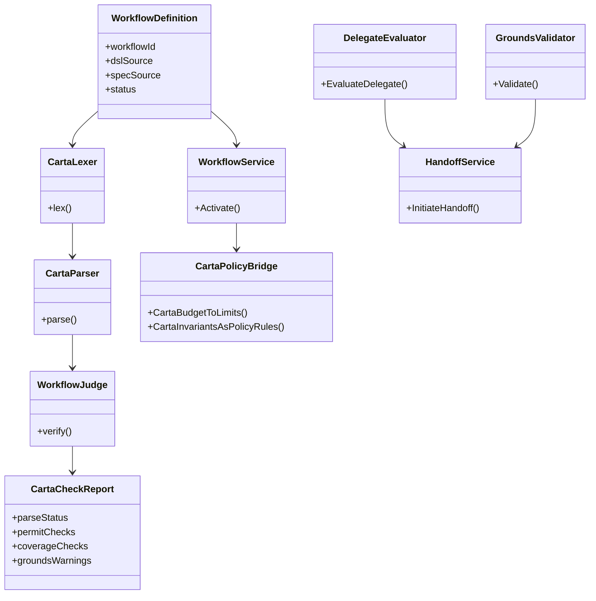
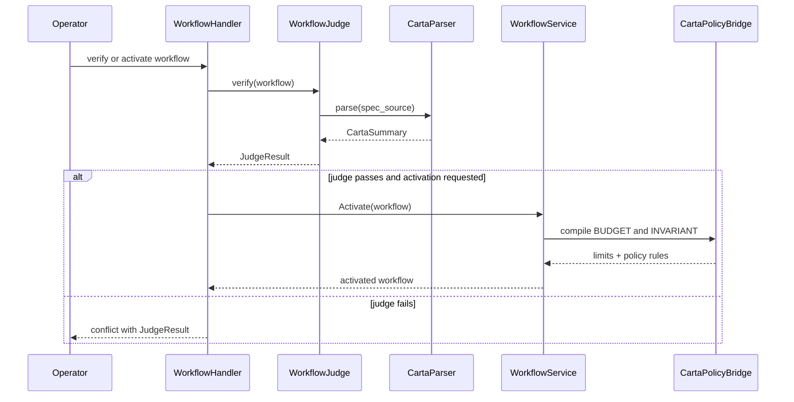
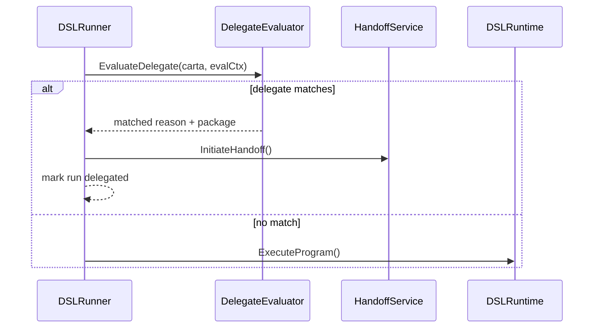
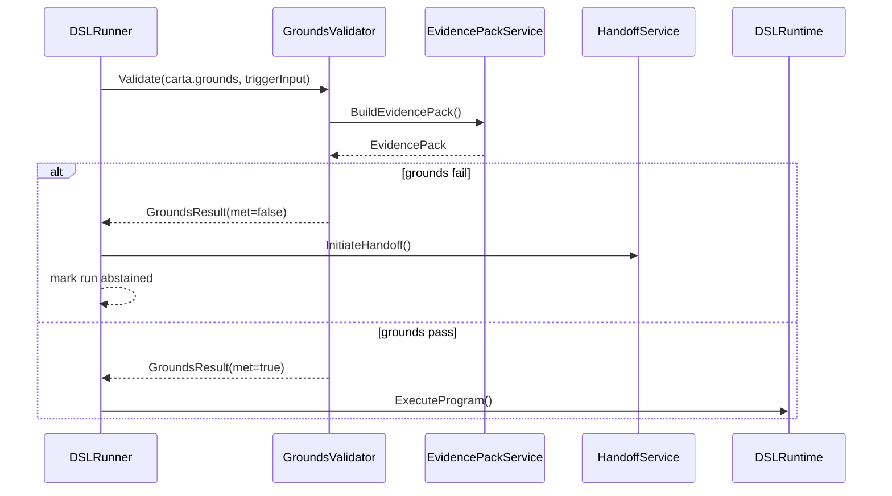
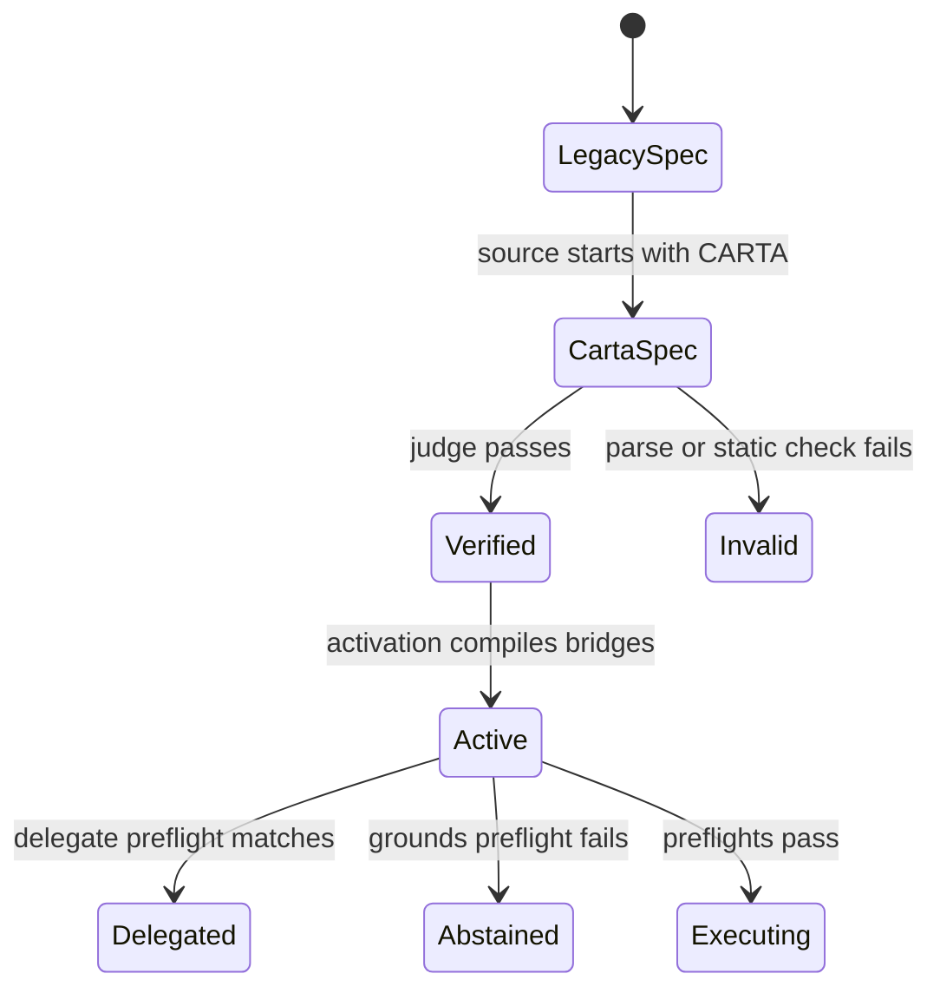

# Wave 9 Analysis, UML Design, and Development Plan

## 1. Purpose

This document defines the implementation analysis for **Wave 9: Behavior Contracts / Carta**.

Wave 9 covers:

- `FR-212`

Wave objective:

- consolidate Carta from a set of partially implemented parser, judge, and runtime pieces into one explicit behavior-contract capability
- freeze the contract boundary between static Carta validation, dynamic Carta preflight, and activation-time policy or budget bridging
- preserve full backward compatibility for legacy free-form `spec_source` while making the Carta path traceable and implementation-safe

## 2. Documentary Dependency Model

### 2.1 Core planning dependency

| Purpose | Primary source | Why it is mandatory |
|---------|----------------|---------------------|
| Wave sequencing | `docs/parallel_requirements.md` | Declares Wave 9 as `FR-212` after `FR-210`, `FR-211`, `FR-232`, `FR-233`, and `FR-240` |
| Business intent | `docs/requirements.md` `FR-212` | Defines Carta as the machine-readable behavior-contract format for `spec_source`, its backward compatibility, and its static and dynamic acceptance criteria |
| Canonical behavior-contract spec | `docs/carta-spec.md` | Defines Carta grammar, expected judge checks, preflight order, and activation bridges |
| Canonical implementation plan | `docs/carta-implementation-plan.md` | Defines the intended task decomposition and the expected wiring points for parser, judge, runtime, and bridge behavior |
| Runtime architecture | `docs/architecture.md` | Defines Carta as an additive capability, the intended runtime flow, and module ownership across agent and policy domains |
| Upstream dependency contracts | `docs/wave2-tooling-copilot-prompt-crm-analysis.md`, `docs/wave3-agent-runtime-handoff-analysis.md`, `docs/wave8-dedupe-budgets-and-release-gating-analysis.md` | Wave 9 depends on safe tools, handoff, prompt lifecycle, mandatory abstention, and budget stabilization already frozen in prior waves |
| Current baseline gaps | `docs/as-built-design-features.md`, `docs/fr-gaps-implementation-criteria.md` | These documents notably do not provide a direct `FR-212` closure baseline, which is itself a traceability finding |
| Public workflow surface baseline | `docs/openapi.yaml` | Shows workflow CRUD is documented, but verify, activate, execute, and Carta-related supported surfaces are still missing from the published contract |

### 2.2 Codebase anchors when narrative docs are incomplete

These are implementation anchors, not replacement sources of truth.

| Area | Anchor | Why it matters |
|------|--------|----------------|
| Carta grammar model | `internal/domain/agent/carta_ast.go`, `internal/domain/agent/carta_lexer.go`, `internal/domain/agent/carta_parser.go` | Shows Carta has a real AST, lexer, and parser rather than being a design-only artifact |
| Judge dispatch | `internal/domain/agent/judge.go`, `internal/domain/agent/judge_carta.go` | Shows the judge already branches into Carta parsing and static checks |
| Runtime preflight | `internal/domain/agent/dsl_runner.go`, `internal/domain/agent/delegate_evaluator.go`, `internal/domain/agent/grounds_validator.go` | Shows delegate and grounds checks already exist as preflight components |
| Activation bridges | `internal/domain/agent/carta_policy_bridge.go`, `internal/domain/agent/workflow_carta_budget_sync.go`, `internal/domain/workflow/service.go` | Shows BUDGET and INVARIANT already compile into agent limits and policy rules during workflow activation |
| Workflow and API surface | `internal/api/handlers/workflow.go`, `internal/api/routes.go` | Shows workflow create, verify, activate, execute, and `spec_source` already exist in handlers and routes, even though OpenAPI does not expose the full surface |
| Runtime wiring reality | `internal/api/routes.go`, `internal/api/handlers/workflow.go`, `internal/api/handlers/insights_shadow.go` | Shows `GroundsValidator` is optional and is not broadly wired through supported API runtime paths today |
| Test baseline | `internal/domain/agent/judge_test.go`, `internal/domain/agent/judge_carta_test.go`, `internal/domain/agent/integration_test.go`, `internal/domain/workflow/service_test.go` | Shows parser, judge, delegate, grounds, budget sync, and invariant sync have concrete test anchors |

### 2.3 LLM context packs

Wave 9 should split along spec, judge, runtime, and activation-bridge lines.

| Pack | Use | Load only these docs |
|------|-----|----------------------|
| `W9-CORE` | Wave sequencing and dependency gates | `docs/parallel_requirements.md`, this document |
| `W9-BIZ` | Business intent and acceptance criteria | `docs/requirements.md` `FR-212`, `docs/carta-spec.md`, this document |
| `W9-JUDGE` | Static consistency sessions | `docs/carta-spec.md`, `docs/carta-implementation-plan.md`, `internal/domain/agent/judge.go`, `internal/domain/agent/judge_carta.go`, `internal/domain/agent/judge_test.go` |
| `W9-RUNTIME` | Dynamic preflight sessions | `docs/architecture.md` Carta flow, `internal/domain/agent/dsl_runner.go`, `internal/domain/agent/delegate_evaluator.go`, `internal/domain/agent/grounds_validator.go`, `internal/domain/agent/integration_test.go` |
| `W9-BRIDGE` | Activation-time bridge sessions | `docs/carta-spec.md`, `internal/domain/agent/carta_policy_bridge.go`, `internal/domain/agent/workflow_carta_budget_sync.go`, `internal/domain/workflow/service.go`, `internal/domain/workflow/service_test.go` |

### 2.4 Documentary confidence map

Wave 9 has stronger direct support than most deferred waves, but the maturity story is still uneven.

| Area | Confidence | Direct support | Integration fallback |
|------|------------|----------------|----------------------|
| Carta grammar and AST | High | `docs/carta-spec.md`, `docs/carta-implementation-plan.md`, parser and AST code | none needed |
| Legacy compatibility of `spec_source` | Medium-high | `docs/requirements.md`, `docs/architecture.md`, `judge.go`, workflow service helpers | preserve the current branch-based behavior |
| Static permit validation | Medium-high | judge code and tests | none needed |
| Static behavior-coverage validation | Medium-low | `docs/carta-spec.md`, `judge_carta.go`, tests | main judge path currently passes `spec=nil`, so coverage enforcement is not clearly active in supported verification flow |
| Delegate preflight | Medium | runtime code, integration tests, Carta spec | stabilize runtime wiring and handoff contract |
| Grounds-based abstention | Medium-low | runtime code, integration tests, Carta spec | current enforcement depends on `GroundsValidator` wiring that is optional and not broadly present in API runtime paths |
| BUDGET to limits bridge | Medium-high | workflow activation bridge and tests | depends on Wave 8 quota contract being frozen |
| INVARIANT to policy bridge | Medium-high | policy bridge and workflow activation tests | depends on stable policy-version semantics from earlier waves |
| Public API support for Carta lifecycle | Low-medium | workflow handlers and routes exist | OpenAPI publication is still missing |
| Requirement traceability for `FR-212` | Low | no `reqs/FR/FR_212.yml` exists today | create the artifact before implementation |

### 2.5 Mandatory traceability note

Every Wave 9 task must state one of these labels:

- `directly documented`
- `derived integration design`
- `blocked by missing source`

Wave 9 must also state whether the task changes:

- static judge semantics
- runtime preflight semantics
- activation-time bridge semantics
- legacy `spec_source` compatibility

## 3. Scope and Constraints

### 3.1 In-scope closure

- define the implementation-safe closure model for `FR-212`
- freeze the Carta lifecycle across verify, activate, and runtime execute paths
- make static judge semantics explicit for permit, grounds-warning, and behavior-coverage checks
- make dynamic runtime semantics explicit for proactive delegation and grounds-based abstention
- make activation-time semantics explicit for BUDGET and INVARIANT bridging
- preserve backward compatibility for legacy `spec_source` parsing

### 3.2 Explicit scope boundaries

- Wave 9 does **not** redesign the DSL itself; Carta remains complementary to `dsl_source`
- Wave 9 does **not** reopen Wave 8 quota design beyond consuming the frozen quota contract needed for `BUDGET`
- Wave 9 does **not** replace policy enforcement architecture; it only defines how Carta invariants compile into it
- Wave 9 does **not** assume UI editor closure for Carta unless an actual documented Agent Studio surface exists
- Wave 9 does **not** claim API support for workflow verify, activate, or execute unless those routes are documented in `docs/openapi.yaml`
- if `GroundsValidator` remains unwired in supported runtime surfaces, Wave 9 must call that out as partial rather than claiming complete dynamic enforcement

### 3.3 Immediate blockers

| Blocker | Why it matters | Required action |
|---------|----------------|-----------------|
| `reqs/FR/FR_212.yml` is missing | Wave 9 has no Doorstop traceability path for its only FR | create the artifact before implementation |
| Wave 8 quota contract may still be unresolved | `BUDGET` cannot claim stable runtime synchronization without a stable quota model | consume the frozen Wave 8 output before closing BUDGET semantics |
| main judge flow passes `spec=nil` into `RunCartaSpecDSLChecks` | static coverage validation is not clearly active in the supported Carta verification path | reconcile the actual judge wiring before claiming full static consistency |
| `GroundsValidator` is optional and not broadly wired in API runtime paths | GROUNDS enforcement can be silently skipped in supported flows | decide and document supported runtime wiring before claiming full dynamic enforcement |
| workflow verify, activate, and execute routes are missing from `docs/openapi.yaml` | Carta lifecycle is only partially documented at the API boundary | publish supported workflow lifecycle routes before rollout |
| no direct `FR-212` baseline exists in as-built or gap docs | closure claims lack a repo-wide status anchor | add Wave 9 traceability notes and requirement artifact before implementation |

## 4. Use Case Analysis

### 4.1 UC-W9-01 Verify a Carta workflow before activation

- Scope: `FR-212`
- Confidence: derived integration design
- Primary actor: Platform operator
- Goal: validate a Carta-backed workflow statically before promotion or activation
- Preconditions:
  - workflow contains `dsl_source`
  - `spec_source` is present and identified as Carta
- Main flow:
  1. operator submits a workflow for verification
  2. judge detects the Carta path
  3. Carta parser produces a `CartaSummary`
  4. static checks evaluate permit consistency, grounds presence, and coverage rules
  5. judge returns a verification result used by activation flow
- Alternate paths:
  - Carta parsing fails and verification returns a parse violation
  - legacy free-form `spec_source` follows the old path without breaking compatibility
  - behavior-coverage checks are only partially wired and must be flagged as incomplete
- Outputs:
  - `JudgeResult`
  - `CartaCheckReport`
- Documentary basis:
  - `docs/requirements.md` `FR-212`
  - `docs/carta-spec.md`
  - `internal/domain/agent/judge.go`

### 4.2 UC-W9-02 Delegate proactively before retrieval or DSL execution

- Scope: `FR-212`, `FR-232`
- Confidence: medium
- Primary actor: DSL runtime
- Goal: stop execution early and hand off to a human when Carta delegation rules match
- Preconditions:
  - workflow is active and has a Carta `DELEGATE TO HUMAN` block
  - runtime has handoff dependencies available
- Main flow:
  1. runtime loads Carta summary
  2. `DelegateEvaluator` evaluates the current execution context
  3. when the rule matches, runtime marks the run as `delegated`
  4. handoff service creates the escalation package
  5. DSL execution does not start
- Alternate paths:
  - no delegate rule matches, so runtime continues to the next preflight
  - delegate reason or package is underspecified and must be normalized before claiming closure
- Outputs:
  - `DelegateDecision`
  - `HandoffPackage`
  - delegated `agent_run`
- Documentary basis:
  - `docs/requirements.md` `FR-212`, `FR-232`
  - `docs/carta-spec.md`
  - `internal/domain/agent/dsl_runner.go`

### 4.3 UC-W9-03 Abstain before DSL execution when GROUNDS are not met

- Scope: `FR-212`, `FR-210`
- Confidence: medium-low
- Primary actor: DSL runtime
- Goal: stop execution early when evidence requirements are not satisfied
- Preconditions:
  - workflow is active and has a Carta `GROUNDS` block
  - a `GroundsValidator` is wired into the execution path
- Main flow:
  1. runtime loads Carta summary after delegate preflight
  2. `GroundsValidator` builds an evidence pack from trigger and input context
  3. validator checks source count, confidence, and staleness
  4. if grounds fail, runtime marks the run as `abstained`
  5. optional handoff is initiated and DSL execution is skipped
- Alternate paths:
  - `GroundsValidator` is not wired, so the check is silently skipped
  - grounds pass and runtime continues to DSL execution
- Outputs:
  - `GroundsResult`
  - abstained `agent_run`
- Documentary basis:
  - `docs/requirements.md` `FR-212`, `FR-210`
  - `docs/carta-spec.md`
  - `internal/domain/agent/grounds_validator.go`

### 4.4 UC-W9-04 Compile BUDGET into runtime limits during activation

- Scope: `FR-212`, `FR-233`
- Confidence: medium-high
- Primary actor: Workflow activation service
- Goal: synchronize Carta budget fields into runtime limit state when the workflow activates
- Preconditions:
  - workflow is in `testing`
  - the upstream quota contract from Wave 8 is frozen
- Main flow:
  1. activation flow detects Carta source
  2. budget bridge extracts `daily_tokens`, `daily_cost_usd`, `executions_per_day`, and `on_exceed`
  3. activation merges those values into `agent_definition.limits`
  4. activated workflow uses the synchronized limit state downstream
- Alternate paths:
  - no BUDGET block exists, so current limits remain unchanged
  - quota contract is still unstable, so BUDGET closure remains partial
- Outputs:
  - updated `agent_definition.limits`
  - activation record
- Documentary basis:
  - `docs/requirements.md` `FR-212`, `FR-233`
  - `docs/carta-spec.md`
  - `internal/domain/workflow/service.go`

### 4.5 UC-W9-05 Compile INVARIANT rules into policy enforcement on activation

- Scope: `FR-212`, `FR-211`
- Confidence: medium-high
- Primary actor: Workflow activation service
- Goal: turn Carta invariants into enforceable policy rules before runtime execution
- Preconditions:
  - workflow is linked to an agent with a policy set
  - workflow activation path can update the active policy rule set
- Main flow:
  1. activation flow detects Carta source
  2. invariant bridge parses `never` and `always` clauses
  3. activation merges the resulting rules into the active policy version
  4. runtime and tool routing consume those rules during execution
- Alternate paths:
  - invariant statements are absent, so policy rules remain unchanged
  - merge semantics are ambiguous and require rule-priority normalization
- Outputs:
  - merged policy rules
  - activation record
- Documentary basis:
  - `docs/requirements.md` `FR-212`, `FR-211`
  - `docs/carta-spec.md`
  - `internal/domain/agent/carta_policy_bridge.go`

### 4.6 UC-W9-06 Preserve legacy free-form `spec_source` without breaking runtime

- Scope: `FR-212`
- Confidence: medium-high
- Primary actor: Workflow judge and runtime
- Goal: maintain compatibility for non-Carta `spec_source`
- Preconditions:
  - workflow provides legacy free-form `spec_source`
- Main flow:
  1. judge detects the source is not Carta
  2. judge uses the legacy spec parsing path
  3. workflow activation and execution continue without Carta-specific enforcement
- Alternate paths:
  - the source is malformed legacy text, producing only legacy warnings or violations
- Outputs:
  - legacy `JudgeResult`
  - unchanged runtime path
- Documentary basis:
  - `docs/requirements.md` `FR-212`
  - `docs/architecture.md`
  - `internal/domain/agent/judge.go`

## 5. Design Decisions to Freeze Before Implementation

### 5.1 Contract set

| Contract | Why it must be frozen first | Documentary basis |
|----------|-----------------------------|-------------------|
| `CartaSummary` | is the canonical machine-readable behavior-contract representation | Carta spec and parser anchors |
| `CartaCheckReport` | separates parse, permit, coverage, and grounds-warning outcomes in verification | `FR-212`, judge anchors |
| `DelegateDecision` | makes pre-DSL proactive escalation explicit | `FR-212`, `FR-232` |
| `GroundsResult` | makes pre-DSL abstention explicit and measurable | `FR-212`, `FR-210` |
| `CartaBudgetLimitsMap` | binds BUDGET semantics to the frozen quota model | `FR-212`, `FR-233` |
| `CartaInvariantRuleSet` | binds INVARIANT semantics to policy enforcement | `FR-212`, `FR-211` |
| `LegacySpecFallback` | protects backward compatibility and avoids silent Carta assumptions on free-form specs | `FR-212` |

### 5.2 Canonical verification rule

Wave 9 must freeze one explicit rule:

- verification of a Carta workflow means parse + static checks + activation eligibility output
- if the system claims `behavior_no_permit_or_delegate` as a supported check, that check must be wired through the supported verification path and not only exist as an isolated helper

### 5.3 Canonical runtime preflight rule

Wave 9 must preserve this order:

- `DelegateEvaluator`
- `GroundsValidator`
- `DSLRuntime.ExecuteProgram`

Any supported runtime path that omits `GroundsValidator` must be documented as partial Carta enforcement, not as full `FR-212` closure.

### 5.4 Canonical activation-bridge rule

Wave 9 must freeze one activation contract:

- `BUDGET` compiles into runtime limits only through the unified quota contract
- `INVARIANT` compiles into policy rules with deterministic merge semantics
- activation must be the only supported bridge point for these transformations unless the repo documents another lifecycle hook

### 5.5 Canonical compatibility rule

Wave 9 must preserve one explicit compatibility promise:

- non-Carta `spec_source` remains valid
- legacy parse or judge behavior is preserved
- the absence of Carta must never silently route into partially parsed Carta semantics

### 5.6 Workflow API rule

If workflow verify, activate, and execute are intended supported surfaces for Carta lifecycle, Wave 9 must publish them in `docs/openapi.yaml` before claiming closure.

## 6. UML Design

### 6.1 Carta lifecycle model

### 6.2 Sequence: verify and activate a Carta workflow

### 6.3 Sequence: delegate before DSL execution

### 6.4 Sequence: abstain on grounds failure before DSL execution

### 6.5 State: `spec_source` behavior-contract mode

## 7. Development Plan

### 7.1 Exit criteria

Wave 9 is ready to start implementation only when all of these are true:

- `reqs/FR/FR_212.yml` exists
- the upstream Wave 8 quota contract is frozen for BUDGET semantics
- the canonical verification, runtime preflight, activation bridge, and legacy-compatibility rules are frozen
- the actual judge wiring for static coverage checks is reconciled
- the supported runtime wiring for `GroundsValidator` is documented
- workflow verify, activate, and execute surfaces are documented in `docs/openapi.yaml` if they are intended supported routes

### 7.2 Task backlog

| ID | Task | Type | Dependency | Traceability label | Output |
|----|------|------|------------|--------------------|--------|
| `W9-00` | publish Wave 9 glossary and traceability note | governance | none | directly documented | shared terminology for Carta, judge, grounds, delegate, invariant, budget |
| `W9-01` | create `reqs/FR/FR_212.yml` from approved business intent and current implementation baseline | traceability | `W9-00` | directly documented | Doorstop artifact for `FR-212` |
| `W9-02` | freeze the canonical `FR-212` boundary across static checks, runtime preflight, and activation bridges | scope | `W9-01` | derived integration design | Carta scope note |
| `W9-03` | reconcile the main judge wiring for Carta behavior-coverage checks | design | `W9-02` | derived integration design | verification wiring note |
| `W9-04` | freeze `CartaCheckReport` and verification output semantics | design | `W9-03` | derived integration design | static verification contract |
| `W9-05` | freeze the runtime preflight contract `Delegate -> Grounds -> DSL` | design | `W9-02` | derived integration design | runtime preflight contract |
| `W9-06` | decide and document supported `GroundsValidator` wiring paths in API and background runtime flows | design | `W9-05` | derived integration design | runtime wiring note |
| `W9-07` | freeze the activation bridge contract for `BUDGET -> limits` and `INVARIANT -> policy rules` | design | `W9-02` | derived integration design | activation bridge contract |
| `W9-08` | map the activation bridge onto the frozen Wave 8 quota model and existing policy merge semantics | design | `W9-07` | derived integration design | bridge normalization note |
| `W9-09` | publish workflow verify, activate, and execute surfaces plus Carta lifecycle expectations in `docs/openapi.yaml` if they are intended supported routes | API | `W9-04`, `W9-06` | derived integration design | OpenAPI delta |
| `W9-10` | define acceptance criteria for proactive delegate-to-human behavior | validation | `W9-05` | derived integration design | delegate acceptance note |
| `W9-11` | define acceptance criteria for grounds-based abstention and partial-wiring behavior | validation | `W9-05`, `W9-06` | derived integration design | grounds acceptance note |
| `W9-12` | define acceptance criteria for activation-time budget and invariant compilation | validation | `W9-07`, `W9-08` | derived integration design | activation bridge acceptance note |
| `W9-13` | define acceptance criteria for legacy free-form `spec_source` compatibility | validation | `W9-02` | derived integration design | compatibility acceptance note |
| `W9-14` | publish the Wave 9 closure and residual-backlog note | handoff | `W9-10`, `W9-11`, `W9-12`, `W9-13` | derived integration design | residual gap note |

### 7.3 Recommended parallelization model

Wave 9 should run as four narrow tracks:

| Track | Tasks | Purpose |
|-------|-------|---------|
| `T9-A Traceability and scope` | `W9-00` to `W9-02` | restore FR traceability and freeze the Wave 9 contract boundary first |
| `T9-B Static verification` | `W9-03`, `W9-04`, `W9-13` | make judge behavior explicit and backward-compatible |
| `T9-C Dynamic runtime enforcement` | `W9-05`, `W9-06`, `W9-10`, `W9-11` | stabilize delegate and grounds preflight behavior |
| `T9-D Activation bridges and API surface` | `W9-07` to `W9-09`, `W9-12`, `W9-14` | stabilize budget and invariant compilation and publish the supported lifecycle surface |

This structure keeps LLM context windows small:

- `T9-A` needs requirements and Carta docs only
- `T9-B` needs parser and judge docs and code only
- `T9-C` needs runtime preflight and handoff only
- `T9-D` needs workflow service, policy bridge, and API surface only

## 8. Risks and Open Decisions

| Area | Risk | Required decision |
|------|------|-------------------|
| Traceability | Wave 9 can drift because `FR-212` has no Doorstop artifact or repo-wide status line | add the missing requirement artifact before implementation |
| Static consistency | the repo may appear to support Carta coverage checks more fully than the actual judge path does | reconcile and document the real verification path before claiming closure |
| Dynamic enforcement | `GroundsValidator` can be skipped silently if not wired into runtime paths | define which runtime paths are officially Carta-complete |
| Quota dependency | `BUDGET` semantics can drift if Wave 8 quotas remain unstable | bind BUDGET only to the frozen quota contract |
| API drift | workflow verify, activate, and execute exist in handlers but not in OpenAPI | publish the supported lifecycle surface before rollout |
| Maturity overclaim | Carta has many implemented components already, which makes it easy to overstate closure despite remaining integration gaps | keep the closure model split into parser, judge, runtime, bridge, and compatibility slices |

## 9. Expected Outputs

At the end of Wave 9 analysis, the repo should have:

- one restored traceability path for `FR-212`
- one canonical closure model for Carta across verify, activate, and execute
- one explicit statement of which static checks are truly active in the judge path
- one explicit statement of which runtime paths enforce delegate and grounds preflight
- one explicit activation contract for `BUDGET` and `INVARIANT`
- one preserved compatibility contract for legacy `spec_source`

Wave 9 should **not** claim full closure yet if judge coverage wiring, grounds-validator wiring, or workflow API publication remain unresolved. Its main job is to turn Carta from a strong but uneven implementation footprint into a bounded, traceable, and supportable behavior-contract capability.
