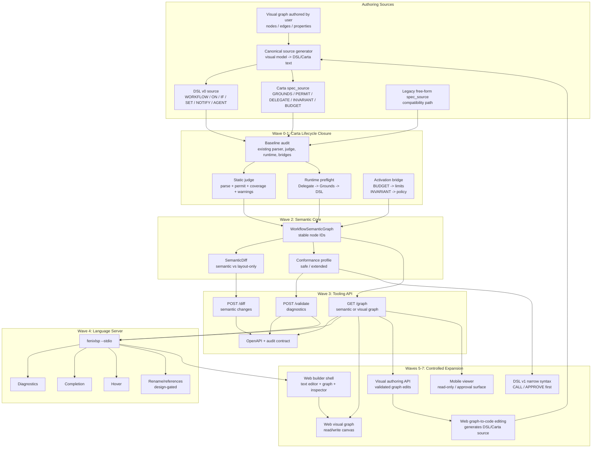
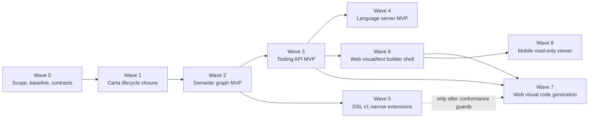
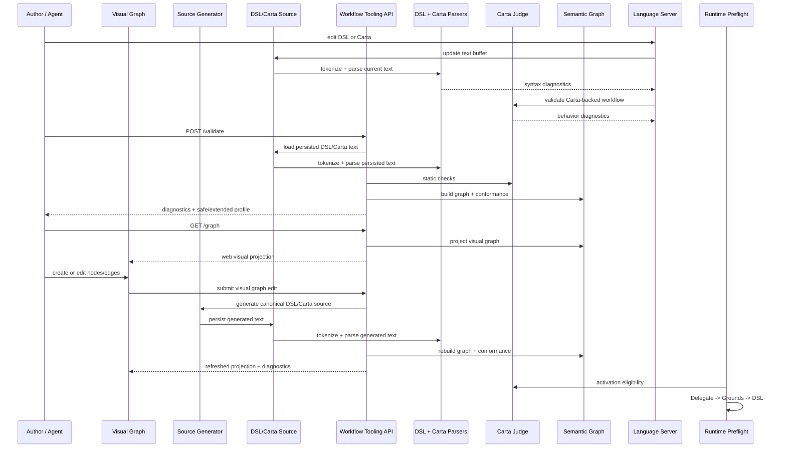

# Carta Language Server and Visual Flow - Agentic Implementation Plan

## Intent

Build the next authoring and tooling layer for Carta-backed workflows without turning the
current wedge into a broad Agent Studio rewrite.

This plan reframes the original ULL proposal into small implementation waves that agents can
execute independently. The first delivery target is a reliable semantic tooling spine:
validation, semantic graph projection, basic language-server support, and a read-only visual
projection. Full visual editing and broad DSL v1 expansion come after the contracts are stable.

## Sources of Truth

| Document | Role |
|---|---|
| `docs/architecture.md` | Product architecture, wedge boundaries, module ownership, API rules |
| `docs/requirements.md` | FR-212, FR-240, FR-241, FR-243 acceptance criteria and dependencies |
| `docs/carta-spec.md` | Canonical Carta grammar, judge checks, runtime preflight order, activation bridges |
| `docs/carta-implementation-plan.md` | Carta parser, judge, runtime, and bridge decomposition |
| `docs/agent-spec-dsl-grammar.md` | Current DSL v0 grammar and explicit reserved-but-out-of-scope syntax |
| `docs/new-release/wave9-behavior-contracts-carta-analysis.md` | Current Carta closure model, blockers, risks, and residual gaps |
| `docs/plans/fenixcrm_strategic_repositioning_spec.md` | Product scope, wedge priorities, non-goals, packaging |

Precedence rule: FenixCRM architecture, requirements, and Carta documents take precedence over
external ULL documents.

## Scope Decision

The implementation should not start by replacing the DSL with a full ULL grammar.

The safe path is:

1. Stabilize Carta lifecycle contracts and supported runtime paths.
2. Add a canonical semantic graph as a projection over existing DSL + Carta.
3. Add tooling APIs and a minimal language server over that projection.
4. Add visual graph rendering after backend contracts are stable.
5. Add write operations and DSL v1 extensions only as narrow, testable slices.

## Current Baseline Audit - CLSF-00

Audited on 2026-04-22 against the repo-local sources of truth and current Go/API code.

| Area | Current Status | Evidence | Gap for This Plan |
|---|---|---|---|
| Carta lexer and tokens | Implemented | `internal/domain/agent/carta_token.go`, `internal/domain/agent/carta_lexer.go`, `internal/domain/agent/carta_token_test.go`, `internal/domain/agent/carta_lexer_test.go` | No new lexer work is needed before semantic graph work. Future DSL v1 tokens must stay separate from Carta tokens. |
| Carta AST and parser | Implemented | `internal/domain/agent/carta_ast.go`, `internal/domain/agent/carta_parser.go`, `internal/domain/agent/carta_parser_test.go` | Parser supports the current Carta grammar; semantic graph tasks should consume `CartaSummary` instead of reparsing text. |
| Legacy `spec_source` parser | Implemented and still used for non-Carta sources | `internal/domain/agent/spec_parser.go`, `internal/domain/agent/judge.go`, `internal/domain/agent/spec_parser_test.go` | Compatibility must be locked with tests before changing judge dispatch. |
| Judge dispatch | Implemented for Carta source detection and parse errors | `internal/domain/agent/judge.go`, `internal/domain/agent/judge_test.go`, `internal/domain/agent/judge_carta_test.go` | The public Carta path calls `RunCartaSpecDSLChecks(carta, program, nil)`, so behavior coverage checks that require `SpecSummary` are not active in the public judge path yet. |
| Static Carta checks | Partially implemented | `internal/domain/agent/judge_carta.go`, `internal/domain/agent/judge_consistency_test.go` | Permit checks and missing-ground warnings are active; behavior coverage exists as a helper but needs wiring or an explicit de-scope decision for Carta-only specs. |
| Runtime preflight order | Implemented in code path | `internal/domain/agent/dsl_runner.go`, `internal/domain/agent/dsl_runner_test.go` | Delegate preflight runs before grounds and before DSL execution. Grounds enforcement depends on `RunContext.GroundsValidator` being configured. |
| Delegate preflight | Implemented | `internal/domain/agent/delegate_evaluator.go`, `internal/domain/agent/delegate_evaluator_test.go`, `internal/domain/agent/dsl_runner.go` | Keep testing focused on terminal status, handoff payload, and no DSL side effects when matched. |
| Grounds preflight | Implemented but dependency-gated | `internal/domain/agent/grounds_validator.go`, `internal/domain/agent/grounds_validator_test.go`, `internal/domain/agent/dsl_runner.go` | Need one supported API/runtime path test proving abstention when evidence requirements fail with a configured validator. |
| BUDGET activation bridge | Implemented and registered | `internal/domain/agent/carta_policy_bridge.go`, `internal/domain/agent/workflow_carta_budget_sync.go`, `internal/domain/workflow/service.go`, `internal/domain/workflow/service_test.go` | Semantics are tested for sync and no-budget no-op; future conformance should report unsupported budget fields rather than adding runtime behavior. |
| INVARIANT activation bridge | Implemented and registered | `internal/domain/agent/carta_policy_bridge.go`, `internal/domain/agent/workflow_carta_budget_sync.go`, `internal/domain/workflow/service.go`, `internal/domain/workflow/service_test.go` | Semantics are tested for rule merge and dedupe; policy-rule expressiveness remains narrow string action mapping. |
| Workflow route surface | Implemented | `internal/api/routes.go`, `internal/api/handlers/workflow.go`, `internal/api/handlers/workflow_test.go` | Existing routes cover CRUD, versions, verify, activate, execute, rollback, graph, validate, and diff. Visual authoring write endpoints are not present. |
| Published OpenAPI | Tooling routes documented | `docs/openapi.yaml` | Workflow lifecycle plus graph, validate, and diff tooling endpoints are documented. LSP and visual authoring endpoints are not documented because they do not exist yet. |
| LSP | Not implemented | No `internal/lsp` or `cmd/fenixlsp` package found | Wave 4 must start with protocol shell after validation/graph contracts exist. |
| Semantic graph and conformance | Implemented MVP | `internal/domain/agent/semantic*`, `internal/domain/agent/conformance.go` | Wave 2 semantic graph, stable IDs, diff, Carta projection, and conformance evaluator are present. Wave 4+ should consume these contracts rather than reparsing source. |
| Visual graph projection | Not implemented | No `visual_projection.go` or visual authoring schema found | Wave 6/7 must consume semantic graph APIs rather than directly inspecting DSL/Carta text. |

Baseline conclusion: Waves 0-3 are now closed for the planned backend semantics and tooling API
scope. Remaining work should start from the LSP shell in Wave 4, using the existing parser, judge,
semantic graph, conformance, diff, and tooling API contracts instead of introducing parallel
source interpretation paths.

## ULL Adaptation Scope - CLSF-01

This repository does not treat external ULL documents as implementation sources of truth. ULL is
adapted only as a planning vocabulary for authoring, projection, and tooling around the existing
FenixCRM DSL + Carta model. Any construct not listed as `Now` below must be rejected or reported
as `extended` until a later local plan promotes it.

| ULL Concept | Classification | FenixCRM Mapping | Implementation Rule |
|---|---|---|---|
| Workflow identity | Now | DSL `WORKFLOW <name>` | Preserve existing parser/runtime semantics. Semantic IDs may include normalized workflow name. |
| Trigger/event | Now | DSL `ON <event>` | Use as graph trigger node; do not add new trigger syntax in Waves 0-4. |
| Conditional decision | Now | DSL `IF <expression>:` | Project as decision node. Boolean chaining remains out of scope until parser support exists. |
| Field mutation/action | Now | DSL `SET <target> = <value>` via `VerbMapper -> ToolRegistry` | Project as action node; tool execution remains controlled by current runtime. |
| Notification/action | Now | DSL `NOTIFY <target> WITH <value>` | Project as action node and evaluate Carta `PERMIT send_reply` coverage through the existing tool mapping. |
| Sub-agent invocation | Now | DSL `AGENT <agent_name> [WITH <payload>]` | Project as agent/action node; no new agent orchestration syntax. |
| Evidence requirements | Now | Carta `GROUNDS` | Project as governance node and runtime preflight input; missing configured validator is a runtime support gap, not new syntax. |
| Tool authorization | Now | Carta `PERMIT` | Project as permit node and keep static judge checks in Wave 1. |
| Human delegation | Now | Carta `DELEGATE TO HUMAN` | Project as delegate node and runtime preflight input. |
| Operational limits | Now | Carta `BUDGET` | Project as budget node; activation sync is existing behavior. |
| Invariants/policies | Now | Carta `INVARIANT` | Project as invariant node; current bridge maps invariant strings to policy rule actions. |
| Semantic graph | Now | New projection over DSL AST + `CartaSummary` | Add as read-only domain projection; it must not become a second executable model. |
| Stable node IDs | Now | Deterministic IDs derived from normalized semantic content and sibling ordinals | Define before diff, LSP references, or visual authoring. IDs must survive whitespace-only changes. |
| Conformance profile | Now | `safe` or `extended` result over parsed sources and graph | Used to report runtime support, not to make unsupported syntax executable. |
| Visual read-only projection | Later | Renderable graph shape derived from semantic graph | Wave 6 only after semantic graph/API contracts. |
| Visual graph edits | Later | Visual model -> canonical DSL/Carta source -> parse/judge/graph | Wave 7 only; visual state must never bypass generated source validation. |
| `CALL` statement | Later | Narrow DSL v1 action/tool call | Candidate Wave 5 construct; lex/parse first, mark `extended` until runtime contract exists. |
| `APPROVE` statement | Later | Narrow DSL v1 approval gate | Candidate Wave 5 construct; no broad policy redesign in parser tasks. |
| Full type declarations | Later | Possible DSL metadata, not current runtime behavior | Keep design-only until type checking and runtime consumers are specified locally. |
| Connector declarations | Later | Future connector catalog/auth metadata | Do not add `CONNECTOR` grammar before connector lifecycle and secret handling are specified. |
| Replay/simulation semantics | Later | FR-243 deterministic replay | Tooling may expose conformance state, not full replay, until replay contracts exist. |
| General ULL imports/includes | Out of scope | None | Reject in parser/tooling; no dependency loading model exists. |
| User-defined functions/macros | Out of scope | None | Reject; would add execution semantics outside the governed runtime. |
| Loops/iteration | Out of scope | None | Reject; not supported by DSL v0 runtime or safety model. |
| Broad boolean language (`AND`, `OR`, `NOT`) | Out of scope for Waves 0-4 | None in DSL v0 | Do not infer support from ULL terminology. Requires parser, evaluator, and judge updates. |
| Parallel branches/forks | Out of scope | None | Reject until runtime scheduler and audit semantics exist. |
| Arbitrary embedded code | Out of scope | None | Never execute or preserve as trusted behavior. Use tools and policy-gated runtime only. |
| Mobile visual authoring | Out of scope | None for this plan | Mobile remains read-only/review after backend and web contracts stabilize. |

Adaptation contract: Waves 0-4 may only read existing DSL v0 and Carta constructs and emit
diagnostics, graph projections, conformance state, and LSP metadata. Wave 5 may introduce only
the explicitly listed narrow DSL v1 constructs (`CALL`, `APPROVE`) and must mark them
non-executable or `extended` until runtime behavior is separately proven.

## Conformance Profiles - CLSF-02

Conformance profiles describe whether a parsed workflow is inside the stable tooling/runtime
contract. They do not replace parser, judge, policy, or runtime validation. A source with syntax
or judge errors should still return diagnostics; conformance is evaluated only for sources that
can be parsed into DSL and, when present, Carta structures.

Profile precedence:

1. `invalid`: source cannot be parsed or fails required structural validation.
2. `extended`: source parses but uses a construct outside the stable Wave 0-4 tooling contract.
3. `safe`: source parses and uses only constructs listed as safe below.

### Safe Profile

`safe` means the semantic graph, validation API, LSP diagnostics, and read-only visual projection
can represent the workflow without inventing new execution semantics.

Rules:

- DSL contains `WORKFLOW`, `ON`, and at least one statement.
- DSL statements are limited to `IF`, `SET`, `NOTIFY`, `AGENT`, `WAIT`, `DISPATCH`, and `SURFACE`.
- `WAIT`, `DISPATCH`, and `SURFACE` are treated as safe because current code parses, validates,
  and has runtime paths for them. This supersedes the older v0 grammar note that described them
  as reserved-but-disabled.
- Expressions use only existing parser-supported primitives: identifiers, strings, numbers,
  booleans, null, arrays, objects, and comparison operators `==`, `!=`, `>`, `<`, `>=`, `<=`,
  and `IN`.
- Carta, when present, uses only `CARTA`, `AGENT`, `GROUNDS`, `PERMIT`, `DELEGATE TO HUMAN`,
  `INVARIANT`, and `BUDGET`.
- Legacy free-form `spec_source` with a valid DSL remains `safe-legacy` in evaluator details, but
  the top-level profile is `safe` so existing workflows are not penalized.
- Missing `spec_source`, missing Carta `GROUNDS`, or optional `GroundsValidator` runtime wiring
  gaps are warnings/capability notes, not automatic `extended`.

Safe examples and future fixture names:

| Fixture Name | Shape | Expected Profile |
|---|---|---|
| `conformance_safe_dsl_v0_core` | `WORKFLOW` + `ON` + `IF` + `SET` + `NOTIFY` + `AGENT` | `safe` |
| `conformance_safe_dsl_runtime_extensions` | DSL with `WAIT`, `DISPATCH`, and `SURFACE` using currently validated forms | `safe` |
| `conformance_safe_carta_full` | DSL core plus Carta `GROUNDS`, `PERMIT`, `DELEGATE`, `INVARIANT`, `BUDGET` | `safe` |
| `conformance_safe_legacy_spec_source` | DSL core plus non-Carta free-form `spec_source` | `safe` with `legacy_spec_source` detail |
| `conformance_safe_missing_spec_source` | DSL core and empty `spec_source` | `safe` with `missing_spec_source` warning detail |

### Extended Profile

`extended` means the source uses a parseable or planned construct that tooling may display but
must not silently treat as fully supported by the stable Wave 0-4 contract.

Rules:

- DSL v1 candidates `CALL` and `APPROVE` are always `extended` until Wave 5 parser support and
  runtime/conformance tests exist.
- Any future typed declarations such as `TYPE`, `ENUM`, `ACTION`, generic types, connector
  declarations, imports, or includes are `extended` if accepted by a future parser and otherwise
  `invalid`.
- Future visual-authoring-only metadata is `extended` unless it round-trips to canonical
  DSL/Carta source and passes parser, judge, semantic graph, and conformance checks.
- FR-243 replay/simulation declarations are `extended` until deterministic replay contracts and
  API behavior exist.
- Unsupported Carta `SKILL` blocks remain `invalid` under the current parser; if a later parser
  accepts them before runtime support exists, they must be classified as `extended`.
- Broad boolean expressions (`AND`, `OR`, `NOT`), loops, parallel branches, user-defined
  functions, macros, and embedded code remain out of scope. If future syntax accepts them before
  runtime semantics exist, the evaluator must classify them as `extended`.

Extended examples and future fixture names:

| Fixture Name | Shape | Expected Profile |
|---|---|---|
| `conformance_extended_call_statement` | DSL with future `CALL ... WITH ... AS ...` | `extended` once parseable |
| `conformance_extended_approve_statement` | DSL with future `APPROVE stage ... role ...` | `extended` once parseable |
| `conformance_extended_type_declaration` | Future typed declaration accepted by parser | `extended` |
| `conformance_extended_connector_declaration` | Future connector declaration accepted by parser | `extended` |
| `conformance_extended_replay_declaration` | Future replay/simulation metadata accepted by parser | `extended` |

### Invalid Profile

`invalid` is reserved for syntax or structural failure, not for unsupported-but-parseable planned
features.

Invalid examples and future fixture names:

| Fixture Name | Shape | Expected Profile |
|---|---|---|
| `conformance_invalid_missing_workflow` | DSL without `WORKFLOW` | `invalid` |
| `conformance_invalid_missing_on` | DSL without `ON` | `invalid` |
| `conformance_invalid_empty_body` | DSL with no executable statements | `invalid` |
| `conformance_invalid_bad_carta` | `spec_source` starts with `CARTA` but fails Carta parsing | `invalid` |
| `conformance_invalid_unsupported_carta_skill` | Carta `SKILL` block under current parser behavior | `invalid` |

Conformance result shape for Wave 2 implementation:

```json
{
  "profile": "safe",
  "details": [
    {
      "code": "legacy_spec_source",
      "severity": "info",
      "message": "legacy free-form spec_source is compatible but has no Carta graph nodes"
    }
  ]
}
```

Allowed `profile` values are `safe`, `extended`, and `invalid`. Detail severities are `info`,
`warning`, and `error`. The evaluator should keep judge violations as diagnostics rather than
duplicating them in conformance details, but it may reference capability gaps such as
`grounds_validator_not_configured` when the supported runtime path is known to be partial.

## Activation Bridge Status - CLSF-15

Audited on 2026-04-22 against `internal/domain/agent/carta_policy_bridge.go`,
`internal/domain/agent/workflow_carta_budget_sync.go`, and `internal/domain/workflow/service.go`.

| Bridge | Status | Supported Behavior | Limits / Non-Goals | Verification |
|---|---|---|---|---|
| Carta `BUDGET` -> agent limits | Full for current scope | Activation parses Carta through the registered resolver, maps `daily_tokens`, `daily_cost_usd`, `executions_per_day`, and `on_exceed`, and merges those values into existing `agent_definition.limits` without deleting unrelated limits. | Does not implement quota enforcement itself; downstream quota/runtime behavior remains owned by quota/runtime tasks. Unknown future budget fields should be reported by conformance rather than silently executed. | `TestCartaBudgetToLimits`, `TestWorkflowActivateBudgetSync`, `TestWorkflowActivateBudgetSyncNoBudgetLeavesLimitsUnchanged` |
| Carta `INVARIANT` -> policy rules | Full for current scope | Activation parses Carta through the registered resolver, maps `never` to deny and `always` to allow rules on `resource=tools`, merges into the active policy version, and dedupes by action so reactivation does not duplicate rules. | Invariant semantics are narrow string-to-policy-action mappings; no ABAC expression compiler or broad policy language is implied. Workflows without an active policy set skip invariant sync. | `TestCartaInvariantsAsPolicyRules`, `TestWorkflowActivateInvariantSync`, `TestWorkflowActivateInvariantSyncDoesNotDuplicateAction` |

Closure rule: Wave 1 can treat `BUDGET` and `INVARIANT` activation bridges as closed for the
current Carta contract, while Wave 2 conformance must still surface unsupported future fields or
policy expressions as `extended`.

## Consolidated View

### Capability Map



Important rule: the Visual Graph is a first-class authoring surface. In edit mode, user graph
changes must generate canonical DSL/Carta source, then that generated source goes through the
same lexer, parser, judge, semantic graph, language-server diagnostics, and runtime activation
path as hand-written text. Text editing and visual editing must converge on the same canonical
token classes, AST, semantic graph, stable node IDs, diagnostics, and runtime meaning. Raw
formatting may be normalized by the canonical source generator.

### Wave Dependency Graph



### Runtime and Tooling Flow



## Gap Review

| Gap | Impact | Plan Response |
|---|---|---|
| Full ULL DSL expansion conflicts with current Carta guidance that Carta complements `dsl_source` | High risk of redesigning the execution language before FR-212 is closed | Make DSL v1 optional and slice it after semantic graph and validation contracts |
| External ULL specs are not repo-local sources of truth | Agents cannot implement against unavailable or drifting documents | Create a repo-local adaptation note before coding any ULL-only construct |
| Current Carta implementation already has parser, judge, runtime, and bridge files | Original task list duplicates shipped or partial work | Start with a baseline audit and only add missing integration pieces |
| Wave 9 says judge and runtime wiring may be partial | Static and dynamic enforcement could be overclaimed | Add explicit verification tasks for judge coverage and runtime preflight paths |
| Visual/text authoring needs a desktop-grade workspace | Mobile canvas + code editing would make diagnostics, diff, keyboard control, and graph editing expensive and fragile | Make web the primary builder surface; keep mobile as a later read-only or approval-oriented surface |
| LSP scope is broad: completion, diagnostics, hover, references, rename | A full LSP is too large for one agent task | Split into protocol shell, diagnostics, completion, hover, and rename/reference slices |
| Stable semantic node IDs are not specified | Diff, visual source generation, references, and visual sync will drift | Define ID algorithm before implementing graph diff or graph-to-source generation |
| Type system and effect model are underspecified for current runtime | Parser can accept syntax that runtime cannot execute safely | Introduce conformance profiles: `safe` for v0-compatible execution, `extended` for declared-but-not-executable features |
| Tooling API lacks auth, audit, versioning, and OpenAPI publication details | API may become an internal-only experiment | Add API contract, audit event, and OpenAPI tasks before client work |
| Visual graph could bypass executable source | User-created visual flows would not behave like text-authored workflows | Require visual edits to generate canonical DSL/Carta source and pass through the same lexer/parser/judge/runtime path |
| FR-243 simulation/replay is referenced but not wired | Tooling could imply replay support that does not exist | Treat replay as a separate dependency; expose conformance state, not full replay |
| Mobile dependency `react-native-svg` triggers mobile QA gates | Any mobile change must run the full mobile gate set | Move mobile graph viewing to a separate optional wave after the web builder proves the contract |

## Delivery Strategy

Use waves instead of large phases. Each wave has a narrow contract and a small set of
agent-owned tasks. Tasks should target Low or Medium-Low effort. If a task looks larger than
Medium-Low, split it before assignment.

Effort scale:

| Effort | Expected Shape |
|---|---|
| Low | Single file or small test/doc update, usually under half a day |
| Medium-Low | One focused behavior slice across 2-4 files, usually under one day |
| Split required | Cross-file integration that cannot fit in a one-day slice |

## Waves

### Wave 0 - Scope, Baseline, and Contracts

Goal: prevent scope drift and establish the implementation baseline before code changes.

Exit criteria:

- Repo-local scope note exists for which ULL concepts are in scope now.
- Current Carta parser, judge, runtime, bridge, route, and OpenAPI gaps are documented.
- `safe` and `extended` conformance profiles are defined.
- Agent tasks below Wave 1 have stable file ownership.

### Wave 1 - Carta Lifecycle Closure

Goal: close the minimum Carta lifecycle gaps needed before building tooling on top.

Exit criteria:

- Judge path clearly runs Carta parse + permit + coverage + grounds warning checks when `spec_source` is Carta.
- Runtime path explicitly documents and tests `Delegate -> Grounds -> DSL`.
- Activation bridge behavior for `BUDGET` and `INVARIANT` is documented or flagged partial.
- Legacy free-form `spec_source` remains compatible.

### Wave 2 - Semantic Graph MVP

Goal: add a canonical semantic graph projection over existing DSL v0 and Carta.

Exit criteria:

- Semantic graph builds from existing DSL + Carta without requiring new DSL syntax.
- Stable node IDs are deterministic across formatting-only changes.
- Semantic diff distinguishes semantic changes from whitespace/layout-only changes.
- Tests cover v0 workflow, Carta permits, delegates, invariants, and missing Carta.

### Wave 3 - Tooling API MVP

Goal: expose graph, validation, diff, and conformance through backend API endpoints.

Exit criteria:

- API returns diagnostics, semantic graph, semantic diff, and conformance profile.
- Routes are covered by handler tests.
- OpenAPI documents the supported endpoints.
- Audit/logging behavior is defined for validation and visual authoring calls.

## Tooling Audit/Log Policy - CLSF-35

Audited on 2026-04-22 against `internal/api/routes.go` and `internal/api/middleware/audit.go`.

Workflow tooling endpoints added in Wave 3 are read-only from a workflow persistence perspective:

| Endpoint | Method | Persistence Behavior | Audit Behavior | Notes |
|---|---|---|---|---|
| `/api/v1/workflows/{id}/graph` | `GET` | Reads a stored workflow and returns semantic graph/conformance projection. Does not update workflow rows, activation state, source text, policy, tools, or runs. | Covered by global protected-route `AuditMiddleware` as a normal authenticated HTTP request. | Endpoint response may include derived semantic metadata, but no executable side effect is triggered. |
| `/api/v1/workflows/{id}/validate` | `POST` | Reads a stored workflow and returns judge diagnostics plus conformance. Does not promote, activate, persist generated source, or mutate workflow status. | Covered by global protected-route `AuditMiddleware`; validation failures return `422` and are classified as request outcomes by the middleware. | Judge diagnostics remain response data, not a separate durable audit event in Wave 3. |
| `/api/v1/workflows/diff` | `POST` | Compares request-body DSL sources in memory. Does not read or write stored workflows. | Covered by global protected-route `AuditMiddleware`; malformed/invalid sources return `400`/`422` and are classified as request outcomes by the middleware. | Request bodies are not copied into new audit metadata to avoid storing draft workflow source in audit logs. |

Visual authoring writes are explicitly reserved for Wave 7. Any future endpoint that persists
generated DSL/Carta source, updates a workflow from a visual graph, or changes activation state
must emit a durable audit event that records at least workflow ID, source of edit (`visual` or
`text`), validation outcome, generated-source diff summary, actor, workspace, and persistence
outcome. That write policy is out of scope for Wave 3 because the current endpoints only project,
validate, or compare source.

### Wave 4 - Language Server MVP

Goal: provide developer tooling over the backend semantic contracts.

Exit criteria:

- `cmd/fenixlsp` starts over stdio and handles `initialize`.
- Diagnostics are backed by the parser, judge, and conformance validator.
- Completion covers current DSL v0 and Carta keywords.
- Hover shows safe metadata for known nodes, tools, and effects.
- Rename/references are added only after stable node references exist.

### Wave 5 - DSL v1 Narrow Extensions

Goal: introduce only the syntax needed by FR-241 authoring workflows.

Exit criteria:

- DSL v0 remains fully backward compatible.
- New syntax is protected by conformance profile and tests.
- `CALL` and `APPROVE` are prioritized before broad type-system constructs.
- Type declarations and connectors remain design-only until runtime contracts exist.

### Wave 6 - Web Visual/Text Builder Shell

Goal: create the primary web authoring workspace with text editor, visual graph, inspector, and
diagnostics surfaces before enabling graph-to-code writes.

Exit criteria:

- Web shell renders DSL/Carta text, visual graph projection, diagnostics, and node inspector.
- Text editor uses LSP-backed diagnostics or the same validation API.
- Visual graph is read-only in this wave and refreshes from backend projection.
- The shell makes generated source and validation state visible.

### Wave 7 - Web Visual Code Generation and Editing

Goal: let users author workflows visually while still generating executable DSL/Carta source that
uses the same lexer, parser, judge, semantic graph, LSP diagnostics, and runtime path as text.

Exit criteria:

- Visual edits generate canonical DSL/Carta source before validation.
- Generated source tokenizes through the same lexer as hand-written text.
- Visual-generated and text-authored equivalents produce the same AST and semantic graph.
- Invalid visual edits return diagnostics and leave stored workflow source unchanged.

### Wave 8 - Mobile Read-Only Workflow Viewer

Goal: expose workflow graph review on mobile only after the web builder and backend projection
contracts are stable.

Exit criteria:

- Mobile renders backend graph projection in read-only mode.
- Mobile can show diagnostics and activation status.
- Mobile does not author visual workflows or generate DSL/Carta source.
- Mobile QA gates pass.

## Agent Task Backlog

### Task Status

| ID | Status | Outcome | Verification |
|---|---|---|---|
| `CLSF-00` | Done | Baseline audit added to this plan. | Documentation review. |
| `CLSF-01` | Done | ULL adaptation scope classified as now, later, or out of scope. | Documentation review. |
| `CLSF-02` | Done | `safe`, `extended`, and `invalid` conformance profile rules and future fixture names defined. | Documentation review against current DSL/Carta parser behavior. |
| `CLSF-03` | Done | Backend ownership map added for Waves 1-4. | Documentation review. |
| `CLSF-10` | Done | Existing public judge path verified: Carta `spec_source` is parsed and missing `PERMIT` returns `tool_not_permitted`. | `go test ./internal/domain/agent/... -run 'TestWorkflowJudgeVerify|TestJudgeCarta'` |
| `CLSF-11` | Done | Carta result shape locked with tests: permit and coverage violations expose `CheckID`, `Code`, `Type`, location/position; grounds warnings expose `CheckID`, `Code`, and location. | `go test ./internal/domain/agent/... -run 'TestRunCarta|TestJudgeCarta'` |
| `CLSF-12` | Done | Legacy free-form `spec_source` path locked: non-Carta specs, even when mentioning Carta, keep legacy parsing and avoid Carta parse errors. | `go test ./internal/domain/agent/... -run 'TestParsePartialSpec|TestWorkflowJudgeVerify'` |
| `CLSF-13` | Done | Runtime preflight order locked: matching Carta `DELEGATE` returns before `GROUNDS` validation and before DSL statement execution. | `go test ./internal/domain/agent/... -run 'TestDSLRunnerRun.*Delegate|TestDSLRunnerRun.*Grounds'` |
| `CLSF-14` | Done | Supported `GROUNDS` preflight path locked: insufficient evidence abstains with status, reason, consolidated query, evidence IDs, output payload, and no DSL statement execution. | `go test ./internal/domain/agent/... -run 'TestGroundsValidator|TestDSLRunnerRun.*Grounds'` |
| `CLSF-15` | Done | Activation bridge status documented: `BUDGET` and `INVARIANT` are full for current scope, with quota enforcement and broader policy expressions explicitly out of scope. | `go test ./internal/domain/agent/... -run TestCarta && go test ./internal/domain/workflow/... -run TestWorkflowActivate` |
| `CLSF-20` | Done | Semantic graph base structs added for workflow, trigger, action, decision, permit, delegate, invariant, and budget nodes with graph node/edge containers. | `go test ./internal/domain/agent/... -run TestSemantic` |
| `CLSF-21` | Done | Stable semantic node ID helper added: IDs hash normalized kind, source, scope, ordinal, and semantic parts; tests cover determinism and whitespace/case normalization. | `go test ./internal/domain/agent/... -run TestSemanticID` |
| `CLSF-22` | Done | DSL v0 semantic graph builder added for `WORKFLOW`, `ON`, `IF`, `SET`, `NOTIFY`, and `AGENT`, including stable IDs, node effects, hierarchy, execution order, and whitespace-stability coverage. | `go test ./internal/domain/agent/... -run TestSemanticBuilder` |
| `CLSF-23` | Done | Carta semantic graph projection added for `GROUNDS`, `PERMIT`, `DELEGATE`, `INVARIANT`, and `BUDGET`, attached to the workflow graph with Carta source metadata and governance/requirements edges. | `go test ./internal/domain/agent/... -run 'TestSemantic|TestSemanticBuilder'` |
| `CLSF-24` | Done | Semantic diff MVP added for graph node/edge changes, with layout-only detection when positions change but semantic fingerprints remain stable. | `go test ./internal/domain/agent/... -run TestSemanticDiff` |
| `CLSF-25` | Done | Conformance evaluator added for `safe`, `extended`, and `invalid` profiles over DSL/Carta sources and semantic graphs, including legacy and missing spec details. | `go test ./internal/domain/agent/... -run TestConformance` |
| `CLSF-30` | Done | Workflow tooling validation service function added to return judge diagnostics, conformance, and semantic graph from one reusable domain call without HTTP coupling. | `go test ./internal/domain/agent/... -run TestValidateWorkflowForTooling` |
| `CLSF-31` | Done | `GET /workflows/{id}/graph` handler and route added, returning workflow ID, conformance profile/details, and semantic graph JSON from the domain validation function. | `go test ./internal/api/handlers -run 'TestWorkflowHandler_Graph|TestWorkflowHandler_Verify'` |
| `CLSF-32` | Done | `POST /workflows/{id}/validate` handler and route added, returning judge diagnostics and conformance JSON with `422` for validation violations. | `go test ./internal/api/handlers -run 'TestWorkflowHandler_Validate|TestWorkflowHandler_Graph|TestWorkflowHandler_Verify'` |
| `CLSF-33` | Done | `POST /workflows/diff` handler and route added, comparing two DSL sources and returning semantic vs layout-only diff JSON. | `go test ./internal/api/handlers -run 'TestWorkflowHandler_Diff|TestWorkflowHandler_Validate|TestWorkflowHandler_Graph'` |
| `CLSF-34` | Done | OpenAPI contract published for workflow graph, validate, and diff tooling endpoints, including request/response schemas and error shape. | `ruby -e "require 'yaml'; YAML.load_file('docs/openapi.yaml')"` |
| `CLSF-35` | Done | Tooling audit/log policy documented: Wave 3 graph, validate, and diff are read-only and covered by global request audit; visual authoring writes are reserved for Wave 7 durable audit events. | Documentation review against `internal/api/routes.go` and `internal/api/middleware/audit.go` |
| `CLSF-40` | Done | LSP protocol shell added: `internal/lsp` package with `Server`, `NewServer`, `Run`; `cmd/fenixlsp/main.go` with `--stdio` flag; handles `initialize` (returns serverInfo + capabilities), `shutdown`, `exit`, unknown requests (method-not-found), and unknown notifications (silent). Complexity refactors for `DiffWorkflowSemanticGraphs`, `addCarta`, `semanticExpressionLabel` applied to unblock gate. | `go test ./internal/lsp/... ./cmd/fenixlsp/...` + stdio smoke test |
| `CLSF-41` | Done | `DocumentStore` added: `Open`, `Change`, `Close`, `Get` over in-memory URI map with `sync.RWMutex`; `Change` on unknown URI is no-op; isolated per URI. | `go test ./internal/lsp/... -run TestDocumentStore` |
| `CLSF-42` | Done | `DiagnosticsHandler` added in `internal/lsp/handlers/`: validates DSL via `ValidateWorkflowDSLSyntax`, maps violations→Error and warnings→Warning with 1-based→0-based line/col conversion, writes framed `textDocument/publishDiagnostics` notification. Server wired with `didOpen`/`didChange`/`didClose` dispatch; `handleTextDocument` extracted to keep `handle` ≤7 complexity. | `go test ./internal/lsp/... ./internal/lsp/handlers/...` |
| `CLSF-43` | Done | `CompletionHandler` added in `internal/lsp/handlers/`: detects DSL vs Carta document by first non-empty line, filters keywords by prefix (case-sensitive), empty prefix returns all. `lsp.CompletionItem` exported to satisfy `completionProvider` interface across packages. Server wired with `textDocument/completion` dispatch; `WithCompletion` chained in `cmd/fenixlsp/main.go`. | `go test ./internal/lsp/... ./internal/lsp/handlers/...` |
| `CLSF-55` | Done | ADR-024 created at `docs/decisions/ADR-024-defer-type-enum-action-connector.md`. Documents that TYPE, ENUM, ACTION, CONNECTOR are not tokenized, parsed, or projected. Defines the prerequisites each keyword needs before implementation: runtime contract, scoping rules, conformance impact, semantic graph impact, policy interaction. Clarifies why they are not added to `dslReservedKeywords` unlike CALL/APPROVE. | Documentation review. |
| `CLSF-54` | Done | `SemanticNodeCall` and `SemanticNodeApprove` added to `semantic_node.go`. `validateV1LeafStatement` extracted in `dsl_validation.go` to accept `CALL`/`APPROVE` structurally without runtime execution. `addCallStatement`/`addApproveStatement` added to `semantic_builder.go` projecting `call`/`approve` nodes. Both kinds absent from `isSupportedConformanceNode` allowlist → any workflow containing them classifies as `extended`. 4 new conformance tests cover CALL→extended, APPROVE→extended, mixed→extended, v0-only regression. ADR-023 created documenting role validation security model. | `go test ./internal/domain/agent/... -run 'TestConformanceCall\|TestConformanceApprove\|TestConformanceMixed\|TestConformanceV0Only'` |
| `CLSF-53` | Done | `parseApproveStatement` added to `parser.go` with optional `role <name>` tail. `TokenRole`/`"ROLE"` added to `token.go` and `dslKeywords`. `parseApproveRole` extracted to keep complexity ≤7. `TokenApprove` registered in `statementParsers()` dispatch map. 5 new parser tests cover full form, bare APPROVE, missing stage name error, missing role name error, and position. | `go test ./internal/domain/agent/... -run 'TestParseDSLParsesApprove\|TestParseDSLRejectsApprove'` |
| `CLSF-52` | Done | `parseCallStatement` added to `parser.go` with optional `WITH <expr>` and `AS <alias>` tail. `TokenAs`/`"AS"` added to `token.go` and `dslKeywords`. `parseCallInputAlias` extracted to keep complexity ≤7. `TokenCall` registered in `statementParsers()` dispatch map. 5 new parser tests cover full form, bare CALL, WITH-only, missing tool name error, and position. | `go test ./internal/domain/agent/... -run 'TestParseDSLParsesCall\|TestParseDSLRejectsCallMissing\|TestParseDSLCallCarries'` |
| `CLSF-51` | Done | `CallStatement` and `ApproveStatement` added to `ast.go`. Both implement the `Statement` interface via `statementNode()` marker and `Pos()`. `Input` and `Alias` on `CallStatement` are optional (`omitempty`); `Role` on `ApproveStatement` is optional. 5 new tests cover interface compliance, optional fields, and appearance in `WorkflowDecl.Body`. | `go test ./internal/domain/agent/... -run 'TestCallStatement\|TestApproveStatement\|TestCallAndApprove'` |
| `CLSF-50` | Done | `TokenCall` and `TokenApprove` added to `token.go` as DSL v1 reserved keywords. Placed in `dslReservedKeywords` (not `dslKeywords`) so `IsKeyword` returns false and v0 parser/runtime ignores them. `LookupTokenType` resolves them case-insensitively. 3 new tests cover recognition, reserved classification, and v0 non-regression. | `go test ./internal/domain/agent/... -run 'TestLookupTokenTypeRecognizesCallAndApprove\|TestCallAndApprove'` |
| `CLSF-45` | Done | Design note created at `docs/plans/clsf-45-references-rename-design-note.md`. Documents three blockers: no span tracking in parser/AST, no cross-document workspace index, no scoping rules for workflow/agent names. Defines prerequisite sequence and explicitly rejects regex-based rename fallback. | Documentation review. |
| `CLSF-44` | Done | `HoverHandler` added in `internal/lsp/handlers/hover.go`: extracts token at cursor via `tokenAt`/`tokenInLine`, selects DSL or Carta keyword table by document type, returns Markdown with node kind + conformance + effect. `lsp.HoverResult`/`lsp.HoverMarkupContent` exported for interface boundary. Server wired with `textDocument/hover` dispatch; `WithHover` chained in `cmd/fenixlsp/main.go`. `tokenInLine` extracted to keep complexity ≤7. | `go test ./internal/lsp/... ./internal/lsp/handlers/...` |
| `CLSF-60` | Done | Backend visual projection schema added: `WorkflowVisualProjection` embeds workflow name, renderable visual nodes with deterministic grid positions, labels, colors by semantic kind, source/effect/properties, visual edges with `connection_type`, and the supplied conformance result. | `go test ./internal/domain/agent/... -run TestProjectWorkflowSemanticGraph` |
| `CLSF-61` | Done | `GET /api/v1/workflows/:id/graph?format=visual` branch added to `WorkflowHandler.Graph`. When `format=visual` query param is present returns `WorkflowVisualProjection` via `ProjectWorkflowSemanticGraph`; default (no param) returns existing `WorkflowGraphResponse` unchanged. 1 new handler test covers visual branch; all existing Graph tests pass. | `go test ./internal/api/handlers/... -run TestWorkflowHandler_Graph` |
| `CLSF-62` | Done | Web builder shell re-implemented in the BFF per ADR-026: `GET /bff/builder` serves HTMX CDN HTML with two-panel editor/graph layout and bearer-token localStorage relay for future HTMX requests. No validation or graph refresh logic added; those remain CLSF-63+. | `cd bff && npm run build`; `cd bff && npm run lint`; `cd bff && npm test -- builder.test.ts` |
| `CLSF-63` | Done | Web editor pane expanded inside the BFF builder shell: editable DSL/Carta textarea now posts under a stable `source` field and has an accessible diagnostics region with an empty state ready for future validation fragments. No validation calls, debounce loop, or graph refresh were added; those remain CLSF-66. | `cd bff && npm run build`; `cd bff && npm run lint`; `cd bff && npm test -- builder.test.ts` |
| `CLSF-64` | Done | Web graph pane expanded into a read-only visual projection fixture inside the BFF builder shell: SVG nodes and directed edges render workflow, trigger, action, and governance shapes with accessible title/description. No backend fetch, text-to-graph refresh, or graph editing was added; live projection remains CLSF-66. | `cd bff && npm run build`; `cd bff && npm run lint`; `cd bff && npm test -- builder.test.ts` |
| `CLSF-65` | Done | Builder inspector surface added below the read-only graph fixture: selected-node properties, conformance, and graph diagnostics have stable HTML targets for future fragments. Dynamic node selection and backend-driven refresh remain out of scope until CLSF-66+. | `cd bff && npm run build`; `cd bff && npm run lint`; `cd bff && npm test -- builder.test.ts` |
| `CLSF-66` | Done | Real text-to-graph refresh loop added: BFF builder editor posts DSL/Carta sources via HTMX to `/bff/builder/preview`; BFF relays to new Go `POST /api/v1/workflows/preview`, which validates draft sources without persistence and returns diagnostics, conformance, and visual projection. BFF renders HTMX fragments for diagnostics, graph, and inspector from the API response. | `cd bff && npm run build`; `cd bff && npm run lint`; `cd bff && npm test -- builder.test.ts`; `go test ./internal/api/handlers -run 'TestWorkflowHandler_Preview\|TestWorkflowHandler_Graph\|TestWorkflowHandler_Validate'`; `go test ./internal/api/...`; `ruby -e "require 'yaml'; YAML.load_file('docs/openapi.yaml')"` |
| `CLSF-67` | Done | Go backend CORS now uses an explicit allowlist rather than a single BFF origin: `CORS_ALLOWED_ORIGINS` can define production/internal browser origins, while defaults keep BFF origin plus local dev origins. Blocked origins still receive no CORS headers. | `go test ./internal/infra/config`; `go test ./internal/api/middleware -run TestCORS`; `go test ./internal/api -run TestRouter_CORS`; `go test ./internal/api/...` |
| `CLSF-68` | Done | BFF CORS tightened from open `cors()` to an explicit configurable allowlist via `BFF_CORS_ALLOWED_ORIGINS`, with defaults for local builder/web and mobile dev origins. Unlisted browser origins receive no CORS allow-origin header, while same-origin/server-to-server requests without `Origin` still work. | `cd bff && npm run build`; `cd bff && npm run lint`; `cd bff && npm test -- cors.test.ts builder.test.ts` |
| `CLSF-69` | Done | Browser-compatible SSE validation added: `GET /bff/copilot/events` accepts EventSource query params, relays to the existing Go `POST /api/v1/copilot/chat` stream, and returns a terminal `event: error` with `retry: 0` when upstream setup fails to avoid browser reconnection loops on persistent errors. Existing mobile `POST /bff/copilot/chat` remains unchanged. | `cd bff && npm run build`; `cd bff && npm run lint`; `cd bff && npm test -- copilot.test.ts` |
| `CLSF-70` | Done | Visual authoring graph schema added in the agent domain: authorable graph, node, edge, node data, position reuse, supported-kind helpers, and constructors cover workflow, trigger, action, decision, grounds, permit, delegate, invariant, and budget. CALL/APPROVE remain excluded from initial visual authoring scope. | `go test ./internal/domain/agent/... -run TestVisualAuthoring`; `go test ./internal/domain/agent/...` |
| `CLSF-71` | Done | Visual authoring graph validator added: returns domain `Violation` diagnostics for missing graph, unsupported node kinds, duplicate/missing node IDs, missing trigger, invalid edge endpoints, and unsupported edge connection types before source generation. | `go test ./internal/domain/agent/... -run TestVisualAuthoring`; `go test ./internal/domain/agent/...` |
| `CLSF-72` | Done | Visual-to-DSL source generator added for DSL v0 core: valid visual authoring graphs generate canonical `WORKFLOW`, `ON`, `SET`, `NOTIFY`, `AGENT`, and `IF` branch syntax. Generated DSL is covered by parser/validator tests; invalid visual graphs and empty decision branches fail before source output. | `go test ./internal/domain/agent/... -run TestGenerateDSLSourceFromVisualAuthoringGraph`; `go test ./internal/domain/agent/...` |
| `CLSF-73` | Done | Visual-to-source generation extended to Carta `spec_source`: governance nodes generate canonical `CARTA`, top-level `BUDGET`, and agent-scoped `GROUNDS`, `PERMIT`, `DELEGATE TO HUMAN`, and `INVARIANT` blocks. Generated Carta is covered by `ParseCarta`; graphs with only BUDGET fail rather than emitting an invalid empty AGENT block. | `go test ./internal/domain/agent/... -run 'TestGenerateSourcesFromVisualAuthoringGraph\|TestGenerateDSLSourceFromVisualAuthoringGraph'`; `go test ./internal/domain/agent/...` |
| `CLSF-74` | Done | Round-trip equivalence tests added for visual authoring graphs: generated DSL-only and DSL+Carta sources are lexed into tokens, parsed into AST/summaries, built into semantic graphs, and compared against equivalent text-authored workflows with the semantic diff gate. | `go test ./internal/domain/agent/... -run 'TestVisualAuthoringRoundTripEquivalent'`; `go test ./internal/domain/agent/...` |
| `CLSF-75` | Done | `POST /api/v1/workflows/{id}/visual-authoring` added: accepts `VisualAuthoringGraph`, runs visual graph validation, source generation (`GenerateSourcesFromVisualAuthoringGraph`), tooling validation (`ValidateWorkflowForTooling` parse/judge/conformance), and persists via `writer.Update` only when all gates pass. Visual/generation/tooling failures return `422` diagnostics without persistence; success returns updated workflow (`200`). Route, handler tests, and OpenAPI schema/contract were added. | `go test ./internal/api/handlers -run 'TestWorkflowHandler_VisualAuthoring'`; `go test ./internal/api/handlers -run 'TestWorkflowHandler_Preview\|TestWorkflowHandler_Validate\|TestWorkflowHandler_Graph'`; `go test ./internal/api/...`; `ruby -e "require '\''yaml'\''; YAML.load_file('\''docs/openapi.yaml'\'')"` |
| `CLSF-76` | Done | BFF builder visual authoring client added: the builder shell mounts a client-side graph canvas, submits visual graph payloads to `/bff/builder/visual-authoring/:id`, relays successful saves to the Go visual-authoring endpoint, and renders validation diagnostics without persisting invalid edits. | `cd bff && npm test -- --runInBand builder.test.ts builderGraphState.test.ts`; `cd bff && npm run build` |
| `CLSF-77` | Done | Constrained web visual create/edit UI added: users can add supported node kinds, select/delete nodes, drag positions, create execution edges, and save through the validated visual authoring path. The client-side graph state model is covered by focused tests. | `cd bff && npm test -- --runInBand builder.test.ts builderGraphState.test.ts`; `cd bff && npm run build` |
| `CLSF-78` | Done | Generated source diff panel added to the BFF builder: visual graph edits produce preview DSL/Carta source text so users can compare generated output before saving. | `cd bff && npm test -- --runInBand builder.test.ts builderGraphState.test.ts`; `cd bff && npm run build` |
| `CLSF-81` | Done | Mobile read-only graph layout helper added with deterministic node ordering, bounded canvas sizing, connector projection, missing-edge filtering, and no-overlap coverage for the core workflow fixture. | `cd mobile && npm test -- --runInBand --runTestsByPath '__tests__/lib/flowLayout.test.ts'` |
| `CLSF-82` | Done | Mobile read-only graph components added: `FlowCanvas`, `FlowNode`, and `FlowConnector` render node labels, kind labels, and connector segments from layout data without adding a graph-rendering dependency. | `cd mobile && npm test -- --runInBand --runTestsByPath '__tests__/components/workflows/FlowCanvas.test.tsx'` |
| `CLSF-83` | Done | Mobile workflow graph review screen added at `mobile/app/(tabs)/workflows/graph.tsx`: fetches workflow graph data through `workflowApi.getGraph`, handles loading/error/empty states, renders conformance chips, and displays the read-only canvas. | `cd mobile && npm run typecheck`; `cd mobile && npm test -- --runInBand --runTestsByPath '__tests__/app/(tabs)/workflows/graph.test.tsx' '__tests__/components/workflows/FlowCanvas.test.tsx' '__tests__/lib/flowLayout.test.ts'` |
| `CLSF-84` | Done | Maestro screenshot runner adapted to the mobile graph implementation: the seeder restores a deterministic workflow fixture, exports `SEED_WORKFLOW_ID`, the authenticated audit opens `fenixcrm:///workflows/graph?id=${SEED_WORKFLOW_ID}`, and the mobile graph client requests the visual graph projection with a stable `flow-canvas` testID. | `GOCACHE=/tmp/fenix-go-build-cache go test ./scripts -run 'TestSeedOutputExposesAuthBlock\|TestSeedWorkflowGraphFixtureCreatesRenderableWorkflow'`; `cd mobile && npm test -- --runInBand __tests__/services/api.test.ts __tests__/components/workflows/FlowCanvas.test.tsx __tests__/app/\(tabs\)/workflows/graph.test.tsx`; `bash scripts/qa-mobile-prepush.sh` |

### Wave 0 Tasks

| ID | Task | Effort | Owner Scope | Dependencies | Acceptance |
|---|---|---:|---|---|---|
| `CLSF-00` | Audit current Carta and workflow tooling baseline | Low | Docs only | None | A short audit section lists existing parser, judge, runtime, bridge, workflow route, and OpenAPI status |
| `CLSF-01` | Define in-scope ULL adaptation for FenixCRM | Medium-Low | `docs/plans/carta-language-server-flow.md` or companion plan | `CLSF-00` | ULL concepts are classified as now, later, or out of scope |
| `CLSF-02` | Define conformance profiles | Medium-Low | Docs plus test fixture names | `CLSF-01` | `safe` and `extended` profiles have exact rules and examples |
| `CLSF-03` | Create agent ownership map for backend slices | Low | Docs only | `CLSF-02` | Each Wave 1-4 task has files, out-of-scope notes, and QA gate |

### Wave 1 Tasks

| ID | Task | Effort | Owner Scope | Dependencies | Acceptance |
|---|---|---:|---|---|---|
| `CLSF-10` | Verify Carta judge dispatch uses parsed Carta data in supported path | Medium-Low | `internal/domain/agent/judge*.go`, tests | `CLSF-00` | Carta workflow with missing permit fails through the public judge path |
| `CLSF-11` | Normalize Carta check result shape | Medium-Low | `internal/domain/agent/judge_carta.go`, tests | `CLSF-10` | Parse, permit, coverage, and warning results are distinguishable |
| `CLSF-12` | Lock legacy `spec_source` compatibility | Low | `internal/domain/agent/*test.go` | `CLSF-10` | Free-form `spec_source` still follows legacy parser behavior |
| `CLSF-13` | Verify delegate preflight order | Medium-Low | `internal/domain/agent/dsl_runner.go`, tests | `CLSF-00` | Delegate runs before grounds and before DSL execution |
| `CLSF-14` | Verify one supported grounds preflight path | Medium-Low | `internal/domain/agent/grounds_validator.go`, runner tests | `CLSF-13` | One documented runtime path abstains when evidence requirements fail |
| `CLSF-15` | Document activation bridge partial/full status | Low | Docs plus focused tests if missing | `CLSF-11` | `BUDGET` and `INVARIANT` behavior is either tested or explicitly marked partial |

### Wave 2 Tasks

| ID | Task | Effort | Owner Scope | Dependencies | Acceptance |
|---|---|---:|---|---|---|
| `CLSF-20` | Define semantic graph structs | Medium-Low | `internal/domain/agent/semantic_node.go`, `semantic_graph.go` | `CLSF-02`, `CLSF-10` | Graph supports workflow, trigger, action, decision, permit, delegate, invariant, budget nodes |
| `CLSF-21` | Define stable node ID algorithm | Medium-Low | `internal/domain/agent/semantic_id.go`, tests | `CLSF-20` | Same source parsed twice produces identical IDs; whitespace changes do not change IDs |
| `CLSF-22` | Build semantic graph from DSL v0 core nodes | Medium-Low | `internal/domain/agent/semantic_builder.go`, tests | `CLSF-21` | WORKFLOW, ON, IF, SET, NOTIFY, AGENT nodes are projected from one fixture |
| `CLSF-23` | Add Carta nodes to semantic graph | Medium-Low | `semantic_builder.go`, tests | `CLSF-22`, `CLSF-11` | PERMIT, DELEGATE, GROUNDS, INVARIANT, BUDGET nodes attach to the workflow graph |
| `CLSF-24` | Implement semantic diff MVP | Medium-Low | `internal/domain/agent/semantic_diff.go`, tests | `CLSF-23` | Rename is semantic; whitespace-only change is layout-only/no-op |
| `CLSF-25` | Add conformance evaluator | Medium-Low | `internal/domain/agent/conformance.go`, tests | `CLSF-23` | v0-only workflow is `safe`; unsupported declarations mark graph `extended` |

### Wave 3 Tasks

| ID | Task | Effort | Owner Scope | Dependencies | Acceptance |
|---|---|---:|---|---|---|
| `CLSF-30` | Add workflow validation service function | Medium-Low | Domain/service layer only | `CLSF-25` | Returns diagnostics from parser, judge, and conformance evaluator |
| `CLSF-31` | Add `GET /workflows/{id}/graph` handler | Medium-Low | `internal/api/handlers/workflow_tooling.go`, routes, tests | `CLSF-23` | Handler returns nodes, edges, and conformance profile |
| `CLSF-32` | Add `POST /workflows/{id}/validate` handler | Medium-Low | Handler, routes, tests | `CLSF-30` | Missing permit returns 422 with diagnostics |
| `CLSF-33` | Add `POST /workflows/diff` handler | Medium-Low | Handler, routes, tests | `CLSF-24` | Semantic and layout-only changes are separated |
| `CLSF-34` | Publish OpenAPI contract for tooling endpoints | Low | `docs/openapi.yaml` | `CLSF-31`, `CLSF-32`, `CLSF-33` | OpenAPI documents request/response schemas and error shape |
| `CLSF-35` | Add audit/log policy for tooling calls | Low | Docs or middleware tests if needed | `CLSF-32` | Validation/diff read behavior is documented; visual authoring write behavior is reserved for Wave 7 |

### Wave 4 Tasks

| ID | Task | Effort | Owner Scope | Dependencies | Acceptance |
|---|---|---:|---|---|---|
| `CLSF-40` | Create LSP protocol shell | Medium-Low | `internal/lsp/server.go`, `cmd/fenixlsp/main.go`, tests | `CLSF-30` | `fenixlsp --stdio` responds to `initialize` |
| `CLSF-41` | Add document store with full-document sync | Medium-Low | `internal/lsp/document_store.go`, tests | `CLSF-40` | `didOpen` and `didChange` update in-memory source by URI |
| `CLSF-42` | Add diagnostics handler | Medium-Low | `internal/lsp/handlers/diagnostics.go`, tests | `CLSF-41`, `CLSF-30` | Parser/judge diagnostics map to line and column |
| `CLSF-43` | Add completion handler for DSL v0 and Carta | Medium-Low | `internal/lsp/handlers/completion.go`, tests | `CLSF-41` | Completion suggests valid current keywords by context |
| `CLSF-44` | Add hover handler for known semantic nodes | Medium-Low | `internal/lsp/handlers/hover.go`, tests | `CLSF-23`, `CLSF-41` | Hover shows node kind, conformance, and effect where known |
| `CLSF-45` | Add references/rename design note before implementation | Low | `docs/plans/clsf-45-references-rename-design-note.md` | `CLSF-44` | Rename is blocked until identifier spans and semantic IDs are stable — see [design note](clsf-45-references-rename-design-note.md) |

### Wave 5 Tasks

| ID | Task | Effort | Owner Scope | Dependencies | Acceptance |
|---|---|---:|---|---|---|
| `CLSF-50` | Add DSL token support for `CALL` and `APPROVE` only | Medium-Low | `internal/domain/agent/token.go`, `lexer.go`, tests | `CLSF-02` | Tokens lex without changing v0 behavior |
| `CLSF-51` | Add AST nodes for `CALL` and `APPROVE` | Medium-Low | `internal/domain/agent/ast.go`, tests | `CLSF-50` | AST supports fields needed by parser and semantic graph |
| `CLSF-52` | Parse `CALL ... WITH ... AS ...` | Medium-Low | `internal/domain/agent/parser.go`, tests | `CLSF-51` | Valid call parses; invalid alias reports line/col |
| `CLSF-53` | Parse `APPROVE stage ... role ...` | Medium-Low | `parser.go`, tests | `CLSF-51` | Approval statement parses and projects as approval node |
| `CLSF-54` | Mark DSL v1-only syntax as `extended` until runtime exists | Low | `conformance.go`, tests | `CLSF-52`, `CLSF-53` | Runtime does not silently execute unsupported statements |
| `CLSF-55` | Defer `TYPE`, `ENUM`, `ACTION`, `CONNECTOR`, and generic types | Low | Docs only | `CLSF-54` | Later grammar work is explicitly separated from executable v1 syntax |

### Wave 6 Tasks

| ID | Task | Effort | Owner Scope | Dependencies | Acceptance |
|---|---|---:|---|---|---|
| `CLSF-60` | Add backend visual projection schema | Medium-Low | `internal/domain/agent/visual_projection.go`, tests | `CLSF-23`, `CLSF-25` | Projection returns renderable nodes, edges, labels, and conformance |
| `CLSF-61` | Wire visual projection into graph endpoint | Low | Handler only | `CLSF-60`, `CLSF-31` | API can return semantic or visual graph shape without breaking existing response |
| `CLSF-62` | Choose and scaffold web builder surface | Medium-Low | Web app/package files, routing, docs | `CLSF-61` | Web route opens a builder shell without mobile dependencies |
| `CLSF-63` | Add web text editor pane | Medium-Low | Web editor component/tests | `CLSF-62`, `CLSF-40` | DSL/Carta text is editable and can display validation diagnostics |
| `CLSF-64` | Add web visual graph read-only pane | Medium-Low | Web graph component/tests | `CLSF-62`, `CLSF-61` | Backend graph fixture renders nodes and edges without overlap |
| `CLSF-65` | Add web inspector and diagnostics panel | Medium-Low | Web inspector/diagnostics components | `CLSF-63`, `CLSF-64` | Selecting a node shows properties, conformance, and diagnostics |
| `CLSF-66` | Add text-to-graph refresh loop | Medium-Low | Web builder state/hooks/tests | `CLSF-63`, `CLSF-64` | Text validation refreshes graph projection through the API |
| `CLSF-67` | Restrict Go backend CORS to internal origins | Low | `internal/api/routes.go` or middleware | `CLSF-62`, ADR-025 | Go backend rejects browser direct calls; BFF + localhost still work |
| `CLSF-68` | Tighten BFF CORS to explicit origin allowlist | Low | `bff/src/app.ts` | `CLSF-62`, ADR-025 | BFF only accepts requests from known origins (mobile dev, web builder, localhost) |
| `CLSF-69` | Validate SSE proxy works with browser EventSource | Low | `bff/src/routes/copilot.ts`, manual/test | `CLSF-62`, ADR-025 | Browser EventSource receives SSE events through BFF proxy without reconnection loops |

### Wave 7 Tasks

| ID | Task | Effort | Owner Scope | Dependencies | Acceptance |
|---|---|---:|---|---|---|
| `CLSF-70` | Define visual authoring graph schema | Medium-Low | `internal/domain/agent/visual_authoring.go`, tests | `CLSF-24`, `CLSF-60` | Schema supports workflow, trigger, action, decision, permit, delegate, invariant, and budget authoring nodes |
| `CLSF-71` | Add visual graph validator | Medium-Low | `visual_authoring.go`, tests | `CLSF-70` | Invalid edges, missing trigger, and unsupported nodes return diagnostics before source generation |
| `CLSF-72` | Add visual-to-source generator for DSL v0 core | Medium-Low | `internal/domain/agent/visual_source_generator.go`, tests | `CLSF-71` | Visual workflow generates canonical DSL source that tokenizes and parses successfully |
| `CLSF-73` | Add visual-to-source generator for Carta blocks | Medium-Low | `visual_source_generator.go`, tests | `CLSF-72`, `CLSF-11` | Visual governance nodes generate canonical Carta source that passes Carta parsing |
| `CLSF-74` | Add round-trip equivalence tests | Medium-Low | `internal/domain/agent/*roundtrip_test.go` | `CLSF-73`, `CLSF-23` | Visual -> source -> tokens -> AST -> semantic graph matches equivalent text-authored workflow |
| `CLSF-75` | Add visual authoring API behind validation | Medium-Low | Handler, routes, tests | `CLSF-74`, `CLSF-32` | API persists generated source only after parse, judge, and conformance validation pass |
| `CLSF-76` | Add web visual authoring client | Medium-Low | Web visual authoring client/hooks/tests | `CLSF-75`, `CLSF-66`, `CLSF-69` | Client submits graph edits and renders generated-source diagnostics |
| `CLSF-77` | Add constrained web visual create/edit UI | Medium-Low | Web graph/inspector components and tests | `CLSF-76`, `CLSF-65` | User-created graph generates executable source and refreshes from backend projection |
| `CLSF-78` | Add generated source diff panel | Medium-Low | Web diff component/tests | `CLSF-77` | Users can compare generated source with previous persisted source before save |

### Wave 8 Tasks

| ID | Task | Effort | Owner Scope | Dependencies | Acceptance |
|---|---|---:|---|---|---|
| `CLSF-80` | Add mobile graph viewer dependency only if needed | Low | `mobile/package.json`, lockfile | `CLSF-61`, `CLSF-64` | Dependency is justified by read-only rendering and install succeeds |
| `CLSF-81` | Build mobile read-only layout helper | Medium-Low | `mobile/lib/flowLayout.ts`, tests | `CLSF-80` | Four-node fixture renders with no overlap |
| `CLSF-82` | Build mobile read-only graph components | Medium-Low | `mobile/components/Flow*.tsx`, tests | `CLSF-81` | Nodes and edges render from fixture data |
| `CLSF-83` | Add mobile workflow graph review screen | Medium-Low | `mobile/app/(tabs)/workflow-builder.tsx`, tests | `CLSF-82` | Screen fetches graph and renders loading, error, empty, diagnostics, and activation status states |

## Recommended Parallelization

| Track | Waves | Good Agent Ownership |
|---|---|---|
| Backend contracts | Waves 0-1 | Docs, judge, runtime preflight, activation bridge status |
| Semantic core | Wave 2 | `internal/domain/agent/semantic*`, conformance tests |
| API surface | Wave 3 | Workflow tooling handlers, routes, OpenAPI |
| LSP | Wave 4 | `internal/lsp/*`, `cmd/fenixlsp` |
| DSL extension | Wave 5 | Lexer/parser/AST only, no runtime execution unless separately approved |
| Web builder shell | Wave 6 | Web text editor, read-only graph, inspector, diagnostics |
| Web visual authoring | Wave 7 | Visual schema and source generator first, web write path second |
| Mobile viewer | Wave 8 | Read-only graph review only after web contracts stabilize |

Parallel work is safe only when file ownership is disjoint. Agents should not edit the same
parser, handler, web component, or mobile component files concurrently.

## Backend Ownership Map - CLSF-03

This map is the file-ownership contract for Waves 1-4. Each task should keep edits inside its
owned files unless the task is explicitly split or this plan is updated first.

| Task | Owned Files / Areas | Out of Scope | Required Local QA |
|---|---|---|---|
| `CLSF-10` | `internal/domain/agent/judge.go`, `internal/domain/agent/judge_carta.go`, `internal/domain/agent/judge_test.go`, `internal/domain/agent/judge_carta_test.go` | Runtime preflight, API handlers, semantic graph | `go test ./internal/domain/agent/... -run 'TestWorkflowJudgeVerify|TestJudgeCarta'` |
| `CLSF-11` | `internal/domain/agent/judge_carta.go`, `internal/domain/agent/judge_consistency_test.go`, `internal/domain/agent/judge_carta_test.go` | Changing `JudgeResult` public JSON shape unless separately approved | `go test ./internal/domain/agent/... -run 'TestRunCarta|TestJudgeCarta'` |
| `CLSF-12` | `internal/domain/agent/spec_parser_test.go`, `internal/domain/agent/judge_test.go` | Carta parser changes, DSL parser changes | `go test ./internal/domain/agent/... -run 'TestParsePartialSpec|TestWorkflowJudgeVerify'` |
| `CLSF-13` | `internal/domain/agent/dsl_runner.go`, `internal/domain/agent/dsl_runner_test.go` | Grounds evidence logic, activation bridge, API route shape | `go test ./internal/domain/agent/... -run 'TestDSLRunnerRun.*Delegate|TestDSLRunnerRun.*Grounds'` |
| `CLSF-14` | `internal/domain/agent/grounds_validator.go`, `internal/domain/agent/grounds_validator_test.go`, focused `internal/domain/agent/dsl_runner_test.go` cases | New retrieval/evidence product behavior, handler changes | `go test ./internal/domain/agent/... -run 'TestGroundsValidator|TestDSLRunnerRun.*Grounds'` |
| `CLSF-15` | `docs/plans/carta-language-server-flow.md`, `internal/domain/agent/carta_policy_bridge_test.go`, `internal/domain/workflow/service_test.go` if tests are missing | New bridge semantics beyond current `BUDGET` and `INVARIANT` behavior | `go test ./internal/domain/agent/... -run TestCarta && go test ./internal/domain/workflow/... -run TestWorkflowActivate` |
| `CLSF-20` | `internal/domain/agent/semantic_node.go`, `internal/domain/agent/semantic_graph.go`, new focused tests | Semantic ID hashing, graph builder traversal, API handlers | `go test ./internal/domain/agent/... -run TestSemantic` |
| `CLSF-21` | `internal/domain/agent/semantic_id.go`, `internal/domain/agent/semantic_id_test.go` | Graph builder behavior and diff algorithm | `go test ./internal/domain/agent/... -run TestSemanticID` |
| `CLSF-22` | `internal/domain/agent/semantic_builder.go`, `internal/domain/agent/semantic_builder_test.go` | Carta nodes, API response schemas, LSP | `go test ./internal/domain/agent/... -run TestSemanticBuilder` |
| `CLSF-23` | `internal/domain/agent/semantic_builder.go`, `internal/domain/agent/semantic_builder_carta_test.go` | Diff, conformance, visual projection | `go test ./internal/domain/agent/... -run 'TestSemanticBuilder.*Carta'` |
| `CLSF-24` | `internal/domain/agent/semantic_diff.go`, `internal/domain/agent/semantic_diff_test.go` | Source formatting or source generation | `go test ./internal/domain/agent/... -run TestSemanticDiff` |
| `CLSF-25` | `internal/domain/agent/conformance.go`, `internal/domain/agent/conformance_test.go` | Parser changes and runtime execution behavior | `go test ./internal/domain/agent/... -run TestConformance` |
| `CLSF-30` | Domain/service validation helper under `internal/domain/agent` or `internal/domain/workflow`, focused tests | HTTP handlers, OpenAPI, LSP protocol | `go test ./internal/domain/agent/...` plus workflow package if touched |
| `CLSF-31` | `internal/api/handlers/workflow_tooling.go`, `internal/api/handlers/workflow_tooling_test.go`, `internal/api/routes.go`, `internal/api/routes_test.go` | Validate/diff endpoints and visual authoring writes | `go test ./internal/api/... -run 'TestWorkflow.*Graph|TestRoutes'` |
| `CLSF-32` | `internal/api/handlers/workflow_tooling.go`, handler tests, routes if needed | Graph/diff endpoint behavior | `go test ./internal/api/... -run 'TestWorkflow.*Validate|TestRoutes'` |
| `CLSF-33` | `internal/api/handlers/workflow_tooling.go`, handler tests, routes if needed | Persisted workflow writes and visual authoring | `go test ./internal/api/... -run 'TestWorkflow.*Diff|TestRoutes'` |
| `CLSF-34` | `docs/openapi.yaml` | Handler implementation changes | OpenAPI review plus `go test ./internal/api/... -run TestRoutes` if route docs reveal route drift |
| `CLSF-35` | `docs/plans/carta-language-server-flow.md` or a dedicated `docs/decisions/ADR-*.md` if the policy becomes durable | Middleware changes unless audit behavior is implemented in code | Documentation review; code QA only if middleware/handler code is touched |
| `CLSF-40` | `internal/lsp/server.go`, `internal/lsp/server_test.go`, `cmd/fenixlsp/main.go` | Completion, hover, diagnostics beyond initialize | `go test ./internal/lsp/... ./cmd/fenixlsp/...` and stdio initialize smoke |
| `CLSF-41` | `internal/lsp/document_store.go`, `internal/lsp/document_store_test.go` | Parser/judge diagnostics and completion | `go test ./internal/lsp/... -run TestDocumentStore` |
| `CLSF-42` | `internal/lsp/handlers/diagnostics.go`, diagnostics tests, validation adapter files | Completion/hover/rename behavior | `go test ./internal/lsp/... -run TestDiagnostics` |
| `CLSF-43` | `internal/lsp/handlers/completion.go`, completion tests | Parser grammar expansion and semantic graph changes | `go test ./internal/lsp/... -run TestCompletion` |
| `CLSF-44` | `internal/lsp/handlers/hover.go`, hover tests, read-only semantic graph adapter | Rename/references and graph ID algorithm changes | `go test ./internal/lsp/... -run TestHover` |
| `CLSF-45` | `docs/plans/carta-language-server-flow.md` or `docs/decisions/ADR-*.md` | Implementing rename/references | Documentation review only |

Wave-level fallback gates:

- Any Wave 1-3 task touching shared domain behavior should also run `go test ./internal/domain/agent/...`.
- Any Wave 3 task touching routes or handlers should also run `go test ./internal/api/...`.
- Any LSP task should run `go test ./internal/lsp/...`; if `cmd/fenixlsp` exists, include `go test ./cmd/fenixlsp/...`.
- If a task touches Go shared behavior across packages, prefer the backend gate sequence from the QA Gates section before pushing.

## QA Gates

Backend waves:

1. `go test ./internal/domain/agent/...`
2. `go test ./internal/api/...`
3. `make complexity`
4. `make test` when shared domain behavior changes

LSP wave:

1. `go test ./internal/lsp/...`
2. `go test ./cmd/fenixlsp/...` if command tests exist
3. Manual stdio smoke test for `initialize`

Web wave:

1. Run the web app's typecheck command.
2. Run the web app's lint command.
3. Run focused web component/unit tests for the builder.
4. Run an end-to-end smoke test for text edit -> diagnostics -> graph refresh when a browser test harness exists.

Mobile wave:

1. `bash scripts/check-no-inline-eslint-disable.sh`
2. `cd mobile && npm run typecheck`
3. `cd mobile && npm run lint`
4. `cd mobile && npm run quality:arch`
5. `cd mobile && npm run test:coverage`

Preferred mobile shortcut:

```bash
bash scripts/qa-mobile-prepush.sh
```

## Implementation Rules for Agents

- Start each task by reading the listed source-of-truth documents and current code in the owned files.
- Do not implement deferred grammar constructs inside earlier tasks.
- Keep all parser functions under the repo complexity threshold.
- Add tests in the same task that changes behavior.
- Preserve legacy `spec_source` and DSL v0 compatibility.
- Do not claim FR-212, FR-241, or FR-243 closure unless the required public API and QA evidence exist.
- Visual editing must generate canonical DSL/Carta source and then use the same lexer/parser/judge/runtime path as text editing.
- Web is the primary authoring surface for text + visual graph editing.
- Mobile remains a secondary read-only review or approval surface unless a later plan explicitly changes that scope.
- For mobile changes, run the full mobile QA gate before any push.

## Current Recommendation

Start with Waves 0-2. That creates the durable semantic backbone needed by both the LSP and
visual graph, while avoiding premature commitment to a full ULL grammar or mobile editor.

The first implementation ticket should be `CLSF-00`, followed by `CLSF-02`, `CLSF-10`, and
`CLSF-20`. This gives later agents a stable contract and prevents duplicate work against the
existing Carta implementation.

## Complexity: Alta | Tokens: ~8600
