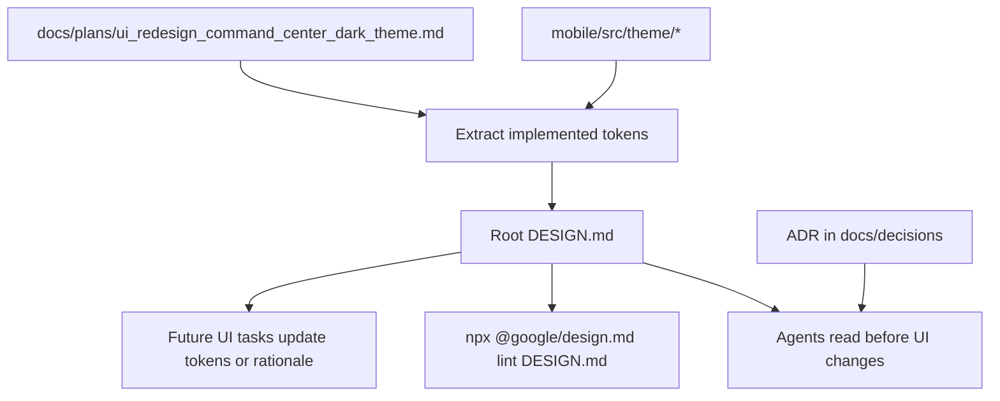

# FenixCRM — DESIGN.md Adoption Plan

## Summary

FenixCRM should adopt a root `DESIGN.md` as the persistent visual-context contract for agents and humans. The initial adoption must document the existing mobile design system rather than redesigning the app.

The runtime source remains `mobile/src/theme/*`. `DESIGN.md` should mirror those implemented tokens and explain how to apply them.

## Key Changes

- Create a root `DESIGN.md` with YAML design tokens plus Markdown rationale.
- Derive the first version from `mobile/src/theme/colors.ts`, `mobile/src/theme/typography.ts`, `mobile/src/theme/spacing.ts`, `mobile/src/theme/semantic.ts`, and `docs/plans/ui_redesign_command_center_dark_theme.md`.
- Capture the current Command Center dark theme: dark operational surfaces, operator blue, amber AI signal accents, semantic status colors, Roboto/monospace typography, and border-based cards.
- Add an ADR under `docs/decisions/` when implementing the adoption, because this changes design governance for future agent work.
- Do not change UI behavior or screen styling during the initial documentation adoption.

## DESIGN.md Interface

The root `DESIGN.md` should include these token groups:

- `colors`: `brandColors` and `semanticColors`.
- `typography`: `headingLG`, `headingMD`, `eyebrow`, `labelMD`, `mono`, `monoLG`, `monoSM`.
- `spacing`: `xs`, `sm`, `md`, `base`, `lg`, `xl`, `xxl`.
- `rounded`: `xs`, `sm`, `md`, `lg`, `full`.
- `components`: at minimum `screen`, `card`, `button-primary`, `button-secondary`, `status-chip`, `data-code`, and `tab-bar`.

The Markdown body should use these sections:

- `## Overview`
- `## Colors`
- `## Typography`
- `## Layout`
- `## Shapes`
- `## Components`
- `## Do's and Don'ts`

Rule: implemented tokens in `mobile/src/theme/*` are the runtime source of truth; `DESIGN.md` is the agent-facing contract and must stay aligned with those tokens.

## Implementation Plan

Execute these tasks in order. Do not start a task until its prerequisites are complete.

| Task | Depends on | Effort / Reasoning | Output | Verification |
|---|---|---|---|---|
| T1 — Inspect implemented design sources | None | Low — read-only extraction from known theme and plan files | Notes extracted from `mobile/src/theme/colors.ts`, `typography.ts`, `spacing.ts`, `semantic.ts`, and `docs/plans/ui_redesign_command_center_dark_theme.md` | Confirm no runtime file is edited |
| T2 — Draft root `DESIGN.md` tokens | T1 | Medium — requires accurate mapping from TypeScript runtime tokens to `DESIGN.md` YAML schema | Root `DESIGN.md` YAML front matter with `colors`, `typography`, `spacing`, `rounded`, and `components` | Token values match `mobile/src/theme/*` exactly |
| T3 — Add root `DESIGN.md` rationale | T2 | Medium — converts implemented theme intent into concise agent-facing rules without changing design direction | Markdown sections: `Overview`, `Colors`, `Typography`, `Layout`, `Shapes`, `Components`, `Do's and Don'ts` | The prose describes the current Command Center dark theme and does not introduce a redesign |
| T4 — Validate token references | T2, T3 | Low — structural scan for reference syntax and obvious broken links | Token references use the `@google/design.md` style, for example `{colors.primary}` | Manual scan before CLI validation |
| T5 — Add governance ADR | T4 | Medium — records a durable project decision and conflict-resolution policy | `docs/decisions/ADR-027-design-md-agent-visual-context.md` | ADR states when to use `DESIGN.md`, when not to use it, and how conflicts with runtime tokens are resolved |
| T6 — Ensure Git trackability | T5 | Low — repository hygiene check for canonical docs blocked by ignore rules | `.gitignore` exception for `DESIGN.md` if needed and for ADR-027 if `docs/decisions/*` blocks it | `git check-ignore -v DESIGN.md docs/decisions/ADR-027-design-md-agent-visual-context.md` reports no ignore rule for canonical files |
| T7 — Run DESIGN.md validation | T6 | Low — execute the official linter and report exact outcome | `@google/design.md` lint result | `npx @google/design.md lint DESIGN.md` exits successfully, or the environment/network blocker is reported verbatim |
| T8 — Run scope-appropriate QA | T7 | Low — choose QA gate from changed-file scope using repo policy | QA result summary | If only docs and `.gitignore` changed, no mobile gate is required; if any `mobile/` file changed, run `bash scripts/qa-mobile-prepush.sh` |

Reasoning split:

- No task is rated `High` or above.
- The `Medium` tasks are T2, T3, and T5. Execute the subtasks below instead of doing each medium task as one broad step.

| Parent | Subtask | Depends on | Effort / Reasoning | Output | Verification |
|---|---|---|---|---|---|
| T2 | T2.1 — Map color tokens | T1 | Low — direct value copy from `colors.ts` and `semantic.ts` | `DESIGN.md` `colors` entries | Every hex value exists in `mobile/src/theme/colors.ts` or `semantic.ts` |
| T2 | T2.2 — Map typography tokens | T2.1 | Low — direct value copy from `typography.ts` | `DESIGN.md` `typography` entries | Font families, sizes, weights, and letter spacing match `typography.ts` |
| T2 | T2.3 — Map spacing and radius tokens | T2.2 | Low — direct value copy from `spacing.ts` | `DESIGN.md` `spacing` and `rounded` entries | Numeric values match `spacing.ts`; dimensions use explicit units where required by `DESIGN.md` |
| T2 | T2.4 — Add minimal component tokens | T2.3 | Low — compose component values only from already mapped tokens | `components` entries for `screen`, `card`, `button-primary`, `button-secondary`, `status-chip`, `data-code`, and `tab-bar` | Component properties reference existing tokens and introduce no new color literals |
| T3 | T3.1 — Write Overview and Colors rationale | T2.4 | Low — summarize existing Command Center theme intent | `Overview` and `Colors` sections | Prose names current tokens and avoids new visual direction |
| T3 | T3.2 — Write Typography and Layout rationale | T3.1 | Low — describe existing type scale, spacing, and density rules | `Typography` and `Layout` sections | Prose aligns with `typography.ts` and `spacing.ts` |
| T3 | T3.3 — Write Shapes, Components, and Do's and Don'ts | T3.2 | Low — convert existing component conventions into usage rules | Remaining required Markdown sections | Rules are actionable and do not require screen rewrites |
| T5 | T5.1 — Create ADR metadata and context | T4 | Low — standard ADR scaffolding with frontmatter | ADR-027 title, status, context, and decision date | Frontmatter uses `doc_type: adr` |
| T5 | T5.2 — Record decision and scope boundaries | T5.1 | Low — document already agreed governance policy | ADR decision section | States `DESIGN.md` is preferred for UI work and not required for backend-only work |
| T5 | T5.3 — Record consequences and conflict policy | T5.2 | Low — document runtime-token precedence | ADR consequences section | States `mobile/src/theme/*` wins when runtime tokens conflict with `DESIGN.md` |

Implementation constraints:

- Do not change UI behavior, screen styling, navigation, API behavior, or mobile runtime tokens in this adoption task.
- Do not infer colors from screenshots when a token exists in `mobile/src/theme/*`.
- If a token exists in both `mobile/src/theme/*` and an older scaffold file such as `mobile/constants/theme.ts`, prefer `mobile/src/theme/*`.
- If `npx @google/design.md lint DESIGN.md` requires network access and cannot run, stop validation at that point and report the blocker instead of substituting another command.
- If the implementation touches `mobile/`, the repository mobile push rule applies: run `bash scripts/qa-mobile-prepush.sh` before any push.

## Acceptance Criteria

- Root `DESIGN.md` exists and describes the current theme without inventing a new visual direction.
- `@google/design.md` lint reports no structural errors, or a clear environment blocker is reported.
- ADR-027 explains when to use `DESIGN.md`, when not to use it, and how to resolve conflicts with runtime tokens.
- Future agents can read `DESIGN.md` before UI work and know the expected colors, typography, radii, spacing, components, and constraints.
- Initial adoption does not change mobile or web runtime behavior.

## Completion Notes — 2026-04-26

- Root `DESIGN.md` was created as a documentation-only contract for the implemented mobile Command Center dark theme.
- The governance ADR was created as `docs/decisions/ADR-027-design-md-agent-visual-context.md` because `ADR-023` already exists for APPROVE role validation.
- `.gitignore` now allows the ADR to remain trackable in Git.
- `npx @google/design.md lint DESIGN.md` exits successfully with 0 errors and 27 warnings. The warnings are accepted for this adoption because they either reflect documented-but-not-component-referenced runtime tokens or flag the existing `brandOnPrimary` / `brandPrimary` contrast without changing runtime UI.
- No `mobile/` files were changed.

## Assumptions

- FenixCRM mobile is the primary visual surface.
- `web/` appears to be scaffold-level and should not drive the initial design contract.
- `docs/agent-spec-design.md` is technical architecture documentation, not visual identity documentation.
- The public `DESIGN.md` specification is alpha, so adoption should be gradual and pragmatic rather than a hard blocking standard.
- Existing local changes must not be reverted or cleaned up as part of this documentation task.
