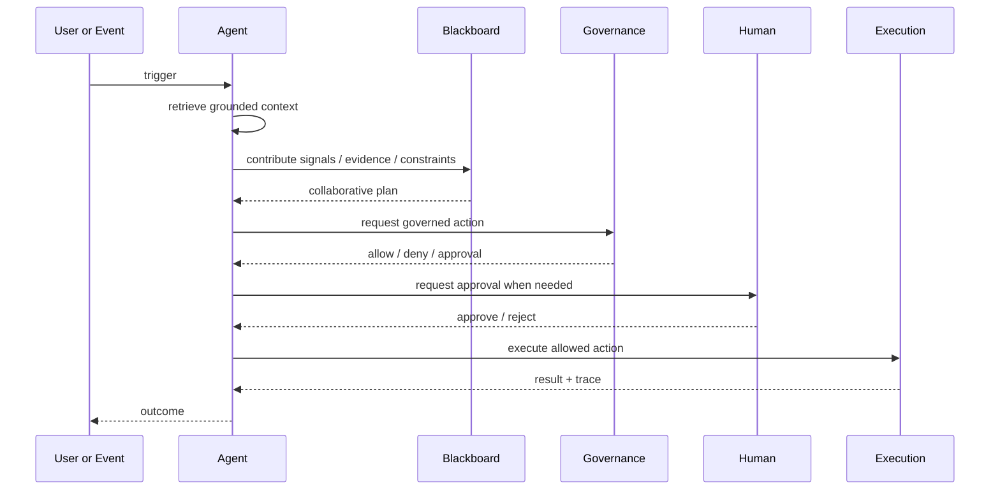

# Product Overview

## What FenixCRM is

FenixCRM is a governed AI operations layer for customer-facing work. It sits above CRM context and workflow systems and gives copilots and agents a controlled way to reason, collaborate and act.

It is not intended to be a broad CRM replacement.

## Product focus

The initial wedge is:

- **Support Copilot / Support Agent** — grounded case resolution, safe execution, approvals and handoff.
- **Sales Copilot** — account and deal context, risk signals, next actions and evidence-backed briefs.

CRM entities remain important mainly as the system of context that feeds those workflows.

## Why it exists

Business AI becomes difficult to trust when it:

- answers without showing where the answer came from;
- executes actions without clear policy boundaries;
- hides approval logic away from the user;
- leaves weak traces after something goes wrong.

Fenix addresses that operating gap.

## Core principles

### Ground before confidence

Agents retrieve customer and knowledge context before making claims. Weak evidence should produce review, deferral or abstention rather than fabricated certainty.

### Policy before execution

Model output does not execute directly. Actions pass through governed capabilities and policy checks.

### Human approval when needed

Sensitive actions can stop and wait for review instead of pretending to be fully autonomous.

### Traceability by default

Runs, policy outcomes, approvals and execution results remain inspectable.

## What is built

| Area | What exists |
|---|---|
| Customer context | Accounts, Contacts, Leads, Deals, Cases, Activities, Notes |
| Knowledge | ingestion, chunking, hybrid retrieval, evidence packs |
| AI runtime | copilot responses, support and sales agents |
| Governance | RBAC, policy checks, approvals, audit |
| Multi-agent coordination | cognitive workspace, specialized agents, arbitration, collaborative planning |
| Workflow control | declarative workflows, visual authoring and graph view |
| Observability | usage, cost, quotas and run traces |
| Surfaces | React Native mobile app and BFF/admin surface |

## Operating model

## Positioning

Fenix should be read as:

- not a generic CRM replacement;
- not blind workflow automation;
- not autonomous execution without evidence or policy.

It is an operating layer for teams that want useful AI assistance without giving up control and traceability.
