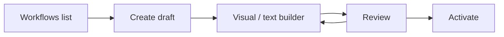

# Product Surfaces

All screenshots below come from the live product screenshot suites.

[← Back to README](../README.md)

## Mobile

### Entry


Every action starts with a user and workspace.

### Inbox


The main operational queue for approvals, handoffs, signals and policy rejections.

### Signal detail


Signals make machine judgment reviewable through confidence and supporting context.

### Support case


Case context, evidence, actions and governance are kept together.

### Sales brief


Grounded account context, active risks and suggested next actions.

### Denied execution


A denied action remains visible and inspectable.

### Governance


Usage, actor, tool, model, latency, cost and policy state are visible together.

### Audit


Audit remains available where work happens.

### Workflow graph


Governed workflow logic is visible rather than hidden.

### CRM hub


CRM entities provide the operational context agents reason over.

## Admin surface

The BFF exposes a session-backed operator surface at `/bff/admin`.

| Login | Dashboard | Workflows |
|---|---|---|
|  |  |  |

| Agent Runs | Approvals | Audit |
|---|---|---|
|  |  |  |

The browser never needs a bearer token: authentication uses an HTTP-only session cookie.

## Workflow authoring



| Create draft | Visual builder | Review and activate |
|---|---|---|
|  |  |  |

- **Create** — start from a minimal draft.
- **Edit** — text and visual editing stay bound to the same workflow.
- **Validate** — saves pass through the workflow parser/judge/conformance path.
- **Activate** — promote an accepted draft to active.

To regenerate screenshots:

```bash
cd mobile && npm run screenshots
cd bff && npm run admin-screenshots
```
