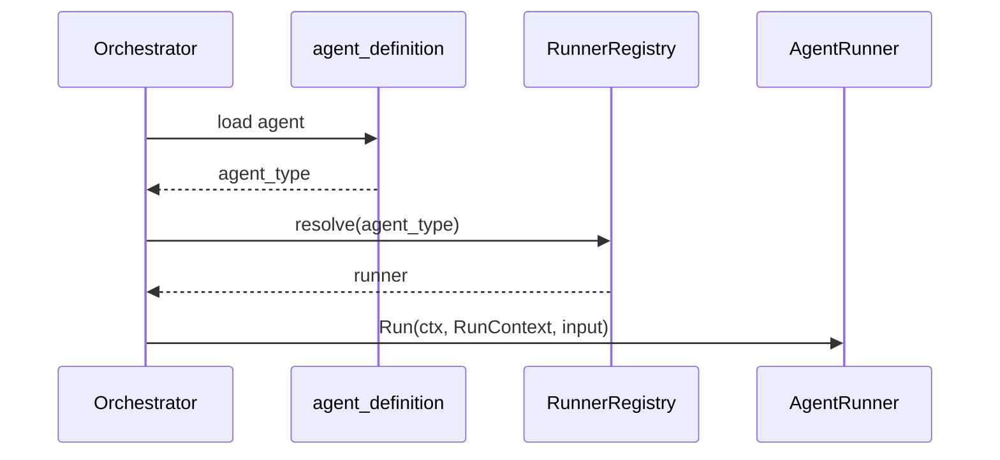

# Task F1.4 - Orchestrator Delegation via RunnerRegistry

**Status**: Completed
**Phase**: AGENT_SPEC - Fase 1 Compatibility Layer
**Depends on**: F1.2, F1.3
**Required by**: F1.8, F3.2, F4.11

---

## Objective

Adaptar `orchestrator.go` para resolver la ejecucion por `RunnerRegistry` sin romper el
flujo actual de `agent_run` ni el comportamiento existente de agentes Go.

---

## Scope

1. Incorporar `RunnerRegistry` como dependencia opcional del `Orchestrator`
2. Soportar resolucion de `agent_type -> AgentRunner` desde `agent_definition`
3. Exponer un camino de ejecucion delegada listo para ser usado por agentes adaptados
4. Mantener `TriggerAgent` compatible mientras se completa F1.5
5. Preparar el terreno para `orchestrator -> registry -> runner`

---

## Out of Scope

- adaptacion de agentes Go al contrato `AgentRunner`
- registro de agentes concretos
- `DSLRunner`
- cambios funcionales en `agent_run`

---

## Expected Output

- `Orchestrator` puede trabajar con `RunnerRegistry`
- existe un camino de delegacion por runner listo para F1.5
- tests de resolucion y delegacion basica

---

## Design Constraints

- no romper `TriggerAgent`
- no degradar `agent_run` ni `agent_run_step`
- no introducir singletons globales
- mantener compatibilidad con `NewOrchestrator(db)`

---

## Acceptance Criteria

- `Orchestrator` acepta `RunnerRegistry` como dependencia opcional
- puede resolver un runner a partir de `agent_definition.agent_type`
- puede delegar ejecucion a un `AgentRunner`
- si no hay registry o runner, falla de forma deterministica
- quality gates de Fase 1 permanecen verdes

---

## Quality Gates

Gate minimo:

```powershell
go test ./internal/domain/agent/...
go test ./internal/domain/tool/...
go test ./internal/domain/policy/...
```

---

## References

- `docs/agent-spec-development-plan.md`
- `docs/agent-spec-design.md`
- `docs/agent-spec-traceability.md`
- `docs/agent-spec-regression-baseline.md`

---

## Implemented Diagram



## Implemented

- `Orchestrator` now accepts an optional registry through `NewOrchestratorWithRegistry`
- `ResolveRunner` and `ExecuteAgent` added for runner-based delegation
- legacy `TriggerAgent` path preserved for compatibility during the transition

## Sources of Truth

- `docs/agent-spec-overview.md`
- `docs/agent-spec-development-plan.md`
- `docs/agent-spec-design.md`
- `docs/agent-spec-traceability.md`

## Implementation References

- `internal/domain/agent/orchestrator.go`
- `internal/domain/agent/orchestrator_test.go`

## Verification Evidence

- `go test ./internal/domain/agent/...`
- `go test ./internal/domain/tool/...`
- `go test ./internal/domain/policy/...`
