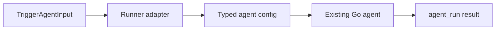

# Task F1.5 - Adapt Go Agents to AgentRunner

**Status**: Completed
**Phase**: AGENT_SPEC - Fase 1 Compatibility Layer
**Depends on**: F1.1, F1.2, F1.4
**Required by**: F1.6, F1.8

---

## Objective

Adaptar los agentes Go actuales para que puedan ejecutarse mediante el contrato
`AgentRunner` sin cambiar su comportamiento funcional ni sus side effects.

---

## Scope

1. Adaptar `support`, `prospecting`, `kb` e `insights` al contrato `AgentRunner`
2. Mantener `AllowedTools`, `Objective` y la logica interna actual
3. Resolver el input runtime comun hacia los config tipados de cada agente
4. No cambiar la semantica actual de `agent_run`, approvals, tools ni audit

---

## Out of Scope

- cambiar logica de negocio de agentes
- introducir `DSLRunner`
- registrar runners en bootstrap global
- cambiar `TriggerAgent` legacy

---

## Expected Output

- wrappers o adaptadores `AgentRunner` para agentes Go actuales
- tests que prueben compatibilidad del contrato
- misma salida funcional que antes del refactor

---

## Design Constraints

- no cambiar las invariantes documentadas en `docs/agent-spec-go-agents-baseline.md`
- no eliminar validaciones o approvals existentes
- no mover logica de negocio al orquestador
- mantener el refactor pequeño y reversible

---

## Acceptance Criteria

- los agentes Go actuales pueden ejecutarse como `AgentRunner`
- el input runtime comun se transforma a config tipado sin ambiguedad
- no cambia el comportamiento funcional esperado por tests existentes
- quality gates de Fase 1 permanecen verdes

---

## Quality Gates

Gate minimo:

```powershell
go test ./internal/domain/agent/...
go test ./internal/domain/tool/...
go test ./internal/domain/policy/...
```

---

## References

- `docs/agent-spec-go-agents-baseline.md`
- `docs/agent-spec-development-plan.md`
- `docs/agent-spec-design.md`
- `docs/agent-spec-phase1-quality-gates.md`

---

## Implemented Diagram



## Implemented

- adapters created for `support`, `prospecting`, `kb` and `insights`
- common runtime input is converted into each agent's typed config
- existing Go-agent business logic stayed unchanged behind the adapter boundary

## Sources of Truth

- `docs/agent-spec-overview.md`
- `docs/agent-spec-development-plan.md`
- `docs/agent-spec-go-agents-baseline.md`
- `docs/agent-spec-traceability.md`

## Implementation References

- `internal/domain/agent/agents/runner_adapters.go`
- `internal/domain/agent/agents/runner_adapters_test.go`

## Verification Evidence

- `go test ./internal/domain/agent/...`
- `go test ./internal/domain/tool/...`
- `go test ./internal/domain/policy/...`
