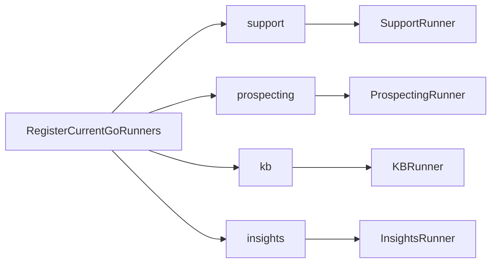

# Task F1.6 - Register Current Go Agents in RunnerRegistry

**Status**: Completed
**Phase**: AGENT_SPEC - Fase 1 Compatibility Layer
**Depends on**: F1.3, F1.5
**Required by**: F1.8, F4.12, F8.1

---

## Objective

Registrar los agentes Go actuales en `RunnerRegistry` para que el runtime pueda resolver
`agent_type -> AgentRunner` usando las implementaciones existentes.

---

## Scope

1. Definir el wiring minimo para registrar `support`, `prospecting`, `kb` e `insights`
2. Alinear cada `agent_type` con su adapter `AgentRunner`
3. Mantener el registro explicito y visible
4. No introducir todavia runners declarativos

---

## Out of Scope

- `DSLRunner`
- dispatch interno o externo
- cambio de logica de negocio de agentes
- bootstrap global fuera del alcance actual del runtime

---

## Expected Output

- registro funcional de los agentes Go actuales
- tests de registro y resolucion por `agent_type`
- base lista para que `ExecuteAgent` use runners reales

---

## Design Constraints

- no registrar por reflexion ni discovery implicito
- no introducir estado global opaco
- mantener correspondencia uno a uno entre `agent_type` y runner
- no romper la compatibilidad con `NewOrchestrator(db)`

---

## Acceptance Criteria

- los cuatro agentes Go actuales quedan registrables en `RunnerRegistry`
- `support`, `prospecting`, `kb` e `insights` resuelven al runner correcto
- el wiring queda preparado para `ExecuteAgent`
- quality gates de Fase 1 permanecen verdes

---

## Quality Gates

Gate minimo:

```powershell
go test ./internal/domain/agent/...
go test ./internal/domain/tool/...
go test ./internal/domain/policy/...
```

---

## References

- `docs/agent-spec-go-agents-baseline.md`
- `docs/agent-spec-development-plan.md`
- `docs/agent-spec-design.md`
- `docs/agent-spec-phase1-quality-gates.md`

---

## Implemented Diagram



## Implemented

- explicit wiring helper added for the four current Go agents
- stable `agent_type` constants introduced for runtime lookup
- registry tests verify correct mapping from `agent_type` to runner instance

## Sources of Truth

- `docs/agent-spec-overview.md`
- `docs/agent-spec-development-plan.md`
- `docs/agent-spec-go-agents-baseline.md`
- `docs/agent-spec-traceability.md`

## Implementation References

- `internal/domain/agent/agents/registry.go`
- `internal/domain/agent/agents/registry_test.go`
- `internal/domain/agent/agents/runner_adapters.go`

## Verification Evidence

- `go test ./internal/domain/agent/...`
- `go test ./internal/domain/tool/...`
- `go test ./internal/domain/policy/...`
