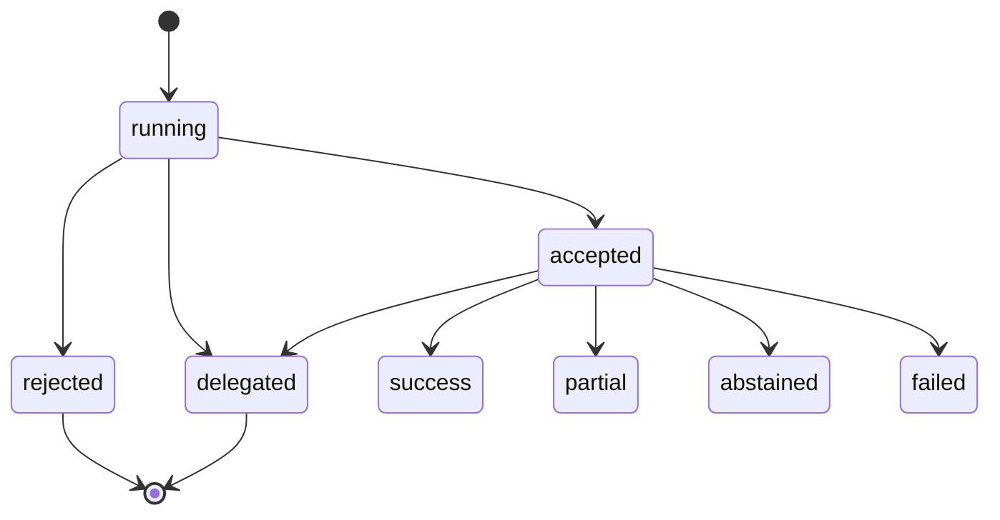

# Task F1.7 - Extend agent_run statuses

**Status**: Completed
**Phase**: AGENT_SPEC - Fase 1 Compatibility Layer
**Depends on**: F0.6, F1.4, F1.6
**Required by**: F1.8, F5, F8

---

## Objective

Extender los estados de `agent_run` con `accepted`, `rejected` y `delegated`
sin romper la semantica actual de los agentes Go ni las transiciones existentes.

---

## Scope

1. Agregar constantes de estado nuevas en `domain/agent`
2. Permitir los nuevos estados en las transiciones de `agent_run`
3. Mantener compatibilidad con estados actuales y flujos legacy
4. Cubrir con tests las transiciones nuevas y la compatibilidad vieja

---

## Out of Scope

- cambiar logica de negocio de agentes Go
- introducir `DSLRunner`
- introducir dispatch externo real
- cambiar schema de base de datos si no es necesario

---

## Expected Output

- `accepted`, `rejected` y `delegated` definidos en el runtime
- transiciones validadas y compatibles
- tests de estados y transiciones

---

## Design Constraints

- no romper `running`, `success`, `partial`, `abstained`, `failed`, `escalated`
- `accepted` debe ser no terminal
- `rejected` y `delegated` deben ser estados validos del runtime
- no degradar trazabilidad de `agent_run_step`

---

## Acceptance Criteria

- los tres estados nuevos existen en `domain/agent`
- las transiciones relevantes son aceptadas por el runtime
- una transicion terminal vieja sigue comportandose igual
- quality gates de Fase 1 permanecen verdes

---

## Quality Gates

Gate minimo:

```powershell
go test ./internal/domain/agent/...
go test ./internal/domain/tool/...
go test ./internal/domain/policy/...
```

---

## References

- `docs/agent-spec-core-contracts-baseline.md`
- `docs/agent-spec-development-plan.md`
- `docs/agent-spec-design.md`
- `docs/agent-spec-use-cases.md`

---

## Implemented Diagram



## Implemented

- `agent_run` extended with `accepted`, `rejected` and `delegated`
- state machine updated to allow new transitions without breaking legacy ones
- runtime step status mapping adjusted so rejected executions remain auditable

## Sources of Truth

- `docs/agent-spec-overview.md`
- `docs/agent-spec-development-plan.md`
- `docs/agent-spec-core-contracts-baseline.md`
- `docs/agent-spec-traceability.md`

## Implementation References

- `internal/domain/agent/orchestrator.go`
- `internal/domain/agent/runtime_steps.go`
- `internal/domain/agent/orchestrator_test.go`

## Verification Evidence

- `go test ./internal/domain/agent/...`
- `go test ./internal/domain/tool/...`
- `go test ./internal/domain/policy/...`
