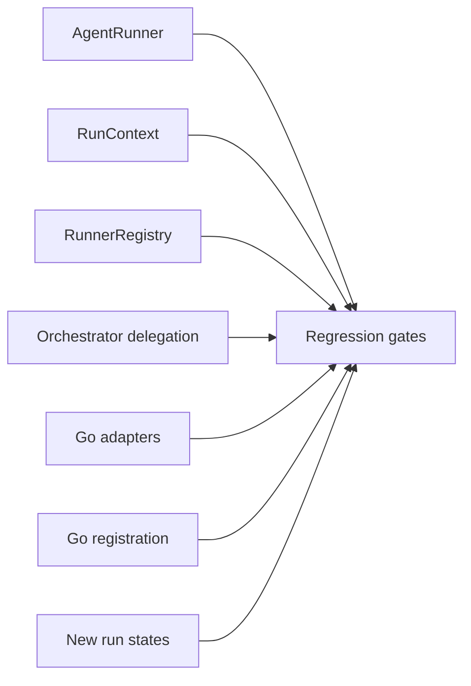

# Task F1.8 - Phase 1 Regression Coverage

**Status**: Completed
**Phase**: AGENT_SPEC - Fase 1 Compatibility Layer
**Depends on**: F1.1, F1.2, F1.3, F1.4, F1.5, F1.6, F1.7
**Required by**: cierre de Fase 1

---

## Objective

Verificar que el nuevo camino de ejecucion de Fase 1 no introduce regresiones
funcionales en orquestacion, agentes Go, tools, policy y audit.

---

## Scope

1. Revisar la cobertura actual del contrato `AgentRunner`
2. Revisar la cobertura actual de `RunContext`
3. Revisar la cobertura actual de `RunnerRegistry`
4. Revisar la cobertura actual del orquestador con delegacion por registry
5. Verificar compatibilidad de agentes Go adaptados
6. Ejecutar quality gates de Fase 1

---

## Out of Scope

- cambios de negocio en agentes Go
- introduccion de `DSLRunner`
- cobertura de Fase 2+

---

## Acceptance Criteria

- existe evidencia de tests para contrato, registry, orquestador y adapters
- los tests legacy de agentes Go siguen pasando
- el gate corto y el gate de transicion quedan documentados
- quedan explicitados los gaps residuales, si existen

---

## Quality Gates

Gate corto:

```powershell
go test ./internal/domain/agent/...
go test ./internal/domain/tool/...
go test ./internal/domain/policy/...
```

Gate de transicion:

```powershell
go test ./internal/domain/agent/...
go test ./internal/domain/tool/...
go test ./internal/domain/policy/...
go test ./internal/domain/audit/...
go test ./internal/api/handlers/... ./internal/api/middleware/...
```

---

## References

- `docs/agent-spec-regression-baseline.md`
- `docs/agent-spec-phase1-quality-gates.md`
- `docs/agent-spec-go-agents-baseline.md`
- `docs/agent-spec-core-contracts-baseline.md`

---

## Implemented Diagram



## Implemented

- Phase 1 regression baseline documented and executed against the new runtime path
- integrated test added for `RunnerRegistry -> ExecuteAgent -> real Go runner`
- transition gates recorded for `agent`, `tool`, `policy`, `audit` and API layers

## Sources of Truth

- `docs/agent-spec-regression-baseline.md`
- `docs/agent-spec-phase1-quality-gates.md`
- `docs/agent-spec-go-agents-baseline.md`
- `docs/agent-spec-core-contracts-baseline.md`

## Implementation References

- `docs/agent-spec-phase1-regression-status.md`
- `internal/domain/agent/agents/registry_test.go`
- `internal/domain/agent/orchestrator_test.go`
- `internal/domain/agent/runner_test.go`

## Verification Evidence

- `go test ./internal/domain/agent/...`
- `go test ./internal/domain/tool/...`
- `go test ./internal/domain/policy/...`
- `go test ./internal/domain/audit/...`
- `go test ./internal/api/handlers/... ./internal/api/middleware/...`
