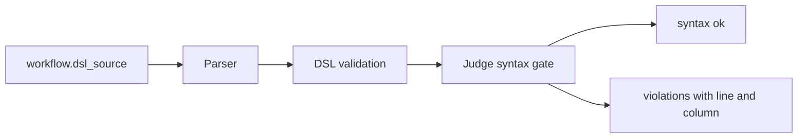
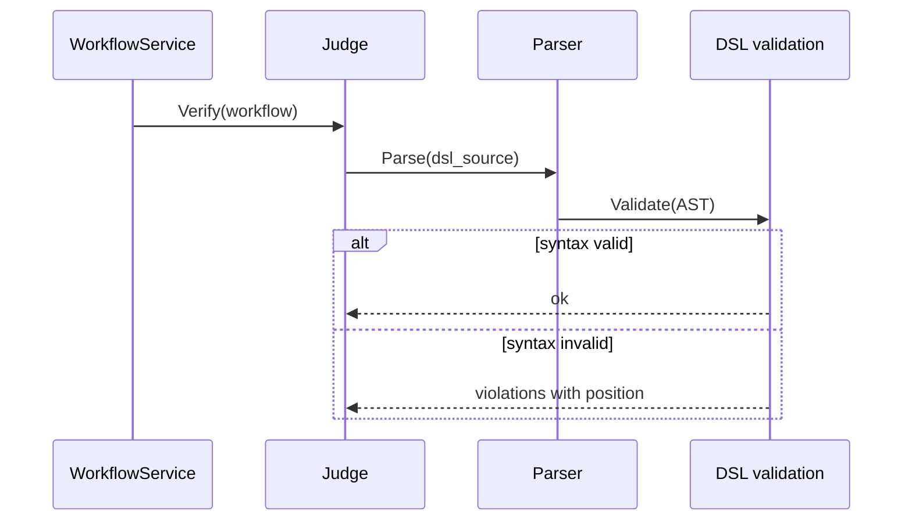
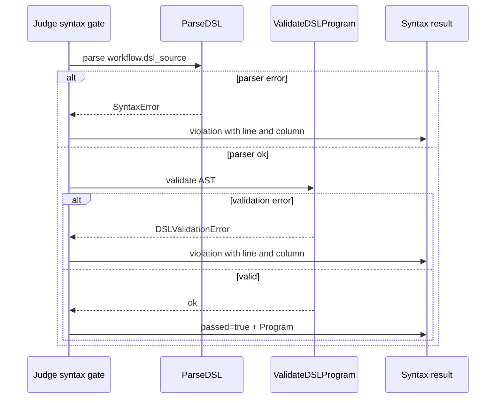

# Task F5.1 - DSL Syntax Validation for Judge

**Status**: Completed
**Phase**: AGENT_SPEC - Fase 5 Judge y activacion
**Depends on**: F4.5, F4.6, F4.7
**Required by**: F5.2, F5.3, F5.7

---

## Objective

Implementar validacion sintactica de workflows DSL como entrada formal del
Judge.

---

## Scope

1. reutilizar parser y validacion DSL de Fase 4
2. normalizar errores sintacticos al contrato del Judge
3. distinguir errores bloqueantes de warnings no bloqueantes
4. dejar base consistente para `Judge.Verify`

---

## Out of Scope

- parser parcial de `spec_source`
- checks de consistencia `spec -> DSL`
- endpoint `verify`
- transiciones de lifecycle

---

## Acceptance Criteria

- existe una entrada unica para validar sintaxis DSL antes del Judge
- errores de sintaxis preservan linea y columna
- un workflow con DSL invalido no puede pasar verify
- la tarea no duplica parser o validacion fuera del stack de Fase 4

---

## Diagram



## Quality Gates

```powershell
go test ./internal/domain/agent/...
go test ./internal/domain/workflow/...
```

## References

- `docs/agent-spec-phase5-analysis.md`
- `docs/agent-spec-design.md`

## Sources of Truth

- `docs/agent-spec-overview.md`
- `docs/agent-spec-development-plan.md`
- `docs/agent-spec-design.md`
- `docs/agent-spec-use-cases.md`
- `docs/agent-spec-traceability.md`
- `docs/agent-spec-phase5-analysis.md`

## Planned Diagram



## Planned Deliverable

- syntactic gate reusable by `Judge.Verify`
- error mapping from parser/validator to `Violation`
- tests covering valid DSL and syntax failures with position data

## Implementation References

- `internal/domain/agent/parser.go`
- `internal/domain/agent/syntax_error.go`
- `internal/domain/agent/dsl_validation.go`
- `internal/domain/agent/judge_syntax.go`
- `internal/domain/agent/judge_syntax_test.go`

## Verification Evidence

- `go test ./internal/domain/agent/...`
- targeted tests for syntax failures and position-aware violations

## Implemented Diagram



## Implemented

- reusable gate `ValidateWorkflowDSLSyntax(...)` over `workflow.dsl_source`
- parser and AST validation from Fase 4 reused without duplicating syntax logic
- syntax and validation failures normalized to a single result shape with:
  - `Passed`
  - `Violations`
  - `Warnings`
  - `Program`
- violations preserve line and column for parser and validation failures
- empty or missing `dsl_source` is reported as a blocking violation
